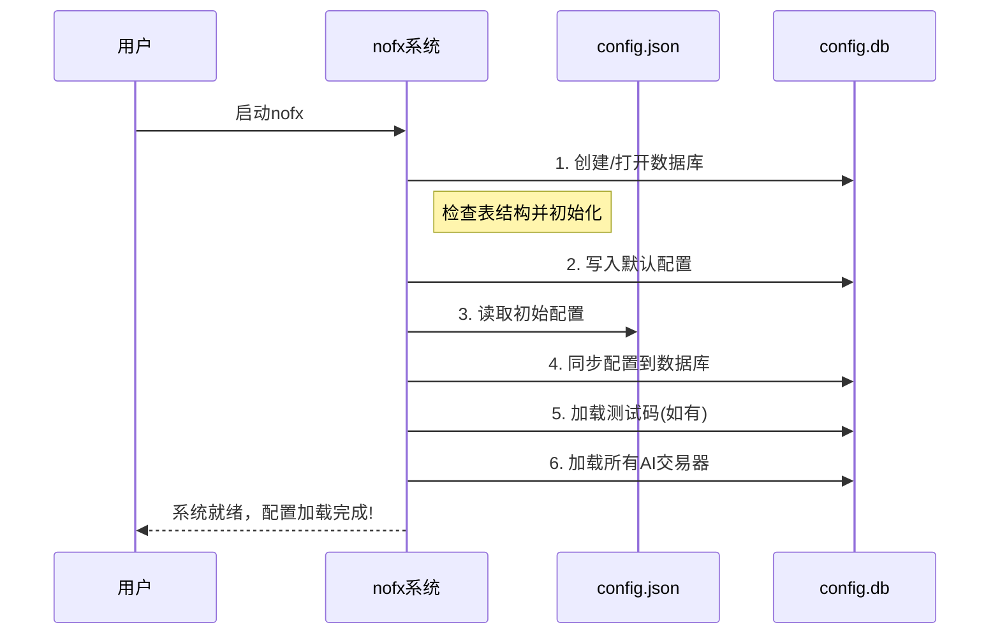

# 第1章：数据库与配置系统

欢迎来到`nofx`

本章将介绍我们AI交易系统的"大脑"与"记忆中枢"——**数据库与配置系统**。

## 什么是`nofx`的"大脑"和"记忆"？

想象在设置一个机器人厨师。告诉它："用这本食谱书，这个品牌的食材，用中火烹饪。"然后晚上你关闭了它。第二天重启时，你肯定不想重新交代所有事项对吧？你会期望它能*记住*你的指令和偏好。

在`nofx`中，我们的"机器人厨师"就是AI自动交易器。它需要记住大量信息：
* 使用哪个AI模型（如同你的食谱书）
* 交易所API密钥（如同知道去哪采购食材）
* 初始资金额度（如1000 USDT）
* 特殊规则设置（如杠杆倍数）
* 用户账户及其个性化配置

这正是**数据库与配置系统**的职责所在。它作为核心存储库，安全持久地保存所有关键信息。"持久化"意味着即使重启电脑或关闭`nofx`，这些信息也不会丢失。

### 典型应用场景：保存AI交易器配置

假设你要设置一个AI交易器，希望它：
1. 使用"DeepSeek"AI模型
2. 连接你的"币安"交易所账户
3. 初始资金1000 USDT
4. 每3分钟扫描市场

你希望这些设置能被保存，以便重启`nofx`时交易器能立即按预设运行，无需重复输入。数据库与配置系统使之成为可能。

## 核心概念

### 1. 数据库：智能文件柜

数据库如同高度组织的数字文件柜。不同于纸质文件，它存储文本、数字、日期等信息。每个抽屉（称为"表"）存放特定类型数据，每份文件（称为"行"）记录单个项目的详情。

`nofx`使用名为`config.db`的SQLite数据库文件。SQLite是轻量高效的嵌入式数据库，所有数据存储在单文件中，无需单独数据库服务器。

我们的数据库包含以下主要"抽屉"（表）：

| 表名            | 存储内容（示例）                |
| :-------------- | :------------------------------ |
| `ai_models`     | AI模型API密钥（DeepSeek、Qwen） |
| `exchanges`     | 交易所凭证（币安、Hyperliquid） |
| `traders`       | 各AI交易器的配置参数            |
| `users`         | 用户账户详情                    |
| `system_config` | 系统运行规则（如API端口号）     |
| `beta_codes`    | 早期测试用户专属访问码          |

### 2. 配置系统：规则手册

配置系统是决定系统行为的规则、参数和设置的集合。在`nofx`中包括：
* **全局规则**：如网页接口端口号(`api_server_port`)、全局杠杆设置
* **交易器专属规则**：如某AI交易器的`initial_balance`或`scan_interval_minutes`

初始化时，`nofx`会从`config.json`文本文件读取系统级配置。启动后所有配置将存入`config.db`数据库，便于通过网页界面灵活更新，无需直接修改文件。

## 系统运行机制

`nofx`启动时按以下流程加载"记忆"和"规则"：

1. **创建/打开数据库**：确保`config.db`就绪，不存在则新建并初始化表结构
2. **读取`config.json`**：获取初始系统参数
3. **同步至数据库**：将`config.json`配置更新到数据库
4. **加载测试码**：从`beta_codes.txt`加载早期测试权限码（如存在）
5. **加载AI交易器**：从数据库读取所有交易器配置到内存

此后所有操作都基于`config.db`数据库，包括获取AI模型密钥、交易所凭证或交易器设置。

以下是`config.json.example`的简化示例：
```json
{
  "admin_mode": true,
  "beta_mode": false,
  "leverage": {
    "btc_eth_leverage": 5,
    "altcoin_leverage": 5
  },
  "api_server_port": 8080,
  "jwt_secret": "your-jwt-secret-key..."
}
```
该文件仅在启动时读取，用于设置数据库中的初始系统参数。例如`api_server_port`指定网页接口端口，`btc_eth_leverage`设置比特币/以太坊交易的默认杠杆。

### 启动流程示意图



### 代码实现探秘

`main.go`中的数据库初始化：
```go
func main() {
    dbPath := "config.db"
    database, err := config.NewDatabase(dbPath) // 创建/打开数据库
    if err != nil {
        log.Fatalf("❌ 数据库初始化失败: %v", err)
    }
    defer database.Close() // 确保程序退出时关闭连接
}
```

`config/database.go`中的核心逻辑：
```go
func NewDatabase(dbPath string) (*Database, error) {
    db, err := sql.Open("sqlite3", dbPath) // 打开SQLite文件
    database := &Database{db: db}
    database.createTables()  // 初始化表结构
    database.initDefaultData() // 写入默认模型和交易所
    return database, nil
}
```

配置同步流程：
```go
// 将config.json设置同步到数据库
if err := syncConfigToDatabase(database); err != nil {
    log.Printf("⚠️ 配置同步失败: %v", err)
}
// 从数据库读取配置项
apiPortStr, _ := database.GetSystemConfig("api_server_port") 
```

## 小结

**数据库与配置系统**作为`nofx`的中枢神经，持久化存储着从AI模型密钥、交易所凭证到交易器参数的所有关键数据。这种设计确保配置变更通过网页界面即可生效，且系统重启后所有设置保持可用。

现在我们已经了解系统如何"记忆"信息，下一章将探索[市场数据系统](02_market_data_system_.md)——这是`nofx`洞察金融市场的"耳目"。

