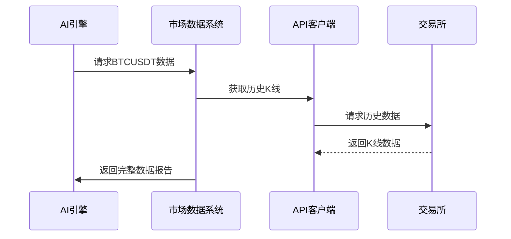

# 第2章：市场数据系统

欢迎回来

在[第1章：数据库与配置系统](01_database___configuration_.md)中，我们学习了`nofx`如何作为"大脑与记忆中枢"存储重要设置。但要让AI有效交易，它还需要实时掌握市场动态。

## AI的"市场耳目"是什么？

想象`nofx`如同一位超级侦探。它拥有记忆（数据库），但如何感知外部世界的变化？它需要观察

对`nofx`而言，这些"耳目"就是**==市场数据系统==**。这个系统持续监控金融市场，收集制定智能交易决策所需的关键信息。它就像一个专业的数据通讯社，不过==采集==的不是新闻，而是价格、交易量和专业指标等数字信息。

### 场景：获取市场快照

假设AI交易器需要了解："当前比特币(BTC)兑美元稳定币(USDT)的市场状况如何？"它需要的不仅是价格，而是完整报告

AI可能要求获取：
* BTCUSDT当前价格
* 过去1小时和4小时的价格变化
* 技术指标(如EMA、MACD、RSI)反映的趋势和动量
* 合约交易关键数据：未平仓量(OI)和资金费率

市场数据系统就是为回答这些问题而设计，为AI提供清晰的市场分析快照。

## 核心机制

### 1. 原始市场数据：基础建材

原始数据是市场提供的基础事实：
* **实时价格**：加密货币的瞬时报价
* **K线数据**：特定时段(如3分钟/4小时)的价格摘要，包含开盘价、收盘价、最高价、最低价和成交量
* **交易量**：特定时段内的买卖总量，高成交量通常预示强趋势
* **未平仓量(OI)**：未结算的期货合约总量，反映市场资金活跃度
* **资金费率**：永续合约市场中多空双方的资金费用，用于锚定合约价格

`nofx`直接从币安等交易所获取这些原始数据。

### 2. 数据获取方式：监听策略

`nofx`通过两种主要方式从交易所获取数据：

| 方式          | 类比               | 用途                     | 工作原理                       |
| :------------ | :----------------- | :----------------------- | :----------------------------- |
| **API客户端** | 致电交易所索要报告 | 历史数据、OI、资金费率等 | 发送请求后获取==单次==响应     |
| **WebSocket** | 实时新闻播报       | 实时价格、持续更新的K线  | 建立连接后==自动推送==数据更新 |

实时数据通常通过"组合流"WebSocket获取，可高效同时监控多种加密货币。

### 3. 加工数据：理解"为什么"

原始数据只是数字，AI需要理解其含义。**技术指标**由此产生：
* **EMA(指数移动平均)**：平滑价格数据识别趋势，侧重近期价格
* **MACD(异同移动平均线)**：判断趋势强度、方向和持续时间
* **RSI(相对强弱指数)**：识别超买(可能下跌)/超卖(可能上涨)状态

通过这些计算，`nofx`将原始数据转化为AI可操作的洞察。

## 系统调用示例

获取BTCUSDT数据时，系统调用`market.Get()`函数：

```go
func getBitcoinSnapshot() {
    data, err := market.Get("BTCUSDT")
    fmt.Printf("当前价格: %.2f\n", data.CurrentPrice)
    fmt.Printf("1小时涨跌幅: %.2f%%\n", data.PriceChange1h) 
    fmt.Printf("EMA20: %.3f\n", data.CurrentEMA20)
}
```

返回的`market.Data`结构包含完整市场信息：

```go
type Data struct {
    Symbol        string
    CurrentPrice  float64
    PriceChange1h float64 
    CurrentEMA20  float64
    CurrentMACD   float64
    OpenInterest  *OIData
    //...更多字段
}
```

## 底层运行

当调用`market.Get("BTCUSDT")`时：



关键代码：
1. **market.Get()**：协调数据收集与指标计算
2. **WSMonitor**：管理实时K线数据缓存
3. **APIClient**：处理历史数据API请求
4. **CombinedStreams**：维护WebSocket实时连接

## 小结

**市场数据系统**作为`nofx`感知市场的感官系统，通过API和WebSocket获取原始数据，并转化为EMA/MACD/RSI等技术指标，为AI决策提供==结构化输入==

下一章我们将探讨[多交易所交易接口](03_multi_exchange_trader_interface_.md)，了解系统如何==与交易所进行交互==。

