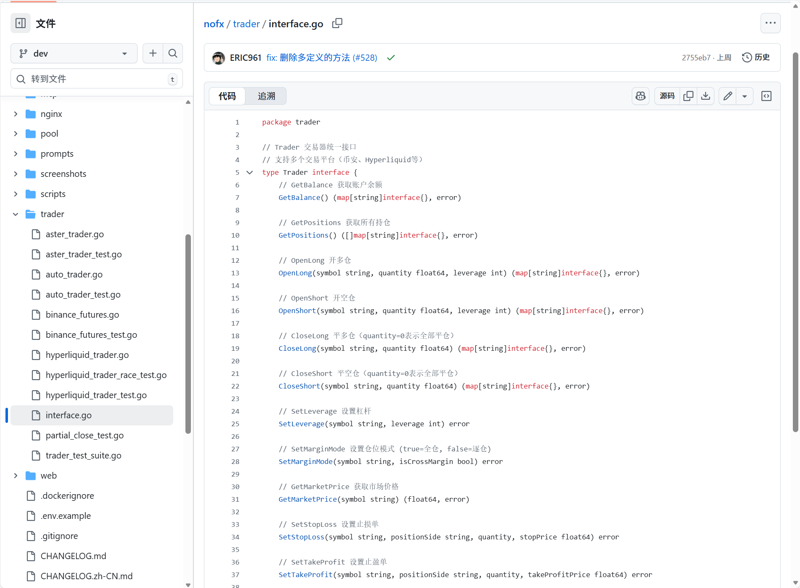
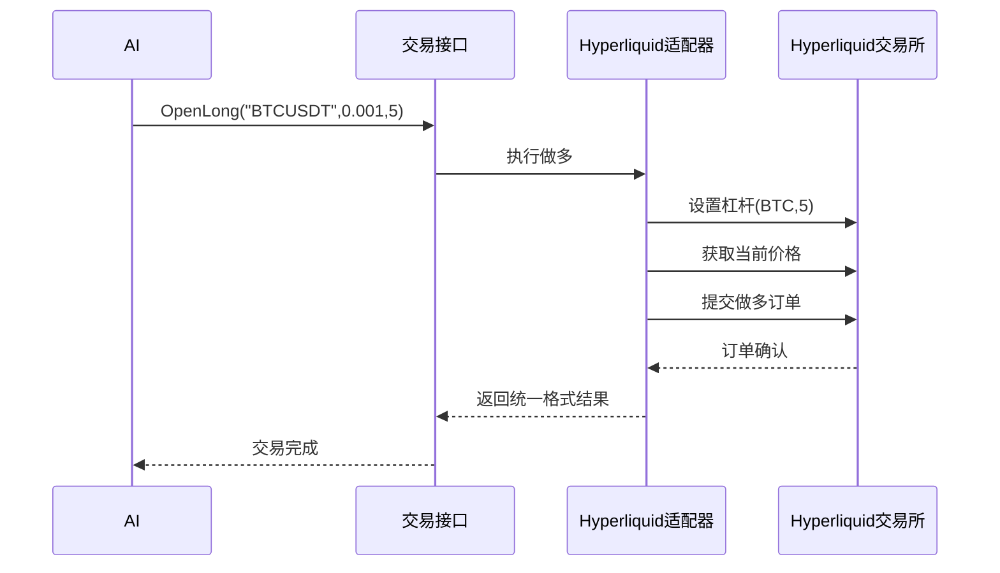

# 第3章：多交易所交易接口

欢迎回来

在[第2章：市场数据系统](02_market_data_system_.md)中，我们学习了`nofx`如何作为AI的"市场耳目"收集处理数据。但理解市场远远不够，AI交易员需要通过==下单==来*执行*交易决策！

## AI的"万能交易遥控器"

假设家中有多台不同品牌的电视机，每台都有独特的遥控器操作方式。如果要让机器人控制所有电视，就得教会它每个遥控器的使用方法——这显然费时费力。

加密货币交易所同样如此。币安、Hyperliquid、Aster DEX等交易所各有其API"语言"来处理下单、查询余额等操作。如果让AI直接学习每家交易所的独特API，系统将变得复杂而脆弱。

**多交易所交易接口**正是为此而生。它如同一个"万能遥控器"，让AI只需掌握一套通用指令，由==接口自动转换==为各交易所特定的API调用。

### 核心场景："开多仓"

假设AI决策："以0.001数量、5倍杠杆做多BTCUSDT"。

若无统一接口，AI需要了解：
* 币安的API密钥格式和接入方式
* 币安设置杠杆的特殊参数
* 币安市价单的精确API格式
* 币安特有的错误消息处理

若切换到Hyperliquid交易，又需重新学习整套流程。

- 通过多交易所交易接口，AI只需发出通用指令："交易器，做多BTCUSDT，数量0.001，杠杆5"。接口自动完成底层适配。

## 核心架构

### 1. `Trader`接口：通用语言

在编程中，"接口"是定义行为契约的蓝图。`nofx`的`Trader`接口规定了所有交易所必须实现的标准操作：

| 方法               | 说明         |
| :----------------- | :----------- |
| `GetBalance()`     | 查询账户余额 |
| `GetPositions()`   | 获取当前持仓 |
| `OpenLong()`       | 开多仓       |
| `OpenShort()`      | 开空仓       |
| `SetLeverage()`    | 调整杠杆     |
| `SetStopLoss()`    | 设置止损     |
| `GetMarketPrice()` | 获取当前价格 |

AI只需了解这些通用方法，无需关心具体实现。

### 2. 交易所适配器：翻译官

每个支持的交易所都有专属适配器，实现`Trader`接口并处理交易所特有逻辑：

* `BinanceTrader`：将`OpenLong()`转换为币安API调用
* `HyperliquidTrader`：适配Hyperliquid的特殊参数
* `AsterTrader`：处理Aster DEX的独特规则

这种设计使`nofx`能灵活扩展新交易所支持，只需新增适配器而无需修改AI核心逻辑。

## 接口调用示例

AI决策引擎（详见[第4章](04_ai_decision_engine_.md)）通过统一接口执行交易：

```go
func executeTrade() {
    // 1. 设置全仓模式
    myTrader.SetMarginMode("BTCUSDT", true)
    
    // 2. 通用做多指令
    result, _ := myTrader.OpenLong("BTCUSDT", 0.001, 5)
    
    // 3. 查询统一格式的余额
    balance, _ := myTrader.GetBalance()
}
```

无论底层是币安还是Hyperliquid，AI代码保持完全一致。

## 底层实现



### 执行流程

当AI调用`OpenLong()`时：



### 代码实现

1. **接口定义 (`trader/interface.go`)**
```go
type Trader interface {
    OpenLong(symbol string, qty float64, leverage int) (map[string]interface{}, error)
    //...其他标准方法
}
```

2. **Hyperliquid适配器 (`trader/hyperliquid_trader.go`)**
```go
func (t *HyperliquidTrader) OpenLong(symbol string, qty float64, leverage int) (map[string]interface{}, error) {
    // 1. 设置杠杆
    t.SetLeverage(symbol, leverage)
    
    // 2. 转换数量精度
    adjQty := t.roundToSzDecimals(convertSymbol(symbol), qty)
    
    // 3. 构造Hyperliquid特定订单
    order := hyperliquid.CreateOrderRequest{
        Coin:  "BTC",
        IsBuy: true,
        Size:  adjQty,
        //...其他参数
    }
    
    // 4. 提交订单
    _, err := t.exchange.Order(order)
    return map[string]interface{}{"status":"FILLED"}, err
}
```

3. **币安适配器 (`trader/binance_futures.go`)**
```go
func (t *FuturesTrader) OpenLong(symbol string, qty float64, leverage int) (map[string]interface{}, error) {
    // 1. 币安杠杆设置
    t.client.NewChangeLeverageService().Symbol(symbol).Leverage(leverage).Do()
    
    // 2. 数量格式化
    qtyStr := t.FormatQuantity(symbol, qty)
    
    // 3. 币安订单类型
    order, err := t.client.NewCreateOrderService().
        Symbol(symbol).
        Side(futures.SideTypeBuy).  // 币安多单枚举
        //...其他参数
        .Do()
    
    return map[string]interface{}{"orderId":order.OrderID}, err
}
```

## 小结

**多交易所交易接口**通过标准化操作和==适配器模式==，使AI能够无缝对接不同加密货币交易所

这种设计将复杂的交易所API差异封装在适配器中，==为上层提供统一调用方式==，极大提升了系统的扩展性和维护性。

现在`nofx`已具备市场感知和交易执行能力，下一步需要构建智能决策大脑。在[第4章：AI决策引擎](04_ai_decision_engine_.md)中，我们将探索系统如何分析市场数据并生成交易信号。

