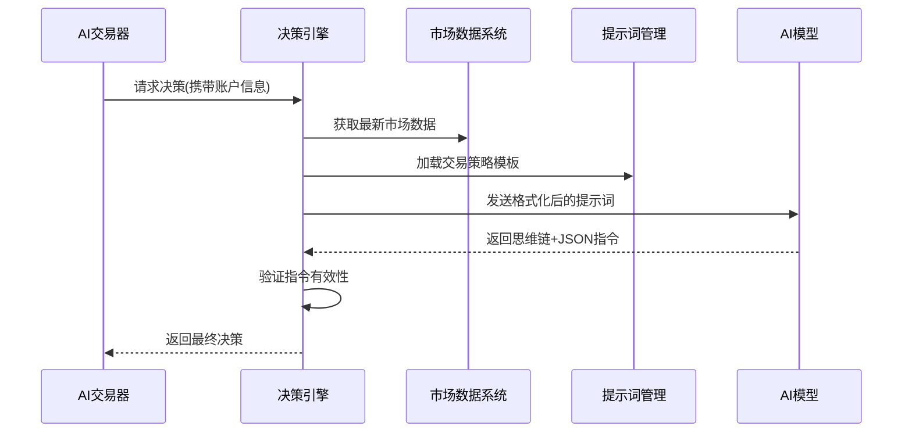

# 第4章：AI决策引擎

欢迎回来

通过前几章的积累，`nofx`已具备关键能力：[第1章](01_database___configuration_.md)赋予它"记忆db"功能，[第2章](02_market_data_system_.md)装备了"市场耳目class"，[第3章](03_multi_exchange_trader_interface_.md)则提供了"交易执行手adapter"

但还缺最关键的一环：**如何做决策？** 当市场数据完备、工具就位时，什么机制告诉它*何时*买入、*何时*卖出或*何时*按兵不动？

## AI的"大脑"：智能交易决策

设想一位超级智能厨师：掌握无数菜谱、通晓所有食材、配备顶级厨具。但在开火前，它需要根据现有食材、用餐时间和你的口味*决定*烹饪什么。

在`nofx`中，**AI决策引擎**正是这样的"大脑"。它将原始市场数据、账户信息和预设规则转化为可执行的交易策略，通过"思考"市场状况来指导交易接口操作。

### 核心场景："现在该交易吗？"

假设AI交易器运行时不断自问："基于当前所有信息，应该开新仓、平现有仓还是观望？"

这是个复杂问题！AI需要综合考量：
* 比特币当前价格（来自市场数据系统）
* 比特币趋势方向（来自市场数据系统）
* 账户可用资金（来自数据库与配置）
* 现有持仓盈亏状况（来自数据库与配置）
* 交易规则约束（即后文将介绍的"提示词"）

决策引擎消化这些输入后，会输出明确指令："以特定参数做多BTCUSDT"、"持有现仓"或"暂时观望"。

## 核心机制解析

### 1. 输入数据：市场与账户全景

决策引擎需要完整的市场画像和账户状态：

* **市场数据**：来自[第2章](02_market_data_system_.md)的实时价格、多周期K线、EMA/MACD/RSI等技术指标，以及合约特有的未平仓量和资金费率
* **账户信息**：来自[第1章](01_database___configuration_.md)的总资产、可用余额、现有持仓及其盈亏
* **交易哲学(提示词)**：用户为AI设定的行为准则

### 2. 交易哲学：AI的行为准则

AI并非随机决策，而是遵循**提示词**(prompts)的详细指引。提示词本质上是告诉AI：
* 核心目标（如风险调整后收益最大化）
* 可采取的行动（开多/开空/平仓/观望）
* 仓位规模计算方法
* **关键的开平仓条件**
* 风险管理规则（如止损止盈设置）
* 市场数据解读方式

`nofx`采用DeepSeek等先进AI模型，通过精心设计的提示词引导其决策过程。

**简化版提示词示例：**
```
# 核心目标
通过系统化、纪律性交易实现风险调整后收益最大化

# 交易原则
- 本金优先：保护资本比追求收益更重要
- 质量至上：少量高确定性交易优于大量低确定性交易

# 开仓条件(必须全部满足)
- 仅当以下条件成立时做多：
    - BTCUSDT的MACD呈正值(看涨动量)
    - BTCUSDT的RSI低于40(超卖或复苏中)
    - 4小时K线显示明确上涨趋势(价格>EMA20)
```
完整提示词文件(如`prompts/default.txt`)包含更复杂的策略逻辑。

### 3. 思维链推理：透明化决策过程

与直接输出结论不同，AI决策引擎会生成详细的**思维链(CoT)**文本，如同"自言自语"：
* "BTCUSDT的3分钟MACD呈正值，显示看涨动量"
* "但4小时RSI超过70，预示可能回调"
* "当前ETHUSDT持仓盈利5%，应考虑移动止损保护利润"
* "综合信号矛盾，选择等待更明确机会"

这种透明化推理对理解AI逻辑、调试行为和改进提示词至关重要。

### 4. 结构化输出：可执行的交易指令

完成CoT推理后，引擎输出`nofx`可直接理解的标准化交易指令：

**简化输出示例：**
```json
{
  "symbol": "BTCUSDT",
  "action": "open_long",
  "leverage": 10,
  "position_size_usd": 1000,
  "stop_loss": 60000,
  "take_profit": 65000,
  "reasoning": "多周期K线显示强劲看涨趋势且成交量放大"
}
```
每个指令都是包含交易对、操作类型、杠杆、仓位规模等完整参数的`Decision`对象。

## 决策引擎调用

主入口函数`decision.GetFullDecision()`封装了整个决策流程：

```go
func getAIDecision() {
    // 1. 构建决策上下文
    ctx := &decision.Context{
        Account: decision.AccountInfo{
            TotalEquity: 10000.0,
            AvailableBalance: 9000.0
        },
        CandidateCoins: []decision.CandidateCoin{
            {Symbol: "BTCUSDT"}, {Symbol: "ETHUSDT"}
        }
    }

    // 2. 获取AI决策
    fullDecision, _ := decision.GetFullDecision(ctx, mcpClient)
    
    // 3. 输出思维链和交易指令
    fmt.Printf("思维链:\n%s\n", fullDecision.CoTTrace)
    for _, d := range fullDecision.Decisions {
        fmt.Printf("操作:%s 交易对:%s 理由:%s\n", 
            d.Action, d.Symbol, d.Reasoning)
    }
}
```

## 底层实现

### 核心工作流程



### 关键代码

1. **决策中枢(`decision/engine.go`)**
```go
func GetFullDecision(ctx *Context) (*FullDecision, error) {
    // 1. 获取市场数据
    fetchMarketDataForContext(ctx)
    
    // 2. 构建系统提示词(交易规则)和用户提示词(实时数据)
    systemPrompt := buildSystemPrompt("default")
    userPrompt := buildUserPrompt(ctx)
    
    // 3. 调用AI模型
    aiResponse := mcpClient.CallWithMessages(systemPrompt, userPrompt)
    
    // 4. 解析响应
    return parseFullDecisionResponse(aiResponse)
}
```

2. **提示词管理(`decision/prompt_manager.go`)**
```go
func GetPromptTemplate(name string) (*PromptTemplate, error) {
    // 从prompts目录加载对应名称的模板文件
    content, _ := os.ReadFile(fmt.Sprintf("prompts/%s.txt", name))
    return &PromptTemplate{Name: name, Content: string(content)}, nil
}
```

3. **AI模型调用(`mcp/client.go`)**
```go
func (c *Client) CallWithMessages(system, user string) (string, error) {
    // 构造符合AI模型API要求的请求格式
    request := map[string]interface{}{
        "model": c.Model,
        "messages": []map[string]string{
            {"role": "system", "content": system},
            {"role": "user", "content": user},
        }
    }
    // 发送HTTP请求并返回响应
}
```

4. **指令验证(`decision/engine.go`)**
```go
func validateDecision(d *Decision) error {
    if d.Action == "open_long" {
        // 检查杠杆是否合规
        if d.Leverage > maxLeverage { return errOverLeverage }
        // 检查风险回报比是否≥1:3
        if calcRiskRewardRatio(d) < 3 { return errPoorRiskReward }
    }
    return nil
}
```

## 小结

**AI决策引擎**作为`nofx`的智能中枢，通过结合实时市场数据、账户状态和预设交易哲学，生成经过思维链验证的标准化交易指令。

这种透明化、结构化的决策过程，使系统既能充分利用AI的分析能力，又能确保风险可控。

现在`nofx`已具备完整的"思考-执行"能力，下一章我们将探讨[认证与用户管理](05_authentication___user_management_.md)，了解如何安全地管控这套强大系统。

