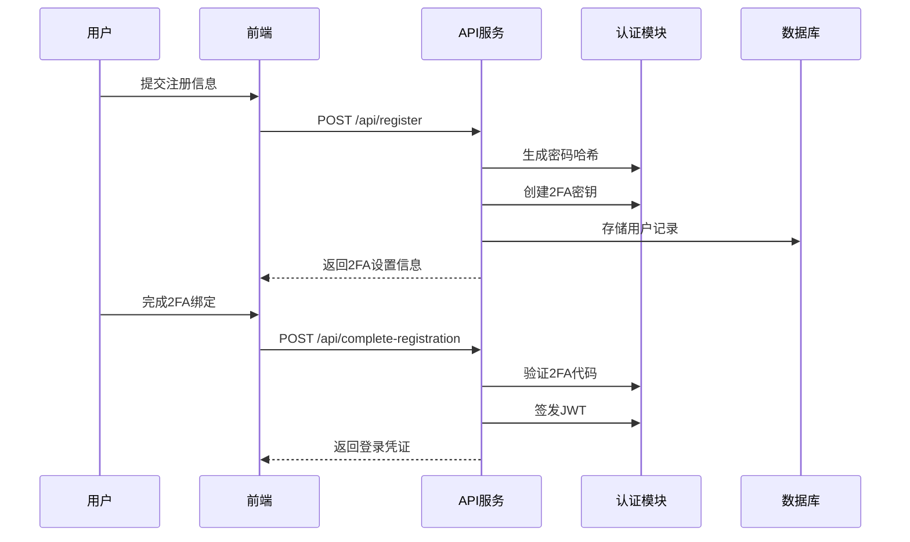

# 第5章：认证与用户管理

欢迎回到`nofx`

截至目前，我们已经构建了一个智能系统：它具备记忆功能（[第1章：数据库与配置](01_database___configuration_.md)）、市场感知能力（[第2章：市场数据系统](02_market_data_system_.md)）和交易执行能力（[第3章：多交易所交易接口](03_multi_exchange_trader_interface_.md)）。最近我们还深入研究了其"大脑"——[第4章：AI决策引擎](04_ai_decision_engine_.md)，它能做出智能交易决策。

但如果不止你一个人使用`nofx`呢？或者你想确保API密钥、资金余额和AI策略等敏感信息不被窥探？这时就需要**认证与用户管理**系统登场了。

## 系统的"安全卫士"与"身份管家"

想象`nofx`是一座戒备森严的建筑，里面满是强大的AI机器人。你肯定不希望任何人随意进出操控它们，因此需要：
1. **门禁系统（注册）**：允许授权人员登记
2. **身份核验（登录）**：确认访客身份真实性
3. **通行证（访问令牌）**：进入后无需反复验证即可通行各区域
4. **增强验证（2FA）**：对敏感区域进行视网膜扫描或指纹检查

这正是**认证与用户管理**系统为`nofx`提供的功能。它负责管理用户账户、验证身份，并确保每个用户都能安全地访问*自己的*AI交易器和配置。

### 核心场景：登录并访问AI交易器

假设你打开`nofx`网页界面时：
* 输入**邮箱**和**密码**
* 系统验证身份真实性
* 若启用**双因素认证(2FA)**，需额外输入手机验证码
* 验证通过后获得**安全访问令牌(JWT)**（相当于数字通行证）
* 后续查看或修改交易器设置时，系统只需检查JWT即可确认权限

这套流程保护了你的财务数据，确保只有你能管理自己的交易机器人。

## 核心机制解析

### 1. 用户账户：数字身份

账户信息（如邮箱和加密存储的密码哈希）保存在`config.db`数据库的`users`表中：

| 字段           | 说明          | 示例                |
| :------------- | :------------ | :------------------ |
| `ID`           | 唯一账户标识  | `user_abc-123`      |
| `Email`        | 登录邮箱      | `john@example.com`  |
| `PasswordHash` | 加密后的密码  | `a$12b@xyz...`      |
| `OTPSecret`    | 2FA密钥       | `ABCDEFGHJKLMNP...` |
| `OTPVerified`  | 2FA是否已验证 | `true`              |

### 2. 双因素认证(2FA)：额外安全层

即使密码泄露，没有绑定设备生成的验证码仍无法登录。`nofx`采用TOTP(基于时间的一次性密码)标准，兼容Google Authenticator等应用。

注册时：
* 系统生成唯一密钥(`OTPSecret`)
* 提供**二维码**供扫描或手动输入密钥
* 输入应用生成的验证码完成绑定

### 3. 安全访问令牌(JWT)：数字通行证

登录成功后系统颁发**JSON Web令牌**：
* **本质**：包含用户ID、邮箱等信息的数字签名凭证
* **原理**：用`config.json`中的`jwt_secret`密钥签名，防篡改
* **优势**：替代反复输入密码，随请求头发送即可验证身份

### 4. 管理员模式：开发捷径

本地开发时可通过`config.json`中的`admin_mode`绕过登录流程，自动以"admin"身份登录（生产环境严禁使用）。

## 前端交互实现

用户主要通过网页界面与系统交互，核心逻辑集中在`AuthContext`、`RegisterPage`和`LoginPage`组件中。

**1. 注册新账户**

填写注册表单时，前端调用`register`函数：

```typescript
const register = async (email: string, password: string) => {
    const response = await fetch('/api/register', {
        method: 'POST',
        body: JSON.stringify({ email, password })
    });
    const data = await response.json();
    
    if (response.ok) {
        return { 
            success: true, 
            userID: data.user_id, 
            qrCodeURL: data.qr_code_url 
        };
    }
};
```

成功注册后进入2FA设置流程：

```typescript
const completeRegistration = async (userID: string, otpCode: string) => {
    const response = await fetch('/api/complete-registration', {
        method: 'POST',
        body: JSON.stringify({ user_id: userID, otp_code: otpCode })
    });
    // 存储JWT令牌实现自动登录
};
```

**2. 登录现有账户**

登录表单提交触发`login`函数：

```typescript
const login = async (email: string, password: string) => {
    const response = await fetch('/api/login', {
        method: 'POST',
        body: JSON.stringify({ email, password })
    });
    // 如需2FA则跳转验证流程
};
```

2FA验证通过`verifyOTP`完成：

```typescript
const verifyOTP = async (userID: string, otpCode: string) => {
    const response = await fetch('/api/verify-otp', {
        method: 'POST',
        body: JSON.stringify({ user_id: userID, otp_code: otpCode })
    });
    // 获取JWT并更新登录状态
};
```

## 后端安全架构

### 核心工作流程



### 关键代码

1. **认证服务(`auth/auth.go`)**
```go
// 密码加密与验证
func HashPassword(password string) (string, error) {
    return bcrypt.GenerateFromPassword([]byte(password), bcrypt.DefaultCost)
}

// 2FA验证
func VerifyOTP(secret, code string) bool {
    return totp.Validate(code, secret)
}

// JWT签发
func GenerateJWT(userID string) (string, error) {
    token := jwt.NewWithClaims(jwt.SigningMethodHS256, 
        jwt.MapClaims{"user_id": userID})
    return token.SignedString(JWTSecret)
}
```

2. **API路由(`api/server.go`)**
```go
// 注册处理
func (s *Server) handleRegister(c *gin.Context) {
    // 验证邮箱唯一性
    // 存储哈希密码和2FA密钥
    // 返回2FA设置信息
}

// JWT验证中间件
func (s *Server) authMiddleware() gin.HandlerFunc {
    return func(c *gin.Context) {
        token := c.GetHeader("Authorization")
        claims, _ := auth.ValidateJWT(token)
        c.Set("user_id", claims.UserID) // 供后续流程使用
    }
}
```

## 小结

**认证与用户管理**系统.go 如同`nofx`的数字门禁，通过==密码哈希、2FA和JWT三重机制守护账户安全==。

这种设计既保证了系统访问的便捷性，又确保了敏感交易数据的机密性。

现在我们已经了解系统如何保障安全访问，接下来将在[第6章：AI自动交易器](06_ai_autotrader_.md)中探索如何将所有组件整合为完整的自动化交易解决方案。

