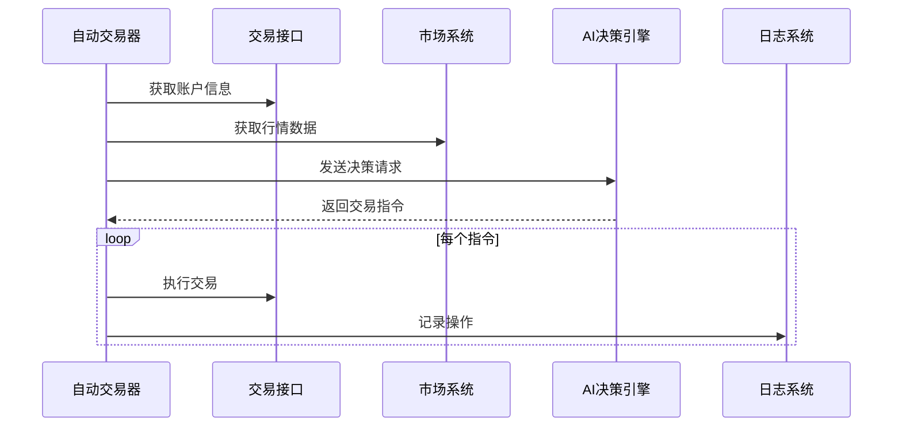

# 第6章：AI自动交易器

欢迎回到`nofx`

通过前几章的积累，我们已经逐步构建了一个强大的系统：[第1章：数据库与配置](01_database___configuration_.md)赋予其记忆能力，[第2章：市场数据系统](02_market_data_system_.md)提供"市场耳目"，[第3章：多交易所交易接口](03_multi_exchange_trader_.md)配备"交易执行手"，而[第4章：AI决策引擎](04_ai_decision_engine_.md)则构建了智能决策"大脑"。最后[第5章：认证与用户管理](05_authentication___user_management_.md)通过身份验证机制保障系统安全。

现在想象你拥有一位天才厨师（AI决策引擎）、储备丰富的食材（市场数据）、精良的厨具（多交易所接口）和完美的食谱（提示词）。

> 如何确保这位厨师能==持续==烹饪、适应新食材并==产出==美味（盈利）佳肴，同时保持详细==记录==？

这就是**AI自动交易器**的用武之地

它是*每个AI交易机器人*的"专属管家"

## AI的"私人管家"：维持系统运转

将`AI自动交易器`视为特定交易策略的全职助理。它不只执行单次交易，而是管理交易机器人的*全生命周期*：

核心职责包括：
* **定时唤醒**：按设定间隔检查市场
* **信息收集**：获取最新市场数据和账户状态
* **专家咨询**：向AI决策引擎寻求建议
* **计划执行**：通过多交易所接口下单交易
* **记录存档**：记录每个动作、决策和绩效
* **持续进化**：利用历史结果优化策略（主要通过改进AI提示词实现）

这个组件将前几章的所有概念整合为持续运行的智能交易机器人。

### 场景："运行我的比特币策略"

假设要在币安上运行基于DeepSeek模型的BTCUSDT交易机器人，每3分钟扫描市场：

若无自动交易器，你需要：
1. 手动获取BTCUSDT数据
2. 手动构建包含策略和账户信息的提示词
3. 手动发送给DeepSeek模型
4. 手动解析复杂响应
5. 手动决定是否执行
6. 手动向币安发送订单
7. 手动记录所有操作
8. 每3分钟重复上述流程！

人力根本无法完成！而`AI自动交易器`能自动化整个流程，==启动后即可7×24小时持续运行==。

## 核心机制

### 1. 唯一标识与配置

每个自动交易器都有唯一`ID`和`名称`，以及特定配置参数：

| 配置项                 | 说明                     | 示例                   |
| :--------------------- | :----------------------- | :--------------------- |
| `ID`/`Name`            | 唯一标识和显示名称       | `btc-deepseek-binance` |
| `AIModel`              | 使用的AI模型             | `deepseek`             |
| `Exchange`             | 交易平台                 | `binance`              |
| `API Keys`             | 交易所和AI模型的密钥     | `sk-xyz...`            |
| `ScanInterval`         | 市场扫描间隔             | `3分钟`                |
| `InitialBalance`       | 初始资金（用于绩效追踪） | `1000 USDT`            |
| `SystemPromptTemplate` | 使用的交易策略模板文件   | `default`              |

这些配置在创建时从数据库加载（参考第1章）。

### 2. 持续交易循环

自动交易器的核心是循环执行以下步骤：

1. **暂停检查**：是否因风控暂停
2. **日绩效重置**：新交易日重置盈亏统计
3. **构建上下文**：
   - 从交易接口获取账户余额和持仓
   - 从市场系统获取最新行情数据
   - 加载该机器人历史表现
4. **获取AI决策**：
   - 发送上下文给AI决策引擎
   - 接收包含思维链和交易指令的响应
5. **指令排序**：确保平仓优先于开仓
6. **执行交易**：
   - 安全检查（如避免重复开仓）
   - 通过交易接口下单
   - 设置止损止盈
7. **记录日志**：保存完整操作记录到`decision_logs/`

### 3. 绩效追踪与日志

自动交易器维护关键指标如`initialBalance`和`dailyPnL`，并通过`DecisionLogger`记录每个循环的详细信息，包括：
- 账户快照（权益、可用余额）
- 当前持仓
- AI使用的完整提示词
- AI的思维链推理过程
- 最终交易决策JSON
- 每项操作的执行结果

这些日志对透明度、调试和长期优化至关重要。

## 使用方式示例

开发者通过配置创建`AutoTrader`实例后，调用`Run()`即可启动：

```go
func startBot() {
    // 1. 创建配置
    config := trader.AutoTraderConfig{
        ID: "btc-strategy-1",
        AIModel: "deepseek",
        Exchange: "binance",
        ScanInterval: 3 * time.Minute,
        SystemPromptTemplate: "default"
    }

    // 2. 创建实例
    myBot, _ := trader.NewAutoTrader(config)
    
    // 3. 启动循环
    go myBot.Run()
    
    // 运行30分钟后停止
    time.Sleep(30 * time.Minute)
    myBot.Stop()
}
```

## 底层实现

### 核心工作流



### 关键代码

1. **结构体定义(`trader/auto_trader.go`)**
```go
type AutoTrader struct {
    id       string
    config   AutoTraderConfig
    trader   Trader          // 交易接口
    mcpClient *mcp.Client    // AI通信客户端
    logger   *DecisionLogger // 日志记录器
}
```

2. **主循环逻辑**
```go
func (at *AutoTrader) runCycle() error {
    // 1. 构建交易上下文
    ctx := at.buildTradingContext()
    
    // 2. 获取AI决策
    decision := decision.GetFullDecision(ctx, at.mcpClient)
    
    // 3. 执行排序后的指令
    for _, action := range sortActions(decision.Actions) {
        at.executeAction(action)
    }
    
    // 4. 保存完整记录
    at.logger.Log(decision)
    return nil
}
```

3. **指令执行示例（做多）**
```go
func (at *AutoTrader) executeOpenLong(d Decision) error {
    // 避免重复开仓
    if at.hasPosition(d.Symbol, "long") {
        return errors.New("existing position")
    }
    
    // 计算数量并下单
    price := market.Get(d.Symbol).CurrentPrice
    qty := d.PositionSizeUSD / price
    result, _ := at.trader.OpenLong(d.Symbol, qty, d.Leverage)
    
    // 设置止损止盈
    at.trader.SetStopLoss(d.Symbol, qty, d.StopLoss)
    return nil
}
```

## 小结

**AI自动交易器**作为`nofx`的运营中枢，通过持续循环整合市场数据采集、AI决策咨询、交易执行和全流程记录，将前几章的独立模块转化为==有机整体==

这种设计使得单个交易机器人能够安全、透明地==自动化==运行。

理解单个自动交易器的工作原理后，下一步自然需要管理==多个==机器人。在[第7章：交易管理器](07_trader_manager_.md)中，我们将探索如何统一管控这些强大的自动交易器。

