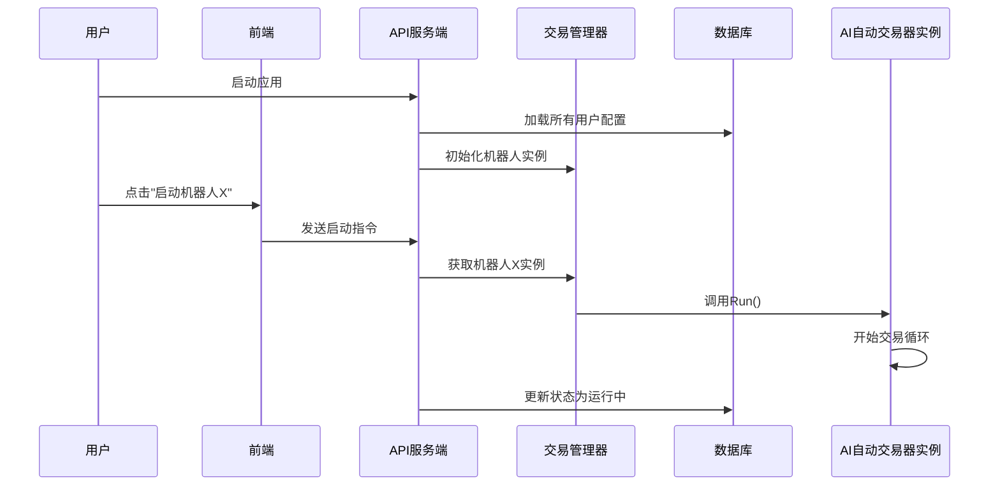

# 第7章：交易管理器

欢迎回来

在[第6章：AI自动交易器](06_ai_autotrader_.md)中，我们学习了负责运行*单个*AI交易机器人的"专属管家"。能处理市场检查、获取AI决策、执行交易并记录特定策略的所有操作。

> 但如果想同时运行*多个*智能交易机器人呢？

比如一个专注比特币，一个操作以太坊，还有一个实验性的山寨币机器人，分别运行在不同交易所和使用不同AI模型。单独管理这些"管家"将很快变得手忙脚乱！你需要手动启停、跟踪每个机器人的状态，并监控整体表现。

## 交易机器人的"中央指挥中心"

想象你是一支特种机器人部队的指挥官。每个机器人（AI自动交易器）都擅长特定任务（交易策略）。作为指挥官，你需要**中央控制台**来：
* **部署新机器人**：启动新交易策略
* **监控所有机器人**：查看活动状态和当前表现
* **下达指令**：根据需要启停特定机器人
* **资源调配**：确保每个机器人配备合适工具

这正是`nofx`中**交易管理器**的角色。它作为所有AI自动交易器的控制中枢，管理从配置加载到启动、停止和监控的全生命周期，确保你的交易机器人舰队协同运作。

### 典型场景：管理AI交易舰队

假设已配置三个AI自动交易器：
1. **"BTC最大收益"**：在币安交易BTCUSDT
2. **"ETH保守策略"**：在Hyperliquid交易ETHUSDT  
3. **"山寨币探索者"**：在币安实验性交易多种山寨币

需要：
- 查看所有机器人状态（运行/停止）
- 启动当前停止的"BTC最大收益"
- 停止表现不佳的"山寨币探索者"
- 新建"SOL短线狙击"机器人交易Solana

**交易管理器**将处理所有这些请求。你通过`nofx`网页界面与其交互，它会找到对应AI自动交易器、执行指令并更新状态。

## 核心机制

### 1. 中央注册表：全局追踪

交易管理器维护`nofx`中所有AI自动交易器的清单。每个机器人都有唯一ID、名称和配置参数。

当`nofx`启动时，管理器从数据库（参考[第1章](01_database___configuration_.md)）加载这些配置到内存。

这意味着它掌握：
- 每个机器人使用的AI模型
- 连接的交易所
- 初始资金、杠杆设置和交易对
- 是否配置为自动运行

### 2. 生命周期管理：启停与监督

交易管理器的核心职责是管理每个AI自动交易器的"生命"：
- **加载**：启动时从数据库读取配置，为每个有效配置创建`AI自动交易器`实例（相当于为每个机器人雇佣"管家"）
- **启动**：调用实例的`Run()`方法，开启持续交易循环（参考[第6章](06_ai_autotrader_.md)）
- **停止**：调用`Stop()`方法，优雅终止交易操作
- **状态监控**：查询实例获取当前状态、近期活动和绩效指标（如当前权益、盈亏、持仓）

### 3. 通过API集中控制

所有管理功能通过`nofx`的API暴露。这意味着网页界面（或其他程序）可发送简单指令如"获取所有机器人"、"启动机器人X"或"删除机器人Y"，而交易管理器处理底层复杂操作。

## 使用方式（前端视角）

用户主要通过`nofx`网页界面与交易管理器交互。以下是前端代码(`web/src/components/AITradersPage.tsx`)如何管理AI机器人的示例：

**典型操作：列举、创建、启停和删除机器人**

```typescript
// 简化版前端代码
import { api } from '../lib/api'; // 用于向后端API发送请求

function AITradersPage() {
  // 1. 获取机器人列表
  const { data: traders } = useSWR('traders', api.getTraders, { 
    refreshInterval: 5000 // 每5秒自动刷新
  });

  // 2. 创建新机器人
  const handleCreate = async (data) => {
    await api.createTrader(data); // POST /api/traders
  };

  // 3. 启动/停止机器人
  const handleToggle = async (id, isRunning) => {
    isRunning ? await api.stopTrader(id) : await api.startTrader(id);
  };

  // 4. 删除机器人
  const handleDelete = async (id) => {
    await api.deleteTrader(id); // DELETE /api/traders/:id
  };
}
```
这段代码展示：
- `api.getTraders()`获取所有已配置机器人
- `api.createTrader()`创建新机器人
- `api.stopTrader()`和`api.startTrader()`控制运行状态
- `api.deleteTrader()`移除机器人

## 底层实现

### 核心工作流



### 关键代码模块

1. **交易管理器结构(`manager/trader_manager.go`)**
```go
type TraderManager struct {
    traders map[string]*trader.AutoTrader // 用ID索引的机器人实例
    mu      sync.RWMutex                  // 线程安全锁
}
```

2. **从数据库加载(`manager/trader_manager.go`)**
```go
func (tm *TraderManager) LoadTradersFromDatabase(db *Database) error {
    // 获取所有用户配置
    users := db.GetAllUsers()
    for _, user := range users {
        // 为每个用户加载机器人配置
        configs := db.GetTraderConfigs(user.ID)
        for _, cfg := range configs {
            // 创建AI自动交易器实例
            instance := trader.NewAutoTrader(cfg)
            tm.traders[cfg.ID] = instance
            // 如果配置为自动运行，则启动
            if cfg.AutoStart {
                go instance.Run() 
            }
        }
    }
}
```

3. **API控制端点(`api/server.go`)**
```go
// 启动机器人处理函数
func handleStartTrader(c *gin.Context) {
    id := c.Param("id")
    instance := traderManager.GetTrader(id)
    go instance.Run() // 在新协程中启动
    db.UpdateTraderStatus(id, true) // 更新数据库状态
}
```

## 小结

**交易管理器**作为`nofx`的中控系统，通过维护机器人注册表、管理生命周期和提供API控制，将多个AI自动交易器整合为协同工作的智能舰队

这种设计使得用户能够轻松管理复杂的多策略交易组合。

现在我们已经了解如何管理交易机器人舰队，最后一块拼图是用户如何通过友好界面与这些强大后端系统交互。在最终章[第8章：前端API客户端](08_frontend_api_client_.md)中，我们将探索连接浏览器与`nofx`后端的桥梁。

