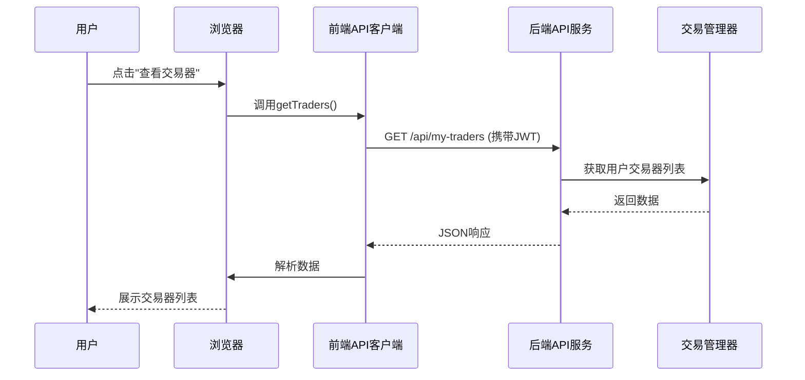

# 第8章：前端API客户端

欢迎来到`nofx`旅程的最终章

我们已经构建了一个强大的系统：它具备记忆功能（[第1章：数据库与配置](01_database___configuration_.md)）、市场感知能力（[第2章：市场数据系统](02_market_data_system_.md)）、交易执行能力（[第3章：多交易所交易接口](03_multi_exchange_trader_interface_.md)）、智能决策能力（[第4章：AI决策引擎](04_ai_decision_engine_.md)）、安全保障（[第5章：认证与用户管理](05_authentication___user_management_.md)），并通过中央控制系统（[第7章：交易管理器](07_trader_manager_.md)）管理多个AI交易机器人（[第6章：AI自动交易器](06_ai_autotrader_.md)）。

- 但所有这些强大的后端逻辑，如何通过直观可视化的方式与用户交互？如何在不输入复杂终端命令的情况下查看账户余额、创建新交易器或启停它们？

## 连接前后端的"专属信使服务"

想象`nofx`后端是一个忙碌的高科技厨房，有专业厨师（AI自动交易器）和主厨（交易管理器）。而你舒适地坐在餐厅（网页仪表盘），想要点餐（创建交易器）或查看订单状态（查询账户余额）。

你不需要亲自进入嘈杂的厨房，而是通过**前端API客户端**这个"专属信使"：
1. **接收指令**：如"创建新交易器"或"启动BTC机器人"
2. **精准传达**：确保后端组件（如交易管理器）收到指令
3. **返回响应**：获取数据并清晰呈现
4. **安全验证**：通过JWT确保只有你能操作自己的机器人

## 核心机制

### 1. API：餐厅菜单

**API**（应用程序接口）是软件间通信的规则集合，如同餐厅菜单：
- 列出可点菜品（如"获取交易器列表"）
- 规定点餐方式（如"需携带用户ID"）
- 说明返回内容（如"JSON格式的交易器列表"）

`nofx`后端提供多种端点：
- `/api/my-traders`：获取交易器列表
- `/api/traders`：创建新交易器
- `/api/account`：查询账户余额

### 2. 前端客户端：点餐员

前端代码（`web/src/lib/api.ts`）如同餐厅服务员，负责：
- 从本地存储获取JWT令牌
- 添加认证头信息
- 发送HTTP请求并处理响应

```typescript
// 简化版api.ts示例
export const api = {
  async getTraders(): Promise<TraderInfo[]> {
    const res = await fetch('/api/my-traders', {
      headers: {
        'Authorization': `Bearer ${localStorage.getItem('auth_token')}`
      }
    });
    return res.json();
  }
}
```

### 3. 代理配置：后厨通道

开发环境下，`vite.config.ts`配置代理，将前端请求转发到后端：

```typescript
// vite.config.ts
export default defineConfig({
  server: {
    proxy: {
      '/api': {
        target: 'http://localhost:8080', // 后端地址
        changeOrigin: true
      }
    }
  }
})
```

## 通信流程



## 后端实现

```go
// api/server.go简化版
func (s *Server) handleGetMyTraders(c *gin.Context) {
    userID := c.GetString("user_id") // 从JWT获取用户ID
    traders := s.traderManager.GetTradersForUser(userID)
    c.JSON(200, traders) // 返回JSON
}
```

## 小结

**前端API客户端**作为连接用户界面与复杂后端的桥梁，通过==标准化HTTP通信和JWT认证==，使得：
- 用户可通过直观界面管理AI交易系统
- 前后端职责分离，保障安全性
- 开发效率提升，便于维护扩展

至此，`nofx`从数据存储、市场感知、交易执行、智能决策到用户交互的全套系统已完整呈现。现在已掌握这个AI交易系统的整体架构与实现原理

END *★,°*:.☆(￣▽￣)/.°★* 。