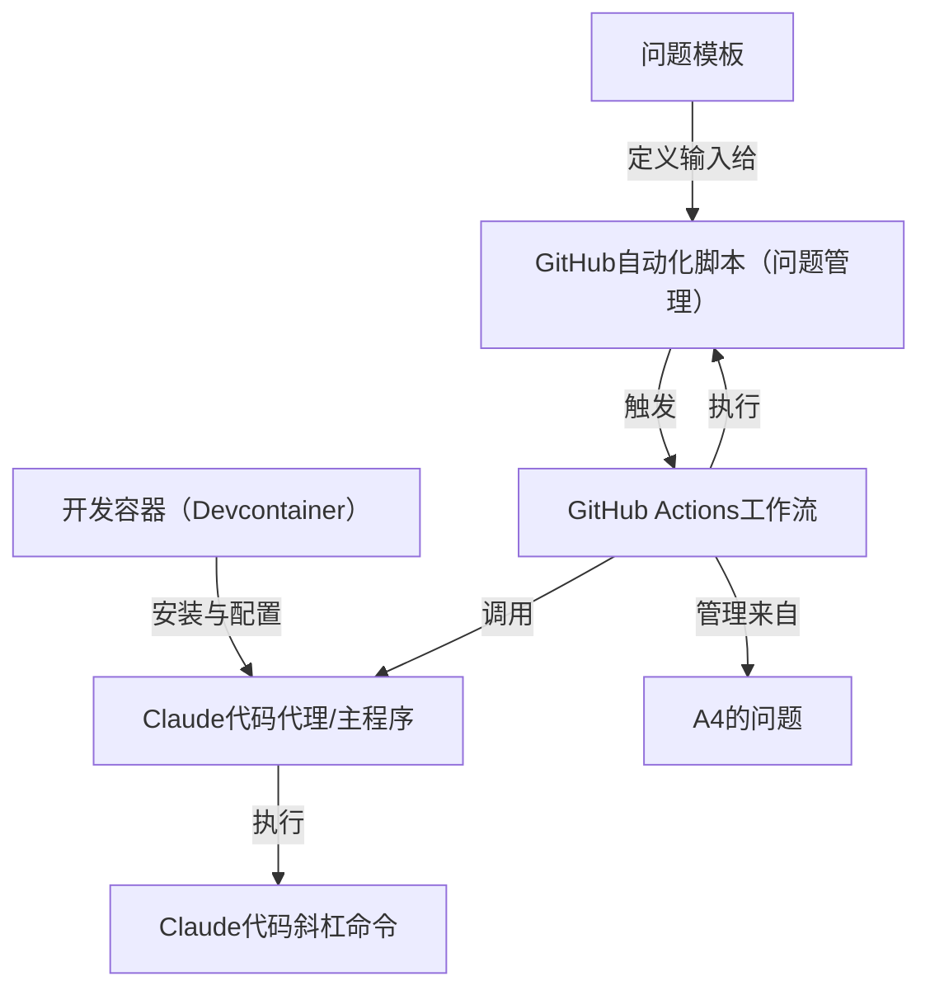

链接：[Claude Code overview - Claude Docs](https://docs.claude.com/en/docs/claude-code/overview)

# docs：Claude Code

`Claude Code`是一款**智能编程助手**，常驻于终端环境，是开发者的*智能伙伴*。它能通过自然语言指令**自动化复杂编程和Git操作**，并与*GitHub问题管理系统*深度集成，显著提升开发效率。

## 架构

## 目录

1. [Claude代码代理/主程序](01_claude_code_agent_application_.md)
2. [Claude代码斜杠命令](02_claude_code_slash_commands_.md)
3. [GitHub Actions工作流](03_github_actions_workflows_.md)
4. [GitHub自动化脚本（问题管理）](04_github_automation_scripts__issue_management__.md)
5. [问题模板](05_issue_templates_.md)
6. [开发容器（Devcontainer）](06_development_container__devcontainer__.md)

