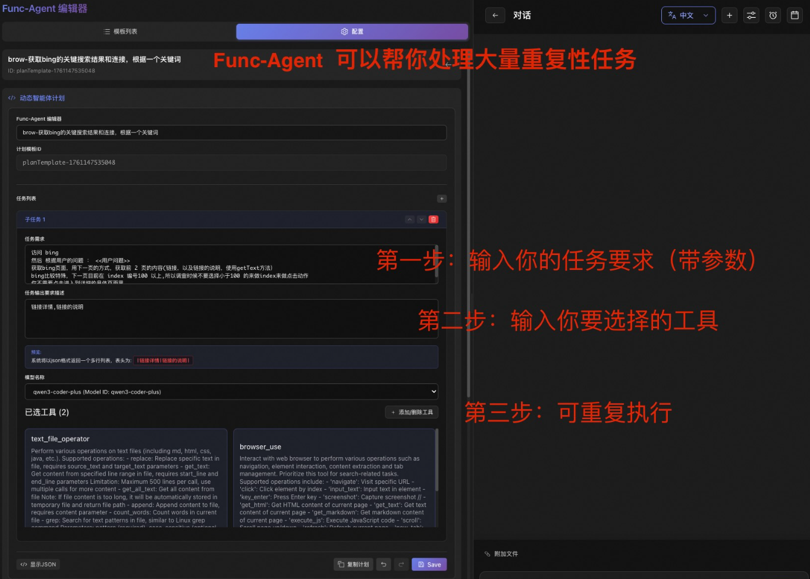
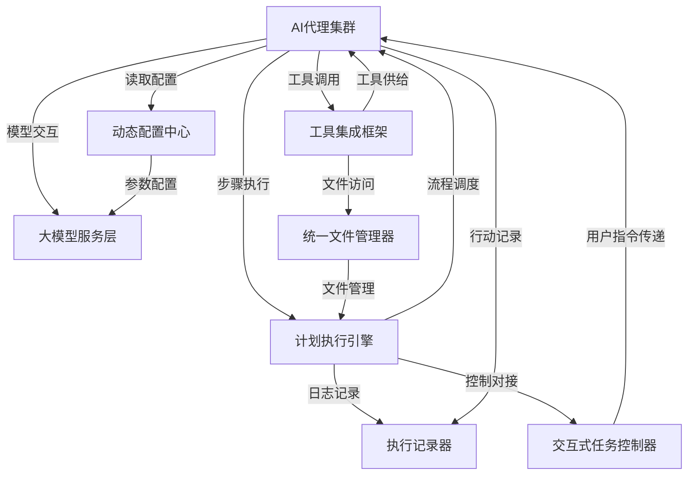

链接：[JManus/README-zh.md at main · spring-ai-alibaba/JManus](https://github.com/spring-ai-alibaba/JManus/blob/main/README-zh.md)

# docs：JManus智能自动化平台

JManus 是一个**AI自动化平台**，旨在简化复杂任务处理流程

如同一位*智能项目经理*，能够将高级用户请求拆解为可执行步骤，并分配给专门的**AI代理**执行

这些代理通过调用*丰富的外部功能工具集*完成任务，同时整个流程会被完整*记录用于调试和审计*

系统支持*动态行为定制*，并通过交互式控制实现*人机协同作业*。

## 系统架构

## 章节

1. [交互式任务控制](01_interactive_task_control_.md)
2. [计划执行引擎](02_plan_execution_engine_.md)
3. [AI代理系统](03_ai_agents_.md)
4. [动态配置管理](04_dynamic_configuration_.md)
5. [大模型服务层](05_llm_service_layer_.md)
6. [工具集成框架](06_tool_integration_framework_.md)
7. [统一文件管理](07_unified_file_manager_.md)
8. [执行记录系统](08_execution_recorder_.md)

---

