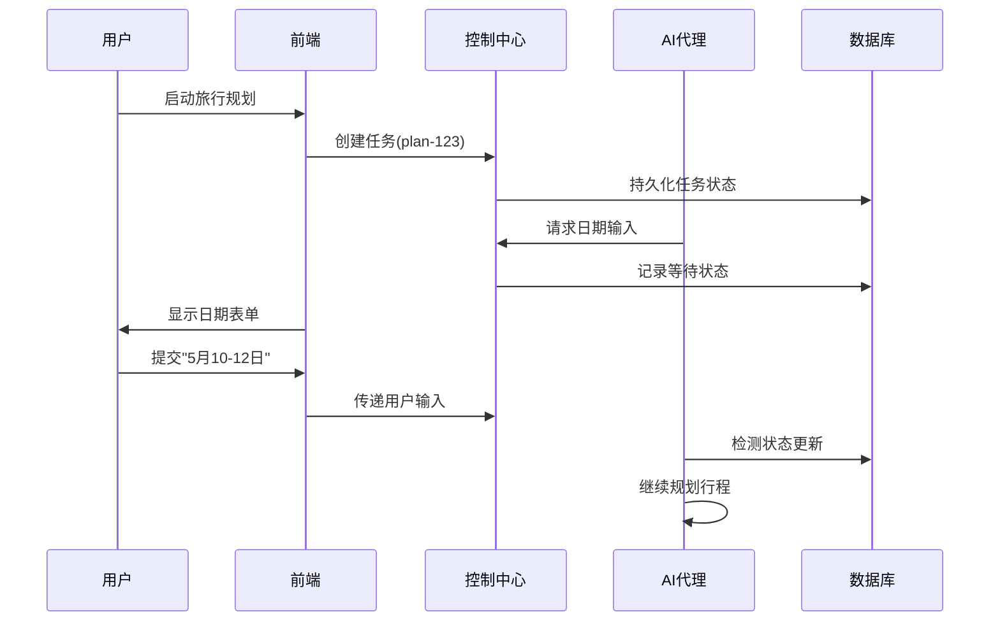

# 第1章：交互式任务控制系统

想象你正在处理一个大型项目，拥有一位能处理多种任务的智能助手。这位助手虽然强大，但有时需要：
- 向你确认细节："您倾向的日期是？"
- 汇报当前进度："报告生成到哪一步了？"
- 响应紧急指令："立即暂停"或"终止任务"

这正是JManus**交互式任务控制**的核心价值

==构建了人类与AI协同工作的桥梁==，确保你不仅是旁观者，更是AI任务的主导者。

## 智能副驾驶：超越全自动模式

将JManus视为AI==副驾驶==——能自主操控飞机（执行复杂任务），但关键时刻需要你的决策输入。交互式控制为你提供了方向盘、暂停键和求助按钮。

本章将展示这套系统如何实现：
1. **输入引导**：AI主动发起问题表单，等待你的关键输入
2. **进度监控**：实时查看任务状态与执行日志
3. **流程干预**：随时停止/暂停/继续任务执行

让我们通过旅行规划案例具体说明！

## 应用场景：AI旅行助手

当你提出"规划海滨城市周末游"时：

1. **信息补全**  
   AI可能询问："优先考虑休闲沙滩还是水上运动？"并暂停任务等待你的选择

2. **进度追踪**  
   在AI查询航班酒店时，你可随时查看：
   ```typescript
   interface PlanExecutionRecord {
     status: 'running' | 'paused';  // 实时状态
     progress: 65;                 // 完成百分比
     progressText: "正在比价酒店方案"; // 当前操作
   }
   ```

3. **动态干预**  
   若临时需调整行程：
   ```typescript
   // 暂停任务
   await DirectApiService.pauseTask("trip-plan-123");
   
   // 修改参数后继续
   await DirectApiService.resumeTask("trip-plan-123");
   ```

## 三大核心机制

### 1. 人机对话（Human-in-the-Loop）

当AI需要关键决策时，通过`FormInputTool`生成交互表单：
```java
public class FormInputTool {
    public ToolExecuteResult run(UserFormInput formInput) {
        this.setInputState(InputState.AWAITING_USER_INPUT); // 进入等待状态
        return new ToolExecuteResult("等待用户填写旅行日期");
    }
}
```
前端将渲染为可视化表单，提交后AI自动续接任务。

### 2. 透明化监控

任务状态机包含完整生命周期：
```typescript
type ExecutionStatus = 
  | 'IDLE'      // 待启动
  | 'RUNNING'   // 执行中
  | 'PAUSED'    // 已暂停
  | 'FINISHED'; // 已完成
```
所有操作记录通过`ExecutionRecorder`持久化存储。

### 3. 强控制能力

通过`RootTaskManagerEntity`实现中央控制：
```java
public enum DesiredTaskState {
    START,   // 启动任务
    STOP,    // 安全终止
    PAUSE,   // 暂停待恢复
    RESUME,  // 继续执行
    CANCEL;  // 彻底取消
}
```
分布式环境下仍能保证控制指令的一致性。

## 技术实现

### 核心组件协作



### 关键服务说明

| 组件                      | 功能                                          |
| ------------------------- | --------------------------------------------- |
| `TaskInterruptionManager` | 每5秒==检查数据库中的控制指令==，实现秒级响应 |
| `UserInputService`        | 管理表单数据生命周期，支持超时自动==回退==    |
| `ExecutionRecorder`       | ==记录==完整操作轨迹，支持事后审计与分析      |

## 总结

交互式控制使JManus从自动化工具进化为：
- **可引导**：关键节点接受人工输入
- **可观测**：全流程透明化监控
- **可干预**：实时控制任务走向

下一章将深入[计划执行引擎](02_plan_execution_engine_.md)，揭示任务拆解与调度原理。

