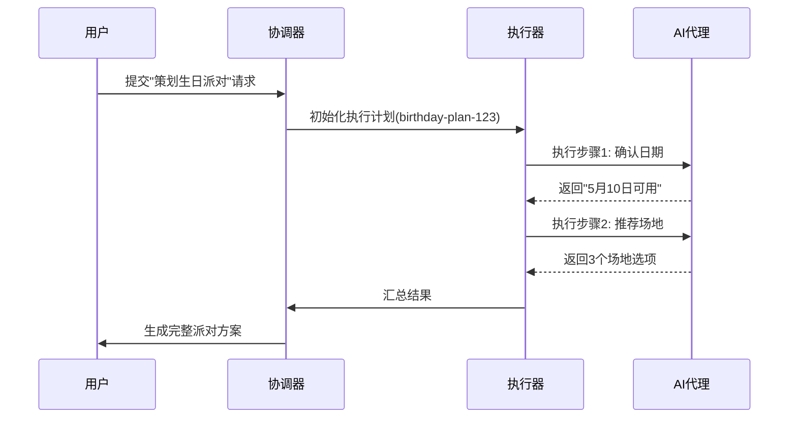

# 第2章：计划执行引擎

在[第1章：交互式任务控制](01_interactive_task_control_.md)中，我们了解了如何==通过指令控制JManus AI助手==

但当提出"规划周末旅行"这类复杂请求时，系统如何==拆解任务==、确保执行顺序并最终达成目标？这就是**计划执行引擎**的职责所在

## AI的项目管理系统

想象策划一场生日派对需要：
1. 选定日期
2. 拟定宾客名单
3. 筛选场地
4. 发送邀请函
5. 安排餐饮
6. 现场布置

这些子任务存在==先后依赖关系==——显然不能在确定场地前预订餐饮

JManus的**计划执行引擎**正是这样的智能项目管家，它将高层级请求（如"策划生日派对"）拆解为可执行的**计划**，并确保每个步骤有序完成。

## 实战案例：派对规划

当你提出"为Sarah策划下月30岁生日派对"时：

1. **目标解析**  
   引擎理解核心诉求："策划Sarah的30岁生日庆典"

2. **生成计划**  
   创建任务清单：
   ```typescript
   interface PlanData {
     title: "Sarah's Birthday";
     steps: [
       { stepRequirement: "确认Sarah可用日期", agentName: "CalendarAgent" },
       { stepRequirement: "生成宾客名单", agentName: "ContactAgent" },
       { stepRequirement: "推荐合适场地", agentName: "VenueResearchAgent" }
     ]
   }
   ```

3. **动态执行**  
   每个步骤分配给专属[AI代理](03_ai_agents_.md)，通过[交互式控制](01_interactive_task_control_.md)处理需人工确认的环节（如场地选择）

4. **结果整合**  
   收集各步骤产出（确定日期、宾客列表、场地预订等），生成完整派对方案

## 核心架构

### 关键组件

| 组件                        | 职责                                         | 类比           |
| --------------------------- | -------------------------------------------- | -------------- |
| `PlanningCoordinator`       | 接收请求，创建执行上下文，初始化执行器       | 项目总监       |
| `AbstractPlanExecutor`      | 逐步执行计划，处理中断请求，收集结果         | 项目经理       |
| `DynamicAgentExecutionPlan` | 存储任务步骤列表及元数据                     | 项目计划书     |
| `ExecutionContext`          | 维护执行环境数据（计划ID、用户请求、文件等） | 项目共享文件夹 |
| `LevelBasedExecutorPool`    | 分级线程池管理子任务                         | 专项工作组     |

### 执行流程



## 技术实现

### 计划执行核心逻辑

```java
// 简化版AbstractPlanExecutor.executeAllStepsAsync
public CompletableFuture<PlanExecutionResult> executeAllStepsAsync(ExecutionContext ctx) {
    for (ExecutionStep step : ctx.getPlan().getSteps()) {
        // 检查用户中断指令
        if (interruptionHelper.isInterrupted(ctx.getRootPlanId())) {
            break; // 立即终止执行
        }
        
        // 执行当前步骤
        BaseAgent agent = getAgentForStep(step);
        String result = agent.run();
        step.setResult(result);
        
        // 记录进度
        recorder.logStepCompletion(step);
    }
    return buildFinalResult(ctx);
}
```

### 中断检查机制

```java
// TaskInterruptionHelper实现片段
public boolean isInterrupted(String planId) {
    RootTaskManagerEntity task = repository.findByPlanId(planId);
    return task.getDesiredState() == DesiredTaskState.STOP; // 检查停止指令
}
```

## 设计优势

1. **灵活可插拔**  
   通过`PlanInterface`抽象支持不同类型的计划结构

2. **执行可观测**  
   `ExecutionRecorder`记录完整执行轨迹，支持：
   ```typescript
   interface ExecutionLog {
     timestamp: "2025-05-01T14:30:00";
     stepId: "confirm-dates-step";
     status: "completed";
     durationMs: 4500;
   }
   ```

3. **资源分级管控**  
   `LevelBasedExecutorPool`确保父任务与子任务不会竞争线程资源

## 总结

计划执行引擎通过：
- **结构化拆解**：将模糊需求==转化==为明确步骤
- **动态调度**：==实时==响应执行状态变化
- **结果聚合**：整合==分散产出==为完整解决方案

使复杂AI任务变得可控可管理

接下来我们将深入这些任务的执行者——[AI代理系统](03_ai_agents_.md)

