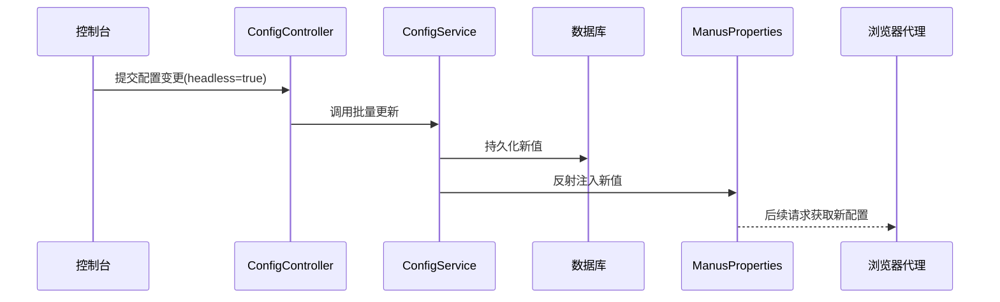

# 第4章：动态配置系统

在[第3章：AI代理系统](03_ai_agents_.md)中，我们了解了JManus如何通过专业化代理执行任务

这些代理通常需要特定参数才能高效工作——例如浏览器代理需知道是否显示可视化窗口，大模型服务需明确调用哪种模型。如果每次调整参数都需要重启系统，对于执行长周期任务的JManus将是灾难性的。这正是**动态配置系统**的价值所在

## 实时控制中枢

将JManus视为精密仪器，**动态配置**就是其控制面板，支持：
- 运行时调整浏览器模式、代理超时等核心参数
- 所有变更立即生效，无需重启服务
- 配置持久化存储，避免重启丢失
- 统一管理界面，覆盖全系统可调参数

## 实战案例：浏览器模式切换

默认情况下，浏览器代理会启动可视化窗口便于调试：
```java
@ConfigProperty(key="headless", defaultValue="false")
private Boolean showBrowserWindow;
```

当执行长期爬取任务时，可通过控制台实时修改为无头模式：
```bash
POST /api/config/update
{"key":"headless","value":"true"}
```
所有新建的浏览器任务将立即采用新配置，正在运行的任务不受影响。

## 核心机制

### 1. 热更新架构



### 2. 配置声明方式

通过注解定义可调参数：
```java
@Component
public class BrowserProperties {
    @ConfigProperty(
        group = "browser",
        description = "是否启用无头模式",
        inputType = InputType.CHECKBOX
    )
    private volatile Boolean headlessMode; // volatile保证多线程可见性
}
```

### 3. 分层缓存设计

1. **内存缓存**：高频访问配置缓存在ConcurrentHashMap
2. **数据库持久层**：所有配置存储在system_config表
3. **默认值回退**：代码注解中定义的默认值

## 技术实现

### 核心组件

| 组件                | 职责                                              |
| ------------------- | ------------------------------------------------- |
| ConfigEntity        | 数据库实体，存储配置键值、描述、类型等元数据      |
| ConfigRepository    | 基于Spring Data JPA的数据库访问接口               |
| ConfigService       | 核心服务，处理配置的初始化、缓存、热更新逻辑      |
| ConfigurationParser | 注解扫描器，启动时解析@ConfigProperty生成初始配置 |

### 关键代码

**配置热更新服务**：
```java
public class ConfigServiceImpl implements ConfigService {
    
    @Transactional
    public void updateConfig(ConfigDTO dto) {
        // 更新数据库
        ConfigEntity entity = repository.findByKey(dto.getKey());
        entity.setValue(dto.getValue());
        repository.save(entity);

        // 清除相关缓存
        cache.invalidate(dto.getKey());

        // 反射更新内存中的配置对象
        updateBeanField(dto.getKey(), dto.getValue()); 
    }

    private void updateBeanField(String key, String value) {
        // 通过Spring上下文找到所有含@ConfigProperty的Bean
        applicationContext.getBeansWithAnnotation(ConfigurationProperties.class)
            .forEach((name, bean) -> {
                // 反射机制更新字段值
                Field field = findField(bean.getClass(), key);
                field.setAccessible(true);
                field.set(bean, convertValue(value, field.getType()));
            });
    }
}
```

**前端交互协议**：
```typescript
interface ConfigItem {
  id: string;
  key: string;
  value: string;
  type: 'BOOLEAN' | 'NUMBER' | 'STRING';
  options?: string[]; // 用于下拉框
}
```

## 系统优势

1. **秒级生效**  
   通过Java反射机制直接修改内存中的配置对象，避免重启带来的服务中断

2. **版本安全**  
   所有变更记录审计日志，支持快速回滚到历史版本

3. **类型安全**  
   自动将字符串配置转换为目标字段类型（Boolean/Integer等）

4. **权限隔离**  
   不同角色可配置不同参数范围，如：
   ```sql
   INSERT INTO config_permissions 
   VALUES ('guest', 'browser.*', 'READ_ONLY');
   ```

## 总结

动态配置系统通过：
- **声明式配置**：代码即文档的注解定义方式
- **无损热更新**：关键业务零中断的配置变更能力
- **统一治理**：全系统参数的可视化集中管理

为JManus==提供了灵活可控的运行时调优能力==。

下一章我们将深入[大模型服务层](05_llm_service_layer_.md)，揭秘AI代理的"大脑"如何工作

