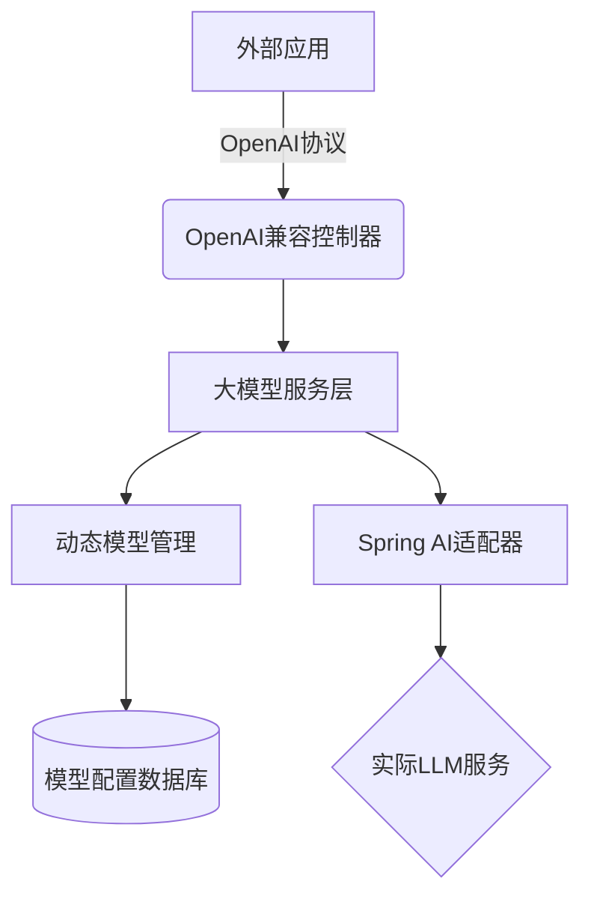

# 第5章：大模型服务层

在[第4章：动态配置系统](04_dynamic_configuration_.md)中，我们了解了如何实时调整JManus参数

这些配置中有许多与AI代理的"大脑"——大语言模型（LLM）密切相关。但如果我们想切换不同的LLM提供商，或者升级到更强大的模型版本，系统如何管理这些复杂的对接？

这正是**大模型服务层**的核心使命

## 智能语言中枢

将JManus想象成拥有专业"语言部门"的组织，该部门负责：
- **统一接入**：标准化对接DashScope、OpenAI等不同厂商的LLM服务
- **密钥安全**：通过加密存储和最小权限管控API密钥
- **模型调度**：动态切换不同能力的LLM实例
- **会话管理**：维护对话上下文和记忆机制

## 实战案例：模型热切换

假设系统初始使用达摩院的"Qwen-Plus"模型，现需切换到GPT-4：

1. **配置新模型**  
   在管理界面填写新模型参数：
   ```json
   {
     "baseUrl": "https://api.openai.com",
     "apiKey": "sk-****",
     "modelName": "gpt-4",
     "temperature": 0.5
   }
   ```

2. **设为默认**  
   通过单次点击完成全局切换：
   ```bash
   POST /api/models/{id}/set-default
   ```

3. **即时生效**  
   所有新建的AI代理任务将自动采用新模型，无需重启服务。

## 核心架构

### 分层设计



### 关键组件

| 组件                       | 职责                                               |
| -------------------------- | -------------------------------------------------- |
| DynamicModelEntity         | 数据库实体，存储LLM连接参数和配置                  |
| ModelService               | 模型配置的CRUD管理，处理默认模型切换逻辑           |
| LlmService                 | 核心服务，维护ChatClient缓存池，处理实际LLM请求    |
| OpenAICompatibleController | 提供OpenAI兼容API，使外部工具可将JManus视为LLM服务 |

## 技术实现

### 模型配置存储

```java
@Entity
@Table(name = "llm_models")
public class DynamicModelEntity {
    @Id
    private String id;
    
    @Column(nullable = false)
    private String baseUrl;  // API端点
    
    @Encrypted  // 字段级加密
    private String apiKey;
    
    @Column(nullable = false)
    private String modelName;  // 如"qwen-plus"
    
    private boolean isDefault;  // 是否默认模型
    
    // 性能参数
    private Double temperature;
    private Integer maxTokens;
}
```

### 动态模型切换

```java
@Service
public class LlmServiceImpl implements LlmService {
    
    private final Map<String, ChatClient> clientCache = new ConcurrentHashMap<>();
    
    @EventListener
    public void handleModelChange(ModelChangeEvent event) {
        // 清除受影响模型的缓存
        clientCache.remove(event.getModelId());
        
        // 如果是默认模型变更，重建默认客户端
        if (event.isDefaultChanged()) {
            rebuildDefaultClient();
        }
    }
    
    private ChatClient createChatClient(DynamicModelEntity model) {
        OpenAiApi api = new OpenAiApi(
            model.getBaseUrl(),
            new ApiKey(model.getApiKey()),
            createWebClient()
        );
        
        return ChatClient.builder(api)
               .defaultOptions(createOptions(model))
               .build();
    }
}
```

### OpenAI兼容接口

```java
@RestController
@RequestMapping("/v1")
public class OpenAICompatibleController {
    
    @PostMapping("/chat/completions")
    public Flux<String> chatCompletions(@RequestBody OpenAIRequest request) {
        // 将OpenAI格式请求转换为JManus任务
        PlanExecutionRequest task = convertToTask(request);
        
        // 通过计划执行引擎处理
        return planExecutor.execute(task)
               .map(this::convertToOpenAIFormat);
    }
}
```

## 系统优势

1. **厂商无感知**  
   通过标准化接口，AI代理无需感知底层是DashScope还是OpenAI

2. **故障转移**  
   内置重试机制和备用模型切换策略

3. **成本优化**  
   支持按需调用不同价位的模型：
   ```sql
   UPDATE llm_models 
   SET is_default=true 
   WHERE cost_per_token < 0.01 
   ORDER BY performance_score DESC LIMIT 1;
   ```

4. **审计追踪**  
   记录所有模型调用的详细日志：
   ```
   [2025-05-20 14:30:00] MODEL_CALL: 
   - model: qwen-plus
   - tokens: 420
   - latency: 1250ms
   - user: admin
   ```

## 总结

大模型服务层通过：
- **统一接入规范**：屏蔽不同LLM的协议差异
- **动态路由能力**：运行时无缝切换模型实例
- **安全管控**：密钥加密与访问审计
- **协议转换**：同时支持原生和OpenAI兼容接口

==构建了JManus与各类大模型交互的智能通道==

接下来我们将探索AI代理如何通过[工具集成框架](06_tool_integration_framework_.md)扩展能力边界。

