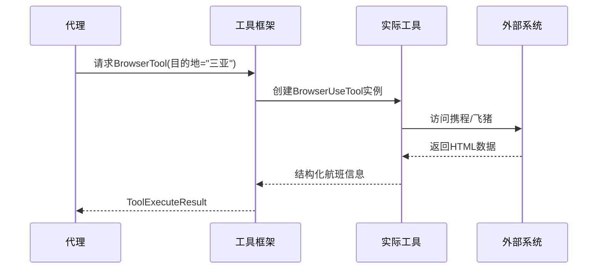

# 第6章：工具集成框架

在[第5章：大模型服务层](05_llm_service_layer_.md)中，我们了解了JManus如何通过大语言模型(LLM)为AI代理赋予"思考"能力。但若代理需要实际操作——例如预订机票而非仅生成预订建议，该如何实现？这正是**工具集成框架**的价值所在

## 智能工具箱

想象一位精通所有菜谱的厨师（即配备LLM的AI代理），若没有刀具、灶具和食材，终究无法烹饪。**工具集成框架**正是JManus代理的"工具箱"，为其提供标准化途径调用各类外部功能：

- **网络浏览**：通过虚拟浏览器访问网页
- **数据查询**：从结构化数据库中检索信息
- **系统命令**：执行本地脚本或程序
- **服务集成**：连接天气API等第三方服务
- **文件操作**：读写本地文件系统

## 实战案例：旅行规划

当执行"海滨城市周末游"计划时：

1. **航班查询代理**  
   调用`BrowserUseTool`工具：
   ```java
   public class BrowserUseTool extends AbstractBaseTool<BrowserInput> {
       @Override
       public ToolExecuteResult run(BrowserInput input) {
           // 使用Selenium驱动浏览器查询航班
           return new ToolExecuteResult(flightData);
       }
   }
   ```

2. **酒店检查代理**  
   使用`DatabaseReadTool`查询本地合作酒店数据库：
   ```sql
   SELECT * FROM hotels 
   WHERE city='三亚' AND rating>=4 
   ORDER BY price ASC LIMIT 10
   ```

3. **行程生成代理**  
   通过`TextFileOperator`创建PDF行程单：
   ```mermaid
   graph LR
     A[代理请求] --> B[工具框架]
     B --> C[文件操作工具]
     C --> D[(文件系统)]
     D --> E[生成PDF]
   ```

## 核心机制

### 标准化接口

所有工具均实现`ToolCallBiFunctionDef`统一契约：
```java
public interface ToolCallBiFunctionDef<I> {
    String getName();          // 工具唯一标识
    String getDescription();   // 功能描述
    ToolExecuteResult run(I input); // 执行入口
}
```

### 动态注册体系

`PlanningFactory`作为工具注册中心：
```java
@Service 
public class PlanningFactory {
    public Map<String, ToolCallBackContext> toolCallbackMap() {
        Map<String, ToolCallBackContext> tools = new HashMap<>();
        
        // 注册内置工具
        tools.put("BrowserTool", 
            new ToolCallBackContext(new BrowserUseTool()));
        
        // 加载MCP外部工具
        mcpService.getTools().forEach(tool -> 
            tools.put(tool.name(), tool));
            
        return tools;
    }
}
```

## 技术实现

### 工具元数据管理

前端通过`ToolController`获取工具列表：
```typescript
// 前端工具模型
interface Tool {
  key: string;       // 唯一标识符
  name: string;      // 显示名称
  serviceGroup: string; // 分类(如"browser")
}
```

### 执行流程



## 系统优势

1. **插拔式扩展**  
   新增工具只需实现标准接口，无需修改核心代码

2. **安全管控**  
   工具执行沙箱隔离，敏感操作需授权：
   ```yaml
   # 工具权限配置
   browser-tool:
     allowed-domains: [ctrip.com, fliggy.com]
     max-runtime: 30s
   ```

3. **跨平台支持**  
   通过MCP协议集成外部服务：
   ```
   POST /mcp/register-tool
   Body: {name: "StockAPI", endpoint: "https://api.example.com/stock"}
   ```

## 总结

工具集成框架通过：
- **标准化协议**：统一的功能调用规范
- **动态装配**：运行时注册与发现机制
- **安全隔离**：沙箱化执行环境

==将AI代理的"思考"能力转化为实际生产力==。

接下来我们将深入代理最常使用的[统一文件管理系统](07_unified_file_manager_.md)。

