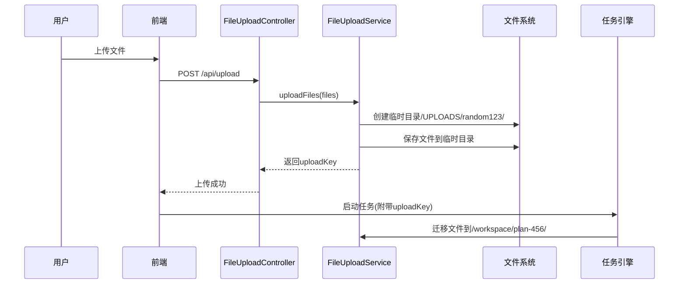

# 第7章：统一文件管理系统

在[第6章：工具集成框架](06_tool_integration_framework_.md)中，我们了解了AI代理如何通过工具与外部系统交互。但当涉及文件操作时，若放任AI随意访问系统文件将导致灾难——误删关键文档、临时文件散落各处甚至越权访问系统文件。这正是**统一文件管理系统**的设计初衷！

## 安全文件沙箱

将JManus视为现代化办公场所，统一文件管理系统为其提供：
- **项目隔离空间**：每个任务拥有专属目录，杜绝文件交叉污染
- **权限围栏**：代理仅能访问自身任务目录，无法窥探其他项目
- **临时文件治理**：明确的上传暂存区和临时工作区
- **路径抽象**：代理通过逻辑路径操作文件，无需感知物理存储结构

## 实战案例：财报分析任务

当处理"解析Q1-Q2财报并生成摘要"任务时：

1. **用户上传**  
   通过界面提交`report_q1.pdf`和`report_q2.pdf`，文件暂存于临时上传区：
   ```java
   // 文件上传服务处理逻辑
   public FileUploadResult upload(MultipartFile[] files) {
       String uploadKey = UUID.randomUUID().toString();
       Path tempDir = getTempUploadPath(uploadKey); // 创建临时目录
       // 保存文件到临时目录
       return new FileUploadResult(uploadKey); 
   }
   ```

2. **任务启动**  
   系统创建专属目录`/workspace/plan-finance-123/`，并将上传文件迁移至此：
   ```mermaid
   graph LR
     A[临时上传区] -->|任务初始化| B[任务专属目录]
     B --> C[输入文件]
     B --> D[代理生成文件]
   ```

3. **代理操作**  
   代理通过统一接口访问文件：
   ```python
   # 代理代码示例
   with file_manager.open("report_q1.pdf") as f:
       content = pdf_loader.parse(f)
   
   # 生成中间文件
   file_manager.write("analysis_notes.md", summary)
   ```

4. **结果交付**  
   最终生成的`final_summary.pdf`自动出现在任务成果区供用户下载。

## 核心机制

### 安全路径管控

通过路径解析引擎确保所有操作限制在任务目录内：
```java
public class UnifiedPathResolver {
    public Path resolve(String planId, String logicalPath) {
        Path base = getPlanWorkspace(planId);
        Path resolved = base.resolve(logicalPath).normalize();
        
        // 安全校验：禁止跨目录访问
        if (!resolved.startsWith(base)) {
            throw new SecurityException("非法路径访问尝试");
        }
        return resolved;
    }
}
```

### 文件操作审计

记录所有关键操作形成追踪链：
```
[2025-05-20 14:30:00] FILE_ACCESS - plan: finance-123
- user: admin
- action: read
- file: /inputs/report_q1.pdf
- checksum: a1b2c3d4
```

## 技术实现

### 核心组件

| 组件                    | 职责                                           |
| ----------------------- | ---------------------------------------------- |
| UnifiedDirectoryManager | 核心路径引擎，管理任务目录结构与安全访问策略   |
| FileUploadService       | 处理文件上传流程，管理临时存储到任务目录的迁移 |
| FileBrowserController   | 提供文件树浏览和内容访问的REST接口             |
| FileValidator           | 校验文件类型、大小等安全属性                   |

### 上传流程



### 目录结构规范

```
/base_dir/
  ├── UPLOADS/            # 上传暂存区
  │   └── {uploadKey}/    # 每次上传的临时目录
  └── WORKSPACES/         # 任务工作区
      └── {planId}/       # 每个任务的专属目录
          ├── inputs/     # 输入文件
          ├── outputs/    # 输出成果
          └── temp/       # 临时工作文件
```

## 系统优势

1. **安全隔离**  
   通过容器化技术实现内核级文件访问控制：
   ```dockerfile
   # 容器启动配置示例
   volumes:
     - "./workspaces/plan-123:/app/workspace:ro"  # 只读挂载输入目录
     - "./workspaces/plan-123/outputs:/app/outputs" 
   ```

2. **版本安全**  
   集成Git实现文件版本追踪：
   ```bash
   # 自动提交任务文件变更
   git -C /workspaces/plan-123 commit -am "Auto-snapshot"
   ```

3. **跨平台兼容**  
   抽象存储接口支持本地FS/S3/OSS等多种后端：
   ```java
   public interface StorageAdapter {
       InputStream read(Path logicalPath);
       void write(Path logicalPath, byte[] data);
   }
   ```

## 总结

统一文件管理系统通过：
- **沙箱隔离**：任务级文件系统隔离
- **安全管控**：严格的路径解析与权限校验
- **操作追溯**：全生命周期审计日志
- **存储抽象**：支持多云多后端存储

==构建了JManus代理与文件系统交互的安全通道==。

接下来我们将了解系统如何通过[执行记录器](08_execution_recorder_.md)实现全链路追踪。

