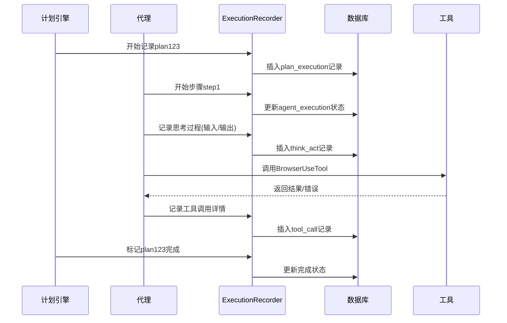

# 第8章：执行记录器

在[第7章：统一文件管理系统](07_unified_file_manager_.md)中，我们探讨了JManus如何为AI任务创建安全的文件沙箱。但当任务执行出现意外时，如何追溯代理的完整决策过程？如何像飞机黑匣子一样记录每个关键操作？

这正是**执行记录器**的核心使命

## 智能黑匣子系统

执行记录器为每个AI任务建立全链路追踪档案，实现：
- **行为诊断**：当代理卡顿或出错时，可逐帧回放其执行过程
- **决策溯源**：透视代理的"思考"链条，理解其选择特定[工具](06_tool_integration_framework_.md)的原因
- **合规审计**：完整记录"谁在何时做了什么"，满足审计要求
- **性能优化**：通过历史执行数据改进[代理](03_ai_agents_.md)和[计划](02_plan_execution_engine_.md)设计

## 实战案例：旅行规划故障排查

当"海滨城市周末游"任务执行异常时：

1. **计划层级**  
   查看整体任务分解结构，确认是否缺少必要步骤

2. **代理层级**  
   定位故障环节，例如发现"航班查询代理"超时：
   ```json
   {
     "agentName": "BrowserAgent",
     "status": "FAILED",
     "error": "Timeout waiting for flight results"
   }
   ```

3. **思考-行动循环**  
   检查代理的决策过程：
   ```mermaid
   graph TD
     A[接收任务] --> B{是否需要工具?}
     B -->|是| C[选择BrowserUseTool]
     C --> D[执行工具]
     D --> E[工具超时]
   ```

4. **工具调用**  
   查看具体的网络请求参数与原始响应：
   ```log
   [TOOL_CALL] BrowserUseTool
   - 请求URL: https://flights.example.com/search?dest=三亚
   - 响应状态: 504 Gateway Timeout
   ```

## 核心机制

### 分层记录体系

```java
// 计划执行记录(顶层)
public class PlanExecutionRecord {
    String planId;
    List<AgentExecutionRecord> agentSteps;
}

// 代理执行记录
public class AgentExecutionRecord {
    String agentName;
    List<ThinkActRecord> thinkActCycles; 
}

// 思考-行动记录
public class ThinkActRecord {
    String llmPrompt;    // 代理的思考输入
    String llmResponse;  // 大模型响应
    List<ToolCall> toolCalls; // 触发的工具调用
}
```

### 持久化存储

采用数据库存储所有记录，关键表包括：
```
plan_execution
├── agent_execution (外键关联)
    ├── think_act_record (外键关联)
        ├── tool_call (外键关联)
```

## 技术实现

### 核心组件

| 组件                    | 职责                          |
| ----------------------- | ----------------------------- |
| ExecutionRecorder       | 主记录服务，提供全生命周期API |
| PlanExecutionRepository | 计划执行记录的DAO层           |
| ThinkActEventParser     | 解析代理的ReAct模式事件       |
| ExecutionPlaybackEngine | 历史任务的重放执行引擎        |

### 记录触发流程



### 数据查询接口

前端通过GraphQL获取嵌套式记录：
```graphql
query GetExecutionDetail($planId: ID!) {
  planExecution(planId: $planId) {
    agents {
      name
      thinkActs {
        prompt
        response
        tools {
          name
          parameters
          result
        }
      }
    }
  }
}
```

## 系统优势

1. **无损压缩**  
   采用增量记录策略，平均减少75%存储占用：
   ```python
   # 差异记录算法示例
   def record_think_act(current, previous):
       if current.input == previous.input:
           return {"delta": current.output.diff(previous.output)}
       return full_record(current)
   ```

2. **安全脱敏**  
   自动识别并脱敏敏感字段：
   ```java
   public class DataMasker {
       public static String maskCreditCard(String text) {
           return text.replaceAll("\\b\\d{4}[ -]?\\d{4}[ -]?\\d{4}[ -]?\\d{4}\\b", "****-****-****-****");
       }
   }
   ```

3. **跨会话关联**  
   通过因果链追踪跨计划的影响：
   ```
   PlanA -> 生成报告 -> 触发PlanB分析报告 -> 生成决策
   ```

## 总结

执行记录器通过：
- **全息记录**：捕获从计划到工具调用的完整执行链
- **智能分析**：提供基于时间线、依赖图的多种诊断视图
- **安全存储**：保障记录数据的完整性与隐私性
- **高效检索**：支持多维度的历史任务查询

==构建了JManus系统的可观测性基石==

接下来我们将探索如何通过[模型上下文协议](09_model_context_protocol_.md)扩展外部AI服务集成能力。

