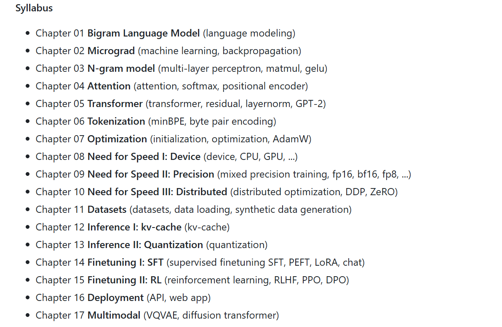
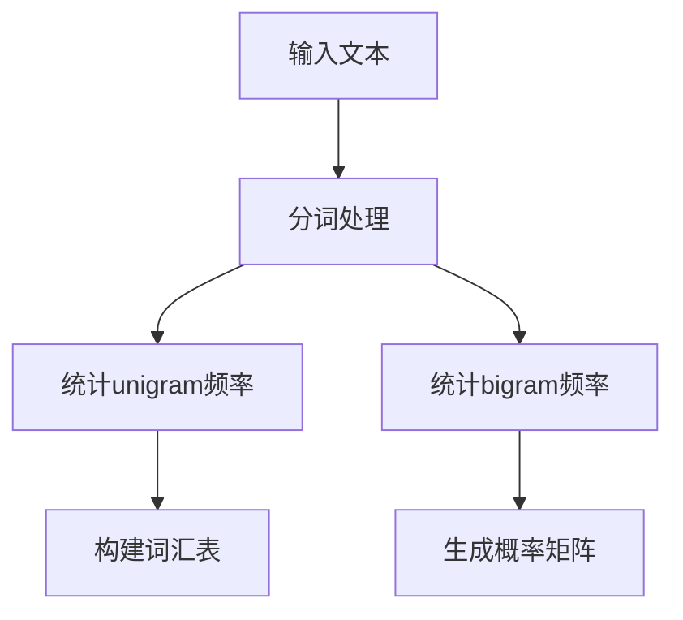

放在前面的一些碎碎碎碎念

「不管有没有人看，反正是写爽了bush」

感谢帮助写作的AI——这个系列总共的文字有二三十万，而中间产物的量级更以十倍记，没有AI的协助，不可能在如此短的时间内完成。&由衷的认为：对于热爱学习的人来说，这就是最好的时代~

( 或许一千万字到一万字 是一个必然的由多才能到少的过程，才能设计出像Bitcoin白皮书一样简练的文本，精炼的短的一句不多的代码。

语言是发散的思考，代码是简洁简练的哲学)

---
### 课程目录



#### 基础篇
1. **语言模型基础**  
   - Chapter 01: Bigram Language Model  
     *语言建模基础*

2. **机器学习核心**  
   - Chapter 02: Micrograd  
     *自动微分与反向传播实现*  
   - Chapter 03: N-gram Model  
     *多层感知机、矩阵运算、GELU激活*

3. **注意力与Transformer**  
   - Chapter 04: Attention  
     *注意力机制、Softmax、位置编码*  
   - Chapter 05: Transformer  
     *残差连接、层归一化、GPT-2架构*

#### 工程优化篇
4. **数据与分词**  
   - Chapter 06: Tokenization  
     *Byte Pair Encoding (MinBPE)*  
   - Chapter 11: Datasets  
     *数据加载与合成数据生成*

5. **训练优化**  
   - Chapter 07: Optimization  
     *参数初始化、优化器（AdamW）*  
   - Chapter 08-10: Need for Speed I-III  
     - **设备**（CPU/GPU加速）  
     - **精度**（混合精度训练：FP16/BF16/FP8）  
     - **分布式**（DDP/ZeRO）

#### 推理与部署篇
6. **高效推理**  
   - Chapter 12: KV-Cache  
     *键值缓存优化*  
   - Chapter 13: Quantization  
     *模型量化*

7. **微调技术**  
   - Chapter 14: Supervised Fine-Tuning (SFT)  
     *PEFT/LoRA/对话微调*  
   - Chapter 15: Reinforcement Learning (RLHF)  
     *PPO/DPO算法*

8. **应用扩展**  
   - Chapter 16: Deployment  
     *API/Web应用部署*  
   - Chapter 17: Multimodal  
     *多模态模型（VQVAE/Diffusion Transformer）*

---

### 思路
- **渐进式学习**：从基础语言模型（Bigram）过渡到现代Transformer架构  
- **全栈覆盖**：包含训练优化、推理加速、部署落地全流程  
- **前沿技术**：涉及混合精度、量化、RLHF等工业级实践  
- **多模态扩展**：最终延伸至视觉-语言联合建模  

# Chapter 01: Bigram Language Model  

语言建模基础

## 概要
- 语言模型的本质是「猜词游戏」
- 大语言模型(LLM)的能力跃升
- 传统统计语言模型：Bigram/N-gram
- 维度爆炸带来的稀疏性问题

---

## 一、直觉理解

### 1.1 什么是LLM？
#### 1.1.1 核心特征
- **文字接龙机器**：持续预测下一个词
- **海量数据训练**：通过阅读学习语言规律

#### 1.1.2 实例说明
> 类比《哈利·波特》中猫头鹰海德薇预测日记内容的过程。给定输入"今天，我和罗恩一起去了"，模型可能预测"魔法部"或"禁忌森林"。

#### 1.1.3 有效性原理
语言规律的可学习性：
- 统计规律性
- 上下文关联性
- 模式复用性

#### 1.1.4 LLM的突破性
三维度提升：
1. **参数量级**：神经连接复杂度指数增长
2. **涌现能力**：超线性增长临界点
3. **算力支撑**：GPU等硬件革命

### 1.2 传统语言模型：Bigram
#### 1.2.1 基本原理
- 统计连续词对频率
- 基于马尔可夫假设（仅依赖前词）

#### 1.2.2 示例分析
输入："我|爱|北京"  
预测逻辑：仅依据"北京"统计后续词频

---

## 二、数学原理

### 2.1 概率公式
$$
P(w_i|w_{i-1}) = \frac{C(w_{i-1},w_i)}{C(w_{i-1})}
$$
其中：
- $C(w_{i-1},w_i)$：词对出现次数
- $C(w_{i-1})$：前词出现次数

### 2.2 优劣分析
| 优势     | 局限性       |
| -------- | ------------ |
| 计算高效 | 上下文局限   |
| 实现简单 | 数据稀疏问题 |

### 2.3 优化方向
- **N-gram扩展**：增加上下文窗口
- **平滑技术**：如拉普拉斯平滑
  $$ P_{add1}(w_i|w_{i-1}) = \frac{C(w_{i-1},w_i)+1}{C(w_{i-1})+V} $$

---

## 三、代码实现

### 3.1 Bigram模型实现
```python
import random
from collections import defaultdict, Counter

class BigramModel:
    def __init__(self):
        self.bigram_counts = defaultdict(Counter)
        self.unigram_counts = Counter()
        self.total_bigrams = 0
        self.vocabulary = set()

    def train(self, text):
        words = text.split()
        self.vocabulary.update(words)
        for i in range(len(words)-1):
            self.unigram_counts[words[i]] += 1
            self.bigram_counts[words[i]][words[i+1]] += 1
            self.total_bigrams += 1
        if words:
            self.unigram_counts[words[-1]] += 1

    def predict_next_word(self, word):
        next_word_counts = self.bigram_counts[word]
        vocabulary_size = len(self.vocabulary)
        total_count = sum(next_word_counts.values()) + vocabulary_size
        
        probabilities = {
            w: (count+1)/total_count 
            for w, count in next_word_counts.items()
        }
        for w in self.vocabulary:
            if w not in probabilities:
                probabilities[w] = 1/total_count
                
        return probabilities

    def sample_next_word(self, word):
        probabilities = self.predict_next_word(word)
        return random.choices(
            list(probabilities.keys()),
            weights=list(probabilities.values()),
            k=1
        )[0]
```

### 3.2 训练流程


### 3.3 预测流程


