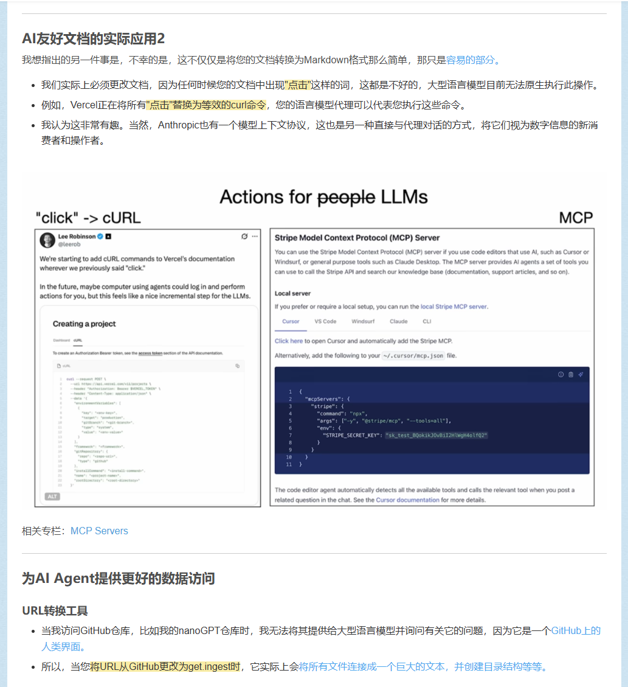

最近各个平台上都在谈ocr ,五个多月前关注的项目 突然爆火起来的说，一切还要从 这篇演讲中的一个观点说起

[[Andrej Karpathy_2] vibe coding | 大型语言模型的1960年代 | 自主性滑块](https://blog.csdn.net/2301_80171004/article/details/148978470?ops_request_misc=%257B%2522request%255Fid%2522%253A%25224c3b7c247cc32756bbb40827dc3877dd%2522%252C%2522scm%2522%253A%252220140713.130102334.pc%255Fblog.%2522%257D&request_id=4c3b7c247cc32756bbb40827dc3877dd&biz_id=0&utm_medium=distribute.pc_search_result.none-task-blog-2~blog~first_rank_ecpm_v1~rank_v31_ecpm-25-148978470-null-null.nonecase&utm_term=_2&spm=1018.2226.3001.4450)

话不多说，我们来看一下这项ai+ocr技术叭

paper：[[2510.18234\] DeepSeek-OCR: Contexts Optical Compression](https://arxiv.org/abs/2510.18234)

---

# docs：DeepSeek-OCR

DeepSeek-OCR 是一个强大的系统，用于对文档和图像执行**光学字符识别（OCR）**。

它就像一个智能助手，接收你的*图像和文本提示*（如"将文档转换为markdown"），然后深度*==分析视觉内容==*并将其与文本提示结合。最终，它利用大语言模型从文档中*生成准确且连贯的文本==输出==*，同时通过==vLLM框架==优化速度和效率。

## 可视化

## 章节

1. [VLLM推理运行器
](01_vllm_inference_runners_.md)
2. [DeepSeek-OCR 主模型（VLLM集成）
](02_deepseek_ocr_main_model__vllm_integration__.md)
3. [图像预处理单元
](03_image_preprocessing_unit_.md)
4. [视觉编码器（基于SAM和CLIP）
](04_vision_encoders__sam_based_and_clip_based__.md)
5. [视觉-语言投影器
](05_vision_language_projector_.md)
6. [生成控制（无重复Logits处理器）
](06_generation_control__no_repeat_logits_processor__.md)

---

