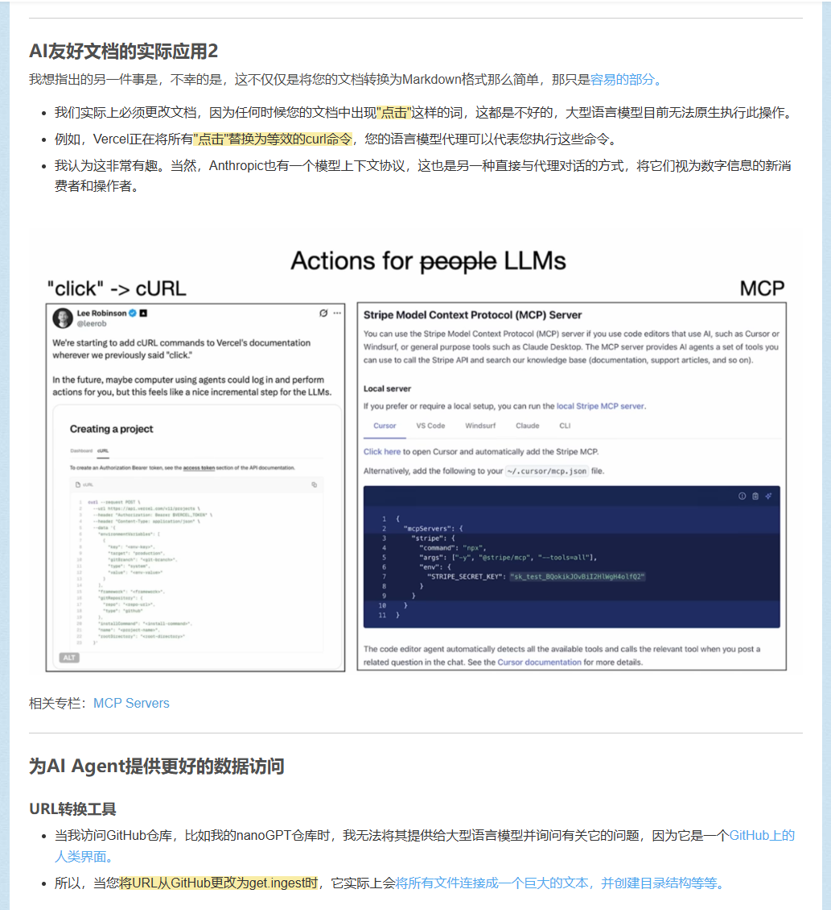

最近各个平台上都在谈ocr ,五个多月前关注的项目 突然爆火起来的说，一切还要从 这篇演讲中的一个观点说起

[[Andrej Karpathy_2] vibe coding | 大型语言模型的1960年代 | 自主性滑块](https://blog.csdn.net/2301_80171004/article/details/148978470?ops_request_misc=%257B%2522request%255Fid%2522%253A%25224c3b7c247cc32756bbb40827dc3877dd%2522%252C%2522scm%2522%253A%252220140713.130102334.pc%255Fblog.%2522%257D&request_id=4c3b7c247cc32756bbb40827dc3877dd&biz_id=0&utm_medium=distribute.pc_search_result.none-task-blog-2~blog~first_rank_ecpm_v1~rank_v31_ecpm-25-148978470-null-null.nonecase&utm_term=_2&spm=1018.2226.3001.4450)

话不多说，我们来看一下这项ai+ocr技术叭

---
