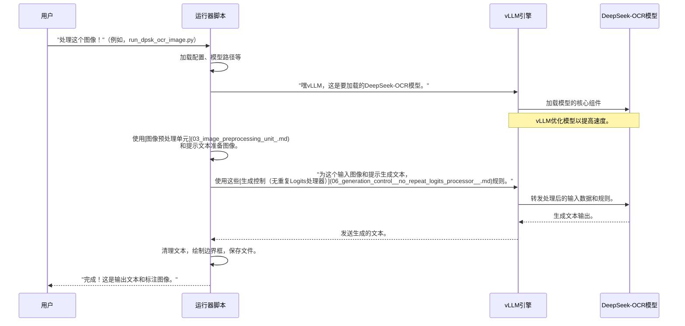

# 第1章：VLLM推理运行器

欢迎来到DeepSeek-OCR

在本章中，我们将从理解如何实际*使用*强大的DeepSeek-OCR模型开始我们的旅程。想象你有一位才华横溢的厨师（DeepSeek-OCR），他能阅读任何食谱（文档）并告诉你相关内容。但你如何告诉厨师*要阅读哪个食谱*以及*如何处理它*呢？这就是"VLLM推理运行器"的用武之地

这些运行器就像是简单的指令手册或程序，告诉DeepSeek-OCR如何处理特定任务，例如处理单个图像、整个PDF文档或同时处理多个图像。它们使用一个名为`vLLM`的特殊超快引擎，确保DeepSeek-OCR尽可能快速高效地工作。

让我们专注于一个常见任务：让DeepSeek-OCR读取并理解**单个图像**。

## 什么是推理运行器？

本质上，"推理运行器"是一个Python脚本，设计用于使用DeepSeek-OCR模型执行特定任务。可以将其视为针对特定工作的专用工具。

每个运行器脚本通常遵循以下步骤：
1.  **设置模型**：告诉`vLLM`引擎在哪里找到并加载DeepSeek-OCR模型。
2.  **准备输入**：接收你的输入（如图像）并将其准备好供模型理解。
3.  **定义规则**：设置`SamplingParams`，这些是模型生成文本输出的特殊规则（例如，输出应该有多创意或多精确，或者输出的长度限制）。
4.  **运行模型**：调用函数让DeepSeek-OCR模型处理输入并生成输出文本。
5.  **处理输出**：获取模型的原始输出并进行清理、格式化，甚至添加视觉元素（如边界框）。

### 为什么使用vLLM？

你可能会好奇为什么我们使用`vLLM`。

`vLLM`就像是大型语言模型（LLM）的涡轮增压器。它帮助DeepSeek-OCR运行得==更快==，比传统方法更==高效地处理多个请求==。对我们来说，这意味着在处理文档时能更快地获得结果。

## 使用运行器：处理单个图像

让我们逐步了解如何使用其中一个运行器（特别是`run_dpsk_ocr_image.py`）来处理单个图像。

### 步骤1：加载DeepSeek-OCR模型

首先，运行器需要告诉`vLLM`引擎关于我们的DeepSeek-OCR模型的信息。它从指定路径加载模型并进行设置。

```python
# 导入必要的工具
from vllm import AsyncLLMEngine
from vllm.engine.arg_utils import AsyncEngineArgs
from vllm.model_executor.models.registry import ModelRegistry
from deepseek_ocr import DeepseekOCRForCausalLM
from config import MODEL_PATH # 模型的位置

# 告诉vLLM如何识别和使用我们的自定义DeepSeek-OCR模型
ModelRegistry.register_model("DeepseekOCRForCausalLM", DeepseekOCRForCausalLM)

# 使用我们的模型设置vLLM引擎
engine = AsyncLLMEngine.from_engine_args(
    AsyncEngineArgs(
        model=MODEL_PATH,
        hf_overrides={"architectures": ["DeepseekOCRForCausalLM"]},
        trust_remote_code=True,
        max_model_len=8192,
    )
)
```
在这段代码中：
*   `ModelRegistry.register_model`教会`vLLM`如何识别`DeepseekOCRForCausalLM`作为它可以运行的模型。
*   `AsyncEngineArgs`定义了`vLLM`引擎的重要设置，例如模型的位置（`MODEL_PATH`）及其最大处理长度（`max_model_len`）。
*   `AsyncLLMEngine.from_engine_args`然后创建实际驱动DeepSeek-OCR任务的引擎。

### 步骤2：定义模型生成文本的方式

接下来，我们设置`SamplingParams`。这些是模型生成文本时的行为指令。

```python
from vllm import SamplingParams
from process.ngram_norepeat import NoRepeatNGramLogitsProcessor

# 防止模型重复自身的特殊规则
logits_processors = [NoRepeatNGramLogitsProcessor(ngram_size=30, window_size=90, whitelist_token_ids= {128821, 128822})]

# 定义模型应如何生成输出
sampling_params = SamplingParams(
    temperature=0.0, # 使输出非常精确，而非创意
    max_tokens=8192, # 允许长输出
    logits_processors=logits_processors, # 应用我们的无重复规则
    skip_special_tokens=False,
)
```
这里：
*   `temperature=0.0`使模型的输出非常直接和事实性，几乎像是要求它给出"确切答案"。更高的温度会使输出更具创意。
*   `max_tokens`设置模型可以生成的文本的最大长度。
*   `logits_processors`指可以修改文本生成过程的高级规则。在这里，它使用`NoRepeatNGramLogitsProcessor`防止模型陷入重复循环。可以在[生成控制（无重复Logits处理器）](06_generation_control__no_repeat_logits_processor__.md)中了解更多。

### 步骤3：准备图像和提示

在模型可以"读取"你的图像之前，图像需要转换为模型理解的格式（如数字"token"）。我们还提供一个`prompt`，这是我们向模型提出的问题。

```python
from PIL import Image
from process.image_process import DeepseekOCRProcessor
from config import INPUT_PATH, PROMPT, CROP_MODE # 图像路径和默认提示

# 从计算机加载图像
image_raw = Image.open(INPUT_PATH).convert('RGB')

# 将图像转换为模型可以处理的特殊格式（token）
image_features = DeepseekOCRProcessor().tokenize_with_images(
    images = [image_raw], # 我们正在处理一个图像列表（这里只有一个）
    bos=True, eos=True, # 添加特殊的开始/结束token
    cropping=CROP_MODE # 如何处理图像裁剪
)

# 这是我们向DeepSeek-OCR提出的问题
prompt = PROMPT # 例如："User: 描述这个文档。<image>\nAssistant:"

# 将提示和图像数据组合供模型使用
request_data = {
    "prompt": prompt,
    "multi_modal_data": {"image": image_features}
}
```
*   `Image.open(INPUT_PATH)`加载你的实际图像文件。
*   `DeepseekOCRProcessor().tokenize_with_images`是一个关键步骤！它将你的视觉图像数据转换为模型可以处理的数字"token"。这是[图像预处理单元](03_image_preprocessing_unit_.md)的一部分。
*   `prompt`是你对DeepSeek-OCR的指令或问题。`<image>`token是一个占位符，模型知道图像数据将插入此处。

### 步骤4：运行生成过程

现在，模型已设置，规则已定义，输入已准备，我们告诉`vLLM`引擎`generate`输出

```python
import asyncio
import time

async def run_inference(engine, sampling_params, request_data):
    request_id = f"my_unique_task_{int(time.time())}"
    final_output = ""

    # 要求vLLM引擎基于我们的输入生成文本
    async for request_output in engine.generate(
        request_data, sampling_params, request_id
    ):
        if request_output.outputs:
            full_text = request_output.outputs[0].text
            # 你可以打印生成的新文本部分
            # print(full_text[printed_length:], end='', flush=True)
            # printed_length = len(full_text)
            final_output = full_text # 存储完整输出

    return final_output

if __name__ == "__main__":
    # 假设'engine'和'sampling_params'已设置
    # 并且'image_features'和'prompt'已准备好用于'request_data'
    # （如步骤1-3所述）

    # 运行我们的推理任务
    result_text = asyncio.run(run_inference(engine, sampling_params, request_data))
    print("\nDeepSeek-OCR的输出：")
    print(result_text)
```
*   `engine.generate`是启动文本生成的核心函数。由于它是一个`AsyncLLMEngine`，它可以逐步生成文本，这对于长输出非常有用。
*   `request_output.outputs[0].text`包含DeepSeek-OCR生成的文本。

**示例输出**

如果你的图像是一张简单的发票，`result_text`可能如下所示：

```
发票
日期：2023-10-26
发票编号：INV-001
应付金额：$150.00
项目1：产品A - $100.00
项目2：产品B - $50.00
```
这是模型的原始输出。

### 步骤5：后处理输出

通常，模型的原始文本输出需要进一步清理或格式化。对于基于图像的任务，运行器还可以在原始图像上绘制边界框，以视觉方式突出显示检测到的元素。

```python
import os
from PIL import Image, ImageDraw, ImageOps # 用于图像操作
# 假设re_match和process_image_with_refs函数在其他地方定义
# 来自run_dpsk_ocr_image.py或工具文件。
# 同时假设'OUTPUT_PATH'在config.py中定义

if __name__ == "__main__":
    # ...（加载图像、运行推理的先前代码）...

    # 保存原始输出
    os.makedirs(OUTPUT_PATH, exist_ok=True)
    with open(f'{OUTPUT_PATH}/result_ori.mmd', 'w', encoding = 'utf-8') as afile:
        afile.write(result_text)

    # 视觉后处理示例（绘制边界框）
    image_draw = image_raw.copy() # 复制一份用于绘制
    # 在实际脚本中，'re_match'从'result_text'提取坐标
    # 并且'process_image_with_refs'绘制它们。
    # 在本教程中，我们只是想象它发生了：
    # matches_ref, matches_images, mathes_other = re_match(result_text)
    # result_image_with_boxes = process_image_with_refs(image_draw, matches_ref)
    # result_image_with_boxes.save(f'{OUTPUT_PATH}/result_with_boxes.jpg')

    print(f"结果已保存到{OUTPUT_PATH}")
```
后处理步骤可以清理格式、移除特殊token，或者如`run_dpsk_ocr_image.py`所示，直接在图像上绘制视觉提示（如边界框）以显示检测到的文本或对象的位置。

## DeepSeek-OCR运行器的工作原理

让我们简化你、运行器脚本、vLLM引擎和DeepSeek-OCR模型之间的交互。


这个图表展示了流程：你启动一个运行器，它用DeepSeek-OCR模型设置`vLLM`，准备你的输入，要求`vLLM`生成输出，然后清理并呈现结果。

## 不同任务的不同运行器

DeepSeek-OCR提供了多个运行器脚本，每个针对特定场景进行了优化：

| 运行器脚本                   | 主要用途                   | 关键差异                                     |
| :--------------------------- | :------------------------- | :------------------------------------------- |
| `run_dpsk_ocr_image.py`      | 处理**单个图像**。         | 设计用于详细输出，包括图像上的视觉边界框。   |
| `run_dpsk_ocr_eval_batch.py` | 处理**批量图像**进行评估。 | 专注于多图像的速度，输出原始文本供分析。     |
| `run_dpsk_ocr_pdf.py`        | 处理**整个PDF文档**。      | 将PDF的每一页视为图像，生成带有布局的新PDF。 |

如你所见，虽然它们共享使用`vLLM`和DeepSeek-OCR的基本步骤，但它们==针对不同类型的输入和期望输出进行了定制==。

## 结论

你刚刚学习了VLLM推理运行器——这些实用的脚本让DeepSeek-OCR行动起来

现在了解到这些脚本：

*   作为DeepSeek-OCR的指挥中心。
*   使用`vLLM`引擎进行超快速推理。
*   处理模型设置、输入准备、特定规则下的输出生成和后处理。
*   针对不同任务（如单个图像、批量或PDF）进行了专门设计。

这些运行器是我们与DeepSeek-OCR模型的第一个连接点。在下一章中，我们将深入探讨系统的核心：[DeepSeek-OCR主模型（VLLM集成）](02_deepseek_ocr_main_model__vllm_integration__.md)本身，以及`vLLM`如何与其集成以提供强大的文档理解能力。

