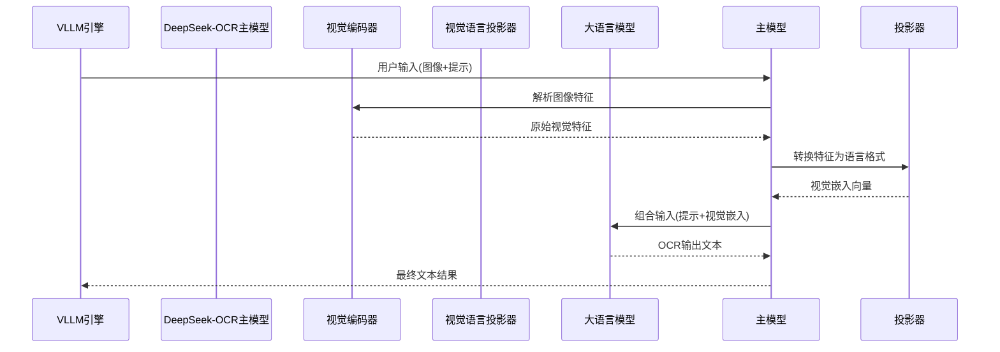

# 第2章：DeepSeek-OCR主模型（VLLM集成）

欢迎回来

在[第1章：VLLM推理运行器](01_vllm_inference_runners_.md)中，我们学习了如何使用辅助脚本和超高速的`vLLM`引擎运行DeepSeek-OCR。但`vLLM`背后运行的"DeepSeek-OCR模型"究竟是什么？它为何能如此智能地理解文档？

本章将深入探索"DeepSeek-OCR主模型"——整个系统的核心大脑。

## 核心问题：文档不仅是文本！

想象你有一张复杂发票，包含数字、日期、地址、产品列表甚至公司logo。简单文本阅读器只能识别文字，但人类还能理解*版式*、*结构*、金额位置以及各部分的视觉关联。

DeepSeek-OCR的目标是像人类一样理解文档，而非简单文本识别。为此需要核心组件能够：
1. **看见**图像（发票）
2. **理解**视觉信息（版式、方框、特定元素）
3. **结合**视觉理解与用户问题（如"总金额是多少？"）
4. **生成**连贯的文本回答

"DeepSeek-OCR主模型"就是这个核心大脑，如同乐队指挥，协调各部件协同产出有意义的输出。

## DeepSeek-OCR主模型是什么？

主模型（代码中为`DeepseekOCRForCausalLM`）是核心协调器，作为**中央管理器**处理全流程信息：
- **接收输入**：获取文本提示（如"总结此文档"）和预处理图像数据
- **调度视觉任务**：将图像数据分发给专用"视觉组件"解析不同特征
- **整合洞察**：将视觉理解转化为"大脑"可处理的语言形式
- **驱动语言模型**：结合视觉理解与文本提示，输入给大语言模型(LLM)
- **生成输出**：LLM产生最终OCR结果文本

通过与`vLLM`框架深度集成，所有复杂工作都能高效运行，优化计算资源使用。

## 主模型使用回顾（第1章内容）

回顾[第1章](01_vllm_inference_runners_.md)如何用`vLLM`设置DeepSeek-OCR模型。`DeepseekOCRForCausalLM`类是`vLLM`使用的模型核心。

首先向`vLLM`注册自定义模型：
```python
# 第1章：向vLLM注册模型
from vllm.model_executor.models.registry import ModelRegistry
from deepseek_ocr import DeepseekOCRForCausalLM  # 主模型！

# 告诉vLLM如何加载DeepseekOCRForCausalLM
ModelRegistry.register_model("DeepseekOCRForCausalLM", DeepseekOCRForCausalLM)
```

然后创建`vLLM`引擎指向模型文件：
```python
# 第1章：初始化vLLM引擎
from vllm import AsyncLLMEngine
from config import MODEL_PATH  # 模型文件路径

engine = AsyncLLMEngine.from_engine_args(
    AsyncEngineArgs(
        model=MODEL_PATH,
        hf_overrides={"architectures": ["DeepseekOCRForCausalLM"]},
        trust_remote_code=True,
        max_model_len=8192,
    )
)
```
当`engine`创建时，会加载`DeepseekOCRForCausalLM`模型。此后当请求从图像生成文本时，主模型将接管处理流程。

## 内部机制：指挥家的调度

简化展示当提交图像和提示时，主模型在`vLLM`引擎中的工作流程：

### 协调流程


### 1. 初始化组件(`__init__`)
```python
class DeepseekOCRForCausalLM(nn.Module):
    def __init__(self):
        self.sam_model = build_sam_vit_b()  # SAM视觉编码器(第4章)
        self.vision_model = build_clip_l()  # CLIP视觉编码器(第4章)
        self.projector = MlpProjector(...)  # 视觉语言投影器(第5章)
        self.language_model = init_vllm_registered_model(...)  # 大语言模型
```

### 2. 图像处理流程
```python
def _pixel_values_to_embedding(self, pixel_values):
    # SAM和CLIP编码器提取特征
    global_features_1 = self.sam_model(image_ori)
    global_features_2 = self.vision_model(image_ori, global_features_1)
    
    # 投影器转换特征
    global_features = self.projector(
        torch.cat([global_features_2[:,1:], global_features_1.flatten(2)], dim=-1)
    )
    
    # 组合全局与局部特征
    return [torch.cat([global_features, self.view_seperator], dim=0)]
```

### 3. 多模态融合
```python
def get_input_embeddings(self, input_ids, multimodal_embeddings):
    text_embeds = self.language_model.get_input_embeddings(input_ids)
    if multimodal_embeddings:
        return merge_multimodal_embeddings(
            input_ids, text_embeds, multimodal_embeddings, self.image_token_id
        )
    return text_embeds
```

### 4. 最终生成
```python
def forward(self, input_ids, inputs_embeds=None, **kwargs):
    if not inputs_embeds:
        vision_embeds = self.get_multimodal_embeddings(**kwargs)
        inputs_embeds = self.get_input_embeddings(input_ids, vision_embeds)
    
    return self.language_model(
        input_ids=None, inputs_embeds=inputs_embeds, **kwargs
    )
```

### 5. 权重加载
```python
def load_weights(self, weights):
    processed = []
    for name, tensor in weights:
        new_name = name.replace('model.','') if 'vision' in name else 'language.'+name
        processed.append((new_name, tensor))
    return AutoWeightsLoader(self).load_weights(processed)
```

## 本章总结

`DeepseekOCRForCausalLM`主模型作为系统核心：
- 协调文本指令与图像数据处理
- 通过专用视觉编码器解析图像
- 将视觉特征转换为语言模型可理解的形式
- 驱动大语言模型生成最终OCR输出

下一章将聚焦图像处理的第一步：[图像预处理单元](03_image_preprocessing_unit_.md)，了解原始图像如何转换为适合视觉编码器处理的格式。

