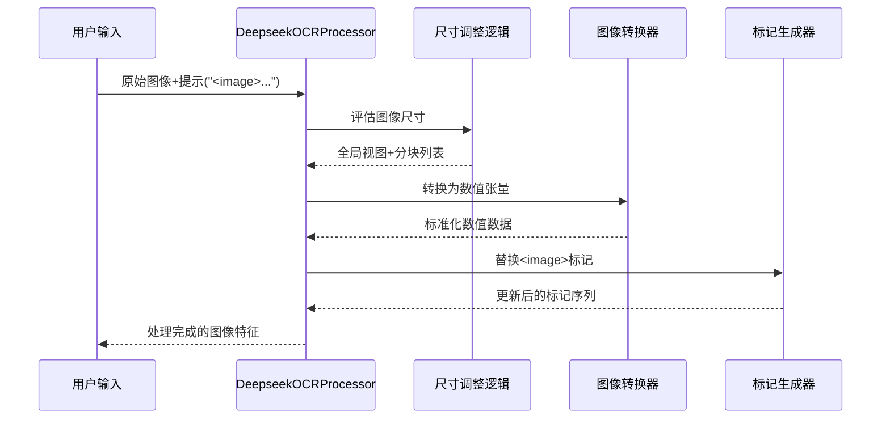

# 第3章：图像预处理单元

欢迎回来

在[第2章：DeepSeek-OCR主模型（VLLM集成）](02_deepseek_ocr_main_model__vllm_integration__.md)中，我们探索了DeepSeek-OCR的"大脑"——`DeepseekOCRForCausalLM`模型如何==协调不同组件来理解文档==。

但在"大脑"施展魔力之前，有个关键的第一步：==原始图像预处理==。就像厨师烹饪前需要洗净、切配食材一样，**图像预处理单元**正是为DeepSeek-OCR准备"视觉食材"的工序。

## 核心问题：原始图像杂乱无章

假设向DeepSeek-OCR输入文档图像，可能是：
- 200x300像素的小票图片
- 5000x7000像素的工程图纸扫描件
- 倾斜拍摄的照片
- 大型PDF中的某一页

这些图像尺寸各异。如果直接输入原始图像，模型将不堪重负！它需要==统一、干净且尺寸适当的输入==才能发挥最佳性能。

**图像预处理单元**的职责就是将任意原始图像转换为标准化、易处理的格式，供模型的"眼睛"（[基于SAM和CLIP的视觉编码器](04_vision_encoders__sam_based_and_clip_based__.md)）分析。

## 图像预处理单元的功能

主要由`DeepseekOCRProcessor`类实现的预处理单元，如同专业后厨团队，执行以下关键步骤：

1. **尺寸调整与填充**：确保所有图像（或其局部）转为统一尺寸。过小图像添加空白边距，过大图像则缩放。
2. **动态裁剪（分块处理）**：对超大图像，简单缩放会丢失细节。该单元智能地将大图切割为重叠的"图块"，让模型既能把握整体布局又能聚焦细节。
3. **数值转换**：将像素信息转换为模型可处理的张量格式，并进行归一化处理以提升模型学习效率。
4. **元数据生成**：记录图像处理过程的关键信息（如分块数量、原始位置），帮助模型理解空间上下文。
5. **占位符替换**：将文本提示中的特殊标记`<image>`替换为代表图像部分的唯一标记序列，指导语言模型整合视觉信息。

## 使用图像预处理单元：`DeepseekOCRProcessor`

在[第1章：VLLM推理运行器](01_vllm_inference_runners_.md)中曾简要接触过`DeepseekOCRProcessor`，它是准备图像的核心工具。

回顾`run_dpsk_ocr_image.py`中的代码片段：
```python
# 第1章：准备图像和提示
from process.image_process import DeepseekOCRProcessor

# 加载原始图像
image_raw = Image.open(INPUT_PATH).convert('RGB')

# 将图像转换为模型专用格式（标记化）
image_features = DeepseekOCRProcessor().tokenize_with_images(
    images = [image_raw],  # 支持批量处理（本例单张）
    bos=True, eos=True,    # 添加起止标记
    cropping=CROP_MODE     # 是否启用分块
)
```

关键方法`tokenize_with_images()`接收原始图像和裁剪设置，返回包含以下内容的`image_features`：
- **`input_ids`**：文本提示的数值表示，其中`<image>`被替换为视觉标记序列
- **`pixel_values`**：调整后的全局视图数值数据
- **`images_crop`**：分块图像的数值数据（如有）
- **`images_spatial_crop`**：记录分块行列数的元数据

## 内部机制：预处理工作流

### 处理流程图示


### 核心代码（`process/image_process.py`）

#### 1. 处理器初始化
```python
class DeepseekOCRProcessor(ProcessorMixin):
    def __init__(self):
        self.image_size = IMAGE_SIZE  # 分块尺寸(如640)
        self.base_size = BASE_SIZE    # 全局视图尺寸(如1024)
        self.image_transform = ImageTransform()  # 数值转换器
        self.tokenizer = LlamaTokenizerFast()    # 文本标记器
        self.image_token_id = self.tokenizer.vocab["<image>"]  # 视觉标记ID
```

#### 2. 核心标记化方法
```python
def tokenize_with_images(self, images, cropping=True):
    # 分割提示文本
    text_splits = PROMPT.split("<image>")  # 如["", "总结该文档..."]

    for text_sep, image in zip(text_splits, images):
        # 动态分块决策
        if cropping and needs_cropping(image):
            tiles, crop_ratio = dynamic_preprocess(image)  # 智能分块
        
        # 生成全局视图
        global_view = pad_to_size(image, self.base_size)
        
        # 分块处理
        if crop_ratio > 1:
            processed_tiles = [self.image_transform(tile) for tile in tiles]
        
        # 计算视觉标记数量
        num_base_tokens = calculate_tokens(self.base_size)
        token_seq = [self.image_token_id] * num_base_tokens
        if crop_ratio > 1:
            num_tile_tokens = calculate_tokens(self.image_size)
            token_seq += [self.image_token_id] * num_tile_tokens * total_tiles
        
        # 组合最终输出
        return {
            "input_ids": torch.cat([text_tokens, token_seq]),
            "pixel_values": global_view_tensor,
            "images_crop": stacked_tiles if tiles else zero_tensor,
            "images_spatial_crop": crop_ratio_tensor
        }
```

## 总结

**图像预处理单元**作为DeepSeek-OCR的初始处理阶段：
- 将异构原始图像转换为标准化数值格式
- 通过动态分块平衡全局视野与局部细节
- 将视觉信息无缝嵌入文本提示流
- 为后续视觉特征提取奠定基础

接下来我们将探索模型的"眼睛"——[基于SAM和CLIP的视觉编码器](04_vision_encoders__sam_based_and_clip_based__.md)，了解它们如何从预处理后的图像中提取有意义的视觉特征。

