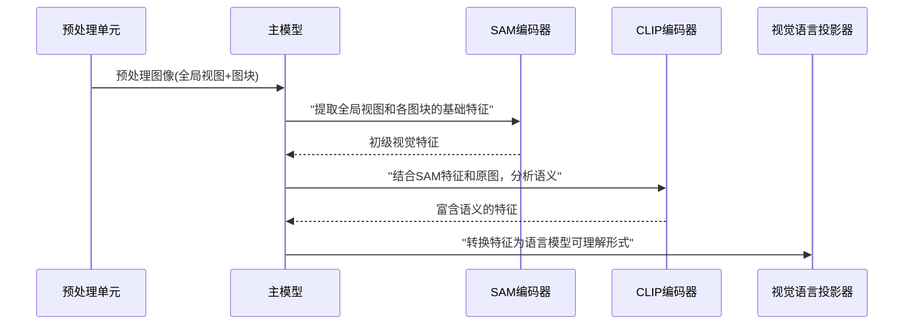

# 第4章：视觉编码器（基于SAM与CLIP）

欢迎回来

在[第3章：图像预处理单元](03_image_preprocessing_unit_.md)中，我们了解了DeepSeek-OCR如何精心准备原始图像，将其调整为==统一尺寸甚至切割为更小的"图块"==。这确保了模型获得易于处理的输入数据。

现在，假设模型已接收到这些完美预处理的图像块。接下来会发生什么？它需要真正"看见"并"理解"图像内容！就像人眼扫描页面、大脑处理信息一样，DeepSeek-OCR使用称为**视觉编码器**的专用组件作为其"眼睛"。

## 核心问题：图像不仅是像素

当您查看文档时，看到的不仅是彩色点阵（像素），而是立即识别出文字、图像、线条、表格及其关联关系。原始像素图像只是数据，模型需要从中==提取有意义的*特征*==才能加以利用。

类比说明：
- **原始图像**：复杂机器的照片
- **视觉编码器**：专业技师查看照片后告诉您："这是齿轮，那是杠杆，这部分连接那部分"，将视觉场景分解为可理解的组件

DeepSeek-OCR使用**两种视觉编码器**协同工作：
1. 擅长识别物体*是什么*及其边界的编码器
2. 精于理解物体*上下文*和意义的编码器

二者共同==将原始像素数据转换为丰富的数值"特征向量"==——这是模型其他部分能理解的语言

## 视觉编码器：模型的"眼睛"

视觉编码器是专门设计用于从图像中提取高级视觉信息的神经网络

它们不仅能判断"这个像素是红色"，更能识别"这组像素构成字母'A'"或"这个区域看起来像表格"。

DeepSeek-OCR采用两种强大的视觉编码器协同工作：

### 1. SAM基础编码器（初级特征提取）
- **功能**：基于**分割任意模型**(SAM)构建，擅长识别图像中任意对象或区域。在DeepSeek-OCR中作为视觉理解的第一层，特别适合提取基础视觉特征和识别通用形状
- **类比**：查看工程图纸时，SAM编码器快速勾勒所有独立形状（圆形、方形、线条），暂不关心具体含义，提供结构概览

### 2. CLIP基础编码器（上下文理解）
- **功能**：处理SAM编码器提供的初级特征，可能同时接收文档全局视图。基于**对比语言-图像预训练**(CLIP)，擅长理解图像与文本关系，生成富含语义信息的特征
- **类比**：SAM勾勒形状后，CLIP编码器进一步分析"这个方形像房间，圆形可能是灯具，这些线条暗示墙体"，为形状赋予上下文和意义

## 视觉编码器的工作流程

[DeepSeek-OCR主模型](02_deepseek_ocr_main_model__vllm_integration__.md)（`DeepseekOCRForCausalLM`）如同指挥家，调度这两个专用"眼睛"：

### 视觉处理流程


### 代码实现（`deepseek_ocr.py`）

#### 1. 编码器初始化
```python
class DeepseekOCRForCausalLM(nn.Module):
    def __init__(self):
        # SAM编码器：基于ViT架构的特殊配置
        self.sam_model = build_sam_vit_b()  
        
        # CLIP编码器：面向CLIP特征提取的ViT架构
        self.vision_model = build_clip_l()
```

#### 2. 双编码器协同处理
```python
def _pixel_values_to_embedding(self, pixel_values, images_crop):
    # 处理全局视图
    global_sam = self.sam_model(pixel_values)  # SAM提取基础特征
    global_clip = self.vision_model(pixel_values, global_sam)  # CLIP结合原图与SAM特征
    
    # 合并特征
    global_features = torch.cat([
        global_clip[:, 1:], 
        global_sam.flatten(2).permute(0,2,1)
    ], dim=-1)
    
    # 处理图块（如有）
    if images_crop:
        local_sam = self.sam_model(images_crop)
        local_clip = self.vision_model(images_crop, local_sam)
        # ...类似合并逻辑...
    
    return combined_features
```

## 输出特征的意义

编码器输出的高维张量（大型数值数组）中，每个数值代表视觉信息的特定方面。例如某些数值表示水平线存在，其他表示特定纹理或物体语义。这些特征向量信息密度极高，完整封装了模型"理解"图像所需的全部信息。

## 总结

DeepSeek-OCR通过**SAM基础编码器**和**CLIP基础编码器**这对专用"眼睛"理解视觉世界：
- SAM编码器提取结构特征
- CLIP编码器提供深层语义理解
- 二者协同将像素转换为强大的数值表示

接下来我们将探索这些==视觉特征如何转换为模型"大脑"（大语言模型）真正理解的语言形式==，敬请期待[视觉语言投影器](05_vision_language_projector_.md)

