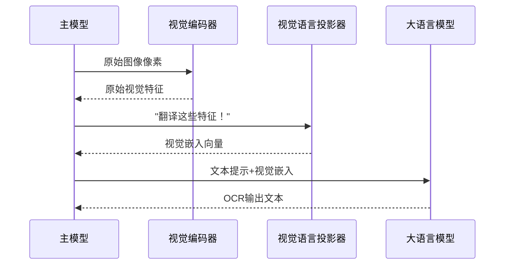

# 第5章：视觉语言投影器

欢迎回来

在[第4章：视觉编码器（基于SAM与CLIP）](04_vision_encoders__sam_based_and_clip_based__.md)中，我们了解了DeepSeek-OCR如何通过专用"眼睛"——SAM与CLIP视觉编码器从图像中提取丰富的数值特征。这些特征如同对文档内容的详细描述，但仍处于"视觉语言"（复杂的数值阵列）层面。

> 现在假设有位精通图像内容的专家，但他只说法语；另有一位精通文档分析的专家，却只懂英语。如何让二者协作？

这正是**==视觉语言投影器==**解决的问题

它作为关键**翻译桥梁**，将视觉编码器的纯视觉特征转换为大语言模型（LLM）能无缝理解的格式。

## 核心问题：两种语言体系

图像世界与文本世界使用不同的"语言"：
- **视觉编码器**：输出代表视觉模式、形状和上下文信息的高维向量（"视觉语言"）
- **大语言模型(LLM)**：处理词语和句子对应的数值"嵌入向量"（"语言空间"）

若直接将原始视觉特征输入LLM，就像让只懂英语的人理解法语独白——完全无法沟通

> LLM需要视觉信息以其熟悉的"语言"呈现。

## 视觉语言投影器：通用翻译器

**视觉语言投影器**是专为这种转换设计的神经网络组件，其核心功能包括：
1. 接收视觉编码器输出的图像内容数值表示（"视觉语言"）
2. 处理并转换这些视觉特征
3. 输出LLM可理解的兼容嵌入格式（称为"视觉嵌入"）

### 工作流程代码示例
```python
# 摘自deepseek_ocr.py（简化版_pixel_values_to_embedding方法）
global_raw_features = torch.cat((global_features_2[:,1:], global_features_1.flatten(2)), dim=-1)
global_features_translated = self.projector(global_raw_features)  # 投影器转换全局特征

if images_crop_exists:
    local_raw_features = torch.cat((local_features_2[:,1:], local_features_1.flatten(2)), dim=-1)
    local_features_translated = self.projector(local_raw_features)  # 投影器转换局部特征
```

## 内部机制：翻译如何实现

### 数据流转图示


### 核心代码解析（`deepencoder/build_linear.py`）

#### 1. 投影器初始化
```python
class MlpProjector(nn.Module):
    def __init__(self, cfg):
        if cfg.projector_type == "linear":  # DeepSeek-OCR采用线性投影
            self.layers = nn.Linear(cfg.input_dim, cfg.n_embed)  # 2048维输入→n_embed维输出
```

#### 2. 特征转换过程
```python
def forward(self, x):
    return self.layers(x)  # 通过线性层实现视觉→语言空间的映射
```

(py接口__魅力时刻)

## 总结

视觉语言投影器在DeepSeek-OCR中扮演着关键角色：
- 将[视觉编码器](04_vision_encoders__sam_based_and_clip_based__.md)==提取的视觉特征转换为LLM兼容格式==
- 通过线性变换实现视觉空间到语言空间的==映射==
- 为后续[生成控制](06_generation_control__no_repeat_logits_processor__.md)提供语义完整的输入

至此图像信息已完成从像素到语义的完整转换，接下来将进入文本生成的关键阶段。

