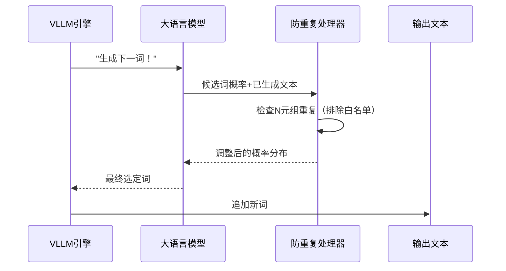

# 第6章：生成控制（防重复逻辑处理器）

欢迎回来

在[第5章：视觉语言投影器](05_vision_language_projector__.md)中，我们见证了DeepSeek-OCR如何将视觉信息完美转换为大语言模型(LLM)可理解的格式。

现在LLM已准备好基于视觉与文本的融合输入生成内容。

但假设我们的LLM开始输出时，陷入"文档显示...文档显示...文档显示..."的循环重复。这种重复显然毫无助益！

这正是**生成控制（防重复逻辑处理器）**的用武之地！它如同一位专业编辑，确保模型输出具备==多样性、连贯性且避免循环重复==。

## 核心问题：重复输出

大语言模型虽然强大，但在文本生成过程中可能陷入词语或短语的重复循环。这是因为模型总是预测*最可能*的下一个词。当某些短语在训练数据中出现频繁，或上下文存在歧义时，模型可能持续选择导致重复序列的词语。

对需要精确描述文档的DeepSeek-OCR而言，重复会引发三大问题：
- **质量低下**：生成文本不自然且难以阅读
- **令牌浪费**：重复内容占用最大输出长度限制（如第1章的`max_tokens=8192`），挤占关键信息空间
- **效用降低**：重复的摘要毫无价值

## 防重复处理器：模型的编辑官

`NoRepeatNGramLogitsProcessor`是专为解决此问题设计的组件，其工作原理如下：

1. **语言模型预测**：计算数千个候选词的概率（称为"逻辑值/logits"）
2. **防重复处理器介入**：检查*已生成文本*
3. **识别N元组模式**：检测最近的词语序列（如"文档显示"是3元组）
4. **标记重复**：若预测词将补全已出现的N元组，则标记该词
5. **降低概率**：将被标记词的选中概率降至极低
6. **引导多样性**：推动模型选择更富变化的词语

## 使用方法：配置`SamplingParams`

在第1章的`run_dpsk_ocr_image.py`中已见过该处理器的配置示例：

```python
from process.ngram_norepeat import NoRepeatNGramLogitsProcessor

logits_processors = [NoRepeatNGramLogitsProcessor(
    ngram_size=30,         # 检测30词序列的重复
    window_size=90,        # 仅检查最近90个令牌
    whitelist_token_ids={128821, 128822}  # 允许<table>标签重复
)]

sampling_params = SamplingParams(
    temperature=0.0,
    max_tokens=8192,
    logits_processors=logits_processors  # 应用防重复规则
)
```

### 关键参数
- **`ngram_size`**：定义检测的词语序列长度。较大值允许短短语重复但阻止长句重复
- **`window_size`**：限定历史文本检查范围（如90个令牌内）
- **`whitelist_token_ids`**：豁免特定令牌（如表格标签`<td>`）的重复限制

## 内部机制：编辑官的魔法

### 工作流程图示


### 核心代码（`process/ngram_norepeat.py`）

#### 1. 初始化配置
```python
class NoRepeatNGramLogitsProcessor:
    def __init__(self, ngram_size, window_size=100, whitelist_token_ids=None):
        self.ngram_size = ngram_size      # 检测的词语序列长度
        self.window_size = window_size    # 历史文本检查范围
        self.whitelist_token_ids = whitelist_token_ids or set()  # 豁免令牌
```

#### 2. 概率调整逻辑
```python
def __call__(self, input_ids, scores):
    if len(input_ids) < self.ngram_size: 
        return scores  # 文本过短时不处理

    current_prefix = tuple(input_ids[-(self.ngram_size-1):])  # 当前词语前缀
    banned_tokens = set()

    # 在历史文本中搜索重复模式
    for i in range(max(0,len(input_ids)-self.window_size), len(input_ids)-self.ngram_size+1):
        if tuple(input_ids[i:i+self.ngram_size-1]) == current_prefix:
            banned_tokens.add(input_ids[i+self.ngram_size-1])  # 记录需禁止词

    # 应用白名单并调整概率
    for token in banned_tokens - self.whitelist_token_ids:
        scores[token] = -float("inf")  # 禁止词概率归零

    return scores
```

## 总结

**防重复逻辑处理器**通过以下机制提升生成质量：
- ==动态检测并禁止重复的N元组==
- 通过窗口限制实现局部防重复
- 智能豁免结构化标签的重复限制
- 通过概率调整而非硬性规则保持灵活性

至此我们完成了DeepSeek-OCR核心组件的探索之旅，从图像预处理到受控文本生成的完整流程已清晰呈现~

END *★,°*:.☆(￣▽￣)/.°★* 。

