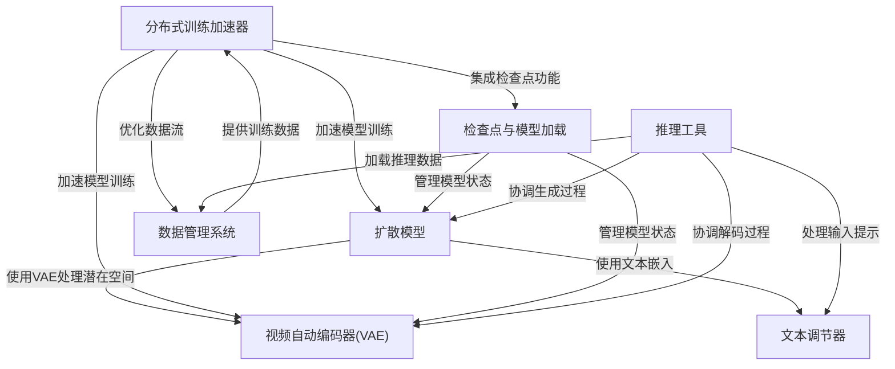
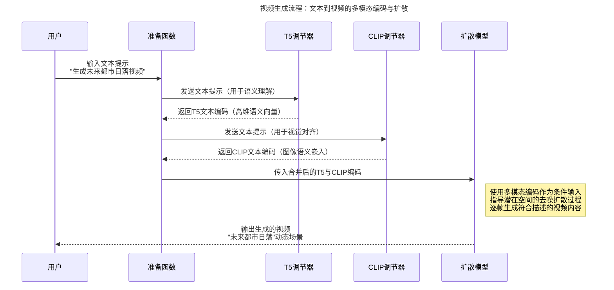

链接：[Open-Sora Gallery](https://hpcaitech.github.io/Open-Sora/)


Sora（OpenAI，虽然我更愿意称其为“ClosedAI”...）

# docs：Open-Sora

Open-Sora是一个开源项目，==通过*文本描述*或*参考图像*生成高质量视频==。


它采用先进的扩散模型(`Diffusion Model`)，在文本调节器(`Text Conditioners`)的引导下，结合视频自动编码器(`VAE`)实现高效数据处理，将噪声转化为连贯的视频序列

为支持大规模运算，项目利用分布式训练加速器(Distributed Training Booster)和数据管理系统(`Data Management System`)确保模型训练与视频生成效率，并通过检查点与模型加载(Checkpoint & Model Loading)及推理工具(Inference Utilities)管理全生命周期流程。

## 可视化



## 章节

1. [文本调节器](01_text_conditioners_.md)
2. [扩散模型](02_diffusion_model_.md)
3. [视频自动编码器(VAE)](03_video_autoencoder__vae__.md)
4. [数据管理系统](04_data_management_system_.md)
5. [推理工具](05_inference_utilities_.md)
6. [检查点与模型加载](06_checkpoint___model_loading_.md)
7. [分布式训练加速器](07_distributed_training_booster_.md)

----

# README

我们设计并实现了Open-Sora项目，致力于高效生成高质量视频。我们希望将模型、工具和所有细节向所有人开放。通过开源理念，Open-Sora不仅实现了先进视频生成技术的普及，还提供了一个简化视频生成复杂性的用户友好平台。我们的目标是推动内容创作领域的创新、创造力和包容性发展。

## 📰 最新动态
[2025.03.12] 🔥 发布Open-Sora 2.0（110亿参数）。🎬 该模型在📐VBench和📊人类偏好评估中达到与110亿参数的HunyuanVideo及300亿参数Step-Video相当的性能。🛠️ 完全开源：仅需20万美元即可训练的完整检查点和训练代码。
[2025.02.20] 🔥 发布Open-Sora 1.3（10亿参数）。升级的VAE和Transformer架构使生成视频质量显著提升🚀。[检查点][报告]
[2024.12.23] 视频生成模型开发成本降低50%！现提供H200 GPU券的开源解决方案。[博客][代码]
[2024.06.17] 发布Open-Sora 1.2，包含3D-VAE、修正流和评分条件机制，视频质量大幅提升。[检查点][报告][论文]
[2024.04.25] 🤗 在Hugging Face Spaces上线Open-Sora的Gradio演示。
[2024.04.25] 发布Open-Sora 1.1，支持2~15秒、144p至720p、任意宽高比的文生图/文生视频/图生视频/视频编辑/无限时长生成，并发布完整视频处理流程。[检查点][报告]
[2024.03.18] 发布完全开源的视频生成项目Open-Sora 1.0，支持视频数据预处理、加速训练、推理等全流程，仅需3天训练即可生成2秒512x512视频。[检查点][博客][报告]
[2024.03.04] Open-Sora实现训练成本降低46%。[博客]

📍 由于项目持续开发，我们为不同版本保留独立分支。最新版本为main，历史版本包括：v1.0、v1.1、v1.2、v1.3。

## 🔆 技术报告
- [Open-Sora 2.0技术报告]
- [逐步指导训练或微调自定义模型]
- [视频自动编码器的训练与评估指南]
- [高压缩视频自动编码器]

历史版本报告（建议查看对应分支）：
- Open-Sora 1.3：移位窗口注意力、统一时空VAE等
- Open-Sora 1.2技术报告：修正流、3D-VAE、评分条件、评估等
- Open-Sora 1.1：多分辨率/时长/宽高比、图像视频条件控制/编辑、数据预处理等
- Open-Sora 1.0：架构设计、字幕生成等

## 🚀 快速开始
### 安装指南
```bash
# 创建并激活虚拟环境（以conda为例）
conda create -n opensora python=3.10
conda activate opensora

# 克隆仓库
git clone https://github.com/hpcaitech/Open-Sora
cd Open-Sora

# 确保torch>=2.4.0
pip install -v .  # 开发模式使用`pip install -v -e .`
pip install xformers==0.0.27.post2 --index-url https://download.pytorch.org/whl/cu121  # 根据CUDA版本安装xformers
pip install flash-attn --no-build-isolation
```

可选安装Flash Attention 3以获得更快速度：
```bash
git clone https://github.com/Dao-AILab/flash-attention # 4f0640d5
cd flash-attention/hopper
python setup.py install
```

### 模型下载
我们的110亿参数模型支持256px和768px分辨率，统一支持文生视频和图生视频

从Huggingface下载：
```bash
pip install "huggingface_hub[cli]"
huggingface-cli download hpcai-tech/Open-Sora-v2 --local-dir ./ckpts
```

从ModelScope下载：
```bash
pip install modelscope
modelscope download hpcai-tech/Open-Sora-v2 --local_dir ./ckpts
```

### 文生视频生成
虽然模型针对图生视频优化，但仍支持文生视频。通过结合flux文生图模型，我们构建了文→图→视频流程（256x256分辨率）：
```bash
# 单提示词生成
torchrun --nproc_per_node 1 --standalone scripts/diffusion/inference.py configs/diffusion/inference/t2i2v_256px.py --save-dir samples --prompt "下雨的海面"

# 内存优化版
torchrun --nproc_per_node 1 --standalone scripts/diffusion/inference.py configs/diffusion/inference/t2i2v_256px.py --save-dir samples --prompt "下雨的海面" --offload True

# CSV批量生成
torchrun --nproc_per_node 1 --standalone scripts/diffusion/inference.py configs/diffusion/inference/t2i2v_256px.py --save-dir samples --dataset.data-path assets/texts/example.csv
```

768x768分辨率：
```bash
# 单GPU
torchrun --nproc_per_node 1 --standalone scripts/diffusion/inference.py configs/diffusion/inference/t2i2v_768px.py --save-dir samples --prompt "下雨的海面"

# 多GPU（使用colossalai序列并行）
torchrun --nproc_per_node 8 --standalone scripts/diffusion/inference.py configs/diffusion/inference/t2i2v_768px.py --save-dir samples --prompt "下雨的海面"
```

可通过`--aspect_ratio`调整宽高比（支持16:9/9:16/1:1/2.39:1），`--num_frames`调整时长（需为4k+1且≤129帧）。

直接文生视频模式：
```bash
# 256px单GPU
torchrun --nproc_per_node 1 --standalone scripts/diffusion/inference.py configs/diffusion/inference/256px.py --prompt "下雨的海面"
# 768px多GPU
torchrun --nproc_per_node 8 --standalone scripts/diffusion/inference.py configs/diffusion/inference/768px.py --prompt "下雨的海面"
```

### 图生视频生成
给定提示词和参考图生成视频：
```bash
# 256px
torchrun --nproc_per_node 1 --standalone scripts/diffusion/inference.py configs/diffusion/inference/256px.py --cond_type i2v_head --prompt "一只圆滚滚的猪在农场的泥塘里打滚..." --ref assets/texts/i2v.png

# CSV批量处理
torchrun --nproc_per_node 1 --standalone scripts/diffusion/inference.py configs/diffusion/inference/256px.py --cond_type i2v_head --dataset.data-path assets/texts/i2v.csv

# 768px多GPU
torchrun --nproc_per_node 8 --standalone scripts/diffusion/inference.py configs/diffusion/inference/768px.py --cond_type i2v_head --dataset.data-path assets/texts/i2v.csv
```

## 🛠️ 高级功能
### 运动评分
训练时我们将运动评分注入文本提示。推理时可指定运动强度（默认为4）：
```bash
torchrun --nproc_per_node 1 --standalone scripts/diffusion/inference.py configs/diffusion/inference/t2i2v_256px.py --save-dir samples --prompt "下雨的海面" --motion-score 4
```

我们还提供动态评分器（需设置OpenAI API密钥）：
```bash
torchrun --nproc_per_node 1 --standalone scripts/diffusion/inference.py configs/diffusion/inference/t2i2v_256px.py --save-dir samples --prompt "下雨的海面" --motion-score dynamic
```

### 提示词优化
利用ChatGPT优化提示词（需API密钥）：
```bash
export OPENAI_API_KEY=sk-xxxx
torchrun --nproc_per_node 1 --standalone scripts/diffusion/inference.py configs/diffusion/inference/t2i2v_256px.py --save-dir samples --prompt "下雨的海面" --refine-prompt True
```

### 结果复现
通过设定随机种子确保可复现性：
```bash
torchrun --nproc_per_node 1 --standalone scripts/diffusion/inference.py configs/diffusion/inference/t2i2v_256px.py --save-dir samples --prompt "下雨的海面" --sampling_option.seed 42 --seed 42
```
使用`--num-sample k`为每个提示生成k个样本。

## ⚡ 计算效率
在H100/H800 GPU上的文生视频效率测试（50步生成）：

| 分辨率  | 1GPU耗时/显存 | 2GPU耗时/显存 | 4GPU耗时/显存 | 8GPU耗时/显存 |
| ------- | ------------- | ------------- | ------------- | ------------- |
| 256x256 | 60s/52.5GB    | 40s/44.3GB    | 34s/44.3GB    | -             |
| 768x768 | 1656s/60.3GB  | 863s/48.3GB   | 466s/44.3GB   | 276s/44.3GB   |

## 📊 性能评估
在VBench上，Open-Sora 2.0与OpenAI Sora的差距从4.52%缩小至0.69%（相比1.2版本）。

人类偏好评估显示我们的模型与110亿参数HunyuanVideo和300亿参数Step-Video表现相当。

凭借强劲性能，Open-Sora 2.0具有极高性价比。

## 🙏 致谢
- ColossalAI：强大的大模型并行加速系统
- DiT：基于Transformer的可扩展扩散模型
- OpenDiT：我们从中采用了有价值的训练加速策略
- PixArt：开源的DiT文生图模型
- Flux：强大的文生图模型
- Latte：高效视频DiT训练的尝试
- StabilityAI VAE：强大的图像VAE模型
- CLIP：卓越的图文嵌入模型

----


# 第1章：文本调节器

欢迎来到Open-Sora

想象你有一个绝妙的视频创意，比如"日出时分无人机拍摄的雾霭笼罩山间湖泊的宁静画面"。如何让计算机理解这个创意并将其转化为真实视频？

与人类不同，计算机本质上并不理解词语、句子或艺术概念。它们==只懂数字==。因此，最大挑战在于`将人类可读的文本  翻译成  视频生成"大脑"能理解的语言`

这正是**文本调节器**的用武之地

它们如同终极翻译官，负责将详细文本描述（称为"提示词"）转换为视频生成模型能理解的数字编码（即"嵌入向量"）。没有这些翻译官，提示词对模型来说只是乱码

## 文本调节器的作用

文本调节器主要执行两个核心功能：

1. **==理解文本==**：解析提示词，捕捉关键词、词语关系和整体情感风格
2. **==生成数字编码==**：基于理解创建数字序列，每组数字代表文本的不同方面（如场景对象、动作或整体氛围）

Open-Sora主要使用两种强大的文本调节器：==**T5**和**CLIP**==，它们协同工作以全面理解提示词：

| 调节器   | 主要功能               | 类比角色     |
| -------- | ---------------------- | ------------ |
| **T5**   | 捕捉细节含义和语法结构 | "故事讲述者" |
| **CLIP** | 把握整体风格和视觉概念 | "艺术评论家" |

这些大型语言模型通过海量文本和图像数据训练，能理解人类语言的微妙之处及其与视觉概念的关联。

## Open-Sora的工作流程

以"日出时分无人机拍摄的雾霭笼罩山间湖泊的宁静画面"为例：

1. `prepare`函数作为管理器接收文本提示
2. 文本同时发送给T5和CLIP调节器
3. T5返回描述`细节的数字编码`，CLIP返回`风格特征编码`
4. 合并后的编码传递给[扩散模型](02_diffusion_model_.md)
5. 扩散模型根据这些"剧本"和"情绪板"生成视频

### 代码

`HFEmbedder`类封装了Hugging Face的预训练文本模型：

```python
class HFEmbedder(nn.Module):
    def __init__(self, from_pretrained: str, max_length: int, shardformer: bool = False, **hf_kwargs):
        super().__init__()
        self.is_clip = "openai" in from_pretrained  # 判断是否为CLIP模型
        self.max_length = max_length
        
        # 加载对应的tokenizer和模型
        if self.is_clip:
            self.tokenizer = CLIPTokenizer.from_pretrained(from_pretrained, max_length=max_length)
            self.hf_module = CLIPTextModel.from_pretrained(from_pretrained, **hf_kwargs)
        else:  # T5模型
            self.tokenizer = T5Tokenizer.from_pretrained(from_pretrained, max_length=max_length, legacy=True)
            self.hf_module = T5EncoderModel.from_pretrained(from_pretrained, **hf_kwargs)
        
        self.hf_module = self.hf_module.eval().requires_grad_(False)

    def forward(self, text: list[str], added_tokens: int = 0, seq_align: int = 1) -> Tensor:
        # 将文本转换为数字嵌入
        batch_encoding = self.tokenizer(
            text,
            truncation=True,
            max_length=self.max_length,
            padding="max_length",
            return_tensors="pt",
        )
        outputs = self.hf_module(input_ids=batch_encoding["input_ids"].to(self.hf_module.device))
        return outputs[self.output_key]
```

在`prepare`函数中调用调节器：

```python
def prepare(t5: HFEmbedder, clip: HFEmbedder, img: Tensor, prompt: str | list[str], seq_align: int = 1):
    # 使用T5和CLIP编码提示词
    txt = t5(prompt, added_tokens=img_ids.shape[1], seq_align=seq_align)  # T5嵌入
    vec = clip(prompt)  # CLIP嵌入
    
    return {
        "img": img,
        "txt": txt.to(device, dtype),  # T5编码
        "y_vec": vec.to(device, dtype),  # CLIP编码
    }
```

## 工作流程图示



## 总结

文本调节器是Open-Sora视频生成流程的关键首步，==通过T5和CLIP等强大模型将创意提示转化为精确的数字指令==

这些编码为后续复杂的视频生成过程提供必要指导。

现在我们已经了解文本提示如何被解析，接下来让我们探索系统的核心"艺术家"：[扩散模型](02_diffusion_model_.md)，它正是根据这些==数字指令实际生成视频的部分==

