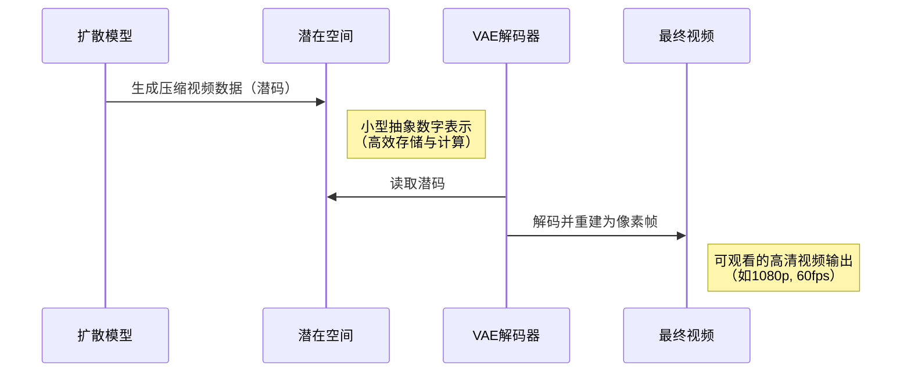

# 第3章：视频自动编码器(VAE)

欢迎回来

在[第2章：扩散模型](02_diffusion_model_.md)中，我们探索了Open-Sora的"艺术家"（扩散模型）如何将文本提示转化为精美但压缩的视频表示(Transformer)

现在想象我们已经获得了这种高质量但压缩的视频数据。就像将高清电影保存为超级压缩的zip文件——你无法直接*观看*zip文件，需要==解压==才能看到实际视频帧。

这正是**视频自动编码器(VAE)**的舞台

VAE是Open-Sora的**"视频解压器"**，核心任务是将扩散模型生成的紧凑高维数字编码（称为"潜在表示"或"==潜码=="）还原为完整==可观看的视频帧==

没有VAE，我们得到的只是无法直接观看的原始抽象数据，VAE正是将抽象数字转化为震撼视觉体验的最后一道工序。

## 视频自动编码器的工作原理

VAE由两个相互关联的核心组件构成：

1. **编码器**：如同智能视频"压缩器"，将高清视频压缩为更小更抽象的"潜在"表示。这种潜码以极紧凑的形式`保留视频最关键的信息`
2. **解码器**：担任"解压器"角色，`将紧凑的潜在表示还原为完整分辨率视频`，目标是使重建视频尽可能接近原始画面

(类似传输中的 序列化与反序列化: [[Linux#55\][网络协议] 序列化与反序列化 | TcpCalculate为例](https://blog.csdn.net/2301_80171004/article/details/142388962?ops_request_misc=%7B%22request%5Fid%22%3A%220f4a635558806c2bae84417af0418e4a%22%2C%22scm%22%3A%2220140713.130102334.pc%5Fblog.%22%7D&request_id=0f4a635558806c2bae84417af0418e4a&biz_id=0&utm_medium=distribute.pc_search_result.none-task-blog-2~blog~first_rank_ecpm_v1~rank_v31_ecpm-1-142388962-null-null.nonecase&utm_term=序列化与反序列化&spm=1018.2226.3001.4450))

为何需要这种压缩与解压机制？

- **速度**：直接处理超大高清视频数据极其缓慢且消耗内存。扩散模型在小型潜码上工作能显著提升生成效率
- **效率**：潜码更易操控。扩散模型在这个压缩空间操作，比直接处理数百万像素简单得多

就像专业电影人使用低分辨率"代理"文件加速剪辑流程，最后再切换回高清"母版"文件。VAE就是为Open-Sora实现这种"代理"创建与"母版"重建的组件。

## Open-Sora中的VAE应用

在视频生成流程中，VAE与扩散模型紧密配合：



### 代码解析

在Open-Sora生成视频时，扩散模型输出潜码`x`后，VAE解码器将其转化为可视帧以下是`scripts/vae/inference.py`中的解码流程：

```python
# 1. 加载VAE模型
model = build_module(cfg.model, MODELS, device_map=device, torch_dtype=dtype).eval()

# 2. VAE解码（实际生成时'x'来自扩散模型的潜码）
x_rec = model.decode(x)

# 3. 保存重建视频
save_sample(x_rec[idx], save_path=save_path_rec, fps=save_fps)
```

完整生成流程（如`opensora/utils/sampling.py`）中，关键调用为`vae_model.decode(latent_from_diffusion)`，VAE的`decode`方法将压缩数据转化为可视帧。

## 解压器内部构造：==VAE模型==

Open-Sora采用多种VAE变体，主要包含三类：

| VAE类型                   | 特点                                 | 类比说明                |
| ------------------------- | ------------------------------------ | ----------------------- |
| **自动编码器(2D)**        | 专注空间压缩（逐帧处理静态图像）     | 超级图片压缩器          |
| **AutoencoderKLCausal3D** | 专为视频设计，兼顾空间与时间维度压缩 | 专业视频压缩器          |
| **DCAE**                  | 特殊架构的高效VAE                    | 类似H.265的专用编解码器 |

虽然内部结构不同，但都实现`编码`与`解码`核心功能。让我们深入其原理。

### 1. 编码器：视频压缩引擎

编码器将视频（5D张量：`批次,通道,帧数,高度,宽度`）逐步压缩。通过卷积神经网络(CNN)和池化等操作降低空间（高/宽）和时间（帧）维度。

`opensora/models/vae/autoencoder_2d.py`中的`encode_`方法：

```python
def encode_(self, x: Tensor) -> tuple[Tensor, DiagonalGaussianDistribution]:
    T = x.shape[2] # 获取帧数
    # 将视频重组为图像批次进行2D处理
    x = rearrange(x, "b c t h w -> (b t) c h w")

    # 通过编码器网络
    params = self.encoder(x)

    # 重组回视频格式并创建潜在分布
    params = rearrange(params, "(b t) c h w -> b c t h w", t=T)
    posterior = DiagonalGaussianDistribution(params)

    # 从分布中采样潜码
    z = posterior.sample()
    
    # 应用缩放和偏移因子（训练稳定性关键）
    z = self.scale_factor * (z - self.shift_factor)
    return z, posterior
```

该方法展示2D VAE将视频帧作为独立图像批次处理的过程

`self.encoder`包含多个`ResnetBlock`和`Downsample`层来缩减尺寸。

输出`z`即压缩潜码，`DiagonalGaussianDistribution`为潜码添加概率分布特性（VAE的"变分"核心）。

编码器类结构如下：

```python
class Encoder(nn.Module):
    def __init__(self, config: AutoEncoderConfig):
        super().__init__()
        self.conv_in = nn.Conv2d(config.in_channels, config.ch, kernel_size=3, padding=1)
        self.down = nn.ModuleList() # 下采样层模块
        # ... 构建ResnetBlock和Downsample层 ...
        self.mid = nn.Module() # 中间层
        self.conv_out = nn.Conv2d(block_in, 2 * config.z_channels, kernel_size=3, padding=1)

    def forward(self, x: Tensor) -> Tensor:
        # 初始卷积
        hs = [self.conv_in(x)]
        # 下采样阶段
        for i_level in range(self.num_resolutions):
            for i_block in range(self.num_res_blocks):
                h = self.down[i_level].block[i_block](hs[-1])
                hs.append(h)
            if i_level != self.num_resolutions - 1:
                hs.append(self.down[i_level].downsample(hs[-1]))
        # 中间层处理
        h = self.mid.block_1(hs[-1])
        # 输出潜在分布参数
        return self.conv_out(h)
```

该网络通过初始卷积(`conv_in`)、`ResnetBlock`（在保持质量前提下学习复杂特征）和`Downsample`层逐步降低输入空间维度

最终`conv_out`输出潜在分布参数。

### 2. 解码器：潜码重建引擎

解码器执行逆向操作，将紧凑潜码`z`扩展为完整视频。通过上采样技术和卷积层重建视觉细节。

`opensora/models/vae/autoencoder_2d.py`中的`decode`方法：

```python
def decode(self, z: Tensor) -> Tensor:
    T = z.shape[2] # 获取帧数
    # 逆缩放和偏移
    z = z / self.scale_factor + self.shift_factor
    
    # 重组为图像潜码批次
    z = rearrange(z, "b c t h w -> (b t) c h w")

    # 通过解码器网络
    x = self.decoder(z)

    # 重组回视频格式
    return rearrange(x, "(b t) c h w -> b c t h w", t=T)
```

类似编码器，该方法将视频潜码重组为图像潜码后通过`self.decoder`网络处理。解码器网络包含上采样和图像细节重建层。

解码器类结构：

```python
class Decoder(nn.Module):
    def __init__(self, config: AutoEncoderConfig):
        super().__init__()
        self.conv_in = nn.Conv2d(config.z_channels, block_in, kernel_size=3, padding=1)
        self.mid = nn.Module() # 中间层
        self.up = nn.ModuleList() # 上采样层模块
        self.conv_out = nn.Conv2d(block_in, config.out_ch, kernel_size=3, padding=1)

    def forward(self, z: Tensor) -> Tensor:
        # 潜码空间初始卷积
        h = self.conv_in(z)
        # 中间层处理
        h = self.mid.block_1(h)
        # 上采样阶段
        for i_level in reversed(range(self.num_resolutions)):
            for i_block in range(self.num_res_blocks + 1):
                h = self.up[i_level].block[i_block](h)
            if i_level != 0:
                h = self.up[i_level].upsample(h)
        # 输出最终图像
        return self.conv_out(h)
```

该网络逆向执行编码器操作，使用`Upsample`层（通常包含插值和卷积）与`ResnetBlock`从压缩潜码生成像素数据，`conv_out`输出重建视频帧。

### 变分特性解析

"V"代表"变分"，意味着编码器不直接输出固定潜码`z`，而是输出*概率分布*参数（具体为`DiagonalGaussianDistribution`）

实际解码用的`z`从该分布采样获得。这种随机性促使VAE学习更"平滑"、连续的潜在空间，使生成视频更具多样性，避免简单记忆训练数据。

## 总结

视频自动编码器(VAE)是Open-Sora创作流程的无名英雄。

它高效压缩与解压视频数据，使强大的[扩散模型](02_diffusion_model_.md)能在快速、省内存的潜在空间运作。通过==将紧凑潜码扩展为完整视频帧，VAE==确保创意构想最终转化为可观看的视觉杰作。

现在我们已了解视频数据如何被压缩、生成与解压，接下来让我们探索Open-Sora如何管理与准备训练这些复杂模型所需的海量数据。这正是[数据管理系统](04_data_management_system_.md)的职责所在

