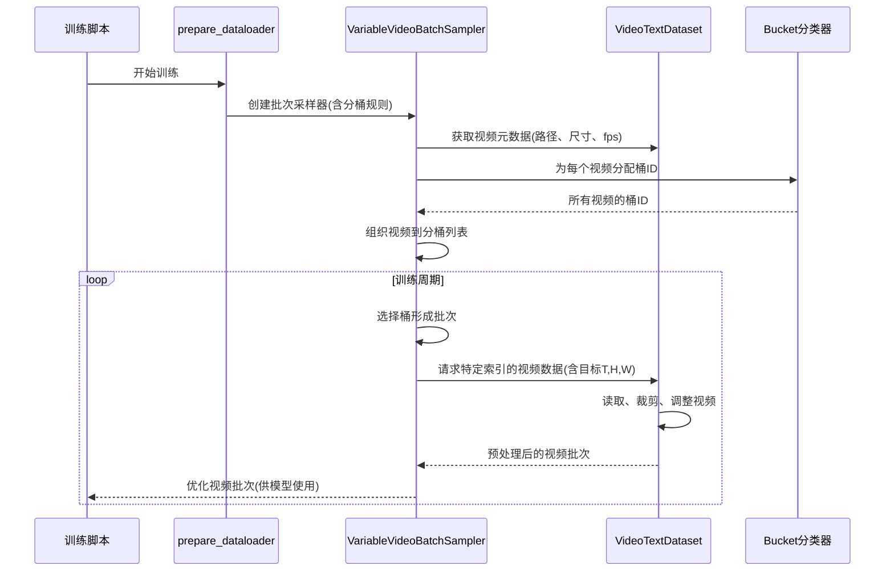

# 第4章：数据管理系统

欢迎回来

在[第3章：视频自动编码器(VAE)](03_video_autoencoder__vae__.md)中，我们了解了Open-Sora如何高效压缩与解压视频数据，使强大的[扩散模型](02_diffusion_model_.md)能够处理更小更易管理的"潜在"表示。

现在想象我们需要训练这些惊人模型。为了让它们生成多样且高质量的视频，需要展示*数百万*个示例。这些"原材料"形态各异：有些视频短，有些长；有些分辨率高，有些低；有些宽屏，有些竖屏。

如何高效地将这些海量异构视频输入训练系统是个巨大挑战！如果随机处理，你会不断调整尺寸、裁剪，并因批次受限于最大视频而浪费宝贵GPU内存。这就像试图将完全随机尺寸的书籍放入固定书架——最终会留下大量空白空间！

这正是**数据管理系统**解决的问题。它如同视频数据的**"智能图书管理员"**，核心任务是高效加载、预处理和组织这些海量异构视频片段，确保[扩散模型](02_diffusion_model_.md)获得流畅优化的数据流，最大化训练时GPU利用率。

## 数据管理系统的核心功能

数据管理系统执行多项关键任务：

1. **高效数据加载**：从特殊文件（如`.parquet`）读取数百万视频的元数据，仅在训练需要时才加载实际像素数据
2. **智能预处理**：应用尺寸调整、裁剪、归一化等必要转换
3. **智能组织（分桶）**：这是最重要部分！==将具有相似特征的视频分组==

让我们深入**分桶机制**的核心思想。

### "分桶"的魔法

想象你有一个拥有数百万本书的图书馆。如果随机取书，可能拿到儿童绘本也可能拿到巨型百科全书。试图将它们全放入标准箱子会混乱低效。

> **分桶**就像按书籍尺寸（高度、宽度、页数）将其整理到专用"桶"或书架中。

Open-Sora中，"桶"按以下特征分组视频：

* **时长（帧数）**：帧数相近的视频
* **分辨率（高&宽）**：像素尺寸相似的视频
* **宽高比**：宽度与高度之比（如16:9宽屏，1:1方形）

| 特征         | 对GPU的重要性                                                |
| ------------ | ------------------------------------------------------------ |
| **视频时长** | 同批次视频必须有相同帧数。若混合64帧和16帧视频，16帧视频需填充空数据匹配64帧，浪费GPU内存和算力 |
| **分辨率**   | 同批次视频必须有相同高宽。512x512与256x256视频同批次时，小视频需填充，浪费空间 |
| **宽高比**   | 按宽高比分组可确保调整尺寸时（如转为256x512）不会过度挤压或拉伸，保留原始画面，高效利用选定分辨率 |

通过将相似视频分入这些"桶"，Open-Sora能创建尺寸近乎统一的训练批次，从而：

* **优化批次处理**：每个批次填充更多真实视频数据，减少填充浪费
* **最大化GPU利用率**：让GPU专注处理真实视频数据而非空白填充，显著提升训练效率

这确保了模型获得流畅高效的数据流，对训练大规模视频生成模型至关重要。

## Open-Sora的数据管理系统实践

主要通过配置数据集和设置**`DataLoader`**与系统交互。`DataLoader`是PyTorch标准工具，Open-Sora为其扩展了智能分桶功能。

配置文件示例（如`configs/diffusion/train/video_cond.py`）：

```python
dataset = dict(
    type="video_text",
    data_path="your_video_metadata.parquet", # 视频元数据路径
    # ...其他数据集设置...
)

bucket_config = dict(
    "256px": { # 256px视频桶
        1: (0.1, 4), # 1帧(图像)，10%概率，批次大小4
        16: (0.9, 2), # 16帧，90%概率，批次大小2
    },
    "512px": { # 512px视频桶
        16: (1.0, 1), # 16帧，100%概率，批次大小1
        32: (0.8, 1), # 32帧，80%概率，批次大小1
    },
    # ...更多桶配置...
)
```

该配置定义Open-Sora预期的视频类型（`video_text`数据集）及分组规则（`bucket_config`）。例如`512px`桶预期调整到约512x512像素的视频，其中`16: (1.0, 1)`表示16帧视频总是被接受（1.0概率），该桶批次大小为1。

训练脚本中使用`prepare_dataloader`函数：

```python
from opensora.datasets.dataloader import prepare_dataloader

# 根据配置构建数据集
dataset = build_module(cfg.dataset_config.type, cfg.dataset_config)

# 准备带分桶逻辑的DataLoader
dataloader, sampler = prepare_dataloader(
    dataset=dataset,
    batch_size=cfg.batch_size, # 通用批次大小，会被bucket_config覆盖
    bucket_config=cfg.bucket_config, # 分桶规则
    # ...其他参数...
)

# 迭代时获得优化批次
for batch_idx, batch_data in enumerate(dataloader):
    video_tensor = batch_data["video"] # 尺寸统一的视频张量(T, C, H, W)
    text_embeddings = batch_data["text"]
    # ...输入扩散模型...
```

`prepare_dataloader`是入口函数，接收数据集（知晓视频位置）和`bucket_config`（定义分组规则），返回可循环的`dataloader`，每个`batch_data`都包含优化打包的相似尺寸视频。

## 智能管理员内部实现

让我们揭开"智能管理员"的运作细节。

### 核心组件工作流



关键组件包括知晓如何加载转换视频文件的`VideoTextDataset`，定义分桶逻辑的`Bucket`类，以及协调分组与批次的`VariableVideoBatchSampler`（尤其针对分布式训练）。

### 1. VariableVideoBatchSampler（批次组织者）

`VariableVideoBatchSampler`（位于`opensora/datasets/sampler.py`）是分桶策略核心

与传统按序取批次不同，它智能分组批次。

其`group_by_bucket`方法尤为关键：

```python
def group_by_bucket(self) -> dict:
    # 使用pandarallel快速为所有视频分配桶ID
    if dist.get_rank() == 0: # 仅rank 0执行初始处理
        bucket_ids = data.parallel_apply(
            apply, # 调用bucket.get_bucket_id的辅助函数
            method=self.bucket.get_bucket_id,
            num_bucket=self.bucket.num_bucket,
        )
    # 跨设备同步桶ID
    bucket_ids = sync_object_across_devices(bucket_ids)
    
    # 按桶ID分组样本索引
    bucket_sample_dict = defaultdict(list)
    for i in valid_indices:
        bucket_sample_dict[bucket_ids_np[i]].append(i)
    return bucket_sample_dict
```

该方法先加载视频元数据，通过`parallel_apply`并行调用`self.bucket.get_bucket_id`为每个视频分配唯一"桶ID"（如`('512px', 16, '16-9')`），然后分组同桶视频索引。

`__iter__`方法从这些组织好的桶中提取批次，确保每批次视频特征相似。巧妙之处在于将目标`(T, H, W)`编码到索引字符串（如`"1234-16-512-512"`），高效传递信息给数据集。

### 2. Bucket类（规则手册）

`Bucket`类（`opensora/datasets/bucket.py`）定义分桶规则。核心方法`get_bucket_id`：

```python
def get_bucket_id(self, T: int, H: int, W: int, fps: float, path: str, seed: int) -> tuple:
    # 调整帧数基于采样间隔
    T = T // sampling_interval
    resolution = H * W
    rng = np.random.default_rng(seed) # 随机数生成器

    # 遍历预设桶(如"256px","512px")
    for hw_id, t_criteria in self.bucket_probs.items():
        # 跳过分辨率过低的视频
        if resolution < self.hw_criteria[hw_id] * 0.8:
            continue

        # 处理图像(T=1)
        if T == 1:
            if 1 in t_criteria and rng.random() < t_criteria[1]:
                return hw_id, 1, get_closest_ratio(H, W, self.ar_criteria[hw_id][1])

        # 处理视频(T>1)
        for t_id, prob in t_criteria.items():
            if T >= t_id and t_id != 1:
                if 符合概率条件:
                    ar_id = get_closest_ratio(H, W, self.ar_criteria[hw_id][t_id])
                    return hw_id, t_id, ar_id # 返回桶ID!
    return None # 无合适桶
```

该方法根据视频原始属性（`T`,`H`,`W`,`fps`）确定最佳`(resolution_id, time_id, aspect_ratio_id)`元组。考虑概率（并非所有同尺寸视频都进同桶，增加训练多样性）并确保视频尺寸符合桶标准。

### 3. VideoTextDataset（视频加载转换器）

`VideoTextDataset`（`opensora/datasets/datasets.py`）负责从磁盘读取视频帧并应用必要预处理。

其`getitem`方法接收分桶信息：

```python
def getitem(self, index: str) -> dict:
    # 解析带桶信息的索引："原始索引-帧数-高度-宽度"
    real_index, num_frames, height, width = map(int, index.split("-"))

    # 获取文本提示等元数据
    ret = super().getitem(real_index)

    # 按目标尺寸读取转换视频
    ret.update(self.get_video(real_index, num_frames, height, width))
    return ret

def get_video(self, index: int, num_frames: int, height: int, width: int) -> dict:
    path = self.data.iloc[index]["path"]
    # 用torchvision.io读取视频帧
    vframes, _ = read_video(path, backend="av")
    
    # 应用时间裁剪(选择帧片段)
    video = temporal_random_crop(vframes, num_frames)
    
    # 应用空间和色彩转换
    transform = get_transforms_video(self.transform_name, (height, width))
    video = transform(video) # T C H W
    return {"video": video.permute(1, 0, 2, 3)} # 转为C T H W
```

当`dataloader`请求数据时，`VariableVideoBatchSampler`传递如`"1234-16-512-512"`的索引。`VideoTextDataset`解析获得原始索引(1234)和目标尺寸(16帧,512x512)，据此读取视频、随机裁剪片段(`temporal_random_crop`)和应用空间转换(`get_transforms_video`)

转换器如`UCFCenterCropVideo`或`ResizeCrop`（位于`opensora/datasets/video_transforms.py`）执行实际尺寸调整和裁剪。

### 高效数据传输：DataloaderForVideo

`DataloaderForVideo`（`opensora/datasets/dataloader.py`）是定制PyTorch`DataLoader`，包含`_pin_memory_loop`。该==循环在独立线程运行==，确保处理后的视频数据（因分桶已标准化）被移入CPU的"固定内存"。固定内存支持快速直接传输至GPU，==避免额外拷贝==，进一步提升训练效率。

## 总结

数据管理系统是Open-Sora高效训练海量异构视频数据集的幕后英雄。作为"智能图书管理员"，它通过==加载、预处理和智能分桶==机制，最大化GPU利用率并确保流畅数据流。这套精密数据处理体系对应对大规模视频生成的复杂性至关重要。

现在我们已了解数据如何被管理，接下来让我们探索`驱动生成流程`的强大工具。下一章将深入[推理工具](05_inference_utilities_.md)

