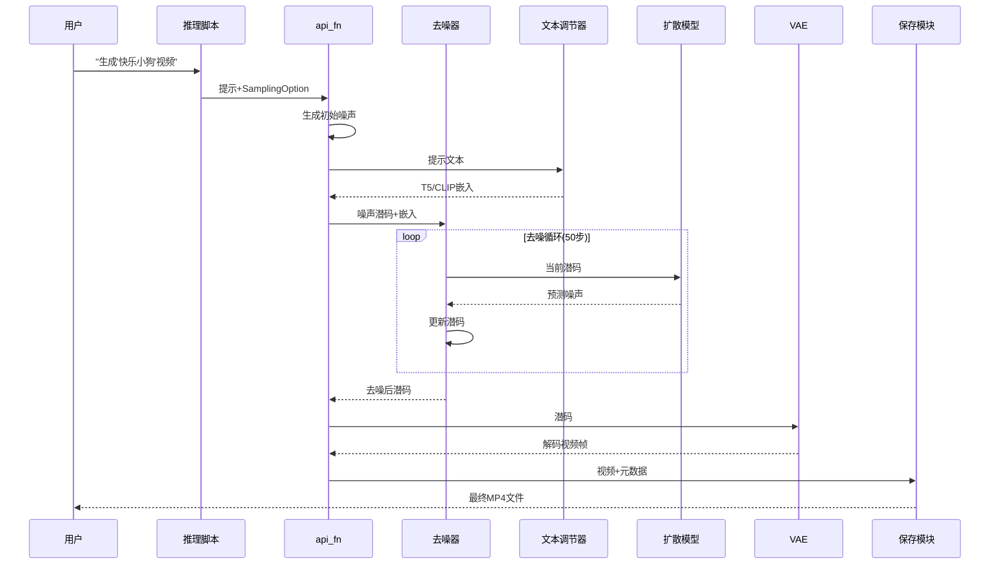

# 第5章：推理工具

欢迎回到Open-Sora

至此我们已经了解了视频生成的各个"大脑"和"工具"：

* [文本调节器](01_text_conditioners_.md) 将创意转化为计算机能理解的语言
* [扩散模型](02_diffusion_model_.md) 作为核心"艺术家"，将抽象噪声转化为压缩视频
* [视频自动编码器(VAE)](03_video_autoencoder__vae__.md) 将压缩视频"解压"为可观看帧
* [数据管理系统](04_data_management_system_.md) 确保高效数据流，尤其在训练时

现在假设所有这些强大组件都已就绪。如何将它们整合？如何告诉系统："用*这个*提示，生成*这个*尺寸的视频，采用*这些*特定设置，并保存到*此处*"？

这就是**推理工具**的舞台！它们如同整个视频生成流程的**"控制面板"**或**"导演"**。虽不直接生成视频，但能==协调所有其他组件==，管理从输入提示到最终视频文件的完整流程。

## 推理工具的核心功能

推理工具是一系列实用函数和工具的集合，负责从训练好的Open-Sora模型生成视频所需的一切操作。主要职责包括：

1. **接收指令**：接受文本提示及所有设定（如视频尺寸、帧数、去噪步数等），甚至能处理参考图像
2. **搭建舞台**：为[扩散模型](02_diffusion_model_.md)准备所有必要输入，包括生成初始随机噪声
3. **指挥演出**：管理完整视频生成流程，确保调用[文本调节器](01_text_conditioners_.md)、[扩散模型](02_diffusion_model_.md)执行去噪步骤、[视频自动编码器(VAE)](03_video_autoencoder__vae__.md)解码最终结果
4. **精细调控**：应用用户选择的特殊选项，如文本引导强度或特定采样技术
5. **交付成果**：将生成视频帧保存为文件（如`.mp4`），通常还会添加水印等细节

本质上，推理工具==提供了与复杂Open-Sora模型交互的友好方式==，使其成为实用的视频生成工具。

## 应用实例：生成简单视频

假设要生成"舒适客厅里追逐激光笔的蓬松猫咪"视频，要求720p分辨率、16帧、保存为MP4。

无需手动调用每个模型（T5、CLIP、扩散模型、VAE）并管理输出，直接使用推理工具即可。Open-Sora中`scripts/diffusion/inference.py`脚本是主要入口：

```python
# 1. 定义视频参数
sampling_option = SamplingOption(
    resolution="720p",
    aspect_ratio="16:9",
    num_frames=16,
    num_steps=50,
    guidance=7.0, # 文本提示的影响强度
    seed=1234,
)
sampling_option = sanitize_sampling_option(sampling_option) # 验证参数

# 2. 准备生成函数
api_fn = prepare_api(model, model_ae, model_t5, model_clip, optional_models)

# 3. 输入提示
batch = {
    "text": ["舒适客厅里追逐激光笔的蓬松猫咪"],
}

# 4. 生成视频
x = api_fn(
    sampling_option,
    cond_type="t2v", # 文生视频模式
    **batch,
).cpu()

# 5. 保存视频
process_and_save(x, batch, cfg, sub_dir, sampling_option)
```
这段简化代码展示了核心交互：定义`SamplingOption`（"订单"），调用`api_fn`（"导演"）传入设置和提示，返回视频数据`x`后由`process_and_save`保存。

## 推理工具的关键组件

### 1. `SamplingOption`：生成蓝图

`SamplingOption`是Python数据类，包含定义视频生成的所有参数，如同填写视频订单表。

| 参数              | 描述                                           |
| ----------------- | ---------------------------------------------- |
| `width`, `height` | 视频尺寸（如1280x720）                         |
| `resolution`      | 预设分辨率（如"720p"），可覆盖`width`/`height` |
| `aspect_ratio`    | 宽高比（如"16:9"）                             |
| `num_frames`      | 视频帧数                                       |
| `num_steps`       | 扩散模型去噪步数（步数越多质量可能越高但更慢） |
| `guidance`        | 文本提示的影响强度（值越大越贴合文本）         |
| `seed`            | 随机种子（相同种子产生相同输出）               |
| `method`          | 采样方法（如`I2V`标准视频生成）                |

`sanitize_sampling_option`函数确保参数（如`resolution`和`aspect_ratio`）转换为模型可用的统一`height`和`width`值。

### 2. `prepare_models`：加载工具集

`prepare_models`函数加载[扩散模型](02_diffusion_model_.md)、[VAE](03_video_autoencoder__vae__.md)和[文本调节器](01_text_conditioners_.md)（[T5](01_text_conditioners_.md)和[CLIP](01_text_conditioners_.md)）：

```python
def prepare_models(cfg, device, dtype):
    model = build_module(cfg.model, MODELS).eval() # 扩散模型
    model_ae = build_module(cfg.ae, MODELS).eval() # VAE
    model_t5 = build_module(cfg.t5, MODELS).eval() # T5
    model_clip = build_module(cfg.clip, MODELS).eval() # CLIP
    return model, model_ae, model_t5, model_clip
```

### 3. `prepare_api`与`api_fn`：核心导演

`prepare_api`创建并配置生成函数`api_fn`，这是实际启动视频生成的"导演"：

```python
def prepare_api(model, model_ae, model_t5, model_clip):
    @torch.inference_mode()
    def api_fn(opt: SamplingOption, cond_type: str, **kwargs):
        # 1. 生成初始噪声
        z = get_noise(opt.num_frames, opt.height, opt.width)
        
        # 2. 准备文本嵌入
        inp = prepare(model_t5, model_clip, z, prompt=text)
        
        # 3. 扩散模型迭代去噪
        x = denoiser.denoise(model, **inp, timesteps=opt.num_steps)
        
        # 4. VAE解码为像素视频
        return model_ae.decode(x)
    return api_fn
```

### 4. `Denoiser`类：去噪策略

不同采样方法（如`I2V`或`DISTILLED`）对应不同去噪策略类，实现`denoise`方法控制扩散模型的迭代去噪过程：

```python
class I2VDenoiser:
    def denoise(self, model, img, timesteps, guidance):
        for t_curr, t_prev in zip(timesteps[:-1], timesteps[1:]):
            # 调用扩散模型预测噪声
            pred = model(img=img, timesteps=t_curr, guidance=guidance)
            # 更新潜码
            img = img + (t_prev - t_curr) * pred
        return img
```

### 5. `process_and_save`：视频保存

将生成的视频张量（经VAE解码的像素数据）保存为文件：

```python
def process_and_save(x, batch, cfg, sub_dir, opt):
    for img, prompt in zip(x, prompts):
        save_path = get_save_path(prompt)
        save_sample(img, save_path=save_path, fps=opt.fps) # 保存MP4
        with open(save_path + ".txt", "w") as f:
            f.write(prompt) # 保存提示文本
```

## 工作流程图示



## 总结

推理工具是Open-Sora不可或缺的"生产工具"，提供从接收创意提示到生成最终视频的完整工作流管理。它们将复杂的[文本调节器](01_text_conditioners_.md)、[扩散模型](02_diffusion_model_.md)和[VAE](03_video_autoencoder__vae__.md) pipeline封装为易用接口。

现在我们已了解视频如何生成和保存，接下来探索Open-Sora如何加载庞大的训练模型及其组件。下一章将深入[模型检查点加载](06_checkpoint___model_loading_.md)

