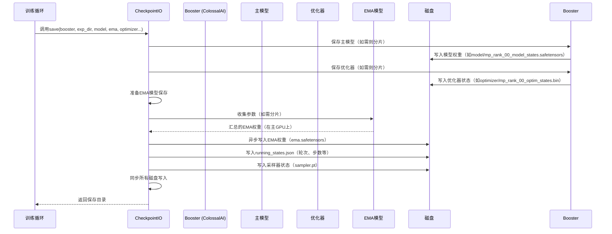

# 第6章：检查点与模型加载

欢迎回到Open-Sora

在[第5章：推理工具](05_inference_utilities_.md)中，我们学习了如何召集所有"演员"（模型）并"导演"从文本提示到最终视频文件的完整生成流程。但如果要训练这些庞大模型（可能耗时数日甚至数月），该如何保障训练进度？

想象你在玩一款超长史诗级游戏。肯定不希望关闭主机时丢失所有进度对吧？你会保存游戏

训练Open-Sora这类大型AI模型就如同进行一场漫长游戏。它需要无数小时的计算，耐心教导模型生成惊艳视频。一旦发生意外——断电、软件崩溃，或只是暂停训练后想继续——都可能让所有努力付诸东流。

这正是**检查点与模型加载**要解决的问题

它如同训练旅程的**"记忆守护者"**，==定期将模型的完整"大脑"和"笔记"快照保存到磁盘==。这样你总能从断点继续，甚至可将训练好的"游戏存档"分享给他人使用或继续训练。

## 什么是检查点？

检查点本质上是训练进度在特定时刻的完整"存档文件"，包含完美恢复训练或使用训练模型生成新视频所需的一切。

Open-Sora检查点包含：

| 组件                 | 存储内容                                 | 重要性                   |
| -------------------- | ---------------------------------------- | ------------------------ |
| **模型权重**         | 模型的"知识"或"大脑"（所有学习到的数字） | 训练模型的核心           |
| **优化器状态**       | 模型的学习"笔记"（如权重调整幅度）       | 确保优化器能继续有效学习 |
| **学习率调度器状态** | 学习"节奏"（学习率随时间变化规律）       | 保证学习率调度正确执行   |
| **训练轮次&步数**    | 训练进度（如同书籍页码）                 | 精确定位恢复位置         |
| **EMA模型权重**      | 模型的"平滑"版本（通常生成视频质量更佳） | 提供高质量的推理版本     |

> 没有检查点，训练将变成高风险的一次性过程，分享强大模型也会极其困难。

## Open-Sora的检查点使用：保存与加载

Open-Sora使检查点的保存和加载变得直观，尤其在训练期间。让我们看看如何保存检查点并恢复训练。

### 应用场景：从检查点恢复训练

假设已训练Open-Sora一周，希望明天继续。

**1. 保存检查点（训练过程中）**

Open-Sora的训练脚本（如`scripts/diffusion/train.py`或`scripts/vae/train.py`）默认会定期自动保存检查点，可通过`ckpt_every`等参数配置。

以下是训练脚本中调用`CheckpointIO`工具`save`函数的简化示例：

```python
# 检查是否到达保存时机
if ckpt_every > 0 and actual_update_step % ckpt_every == 0:
    # 保存模型进度的核心代码！
    save_dir = checkpoint_io.save(
        booster,
        exp_dir,
        model=model,
        ema=ema,
        optimizer=optimizer,
        lr_scheduler=lr_scheduler,
        sampler=sampler,
        epoch=epoch,
        step=step + 1,
        global_step=global_step + 1,
    )
    logger.info("检查点已保存：轮次%s 步数%s 路径%s", epoch, step + 1, save_dir)
```
这段代码中，`checkpoint_io.save`是保存功能的核心，接收`booster`（管理分布式训练的Open-Sora助手）、保存目录`exp_dir`，以及所有关键组件：`model`、`ema`（指数移动平均模型）、`optimizer`、`lr_scheduler`和当前训练进度（`epoch`、`step`、`global_step`），最后返回新检查点路径。

**2. 加载检查点恢复训练**

只需在配置中通过`load`参数指定检查点路径：

```python
if cfg.get("load", None) is not None:
    logger.info("正从%s加载检查点", cfg.load)
    ret = checkpoint_io.load(
        booster,
        cfg.load, # 检查点路径
        model=model,
        ema=ema,
        optimizer=optimizer,
        lr_scheduler=lr_scheduler,
        sampler=sampler,
    )
    start_epoch = ret[0] # 训练中断时的轮次
    start_step = ret[1]  # 该轮次中的步数
    logger.info("已加载检查点%s：轮次%s 步数%s", cfg.load, start_epoch, start_step)
```
`checkpoint_io.load`函数接收`booster`和检查点路径`cfg.load`，自动将`model`、`ema`、`optimizer`、`lr_scheduler`和`sampler`恢复到保存时的状态，并返回`epoch`和`step`以便训练循环精准重启。

**3. 加载模型用于推理**

若只需使用训练好的模型*生成*视频，通常不需要优化器或调度器状态，仅需模型权重。Open-Sora为此提供简化函数`load_checkpoint`：

```python
# 从采样工具加载（实际调用位于主推理脚本）
from opensora.utils.ckpt import load_checkpoint

# 仅加载模型权重
model = load_checkpoint(
    model,             # 初始化后的模型（蓝图）
    "path/to/model.safetensors", # 或分片检查点目录
    device_map="cuda", # 加载目标设备（如GPU）
    strict=True,       # 确保所有键匹配（对预训练模型重要）
)
```
`load_checkpoint`函数更灵活，支持从不同格式（如`safetensors`）加载，甚至可直接从Hugging Face Hub获取预训练模型。

## 记忆守护者内部：`CheckpointIO`类剖析

Open-Sora检查点管理的核心是`CheckpointIO`类（位于`opensora/utils/ckpt.py`）。它与ColossalAI的`Booster`协同工作，==处理大型模型的复杂保存/加载，包括分片和异步I/O==。

### 操作序列：保存检查点

以下是训练期间`CheckpointIO.save`的工作流程：



该图展示`CheckpointIO`如何协调多组件保存，使用`Booster`处理主模型和优化器（应对分片等复杂情况），直接管理EMA模型和其他状态。

### `CheckpointIO`关键组件

以下是`opensora/utils/ckpt.py`中方法的简化版本。

**1. `CheckpointIO`类初始化**

```python
class CheckpointIO:
    def __init__(self, n_write_entries: int = 32):
        self.n_write_entries = n_write_entries
        self.writer: Optional[AsyncFileWriter] = None # EMA异步保存
        # ... 其他内部变量 ...

    def _sync_io(self):
        # 确保所有待写入完成
        if self.writer is not None:
            self.writer.synchronize()
            self.writer = None
```
`CheckpointIO`初始化时配备`AsyncFileWriter`工具，用于非阻塞快速磁盘写入（异步I/O）。`_sync_io`方法确保所有后台写入完成后再继续。

**2. 简化版`save`方法**

```python
def save(self, booster: Booster, save_dir: str, model: nn.Module = None, ema: nn.Module = None, ...) -> str:
    self._sync_io() # 同步先前写入
    # 创建专属检查点目录
    save_dir = os.path.join(save_dir, f"epoch{epoch}-global_step{actual_update_step}")
    os.makedirs(os.path.join(save_dir, "model"), exist_ok=True)

    # 保存主模型权重（Booster处理分片和safetensors格式）
    booster.save_model(model, os.path.join(save_dir, "model"), shard=True, use_safetensors=True)

    # 保存优化器状态（Booster处理分片）
    if optimizer is not None:
        booster.save_optimizer(optimizer, os.path.join(save_dir, "optimizer"), shard=True)

    # 保存EMA模型（如需则从所有GPU收集分片）
    if ema is not None and dist.get_rank() == 0: # 仅主GPU（rank 0）执行
        ema_state_dict = {} # 简化版：实际会执行模型参数收集
        self.writer = async_save(os.path.join(save_dir, "ema.safetensors"), ema_state_dict)

    # 保存训练进度元数据（JSON格式）
    if dist.get_rank() == 0:
        running_states = {"epoch": epoch, "step": step, ...}
        save_json(running_states, os.path.join(save_dir, "running_states.json"))

    dist.barrier() # 等待所有GPU完成
    return save_dir
```
`save`方法利用`booster.save_model`和`booster.save_optimizer`的强大功能，自动处理`shard=True`（模型分片）和`use_safetensors=True`（安全高效格式）

对EMA模型执行`model_gathering`（参数收集到主GPU），通过`async_save`后台写入`safetensors`文件，最后保存记录元数据的`running_states.json`。

**3. 简化版`load`方法**

```python
def load(self, booster: Booster, load_dir: str, model: nn.Module = None, ema: nn.Module = None, ...) -> tuple[int, int]:
    assert os.path.exists(load_dir), f"检查点目录{load_dir}不存在"
    
    # 加载训练进度元数据
    running_states = load_json(os.path.join(load_dir, "running_states.json"))

    # 加载主模型权重（Booster处理分片重组）
    if model is not None:
        booster.load_model(model, os.path.join(load_dir, "model"), strict=False)

    # 加载EMA模型
    if ema is not None:
        ema_state_dict = load_file(os.path.join(load_dir, "ema.safetensors"))
        ema.load_state_dict(ema_state_dict, strict=False, assign=True)

    # 加载优化器状态
    if optimizer is not None:
        booster.load_optimizer(optimizer, os.path.join(load_dir, "optimizer"))
    
    dist.barrier() # 等待所有GPU完成加载
    return (running_states["epoch"], running_states["step"])
```
`load`方法与`save`对应，先加载`running_states.json`，再通过`booster.load_model`和`booster.load_optimizer`智能加载各组件（自动处理分片文件）

对EMA模型直接使用`load_file`读取`safetensors`文件。

### 推理模型加载：`load_checkpoint`函数

`load_checkpoint`函数（同位于`opensora/utils/ckpt.py`）是专为加载模型权重设计的便捷工具，常用于推理或微调而非完整训练恢复。

```python
def load_checkpoint(model: nn.Module, path: str, cache_dir: str = None, ...) -> nn.Module:
    # 若本地不存在路径，尝试从Hugging Face Hub下载
    if not os.path.exists(path):
        path = load_from_hf_hub(path, cache_dir)
    assert os.path.exists(path), f"未找到检查点：{path}"

    logger.info(f"正从{path}加载模型权重")
    if path.endswith(".safetensors"):
        ckpt = load_file(path, device='cpu') # 先加载到CPU
        missing, unexpected = model.load_state_dict(ckpt, strict=False)
    elif path.endswith(".pt") or path.endswith(".pth"):
        ckpt = torch.load(path, map_location=device_map) # 加载PyTorch .pt文件
        missing, unexpected = model.load_state_dict(ckpt, strict=False)
    else: # 假设为ColossalAI分片检查点目录
        load_from_sharded_state_dict(model, path)
    
    return model
```
该函数强大之处在于支持三种常见格式：
* `.safetensors`：更新、更安全、更快的模型权重格式
* `.pt`或`.pth`：标准PyTorch检查点文件
* ColossalAI分片目录：分片保存的模型

通过集成`load_from_hf_hub`，可直接提供Hugging Face仓库路径自动下载检查点，极大简化社区共享模型的使用流程。

## 总结

检查点与模型加载是训练和共享Open-Sora等大型AI模型的"记忆守护者"。通过定期保存模型的"大脑"、学习笔记和进度，确保努力不会白费，==训练好的模型能轻松分发复用==。这套健壮系统是训练和部署尖端视频生成模型的基础。

现在我们已理解模型进度如何保存和加载，接下来探索Open-Sora如何突破极限，将训练==负载分布到多GPU上==。下一章将深入[分布式训练加速器](07_distributed_training_booster_.md)

