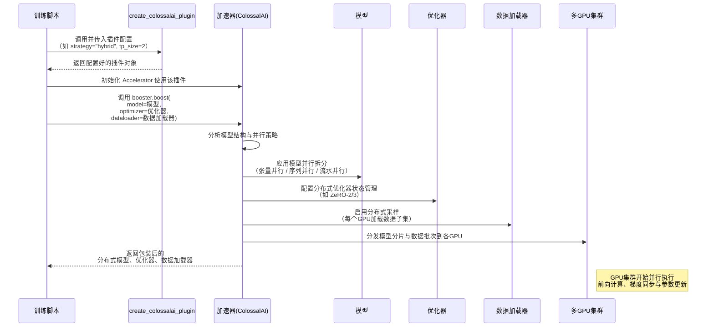

# 第7章：分布式训练加速器

欢迎回到Open-Sora

在[第6章：检查点与模型加载](06_checkpoint___model_loading_.md)中，我们学习了如何保存和加载AI模型的"大脑"，确保漫长训练过程中的成果不会丢失。

现在想象你试图在单块GPU上训练这些惊人的Open-Sora模型（比如参数庞大的[扩散模型](02_diffusion_model_.md)）。这就像试图把一头大象塞进小汽车——根本行不通！模型太大无法放入GPU内存，即便能放下，训练速度也会极其缓慢。

这正是**分布式训练加速器**要解决的问题！它如同大规模AI训练的**"总指挥"**或**"首席架构师"**，核心任务是==将Open-Sora的训练工作高效分配到多块GPU甚至多台计算机上==，使得训练那些单设备无法承载的尖端模型成为可能。

## 分布式训练加速器的核心功能

分布式训练加速器如同大型建筑项目（训练Open-Sora）的项目经理。它不直接建造摩天大楼，而是==智能划分工作==，将任务分配给不同施工队（GPU），并确保它们协同无间。

主要职责包括：

1. **突破内存限制**：将巨型模型和海量数据分解为可管理的小块，每块GPU仅处理部分工作负载，避免"内存不足"错误
2. **加速训练过程**：通过多GPU并行工作，大幅缩短总训练时间。就像多个施工队同时建造不同楼层，而非单队建造整栋楼
3. **处理复杂协调**：管理GPU间精密通信，确保模型所有部分即使分布在不同机器上也能正确高效学习

为实现这些，加速器采用先进的**并行化策略**。让我们看看主要的任务划分方式。

## ==并行化==策略

假设你有一个大任务（训练模型）和一组工人（GPU），如何分配工作？

| 策略           | 类比                                                         | Open-Sora实现原理                                            | 优势                                        |
| -------------- | ------------------------------------------------------------ | ------------------------------------------------------------ | ------------------------------------------- |
| **数据并行**   | 多位厨师制作相同菜品，每人处理不同*批次*的食材               | 每块GPU拥有*完整的模型副本*，但处理数据集中的*不同视频批次*，最后汇总学习结果 | 适合大型数据集；实现简单                    |
| **模型并行**   | 巨幅画作超出单个画家能力，多位画家协作完成不同*区域*         | 将*模型本身*（如[扩散模型](02_diffusion_model_.md)的层）拆分到不同GPU | 解决单GPU内存不足问题                       |
| **张量并行**   | 模型并行的特例。将单个数学运算（如大型矩阵乘法）拆分为小块在不同GPU上计算 | 模型层内的核心计算（张量）被拆分到多GPU，各GPU计算部分结果后合并 | 应对超大规模模型，单层都无法放入单GPU的情况 |
| **序列并行**   | 超长书籍。每人阅读同一句子的不同*片段*，最后整合理解         | 处理长序列（如多视频帧或文本标记）时，将序列本身拆分到不同GPU | 大幅降低单GPU对超长输入序列的内存需求       |
| **流水线并行** | 装配流水线。不同工人负责生产流程的*不同阶段*（如车架组装、发动机安装） | 将模型层划分为多个阶段分配到不同GPU，数据按顺序流经这些阶段  | 进一步降低单GPU内存占用，可重叠计算提升效率 |

Open-Sora采用`ColossalAI`作为强大的"加速器"来实现这些策略。

## Open-Sora加速器实战：提升训练效率

`ColossalAI`的优势在于将分布式训练的复杂性隐藏在简单的`Booster`对象背后。你只需配置所需的并行化类型，加速器会处理底层细节。

### 应用场景：实现分布式训练

让我们看Open-Sora训练脚本（`scripts/diffusion/train.py`或`scripts/vae/train.py`）如何使用加速器。

**1. 配置ColossalAI插件：**

首先在配置文件（如`configs/diffusion/train/video_cond.py`）中指定分布式训练插件类型：

```python
plugin = "hybrid" # 或"zero2"
plugin_config = dict(
    tp_size=2,  # 使用2块GPU进行张量并行
    sp_size=1,  # 本例不启用序列并行
    pp_size=1,  # 本例不启用流水线并行
    # ... 其他参数如zero_stage...
)
```

训练脚本中根据配置创建ColossalAI插件：

```python
from colossalai.booster import Booster
from opensora.utils.train import create_colossalai_plugin

# 定义插件类型及配置
plugin_type = cfg.get("plugin", "zero2")
plugin_config = cfg.get("plugin_config", {})

# 根据设置创建插件
plugin = create_colossalai_plugin(
    plugin=plugin_type,
    dtype=cfg.get("dtype", "bf16"), # 数据类型（如bfloat16加速训练）
    grad_clip=cfg.get("grad_clip", 0), # 梯度裁剪防止不稳定
    **plugin_config,
)

# 用插件初始化加速器
booster = Booster(plugin=plugin)
```
`create_colossalai_plugin`函数设置具体的分布式策略

例如`zero2`表示采用内存高效的数据并行，选择`hybrid`则允许组合多种并行策略（如`tp_size`张量并行和`sp_size`序列并行），前提是硬件和模型支持。

**2. 加速模型、优化器和数据加载器：**

初始化`booster`后，只需将常规PyTorch模型、优化器、学习率调度器和数据加载器传入`booster.boost()`方法。这是魔法发生的关键步骤！

```python
# 核心加速步骤！
model, optimizer, _, dataloader, lr_scheduler = booster.boost(
    model=model,
    optimizer=optimizer,
    lr_scheduler=lr_scheduler,
    dataloader=dataloader,
)
```
`booster.boost()`调用后，你的`model`、`optimizer`、`dataloader`和`lr_scheduler`会自动转换为分布式环境可用的版本。无需手动分配模型部分到不同GPU或担心梯度通信，加速器已为你搞定一切！

## 总指挥内部机制：实现细节

让我们简略看看`booster.boost()`调用时的内部运作。

### 操作流程图示



### 加速器核心组件

**1. `create_colossalai_plugin` (`opensora/utils/train.py`)**

该函数根据`plugin_type`创建特定ColossalAI插件，并设置"进程组"定义GPU间通信方式。

```python
import torch.distributed as dist
from colossalai.booster.plugin import HybridParallelPlugin, LowLevelZeroPlugin

def create_colossalai_plugin(plugin: str, dtype: str, grad_clip: float, **kwargs):
    plugin_kwargs = dict(
        precision=dtype,
        # ... 通用设置 ...
    )
    plugin_kwargs.update(kwargs)

    if plugin == "zero1" or plugin == "zero2":
        # ZeRO-1/2使用全局数据并行
        plugin = LowLevelZeroPlugin(stage=(1 if plugin == "zero1" else 2), **plugin_kwargs)
        set_data_parallel_group(dist.group.WORLD) # 所有GPU同属数据并行组
    elif plugin == "hybrid":
        # 混合策略组合多种并行方式
        plugin = HybridParallelPlugin(
            custom_policy=kwargs.pop("custom_policy", None), # 如MMDiT模型的自定义拆分规则
            **plugin_kwargs,
        )
        set_tensor_parallel_group(plugin.tp_group)     # 设置张量并行组
        set_sequence_parallel_group(plugin.sp_group)    # 设置序列并行组
        set_data_parallel_group(plugin.dp_group)        # 设置数据并行组
    return plugin
```
该函数对*工作负载分配方式*起决定性作用。对于`hybrid`并行（常用于Open-Sora的[扩散模型](02_diffusion_model_.md)等超大模型），可能使用`custom_policy`如`MMDiTPolicy`（`opensora/models/mmdit/distributed.py`），该策略明确指导ColossalAI如何将[MMDiTModel](02_diffusion_model_.md)拆分到不同GPU实现张量或序列并行。

**2. `booster.boost()`调用 (`scripts/diffusion/train.py`)**

`booster.boost()`方法是核心引擎，将标准PyTorch模型、优化器和数据加载器转换为分布式版本。

实际调用代码：

```python
# 加速器智能准备分布式训练组件
model, optimizer, _, dataloader, lr_scheduler = booster.boost(
    model=model,
    optimizer=optimizer,
    lr_scheduler=lr_scheduler,
    dataloader=dataloader,
)
```
在幕后，`booster.boost()`执行大量繁重工作。例如：
*   若使用**ZeRO (零冗余优化器)**，会修改优化器使其状态和梯度分片到多GPU，显著降低单GPU内存占用
*   若使用**张量并行**，会封装模型层（如[扩散模型](02_diffusion_model_.md)Transformer块中的注意力和前馈层），使这些层的部分计算分布到不同GPU
*   对于**数据并行**，可能调整`DataLoader`确保每GPU获取唯一的数据批次片段

> 这种抽象让开发者能专注于核心AI模型构建，而加速器处理规模化高效运行的复杂挑战。

## 总结

分布式训练加速器是Open-Sora能够训练超大规模视频生成模型的强大后盾。

通过智能协调数据、模型、张量和序列==并行==等策略，使==训练工作分布到多GPU==，突破内存限制并极大加速整个过程。这位"总指挥"让训练此类庞大模型的不可能任务变为现实。

END *★,°*:.☆(￣▽￣)/*.°★* 。

