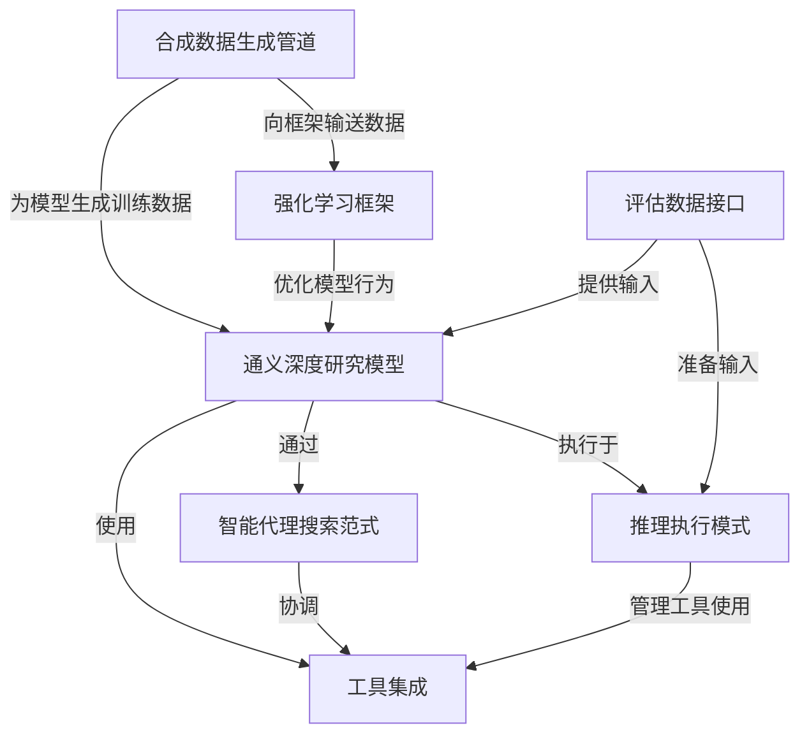
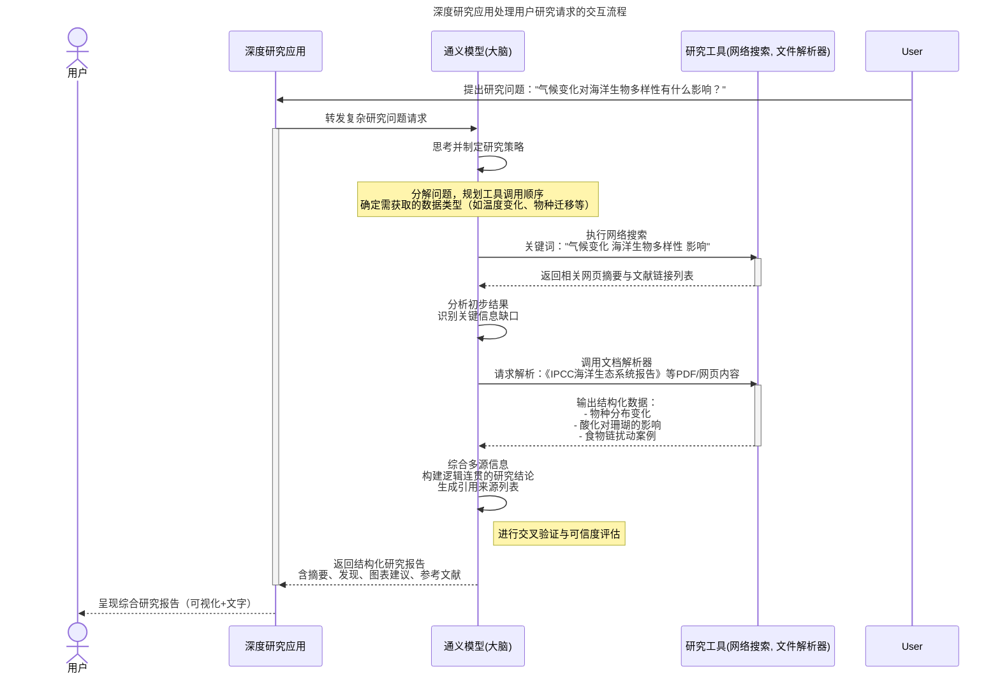

链接：[Tongyi DeepResearch: A New Era of Open-Source AI Researchers | Tongyi DeepResearch](https://tongyi-agent.github.io/blog/introducing-tongyi-deep-research/)

# docs：Tongyi DeepResearch Model

围绕**通义深度研究模型**构建，这是一个拥有305亿参数的复杂大型语言模型，专为*复杂、长期的信息检索任务*而设计。

该系统采用*智能代理搜索范式*运行，能够智能执行操作、观察结果并做出决策以开展研究。

该模型*利用多种外部工具*（如网络搜索和文件解析器）收集信息，并通过*全自动合成数据生成`管道`*和*`强化学习框架`*持续训练和改进。

## 可视化



## 章节内容

1. [通义深度研究模型](01_tongyi_deepresearch_model_.md)
2. [智能代理搜索范式](02_agentic_search_paradigm_.md)
3. [工具集成](03_tool_integration_.md)
4. [推理执行模式](04_inference_execution_modes_.md)
5. [评估数据接口](05_evaluation_data_interface_.md)
6. [合成数据生成管道](06_synthetic_data_generation_pipeline_.md)
7. [强化学习框架](07_reinforcement_learning_framework_.md)

相关前文传送：

[[GLM-4.5] GLM-4.5模型 | Claude Code服务集成](https://lvynote.blog.csdn.net/article/details/150469083)

[[GLM-4.5] LLM推理服务器(SGLang/vLLM) | 工具与推理解析器](https://blog.csdn.net/2301_80171004/article/details/150469687?spm=1001.2101.3001.10796)

---

# 第1章：通义深度研究模型

欢迎来到深度研究的世界

在第一章中，我们将认识本项目的核心——**通义深度研究模型**。

这个模型就像是整个深度研究项目的"超级大脑"。

## 它解决什么问题？

想象你需要回答一个复杂且需要深入挖掘的问题

例如："气候变化对海洋生物多样性的长期影响是什么？全球正在开发的最有前景的缓解策略有哪些？"

> 回答这个问题不仅需要==查找==一个事实，还需要==阅读==大量资料、==理解==不同观点并==整合==信息形成全面答案。

传统搜索引擎只能提供链接列表，普通AI模型可能基于训练数据给出快速回答

但如果我们需要一个能像专业研究员那样*主动研究*主题的AI呢？

这正是通义深度研究模型要解决的问题。它专为**"长期、深度信息检索"**任务设计——擅长在多步骤研究中探索主题，深入挖掘以获取全面答案。

## 认识这个"大脑"：通义深度研究模型

通义深度研究模型本质上是一个强大的**大语言模型(LLM)**。

如果你听说过ChatGPT这类AI，就知道LLM==通过海量文本训练来理解和生成类人语言==。

关于这个模型的关键信息：

*   **规模优势**：拥有惊人的**305亿参数**。简单来说，"参数"就像大脑中的神经连接，参数越多通常意味着模型能力越强、知识越丰富。这种规模使其能够理解复杂主题并生成精细回答。
*   **研究专用**：与通用LLM不同，这个模型专为研究任务设计。可以把它想象成一位高度专业化、非常聪明的图书管理员，不仅回答问题，还会主动*研究*主题。这位管理员会使用各种资源（后续章节会介绍）寻找全面详细的答案，而非仅提供表面回答。
*   **核心智能**：该模型是整个深度研究项目的大脑、决策者和战略家。当你向深度研究系统提问时，正是通义深度研究模型在协调整个信息查找与整合过程。

## 它如何工作？（简化版）

用"聪明图书管理员"的比喻来说明：

1.  管理员（通义深度研究模型）首先彻底理解你的请求
2.  然后规划如何查找信息："我先查这个数据库，再看最新科研论文，然后与新闻报道交叉验证"
3.  使用各种工具（如网络搜索、文档分析或计算工具——详见第3章[工具集成](03_tool_integration_.md)）收集事实
4.  收集信息时持续跟踪所学内容，必要时调整计划
5.  最后整合所有信息，逻辑化组织后呈现详细、深入研究的答案

## 模型应用（高层次）

虽然本教程不会用复杂Python代码*构建*模型，但你会通过告诉深度研究系统*使用哪个模型*和*研究什么问题*来与之交互。

项目提供了运行通义深度研究模型的方式。本质上你需要将深度研究应用"指向"模型"大脑"的存储位置。

在项目设置中，你会看到配置使用哪个模型的脚本。这就是告诉深度研究系统使用通义深度研究模型的地方：

```bash
# 来自run_react_infer.sh或类似配置的片段
# MODEL_PATH - 本地或远程模型权重的路径
# 这个变量告诉系统在哪里找到通义深度研究模型
MODEL_PATH="Alibaba-NLP/Tongyi-DeepResearch-30B-A3B"

# DATASET - 评估问题的路径
DATASET="eval_data/example.jsonl"

# OUTPUT_PATH - 模型回答的保存位置
OUTPUT_PATH="./outputs"

# 运行推理脚本时，它将使用MODEL_PATH指定的模型
# 回答来自DATASET的问题
bash run_react_infer.sh
```

在这个例子中，`MODEL_PATH="Alibaba-NLP/Tongyi-DeepResearch-30B-A3B"`是关键行。

它表示你告诉深度研究应用加载并使用*我们的*通义深度研究模型。`Alibaba-NLP/Tongyi-DeepResearch-30B-A3B`是指向模型"大脑"（其305亿参数）存储位置的特殊标识符，通常来自HuggingFace或ModelScope等平台，如项目`README.md`所述。

配置完成后，当运行`run_react_infer.sh`脚本时，深度研究应用将使用通义深度研究模型处理`example.jsonl`数据集中的问题，并将其详细回答保存到指定的`outputs`文件夹。

## 内部机制：深度研究流程

让我们可视化当你提出问题时通义深度研究模型处理的基本交互。

这个图表展示了"大脑"（我们的模型）如何成为研究过程的中心：



在这个简化流程中，通义深度研究模型（我们的"大脑"）接收问题后充当核心协调者。

它决定*需要什么*信息、*使用哪些*工具获取信息，以及*如何*将所有内容组合成连贯详细的答案。

## 总结

本章介绍了通义深度研究模型，这是我们项目的核心智能。

我们了解到它是一个拥有305亿参数的强大语言模型，专为深度、长期的信息检索任务设计。它就像一个非常聪明的研究图书管理员，协调整个信息查找和整合过程，全面回答复杂问题。

也初步了解了这个模型如何通过`MODEL_PATH`变量在深度研究项目中引用。理解这个==模型作为核心"大脑"对我们探索它如何与其他组件交互至关重要==。

接下来，我们将深入探讨这个强大模型如何以代理式思维方式*思考*和决策以执行研究任务。准备好探索[智能代理搜索范式](02_agentic_search_paradigm_.md)吧！

