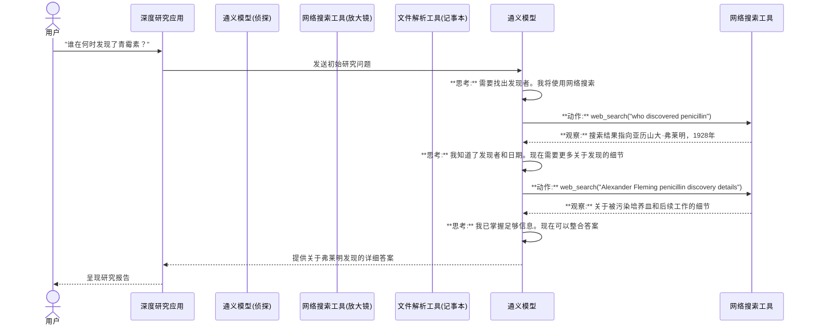

# 第2章：智能代理搜索范式

欢迎回来

在[第1章：通义深度研究模型](01_tongyi_deepresearch_model_.md)中，我们认识了项目的"大脑"——通义深度研究模型。我们知道它是一个专为解决复杂研究问题而设计的超级智能LLM。但这个大脑究竟*如何*工作？它如何从一个问题出发，经过深入挖掘和多步骤处理，最终给出详细答案？

这就是**==智能代理搜索范式==**的用武之地。可以把它看作是我们模型*思考*和*行动*以开展研究的详细操作手册。正是这个"运行框架"将我们聪明的大脑变成了==主动的调查员==。

## 智能代理搜索范式解决什么问题？

假设我们想知道："青霉素发现过程中的关键事件有哪些？主要参与者是谁？"

如果只是用传统搜索引擎输入这个问题，我们会得到一系列链接。作为人类，我们需要点击、阅读、整合不同页面的信息并综合答案。这是被动搜索。

深度研究解决的问题就是为我们完成所有这些*主动调查*工作。它需要能够：
1. 理解问题
2. 将其分解为更小的研究步骤
3. 决定使用哪种工具（如网络搜索、阅读文档）
4. 执行该工具
5. 观察结果
6. 根据最新发现决定*下一步*做什么
7. 持续进行直到问题得到全面解答

这种多步骤、自适应的过程正是智能代理搜索范式所实现的。

## 认识代理：我们的数字侦探

智能代理搜索范式的核心理念是深度研究模型就像一个**"代理"**。在这个上下文中，代理是什么？

**代理**就像一个聪明的侦探在破案：
*   **目标导向**：有主要目标（回答研究问题）
*   **自主性**：独立工作，自行决定下一步做什么
*   **感知**："观察"世界（如阅读搜索结果、从文件中提取信息）
*   **行动**：在世界上"执行动作"（如网络搜索、解析文档）
*   **适应**：根据观察到的新信息调整计划

因此，深度研究模型不仅仅是简单地一次性生成文本，而是转变为这个数字侦探，系统地调查我们的问题。

## 侦探的方法：行动、观察和决策

我们的数字侦探（[通义深度研究模型](01_tongyi_deepresearch_model_.md)）遵循一个持续的循环：

1.  **决策（思考）**：代理首先*思考*当前情况和总体目标。决定下一步需要什么信息，什么行动最有帮助。这是我们305亿参数模型强大推理能力的体现。
2.  **行动（执行）**：基于决策，代理执行特定的"动作"。可能是使用搜索引擎、阅读文件或运行计算。这些动作通过专门的[工具](03_tool_integration_.md)执行（下一章将详细介绍）。
3.  **观察（查看）**：执行动作后，代理从环境中获得"观察"结果。这是其行动的结果——可能是搜索结果列表、文档内容或计算答案。

这个"==决策->行动->观察=="循环不断重复，直到代理确定已收集足够信息来全面回答问题。

## 工具：侦探的装备

就像侦探使用放大镜、指纹工具或记事本一样，我们的深度研究代理使用各种**工具**来执行动作。

这些工具让它能够与"环境"互动——即互联网和本地文件中的海量信息。

工具示例包括：
*   **网络搜索**：在互联网上查找信息
*   **文件解析器**：读取和理解本地存储的文档
*   **计算器**：执行数学运算

智能代理搜索范式高度依赖这些工具，因为它们扩展了LLM的能力，使其不仅限于从训练数据生成文本，还能收集*新的、最新的*信息。我们将在第3章[工具集成](03_tool_integration_.md)中深入探讨。

## 自主导航信息

这个范式的关键优势之一是**自主导航**。这意味着由[通义深度研究模型](01_tongyi_deepresearch_model_.md)驱动的代理在收到初始复杂问题后，不需要持续的人类指导。它能够：
*   将复杂问题==分解==为更小、可管理的步骤
*   探索不同的信息来源
*   根据发现即时==调整==策略
*   持续进行直到达成目标（全面答案）

这使得深度研究在"长期、深度信息检索"任务中极其强大，因为简单的单次搜索远远不够。

## 深度研究实战：青霉素案例

让我们回到问题："青霉素发现过程中的关键事件有哪些？主要参与者是谁？"

以下是深度研究代理在智能代理搜索范式支持下可能采取的简化步骤：

1.  **初始决策**：代理思考"我需要了解青霉素的发现。首先应该找出发现者"
2.  **行动**：使用`web_search`工具查询"who discovered penicillin"
3.  **观察**：搜索结果指向亚历山大·弗莱明和1928年
4.  **第二决策**："好的，亚历山大·弗莱明。现在需要关键事件。应该查找更详细的发现概述"
5.  **行动**：再次使用`web_search`，查询"Alexander Fleming penicillin discovery timeline"
6.  **观察**：找到维基百科页面或科学文章，详细描述事件，包括被污染的培养皿、初步观察以及后来钱恩和弗洛里的开发
7.  **第三决策**："我知道了发现者和主要事件。现在应该确定参与开发的其他主要人物"
8.  **行动**：如果有关于抗生素历史的本地文档，使用`file_parser`工具，或者再次`web_search`查询"development of penicillin after Fleming"
9.  **观察**：识别出霍华德·弗洛里和恩斯特·钱恩
10. **最终决策**："我已掌握所有主要人物和关键事件。现在可以整合这些信息形成全面答案"
11. **行动**：代理内部构建最终答案

这种==多步骤、迭代==的过程正是智能代理搜索的标志。

## 内部机制：代理的内心独白

智能代理搜索范式通常通过"ReAct"（推理和行动）技术实现。这意味着模型生成其"思考"（决策）和"动作"（工具调用）作为输出的一部分，与"观察"（工具结果）交替进行。

以下是模型内部思考过程的示意：



在深度研究项目中，当我们运行如`run_react_infer.sh`这样的推理脚本时（如[第1章](01_tongyi_deepresearch_model_.md)所示），通义深度研究模型就是在执行这种=="ReAct"风格==的代理推理。

本质上，它在内部生成这些`思考`、`动作`和`观察`步骤以达到目标。

以下是代理内部思考过程和动作的概念性示例（非实际代码，但说明了模式）：

```python
# 这是代理内部思考过程的概念性示例
# 通义深度研究模型生成这些步骤

# 当前研究目标："谁在何时发现了青霉素？"

# 步骤1
print("思考: 我需要找出青霉素的发现者。我将使用网络搜索工具")
# 模型然后生成一个动作:
action = "web_search(query='who discovered penicillin')"
print(f"动作: {action}")
# 工具运行后返回一个观察:
observation = "[搜索结果指出亚历山大·弗莱明在1928年发现了青霉素]"
print(f"观察: {observation}\n")

# 步骤2
print("思考: 我知道了发现者和日期。应该确认并增加答案的上下文")
action = "web_search(query='details of Alexander Fleming penicillin discovery')"
print(f"动作: {action}")
observation = "[搜索结果提供了关于霉菌、葡萄球菌以及钱恩和弗洛里后续工作的细节]"
print(f"观察: {observation}\n")

# 步骤3
print("思考: 我已收集足够信息。现在可以形成全面答案")
action = "finish(answer='亚历山大·弗莱明在1928年观察到霉菌污染培养皿时发现了青霉素。他的工作后来由霍华德·弗洛里和恩斯特·钱恩扩展')"
print(f"动作: {action}")
print("观察: 任务完成")
```

在这个概念性流程中，`通义深度研究模型`是基于先前收到的`观察`生成`思考`和`动作`行的部分。它不断调整计划，直到能够生成带有答案的最终`finish`动作。

## 传统搜索 vs. 智能代理搜索

快速比较两种范式：

| 特性       | 传统搜索(如Google)        | 智能代理搜索(深度研究)       |
| :--------- | :------------------------ | :--------------------------- |
| **交互**   | 被动：提问，提供链接/片段 | 主动：为你执行多步骤研究     |
| **目标**   | 提供相关文档/答案         | 实现复杂的多步骤研究目标     |
| **过程**   | 单次查询，单次结果集      | ==决策-动作-观察的迭代循环== |
| **智能**   | 关键词匹配，排名          | 推理、规划、工具使用、适应   |
| **复杂度** | 适合简单的事实查询        | 适合复杂的多层面研究任务     |
| **输出**   | 链接列表，简短答案        | 详细、综合的研究报告         |

智能代理搜索范式将深度研究从简单的问答系统提升为强大的自主研究助手。

## 总结

在本章中，我们探索了**智能代理搜索范式**，它定义了深度研究模型——我们的数字大脑——实际*运作*的方式。我们了解到它就像一个侦探，使用`决策`、`动作`（由[工具](03_tool_integration_.md)驱动）和`观察`的持续循环，自主导航信息空间，回答复杂的多步骤研究问题

这种主动、智能的方法正是深度研究在深度信息检索任务中如此高效的原因。

接下来，我们将深入了解数字侦探用来执行`动作`的具体"装备"：[工具集成](03_tool_integration_.md)。

