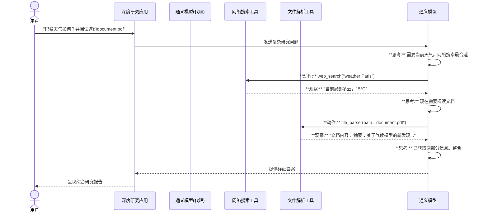

# 第3章：工具集成

欢迎回来

在[第1章：通义深度研究模型](01_tongyi_deepresearch_model_.md)中，我们认识了项目的"大脑"——超级智能的通义深度研究模型。接着在[第2章：智能代理搜索范式](02_agentic_search_paradigm_.md)中，我们学习了这个大脑如何像数字侦探一样工作，遵循"==决策-动作-观察=="循环来解决复杂问题。

现在想象我们的数字侦探接到了一个案件，但它需要特殊装备来收集线索——比如观察细节的放大镜、导航用的地图，或是打开加密信息的工具包。

这就是**工具集成**的用武之地,它旨在为我们的智能代理提供正确的"装备"，使其能够与自身==知识库之外的现实世界互动==。

## 工具集成解决什么问题？

我们的通义深度研究模型非常聪明且知识渊博，因为它基于海量文本训练。但即使最聪明的大脑也有局限：

1. **信息过时**：它的知识基于最后一次训练时的数据。不知道昨天的新闻、当前股价或最新科学发现。
2. **缺乏特定动作**：它能生成文本，但不能*执行*诸如浏览网页、复杂计算或读取刚上传的PDF文档等操作。
3. **无法与现实世界互动**：除非提供连接外部系统的方式，否则它生活在数字真空中。

**用例示例**：深度研究如何查找巴黎*当前*天气，或阅读上周发表的特定PDF研究论文？它的内部训练数据不会有这些信息。

这正是**工具集成**要解决的问题。它为深度研究代理==提供外部功能，使其能够执行需要最新信息或特定现实世界动作的任务==。

## 什么是工具？（代理的瑞士军刀）

将**工具**视为深度研究代理的专用扩展或插件。它们就像是代理的**瑞士军刀**，每项功能都针对特定用途设计：

* **网络搜索**：在互联网上查找最新信息（如"巴黎当前天气"）
* **计算器**：精确执行数学运算（如"345,678的15%是多少？"）
* **文件解析器**：读取并提取本地文档中的信息（如PDF研究论文）
* **API集成**：连接特定在线服务（目前我们先简化处理）

这些工具使代理不仅能回忆记忆中的信息，还能主动*交互*现实世界。

## 工具为何如此重要？

工具至关重要，因为它们：

1. **提供新鲜信息**：让代理直接从源头获取实时最新数据（如搜索引擎获取当前事件）
2. **实现复杂动作**：使代理能执行纯语言模型无法完成的操作（如复杂数学运算、读取特定文件）
3. **提高准确性和可靠性**：通过专用工具，代理能从可靠来源获取事实答案，而非仅依赖可能过时的内部知识
4. **扩展能力**：将代理从单纯的"讲述者"转变为"执行者"，使其成为更强大、多用途的研究助手

## 代理如何使用工具？（决策过程）

最神奇的部分在于，我们的[通义深度研究模型](01_tongyi_deepresearch_model_.md)（大脑）不仅*拥有*这些工具，还能智能决定*何时*使用*哪个*工具。这种决策是我们在[智能代理搜索范式](02_agentic_search_paradigm_.md)章节讨论的"决策->动作->观察"循环的一部分。

面对问题时，代理的内部思考过程可能是这样的：

1. **思考**："要回答这个问题，我需要训练数据中没有的信息，或者需要执行特定动作"
2. **决策**："哪个工具最适合这个任务？"
3. **动作**："我将调用`web_search`工具执行特定查询"
4. **观察**："这是`web_search`工具返回的结果"
5. **下一步思考**："基于这些结果，我接下来该做什么？"

## 在深度研究中设置工具（解决用例）

深度研究项目使得启用和配置这些工具非常简单。通常通过编辑`run_react_infer.sh`等配置脚本来实现，该脚本告诉深度研究系统有哪些可用工具以及如何访问它们。

我们来看看如何启用网络搜索工具并准备文件解析器，使用`run_react_infer.sh`脚本中的片段（如`README.md`和[第1章](01_tongyi_deepresearch_model_.md)所述）。

```bash
# --- 网络搜索工具配置 ---
# 要启用网络搜索，通常需要从搜索提供商处获取API密钥
# 这个密钥允许深度研究代理与搜索引擎"对话"
# 如果WEB_SEARCH_API_KEY为空，则不会使用网络搜索工具
export WEB_SEARCH_API_KEY="YOUR_GOOGLE_SEARCH_API_KEY_HERE"
export WEB_SEARCH_ENGINE_ID="YOUR_GOOGLE_SEARCH_ENGINE_ID_HERE"

# --- 文件解析器工具配置 ---
# 文件解析器允许代理读取本地文档
# 通常不需要API密钥，但需要启用
export FILE_PARSER_ENABLED="True"

# 其他工具可能有类似设置
# ...（其他脚本配置）...

# 运行推理脚本时，它将使用模型和启用的工具：
bash run_react_infer.sh
```

**说明**：

* `WEB_SEARCH_API_KEY`和`WEB_SEARCH_ENGINE_ID`：这些行对网络搜索工具至关重要。`YOUR_GOOGLE_SEARCH_API_KEY_HERE`是一个占位符，应替换为从Google自定义搜索API等服务获得的真实密钥。这个密钥就像密码，授予深度研究执行搜索的权限。没有它，代理无法使用网络搜索工具。
* `FILE_PARSER_ENABLED="True"`：这简单地"打开"文件解析器工具。如果是`"False"`，代理将无法读取本地文件。

通过设置这些环境变量，你实际上是在给深度研究代理递上网络搜索"放大镜"，并告诉它"文件阅读笔记本"已备好。

## 内部机制：工具使用流程

当你提出需要工具的问题时，以下是简化的执行顺序：



**流程说明**：

1. `用户`提出需要外部信息和动作的问题
2. `深度研究应用`将其发送给`通义模型`
3. `通义模型`*思考*（作为[智能代理搜索范式](02_agentic_search_paradigm_.md)的一部分）。它意识到需要当前天气，于是决定使用`网络搜索工具`
4. `通义模型`然后以特定格式生成一个`动作`（如`web_search(query="weather Paris")`）
5. `深度研究应用`（协调工具的部分）看到这个`动作`，实际调用`网络搜索工具`查询"weather Paris"
6. `网络搜索工具`执行搜索并返回`观察`结果（搜索结果/当前天气）给`通义模型`
7. `通义模型`处理这个`观察`。再次思考后决定下一个`动作`是使用`文件解析工具`读取"document.pdf"
8. 这个循环持续进行，直到`通义模型`收集到所有必要信息并决定可以提供全面答案

关键在于`通义模型`充当导演角色，在研究过程的每一步选择使用瑞士军刀中的哪个"工具"。

## 常见深度研究工具

以下是深度研究（及类似代理系统）可以集成的常见工具类型：

| 工具类型       | 功能描述                    | 用例示例                       | 需要配置      |
| :------------- | :-------------------------- | :----------------------------- | :------------ |
| **网络搜索**   | 访问互联网查找最新信息      | "昨天新闻的头条是什么？"       | API密钥       |
| **计算器**     | 执行精确数学计算            | "计算587的平方根，然后乘以23"  | 无需          |
| **文件解析器** | 读取并提取本地文档内容      | "总结'report.pdf'中的关键发现" | 启用/路径     |
| **数据库查询** | 与结构化数据库（如SQL）交互 | "查找上月订购产品X的所有客户"  | 连接详情      |
| **API调用器**  | 连接特定外部服务/API        | "获取AAPL的最新股价"           | API密钥，端点 |

如你所见，每种工具都提供独特功能，极大地扩展了深度研究代理的能力范围。

## 总结

在本章中，我们解锁了深度研究中**工具集成**的力量

我们了解到工具是外部功能——就像瑞士军刀——赋予[通义深度研究模型](01_tongyi_deepresearch_model_.md)==获取实时信息==、执行特定动作并与自身知识库之外的现实世界互动的能力。这使得我们的深度研究代理在回答复杂、最新的问题时异常灵活，因为它能智能地决定在[智能代理搜索范式](02_agentic_search_paradigm_.md)的"决策-动作-观察"循环中使用哪个工具。

你也看到了这些工具通常如何通过`run_react_infer.sh`等脚本中的简单设置来启用和配置，通常需要外部服务的API密钥。

接下来，我们将深入探讨深度研究代理实际运行其思考和行动过程的不同方式，探索各种**[推理执行模式](04_inference_execution_modes_.md)**。

