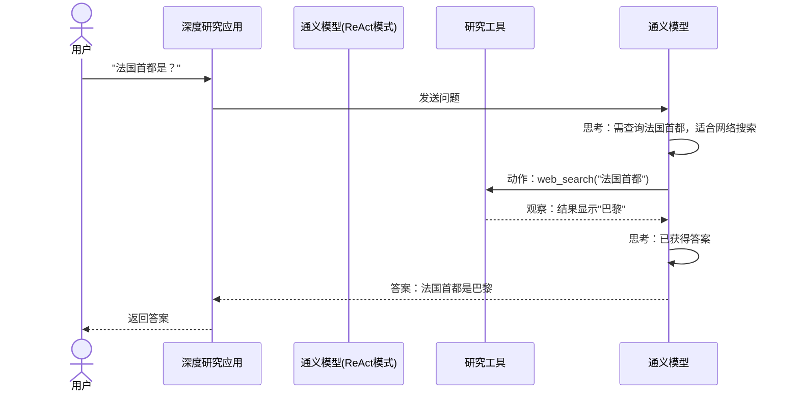

# 第4章：推理执行模式

欢迎回来

在[第1章：通义深度研究模型](01_tongyi_deepresearch_model_.md)中，我们认识了项目的"大脑"；

在[第2章：智能代理搜索范式](02_agentic_search_paradigm_.md)中，我们学习了这个大脑如何通过"决策-动作-观察"循环像数字侦探一样思考行动；

而在[第3章：工具集成](03_tool_integration_.md)中，我们看到了侦探如何获得它的专属装备。

现在想象一下：我们可以让这个超级智能侦探根据案件需求切换工作模式。有时需要它直接高效地运用核心能力，有时则需要它全力以赴，调动所有技巧给出最全面完美的答案——这就是**推理执行模式**的意义所在

它们是我们深度研究代理的不同"运行状态"。

## 推理执行模式解决什么问题？

将深度研究代理比作技艺精湛的大厨：

* **日常烹饪**：按熟悉食谱逐步操作，运用基础厨艺完成菜品。这对应代理的*原生能力*。
* **盛宴筹备**：需要规划多道精品菜肴，反复尝试调整确保每道菜完美。大厨会运用最深度的知识、创造性规划甚至尝试新技巧。这对应将代理推向*性能极限*。

推理执行模式让我们能==灵活选择代理在研究任务中投入的"思考强度"==：是逐步直接解决问题，还是采用更高级的资源密集型策略以获得最佳结果？

## 模式介绍：ReAct与Heavy

深度研究提供两种主要运行方式：

1. **ReAct模式**：代理的"逐步执行"基础方法
2. **基于IterResearch的'Heavy'模式**：代理的"极致性能"复杂策略

### 1. ReAct模式：标准食谱

**描述：**
ReAct模式是代理的基础运行方式，聚焦其原生能力。"ReAct"代表"推理(Reasoning)"和"行动(Acting)"，如[第2章](02_agentic_search_paradigm_.md)所述，代理持续循环：
- **思考**：推理下一步行动
- **动作**：执行操作（如使用[工具](03_tool_integration_.md)）
- **观察**：检查动作结果

**类比：** 如同大厨按标准食谱操作：思考（"需要切洋葱"）→ 行动（"切洋葱"）→ 观察（"洋葱已切好"）。这是高效直接的烹饪方式。

**适用场景：**
- 观察模型基础推理过程
- 快速获取中等复杂度问题的答案
- 评估模型核心智能（无需额外增强）

**工作原理：**
ReAct模式下，模型直接执行"思考→动作→观察"循环，对每个观察生成新的思考和动作。这是透明直接的问题解决方式。



**配置方式：**
使用`run_react_infer.sh`脚本（如[第1章](01_tongyi_deepresearch_model_.md)所述）即默认以ReAct模式运行：

```bash
# MODEL_PATH - 模型权重路径
MODEL_PATH="Alibaba-NLP/Tongyi-DeepResearch-30B-A3B"
# DATASET - 评估问题路径
DATASET="eval_data/example.jsonl"
# OUTPUT_PATH - 输出保存路径
OUTPUT_PATH="./outputs"
# 以ReAct范式执行任务
bash run_react_infer.sh
```

### 2. 基于IterResearch的'Heavy'模式：满汉全席

**描述：**
'Heavy'模式（基于IterResearch策略）是更复杂的高级方法，专为极其复杂的研究问题设计。这是"测试时扩展策略"，在研究过程中投入更多计算资源以确保最佳结果。

**类比：** 如同大厨筹备盛宴：设计多套菜单、尝试食材组合、准备备用方案、持续试味调整。需要更多资源但保证卓越成果。

**适用场景：**
- 关键任务或极其复杂的研究问题
- 需要深度推理、多路径探索和严格自修正
- 愿意投入更多计算资源换取峰值性能

**工作原理：**
相比ReAct的直接路径，'Heavy'模式可能：
- **多路径探索**：尝试多种推理路线
- **迭代优化**：生成初始答案后自我批评改进
- **高级规划**：制定长期研究路线图
- **自修正**：主动检测知识空白并填补

**配置方式：**
通常通过专用推理脚本（如`run_heavy_infer.sh`）或参数设置（如`INFERENCE_MODE="Heavy"`）启用。

## 模式对比

| 特性         | ReAct模式            | Heavy模式                    |
| :----------- | :------------------- | :--------------------------- |
| **方法**     | 直接逐步推理         | 复杂规划与迭代优化           |
| **目标**     | 评估核心能力         | 释放最大性能潜力             |
| **复杂度**   | 适合多数研究问题     | 专为复杂/关键问题设计        |
| **资源消耗** | 中等（高效顺序步骤） | 高（更多思考步骤与工具调用） |
| **输出质量** | 可靠的基础答案       | 全面彻底的最佳答案           |
| **透明度**   | 高（清晰的三步循环） | 较低（内部复杂子流程）       |

## 如何选择？

* **日常研究/快速问题**：使用**ReAct模式**，高效透明。
* **关键任务/突破性研究**：使用**Heavy模式**，调动全部智力资源。

## 总结

本章探讨了深度研究代理的两种**推理执行模式**：

> - **ReAct模式**：直接逐步方法，适合理解核心能力
> - **Heavy模式**：复杂高性能策略，应对极端挑战

理解这些模式后，我们可以根据研究需求在效率与性能间取得最佳平衡。

接下来我们将关注代理处理的问题数据，深入[评估数据接口](05_evaluation_data_interface_.md)。
