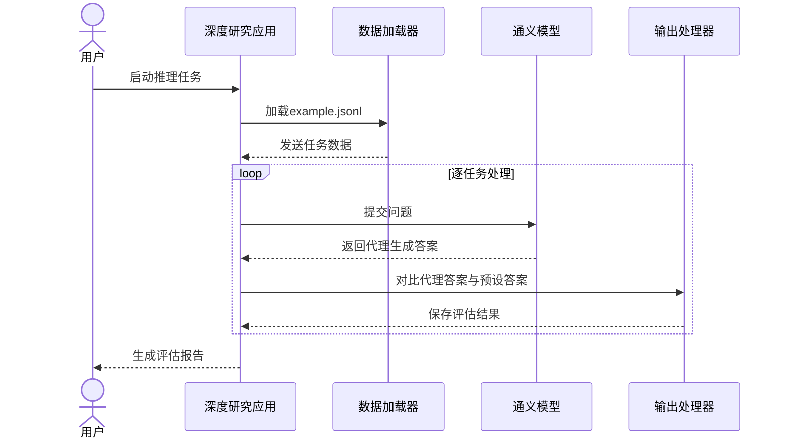

# 第5章：评估数据接口

欢迎回来

在前几章中，我们已经深入理解了深度研究系统的工作原理：从认识"大脑"（[第1章：通义深度研究模型](01_tongyi_deepresearch_model_.md)），到理解其"思考过程"（[第2章：智能代理搜索范式](02_agentic_search_paradigm_.md)），再到配备"工具装备"（[第3章：工具集成](03_tool_integration_.md)），最后探索不同"工作模式"（[第4章：推理执行模式](04_inference_execution_modes_.md)）。

现在想象我们拥有这个超级智能的研究代理，随时准备解答任何问题。

> 但如何向它**提出问题**？如果要==测试其表现==，系统如何知道**正确答案**应该是什么？

这正是**评估数据接口**的用武之地

## 评估数据接口解决什么问题？

类比说明：如果给人类助理布置复杂研究任务，我们不会含糊其辞，而是会清晰写下要求（可能采用标准化表格）。如果是测试题，可能还会在单独部分附上参考答案用于评分。

**评估数据接口**解决的问题是定义**标准化封装研究任务**的方式，确保：
1. 深度研究代理能**准确理解**研究需求
2. 深度研究系统能通过对比代理生成答案与预设答案来**评估性能**

**用例示例**：需要深度研究回答"谁发现了青霉素？"，已知答案为"亚历山大·弗莱明"。如何将问题与答案以系统可自动处理的形式提供？

## 标准格式：JSONL

==为确保代理能一致理解任务，我们采用称为**JSONL**的标准化数字表格==。

### 什么是JSONL？

JSONL即"JSON行"格式：
- 文件中每行是一个完整JSON对象
- 每个JSON对象代表一个任务或数据记录

本质上是以独立行组织的任务列表。

### 必填字段：`question`与`answer`

每个JSON对象必须包含两个关键信息：
- `"question"`：需要代理回答的研究问题
- `"answer"`：问题预期正确答案（用于评估代理表现）

**为何需要两者？**
即使仅用代理生成新研究，包含`answer`也有助于理解系统对该类问题的预期输出类型。在评估或训练时，系统使用`answer`字段评分代理表现。

## 如何创建评估数据文件

创建文本文件（通常命名为`example.jsonl`），每行包含一个研究问题及其预期答案，存放于项目`eval_data/`目录。

示例`eval_data/example.jsonl`内容：
```json
{"question": "谁在何时发现了青霉素？", "answer": "亚历山大·弗莱明于1928年发现。"}
{"question": "法国首都是？", "answer": "巴黎。"}
{"question": "列出气候变化对海洋生态系统的三项长期影响", "answer": "海洋酸化、海平面上升和珊瑚白化。"}
```
**说明：**
- 每行是自包含的研究任务
- `question`明确表述研究需求
- `answer`提供用于核对代理输出的正确答案

## 指定数据路径

创建文件后，需在`run_react_infer.sh`脚本中配置`DATASET`变量指向该文件：
```bash
# DATASET - 评估问题路径（如'eval_data/example.jsonl'）
DATASET="eval_data/example.jsonl"
# ...其他配置...
bash run_react_infer.sh
```
**说明：**
通过`DATASET="eval_data/example.jsonl"`配置，我们告知深度研究应用："本次运行请使用`eval_data`目录下`example.jsonl`定义的问题与答案。"

## 特例：文件解析工具

回忆[第3章工具集成](03_tool_integration_.md)，若问题需代理使用`file_parser`工具读取本地文件，需对`question`字段进行特殊格式化：
- 在`question`字段**前置文件名**
- 实际文件（如`my_research_paper.pdf`）必须置于`eval_data/file_corpus/`目录

示例`example.jsonl`格式：
```json
{"question": "my_research_paper.pdf: 总结可再生能源关键发现", "answer": "论文强调太阳能与风能日益具备成本效益，对全球能源转型至关重要。"}
{"question": "《银河系漫游指南》作者是谁？", "answer": "道格拉斯·亚当斯。"}
```
**说明：**
- 首行指示代理："先在`eval_data/file_corpus/`查找`my_research_paper.pdf`，然后执行文档内容总结"
- 次行为常规网络搜索或内部知识问题

这种设计让代理能通过`question`字段格式自动触发`file_parser`工具并定位目标文件。

## 底层处理流程

运行深度研究系统时，数据处理的简化流程如下：



**流程说明：**
1. **用户启动**：指定`example.jsonl`文件路径
2. **数据加载**：应用内`数据加载器`逐行读取JSONL文件
3. **任务处理**：
   - 提取`question`提交给`通义模型`
   - 代理根据[第2章](02_agentic_search_paradigm_.md)和[第4章](04_inference_execution_modes_.md)方法进行研究（可能使用[第3章](03_tool_integration_.md)工具）
   - 生成`agent_generated_answer`后返回应用
   - `输出处理器`对比代理答案与预设`answer`进行评分
   - 结果保存至`OUTPUT_PATH`指定目录
4. **报告生成**：处理完所有任务后输出汇总评估报告

## 本章总结

本章探讨了**评估数据接口**——向深度研究代理提供研究任务及预期答案的标准方式。我们学习了：
- 采用**JSONL格式**，每行包含`question`与`answer`
- 创建评估文件`example.jsonl`的方法
- 配置文件路径的特殊处理
- 集成`file_parser`工具时的文件名前置规范

理解此接口对任务部署与代理能力评估至关重要。接下来我们将探索更激动人心的主题：[合成数据生成流水线](06_synthetic_data_generation_pipeline_.md)。

