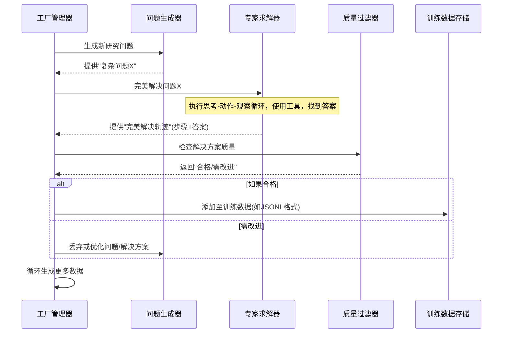

# 第6章：合成数据生成流水线

欢迎回来

在[第5章：评估数据接口](05_evaluation_data_interface_.md)中，我们学习了如何以标准化方式向深度研究代理提供**现有**研究任务（问题与答案）。这对于测试和评估代理非常有用。但如果我们需要**海量**高质量的新研究任务来**训练**这个超级智能代理呢？人工创建成千上万条数据将是不可能完成的任务

这正是**合成数据生成流水线**的用武之地。

## 合成数据生成流水线解决什么问题？

想象训练职业运动队时，运动员需要无数练习场景来提升水平。人类教练不可能亲自设计每个训练动作、完美演示并记录所有标准步骤——这过程将耗费巨大成本！

训练[Tongyi深度研究模型](01_tongyi_deepresearch_model_.md)同样面临这个挑战。要成为真正强大的研究代理，它需要练习：
- 理解复杂问题
- 拆解问题步骤
- 选择使用哪些[工具](03_tool_integration_.md)（如网络搜索或文件解析）
- 执行工具操作
- 从观察中学习
- 最终合成完整答案

所有这些"练习场景"（包括[智能搜索范式](02_agentic_search_paradigm_.md)描述的完美`思考`、`动作`、`观察`序列）极难通过人工创建。

**合成数据生成流水线**通过自动化"数据工厂"解决这个问题。这个智能系统能持续生成真实、多样且高质量的训练数据，无需人工编写每个示例。

## 自动化数据工厂：什么是合成数据？

将这条流水线视为为深度研究代理生产练习场景的高效自动化工厂：

- **合成数据**："合成"意味着由系统生成而非直接来自真实人类交互。本流水线能创建完整研究任务，包括问题、最优分步解决方案及最终答案。
- **学习工厂**：这个工厂不生产实体产品，而是生产数字课程。这些课程教导[Tongyi深度研究模型](01_tongyi_deepresearch_model_.md)如何成为更优秀的研究者。

DeepResearch的`README.md`将其列为关键特性："⚙️ **全自动合成数据生成流水线**：我们设计了高度可扩展的数据合成流水线，完全自动化支持代理预训练、监督微调和强化学习。"

## 为何该流水线对DeepResearch至关重要？

这个自动化数据工厂是项目成功的关键，因为它能实现：

1. **海量规模**：可生成数百万训练样本，远超人工能力。大规模数据对有效训练复杂模型至关重要。
2. **高质量与多样性**：设计的示例不仅真实，还覆盖广泛主题、难度和工具使用场景，帮助代理学习处理各类研究问题。
3. **高效训练**：通过持续提供高质量数据流，确保模型能高效训练并随时间推移变得更智能、更鲁棒。
4. **针对性学习**：可为不同训练阶段生成专用数据：
   - **预训练**：教授通用知识和基础推理能力
   - **监督微调(SFT)**：精调代理行为使其紧密遵循专家示例，特别是工具使用和研究结构
   - **强化学习(RL)**：提供复杂挑战让代理通过试错学习优化策略（详见[第7章：强化学习框架](07_reinforcement_learning_framework_.md)）

本质上，该流水线是通过持续提供最佳学习材料保持DeepResearch领先地位的引擎。

## 数据工厂工作原理（简化版）

以下是该合成数据工厂核心步骤的简化流程：

**自动化数据工厂流程说明：**

1. **工厂管理器**：流程协调者，启动整个生产过程
2. **问题生成器**：负责创造新颖、多样且具挑战性的研究问题或场景，可能是另一个专门训练用于生成问题的AI模型
3. **专家求解器**：核心组件，通常由高性能AI模型（可能是早期训练完善的DeepResearch版本或其他强大LLM）担任"完美研究代理"。它接收"复杂问题X"并真实尝试解决，生成包含每个`思考`、`动作`（使用[工具](03_tool_integration_.md)）、`观察`及最终合成`答案`的"完美解决轨迹"——这些轨迹成为训练DeepResearch模型的"教师笔记"
4. **质量过滤器**：在存储前审查生成方案。问题是否清晰？解决方案是否逻辑合理？工具调用是否正确有效？最终答案是否准确全面？质量不达标的数据会被丢弃或标记优化
5. **训练数据存储**：通过质量检查后，"复杂问题X"及其"完美解决轨迹"被格式化（如转为[第5章](05_evaluation_data_interface_.md)所述`JSONL`格式）并加入海量数据集，用于训练[Tongyi深度研究模型](01_tongyi_deepresearch_model_.md)

该循环持续运行，为DeepResearch生成无穷尽的高价值学习材料。

## 对DeepResearch训练阶段的影响

合成数据流水线赋能所有关键训练阶段：

| 训练阶段     | 合成数据的作用                                               | 示例数据内容（概念）                                       |
| :----------- | :----------------------------------------------------------- | :--------------------------------------------------------- |
| **预训练**   | 提供广泛通用的研究交互，让模型理解信息寻求的流程             | 数百万条(问题, 思考-动作-观察序列, 答案)                   |
| **监督微调** | 提供正确推理和工具使用的明确高质量示例，引导模型学习专家行为 | "给定X，应使用工具Z搜索Y获得观察A"的示范                   |
| **强化学习** | 创建多样化"环境"和任务供代理探索，从成功/失败中学习并优化策略 | 存在多路径的复杂任务，代理学习能获得最高奖励的最优动作序列 |

该流水线是实现[Tongyi深度研究模型](01_tongyi_deepresearch_model_.md)"长视野深度信息寻求"任务高效处理的核心策略。

## 本章总结

本章探讨了**合成数据生成流水线**——作为自动化"数据工厂"，它为深度研究模型创造海量训练数据。我们了解到该流水线通过为预训练、监督微调和强化学习生成高质量多样化练习场景，使代理无需依赖人工数据创建就能获得强大能力。它是持续精炼和增强深度研究代理智能的隐形引擎。

接下来我们将深入探讨最能体现该流水线价值的先进训练方法：[强化学习框架](07_reinforcement_learning_framework_.md)。

