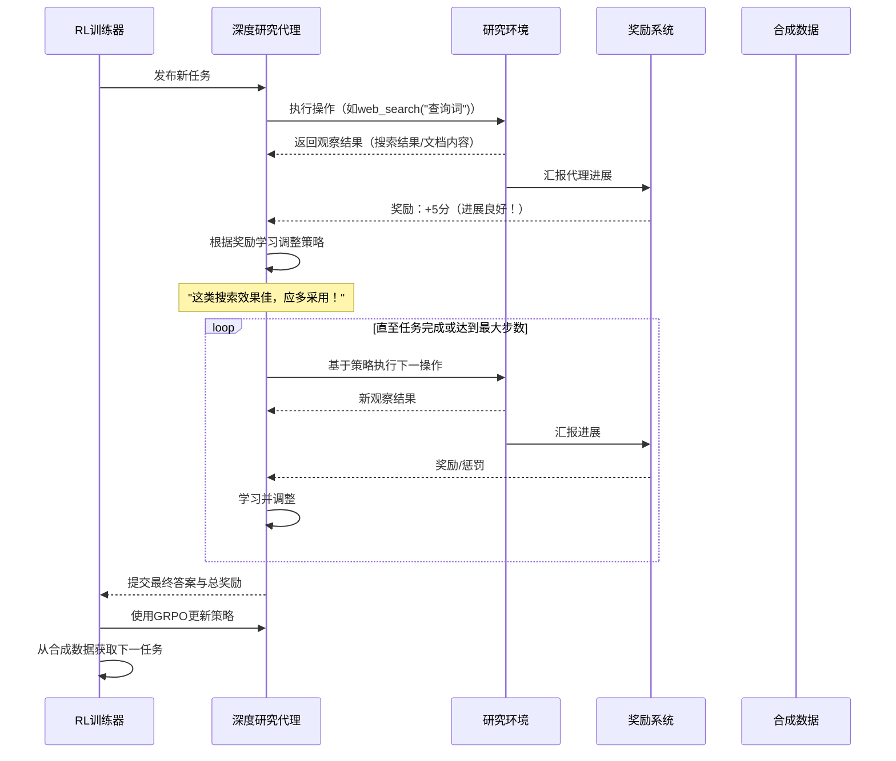

# 第7章：强化学习框架

欢迎回来

在之前的探索中，我们认识了"大脑"（[第1章：通义深度研究模型](01_tongyi_deepresearch_model_.md)），理解了其"思考过程"（[第2章：智能代理搜索范式](02_agentic_search_paradigm_.md)），配备了"工具装备"（[第3章：工具集成](03_tool_integration_.md)），甚至学会了如何分配任务（[第5章：评估数据接口](05_evaluation_data_interface_.md)）以及**自动生成**这些任务（[第6章：合成数据生成流水线](06_synthetic_data_generation_pipeline_.md)）。

现在想象我们拥有一位天赋异禀的学生（深度研究代理），他已通过教材（预训练）和观察专家（监督微调）学习了许多知识。

> 但要真正达到巅峰，他需要通过实践、尝试、犯错并从经验中学习——这正是**强化学习框架**的舞台

## 强化学习框架解决什么问题？

将深度研究代理比作学习复杂策略游戏（如国际象棋或大型研究项目）的学生：
- **教材学习**：学生了解规则和基础操作（预训练）
- **专家模仿**：观摩过许多专家对局并能复现优秀操作（监督微调）

但要成为**大师**，还需要：
1. **探索**：尝试不同策略（包括非常规方法）
2. **观察结果**：分析每个操作后的局面变化
3. **获得反馈**：得到"得分"或"奖励"——该操作对获胜有帮助还是失误？
4. **调整**：根据反馈优化策略，逐渐掌握最佳方法

深度研究面临相似挑战：代理如何学习针对复杂多步研究任务的**最优策略**？特别是当不存在单一明确"正确"路径时，如何掌握在不同情境下**何时**以及**如何**最有效地执行长序列操作？

**强化学习（RL）框架**通过==试错反馈机制==系统性地解决这个问题，使代理能发现深度信息寻求任务的最佳长期策略。

## 核心理念：奖励驱动学习（教练与学员模式）

强化学习的本质是**代理**（深度研究模型）学习在**环境**（研究任务与可用工具）中做出一系列**决策**（如选择`网络搜索`或`文件解析`），以最大化数值化的**奖励**信号。

类比教练（RL框架）与学员（深度研究代理）的互动：
1. **布置任务**："研究AI对未来十年医学的影响"
2. **尝试操作**：代理决定`网络搜索`"AI医学进展"
3. **观察结果**：获得搜索返回内容
4. **获得反馈**：
   - 搜索结果高度相关且推动研究：获得正向"奖励"（如鼓励）
   - 结果无关或无效：获得"惩罚"（如负面评价）
5. **学习调整**：通过大量此类互动，学员逐渐掌握在何种情境下采取何种操作能获得更高奖励和更好研究结果

深度研究代理的终极目标是学习能在整个研究任务中获得最高总奖励的**最优策略**（称为**策略**），即找到最高效、准确且全面的问题解答方法。

## 深度研究的专属训练法：组相对策略优化

项目采用称为**组相对策略优化（GRPO）**的高级定制技术。`README.md`描述为："我们采用严格在策略的RL方法，基于定制组相对策略优化框架，结合词元级策略梯度、留一法优势估计，以及负样本选择性过滤，以在非平稳环境中稳定训练。"

这些"专属训练法"对代理意味着：

1. **词元级策略梯度（精准反馈）**：教练不仅评价整场"比赛"，还对学员的**每个词或决策**给出反馈。对LLM而言，"词元"相当于词或词片段。这种粒度让代理能精细调整每个具体工具选择或搜索关键词的决策质量。

2. **留一法优势估计（公平评分）**：学员可能做出正确操作却因意外获得差评（或反之）。该技术通过评估**每个独立操作**对最终结果的贡献度，避免将所有操作等同对待，帮助代理更准确地从个体决策中学习。

3. **负样本选择性过滤（忽略噪声）**：复杂环境中某些"反馈"可能具有误导性（如看似有效实为死胡同的搜索结果）。选择性过滤帮助学员专注真正有价值的反馈，避免形成不良习惯——这在互联网和复杂文档等"非平稳"环境中尤为重要。

这些先进技术确保深度研究代理即使在真实世界研究的复杂多变中也能高效稳定地学习。

## 运作原理：RL训练循环

强化学习框架驱动的持续学习过程：

**流程说明：**
1. **任务发布**：`RL训练器`（教练）从[合成数据流水线](06_synthetic_data_generation_pipeline_.md)获取高质量多样化任务
2. **执行操作**：`深度研究代理`在`研究环境`中采取`动作`（如调用`网络搜索`工具）
3. **环境反馈**：返回`观察结果`（如搜索结果、解析后的文档）
4. **奖励评估**：`奖励系统`根据动作和观察对研究目标的推进程度给出`奖励`（正/负）——这是代理学习"优质研究行为"的关键
5. **策略调整**：代理根据奖励微调内部`策略`
6. **循环迭代**：持续执行"动作→观察→奖励→学习"循环直至任务完成
7. **策略升级**：积累足够经验后，`RL训练器`运用`GRPO`技术对代理的整体策略进行重大更新
8. **持续进化**：通过新任务重复该过程，不断提升代理处理复杂研究的能力

这种由强化学习框架驱动的迭代学习过程，使深度研究超越预设步骤的执行，真正学会为"长视野深度信息寻求"任务**制定战略**和**优化方法**。

## 为何RL是智能研究的进阶之道？

| 特性         | 监督微调(SFT)模仿学习                                        | 强化学习(RL)经验学习                                         |
| :----------- | :----------------------------------------------------------- | :----------------------------------------------------------- |
| **学习方式** | 通过模仿专家示例学习                                         | 通过探索、试错和奖励反馈学习                                 |
| **数据来源** | 人工标注或含**明确**理想步骤的[合成数据](06_synthetic_data_generation_pipeline_.md) | 将[合成数据](06_synthetic_data_generation_pipeline_.md)作为探索**环境** |
| **目标**     | 复现专家行为                                                 | 发现**最优**行为以最大化长期奖励                             |
| **优势**     | 适合传授特定技能和行为                                       | 擅长发现复杂策略和适应性行为                                 |
| **最佳场景** | 初始技能获取，遵循已知路径                                   | 掌握开放性和长视野复杂任务                                   |

强化学习将深度研究代理推向更高智能水平，使其能发现初始训练数据中未明确演示的创新高效策略。

## 本章总结

本章探讨了**强化学习框架**——这种先进训练方法将深度研究代理培养成真正的研究大师。

我们了解到RL通过奖励惩罚机制让代理在试错中学习最优策略，如同教练指导学员。项目采用的**组相对策略优化（GRPO）**技术通过精准、公平且去噪的反馈，确保代理在复杂"长视野深度信息寻求"任务中获得稳定高效的学习

该框架是释放代理自主高质量研究全部潜能的关键。

END *★,°*:.☆(￣▽￣)/*.°★* 。