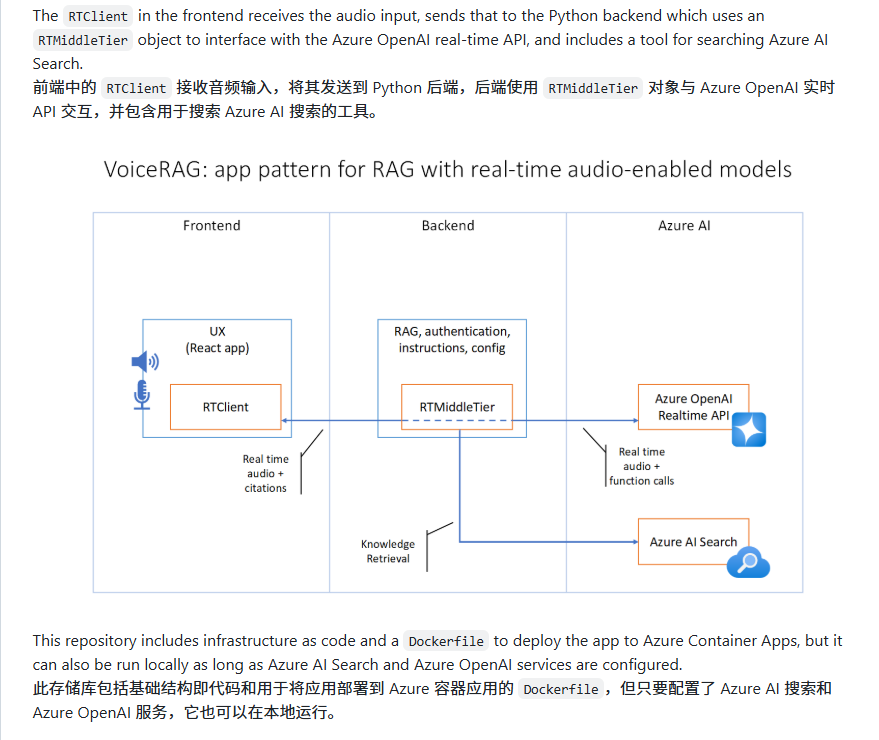
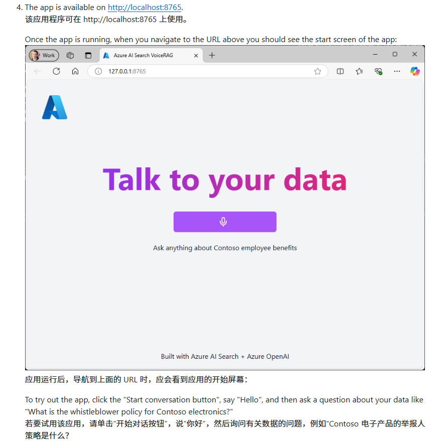
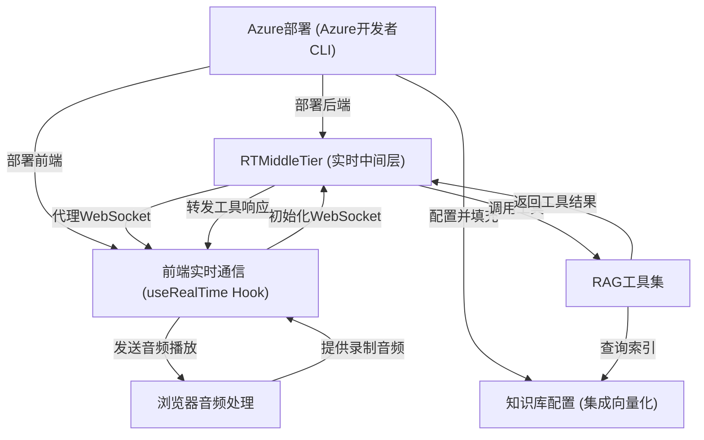
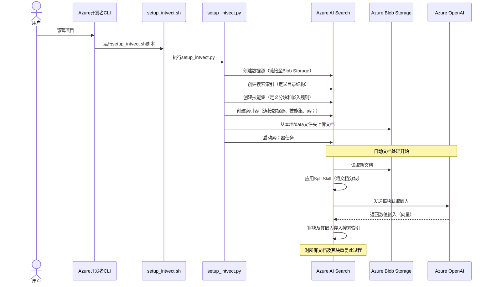

# VoiceRAG

链接：[Azure AI 搜索 - 检索增强生成 | Microsoft Azure](https://azure.microsoft.com/zh-cn/products/ai-services/ai-search/)

## 引言

本报告基于 Azure-Samples/aisearch-openai-rag-audio 项目，分析 VoiceRAG（语音增强检索生成）这一新兴应用模式。

VoiceRAG 结合了检索增强生成（RAG）技术与语音交互界面，利用 Azure AI Search 和 GPT-4o 实时音频 API 构建==交互式语音生成== AI 体验。

**发现**：VoiceRAG 代表了人机交互的重要进步，通过==将传统的文本 RAG 模式扩展到语音领域==，为用户提供了更自然、直观的知识查询体验。

该模式在保持 RAG 技术准确性的同时，显著提升了用户体验的便利性和可访问性。

## 1：技术架构与核心特性

### 架构设计原理



- **三层架构模式**：前端 RTClient 负责音频输入采集，Python 后端通过 RTMiddleTier 对象与 Azure OpenAI 实时 API 接口，集成 Azure AI Search 工具进行知识检索
- **实时音频处理**：利用浏览器麦克风捕获语音输入，通过 GPT-4o 实时 API 进行音频处理和响应生成
- **容器化部署**：提供完整的基础设施即代码（IaC）和 Dockerfile，支持 Azure Container Apps 部署

### 核心功能特性
- **语音交互界面**：完全基于语音的用户交互，消除了传统文本输入的障碍
- **RAG 集成**：通过 Azure AI Search 服务查询知识库，将==检索到的文档发送给== GPT-4o 实时 API 生成响应
- **音频输出**：直接播放 GPT-4o 实时 API 的音频响应，提供流畅的==对话==体验
- **引用展示**：显示生成响应时使用的搜索结果，确保信息可追溯性

## 2：技术实现与部署方案

### 开发环境支持
- **多平台兼容**：支持 GitHub Codespaces、VS Code Dev Containers 和本地环境三种开发方式
- **工具链要求**：需要 Azure Developer CLI、Node.js、Python >=3.11、Git 等基础工具
- **快速启动**：通过 `GitHub Codespaces` 可实现==一键式环境配置==，降低了技术门槛

### 部署流程优化
- **自动化部署**：单一命令 `azd up` 即可完成资源配置、代码部署和示例数据的集成向量化
- **资源配置**：自动创建 Azure Container Apps、OpenAI 服务、AI Search 等必要资源
- **环境变量管理**：支持自定义部署配置，包括现有服务集成和语音选择定制

### 本地开发支持
- **开发服务器**：提供本地运行能力，支持连接已部署的 Azure 服务或现有服务
- **环境配置**：通过 `.env` 文件管理必要的环境变量，包括 OpenAI 端点、部署名称、API 密钥等
- **跨平台兼容**：提供 Windows 和 Linux/Mac 的启动脚本

## 3：成本效益与安全考量

### 成本结构分析
- **主要成本来源**：Azure AI Search（标准层）产生持续费用，即使在中断部署的情况下也可能产生成本
- **资源定价模型**：
  - Azure Container Apps：按使用量付费的消费计划
  - Azure OpenAI：按每 1K 令牌使用量计费
  - Azure AI Search：按小时计费的标准层
  - Azure Blob Storage：基于存储和读取操作的标准层定价
- **成本优化建议**：可切换到免费 SKU 降低成本，但功能会受到限制

### 安全实践
- **托管身份认证**：使用 Managed Identity 消除开发者管理凭据的需求，提高安全性
- **无凭据架构**：应用程序可通过托管身份获取 Microsoft Entra 令牌，无需管理任何凭据
- **代码安全扫描**：建议启用 GitHub 密钥扫描功能，确保代码库安全最佳实践

## 4：应用场景与技术价值

### 实际应用示例



- **企业知识查询**：用户可通过语音询问"Contoso electronics 的举报人政策是什么？"等企业相关问题
- **文档检索优化**：将传统的文本搜索转换为自然语言对话，提高信息获取效率
- **无障碍访问**：为视觉障碍用户或需要免手操作的场景提供更好的可访问性

### 技术创新价值
- **模式创新**：VoiceRAG 模式代表了 ==RAG 技术向多模态交互==的重要扩展
- **用户体验提升**：通过语音交互降低了技术使用门槛，提高了用户参与度
- **集成生态**：展示了 Azure 生态系统中多个 AI 服务的有效整合能力

## 结论

VoiceRAG 应用模式代表了检索增强生成技术的重要演进，成功地==将传统的文本 RAG 扩展到语音交互领域==。

通过 Azure AI Search 和 GPT-4o 实时音频 API 的深度集成，该模式不仅保持了 RAG 技术在信息准确性方面的优势，还显著提升了用户交互体验的自然性和便利性。

**主要技术价值**：
1. **交互模式创新**：实现了从文本到语音的交互范式转换
2. **技术集成优化**：展示了多个 Azure AI 服务的有效协同
3. **部署便利性**：提供了完整的开发到部署工具链支持
4. **成本可控性**：通过灵活的资源配置选项平衡功能与成本

该项目为企业级语音 AI 应用提供了可行的技术路径，特别适用于需要结合专业知识库进行语音交互的场景。

随着语音 AI 技术的持续发展，VoiceRAG 模式有望成为下一代智能助手和知识管理系统的重要技术基础

------------------

# docs：aisearch-openai-rag-audio

本项目支持与AI助手进行**实时语音对话**，该助手能基于**定制知识库**回答问题。

系统通过浏览器麦克风获取输入，并以音频形式播放AI响应。在生成答案前，系统会智能地从文档中**检索相关信息**，确保准确性并提供**来源引用**。

## 可视化



## 章节

1. [知识库配置 (集成向量化)](01_knowledge_base_setup__integrated_vectorization__.md)
2. [RAG工具集](02_rag_tooling_.md)
3. [RTMiddleTier (实时中间层)](03_rtmiddletier__real_time_middle_tier__.md)
4. [浏览器音频处理](04_browser_audio_processing_.md)
5. [前端实时通信 (useRealTime Hook)](05_frontend_real_time_communication__userealtime_hook__.md)
6. [Azure部署 (Azure开发者CLI)](06_azure_deployment__azure_developer_cli__.md)

---
# 第1章：知识库配置（集成向量化）

想象你拥有大量重要文档——就像一座装满书籍、报告和笔记的图书馆。如果你希望AI仅基于这个特定图书馆的信息（而非其通用互联网知识）回答问题，它==如何快速找到正确答案==？显然不能每次提问时都从头开始阅读每份文档

这正是"知识库配置（集成向量化）"的意义所在。它将原始文档组织成一个高效、可搜索的图书馆，使AI能够理解。

这一过程自动预处理信息，让AI能快速找到相关细节并提供准确答案。

## 核心问题：海量文本的智能化处理

根本问题在于计算机（以及AI）并不像人类那样天然"理解"语言，它们只处理数字。如何将文档中的文字转化为AI可搜索和理解的形式？

## 解决方案：集成向量化

本项目通过在Azure AI Search中建立自动化系统来解决这个问题，将文档转换为强大的可搜索格式。该过程涉及几个协同工作的关键概念：

### 1. Azure AI Search：智能图书馆系统

将**Azure AI Search**视为先进的数字图书馆系统

它不仅是文件存储库，更是专为海量信息快速检索设计的服务，作为知识库的核心枢纽。

### 2. 索引：高级目录

在Azure AI Search中，**索引**如同图书馆的高级目录。与传统仅记录书名和作者的目录不同，该索引存储文档的*实际内容*（分解为小片段）以及捕捉语义的特殊数字"指纹"。

### 3. 技能集：专家级图书管理员

**技能集**如同一位自动处理新增文档的专家图书管理员，执行以下关键任务：

*   **分块**：不试图一次性概括整本书，而是将文档分解为更易管理的片段（如章节），帮助AI搜索时聚焦相关内容。
*   **嵌入**：为每个文本块生成称为**嵌入**的数字表示。这相当于将文本块的*含义*转换为独特的数字指纹。语义相似的块将具有相似的数值指纹。这些嵌入由Azure OpenAI生成。

### 4. 集成向量化：自动化魔法

"集成向量化"指Azure AI Search自动协调上述所有步骤。你只需将原始文档上传至存储位置（Azure Blob Storage），Azure AI Search便会自动：

1. 连接文档
2. 分解为小块
3. 使用Azure OpenAI为每块生成数值嵌入
4. 将块及其嵌入存储至搜索索引

这是将非结构化文本转化为高度可搜索、AI就绪知识库的全自动流水线。

## 项目中的实现

在`aisearch-openai-rag-audio`项目中，`app/backend/setup_intvect.py`脚本（由`scripts/setup_intvect.sh`或`.ps1`脚本协调）处理整个配置。部署项目时，它会定义Azure AI Search应如何处理文档并启动流程。

### 步骤1：加载环境变量

首先，项目需要知道Azure服务的位置及访问方式。`load_azd_env()`函数加载这些关键设置。

```python
# app/backend/setup_intvect.py（简化片段）
import os
from dotenv import load_dotenv
import subprocess
import json

def load_azd_env():
    # 查找由'azd'（Azure开发者CLI）创建的'.env'文件
    # 并加载其中变量（如Azure端点URL和密钥）
    # 以便脚本使用
    result = subprocess.run("azd env list -o json", shell=True, capture_output=True, text=True)
    env_json = json.loads(result.stdout)
    env_file_path = None
    for entry in env_json:
        if entry["IsDefault"]:
            env_file_path = entry["DotEnvPath"]
    if not env_file_path:
        raise Exception("未找到默认azd环境文件")
    load_dotenv(env_file_path, override=True) # 加载环境变量
```

### 步骤2：配置Azure AI Search组件

`setup_index`函数（篇幅较长，分段说明）负责创建或更新Azure AI Search中的所有必要部分。

#### 连接文档（数据源）

这部分代码告诉Azure AI Search原始文档的存储位置——具体是Azure Blob Storage容器。

```python
# app/backend/setup_intvect.py（setup_index函数简化片段）
from azure.search.documents.indexes import SearchIndexerClient
from azure.search.documents.indexes.models import (
    SearchIndexerDataSourceConnection, SearchIndexerDataContainer, SearchIndexerDataSourceType
)

def create_data_source(index_name, azure_search_endpoint, azure_credential, azure_storage_connection_string, azure_storage_container):
    indexer_client = SearchIndexerClient(azure_search_endpoint, azure_credential)

    if index_name not in [ds.name for ds in indexer_client.get_data_source_connections()]:
        print(f"创建数据源连接: {index_name}")
        indexer_client.create_data_source_connection(
            data_source_connection=SearchIndexerDataSourceConnection(
                name=index_name,
                type=SearchIndexerDataSourceType.AZURE_BLOB, # 文档存储在Azure Blob Storage
                connection_string=azure_storage_connection_string,
                container=SearchIndexerDataContainer(name=azure_storage_container)))
    else:
        print(f"数据源连接 {index_name} 已存在")
```

#### 定义高级目录（搜索索引）

接下来定义`SearchIndex`的结构，即目录中每个"条目"包含的信息类型。

```python
# app/backend/setup_intvect.py（setup_index函数简化片段）
from azure.search.documents.indexes import SearchIndexClient
from azure.search.documents.indexes.models import (
    SearchIndex, SearchableField, SearchField, SearchFieldDataType,
    VectorSearch, AzureOpenAIVectorizer, AzureOpenAIParameters, VectorSearchProfile,
    SemanticSearch, SemanticConfiguration, SemanticPrioritizedFields, SemanticField
)

def create_search_index(index_name, azure_search_endpoint, azure_credential, embeddings_dimensions, openai_endpoint, openai_deployment, openai_model):
    index_client = SearchIndexClient(azure_search_endpoint, azure_credential)

    if index_name not in [idx.name for idx in index_client.list_indexes()]:
        print(f"创建索引: {index_name}")
        index_client.create_index(
            SearchIndex(
                name=index_name,
                fields=[ # 目录中的列
                    SearchableField(name="chunk_id", key=True),
                    SearchableField(name="chunk"), # 存储实际文本块
                    SearchField(name="text_vector", # 存储数值嵌入
                                type=SearchFieldDataType.Collection(SearchFieldDataType.Single),
                                vector_search_dimensions=embeddings_dimensions,
                                vector_search_profile_name="vp", stored=True)
                ],
                vector_search=VectorSearch( # 处理数值摘要（向量）的方式
                    vectorizers=[
                        AzureOpenAIVectorizer(name="openai_vectorizer", # 使用OpenAI创建嵌入
                            azure_open_ai_parameters=AzureOpenAIParameters(
                                resource_uri=openai_endpoint, deployment_id=openai_deployment, model_name=openai_model))
                    ],
                    profiles=[VectorSearchProfile(name="vp", vectorizer="openai_vectorizer")]
                ),
                semantic_search=SemanticSearch( # 提升自然语言查询的相关性
                    configurations=[SemanticConfiguration(name="default",
                        prioritized_fields=SemanticPrioritizedFields(content_fields=[SemanticField(field_name="chunk")]))]
                )
            )
        )
    else:
        print(f"索引 {index_name} 已存在")
```

#### 设置专家规则（技能集）

这部分定义`Skillset`——对每份文档执行的自动化任务系列。

```python
# app/backend/setup_intvect.py（setup_index函数简化片段）
from azure.search.documents.indexes import SearchIndexerClient
from azure.search.documents.indexes.models import (
    SearchIndexerSkillset, SplitSkill, AzureOpenAIEmbeddingSkill,
    InputFieldMappingEntry, OutputFieldMappingEntry,
    SearchIndexerIndexProjections, SearchIndexerIndexProjectionSelector, IndexProjectionMode
)

def create_skillset(index_name, azure_search_endpoint, azure_credential, openai_endpoint, openai_deployment, openai_model, embeddings_dimensions):
    indexer_client = SearchIndexerClient(azure_search_endpoint, azure_credential)

    if index_name not in [sk.name for sk in indexer_client.get_skillsets()]:
        print(f"创建技能集: {index_name}")
        indexer_client.create_skillset(
            skillset=SearchIndexerSkillset(
                name=index_name,
                skills=[
                    SplitSkill( # 技能1：将文档分页（块）
                        text_split_mode="pages", maximum_page_length=2000, page_overlap_length=500,
                        inputs=[InputFieldMappingEntry(name="text", source="/document/content")],
                        outputs=[OutputFieldMappingEntry(name="textItems", target_name="pages")]),
                    AzureOpenAIEmbeddingSkill( # 技能2：使用Azure OpenAI为每块生成嵌入
                        context="/document/pages/*", resource_uri=openai_endpoint,
                        deployment_id=openai_deployment, model_name=openai_model,
                        dimensions=embeddings_dimensions,
                        inputs=[InputFieldMappingEntry(name="text", source="/document/pages/*")],
                        outputs=[OutputFieldMappingEntry(name="embedding", target_name="text_vector")])
                ],
                index_projections=SearchIndexerIndexProjections( # 处理数据存入索引的方式
                    selectors=[SearchIndexerIndexProjectionSelector(
                        target_index_name=index_name,
                        source_context="/document/pages/*", # 应用于每个块
                        mappings=[
                            InputFieldMappingEntry(name="chunk", source="/document/pages/*"),
                            InputFieldMappingEntry(name="text_vector", source="/document/pages/*/text_vector"),
                            InputFieldMappingEntry(name="title", source="/document/metadata_storage_name") # 文档文件名作为标题
                        ])],
                    parameters=SearchIndexerIndexProjectionsParameters(projection_mode=IndexProjectionMode.SKIP_INDEXING_PARENT_DOCUMENTS)
                )
            )
        )
    else:
        print(f"技能集 {index_name} 已存在")
```

#### 调度处理任务（索引器）

`Indexer`是整合数据源（文档）、技能集（处理规则）和搜索索引（存储结果）的实际任务。

```python
# app/backend/setup_intvect.py（setup_index函数简化片段）
from azure.search.documents.indexes import SearchIndexerClient
from azure.search.documents.indexes.models import SearchIndexer, FieldMapping

def create_indexer(index_name, azure_search_endpoint, azure_credential):
    indexer_client = SearchIndexerClient(azure_search_endpoint, azure_credential)

    if index_name not in [idxer.name for idxer in indexer_client.get_indexers()]:
        print(f"创建索引器: {index_name}")
        indexer_client.create_indexer(
            indexer=SearchIndexer(
                name=index_name,
                data_source_name=index_name, # 链接到存储室（数据源）
                skillset_name=index_name,     # 链接到图书管理规则（技能集）
                target_index_name=index_name, # 链接到高级目录（搜索索引）
                field_mappings=[FieldMapping(source_field_name="metadata_storage_name", target_field_name="title")]
            )
        )
    else:
        print(f"索引器 {index_name} 已存在")
```

### 步骤3：上传文档并运行索引器

配置完所有组件后，最后一步是将文档导入系统并启动`Indexer`。

```python
# app/backend/setup_intvect.py（简化片段）
import os
from azure.storage.blob import BlobServiceClient
from azure.search.documents.indexes import SearchIndexerClient
from azure.core.exceptions import ResourceExistsError

def upload_and_process_documents(indexer_name, azure_search_endpoint, azure_credential, azure_storage_endpoint, azure_storage_container):
    # 1. 将本地'data'文件夹中的文档上传至Azure Blob Storage
    blob_service_client = BlobServiceClient(account_url=azure_storage_endpoint, credential=azure_credential)
    container_client = blob_service_client.get_container_client(azure_storage_container)
    if not container_client.exists():
        container_client.create_container()

    existing_blobs = [blob.name for blob in container_client.list_blobs()]
    for file in os.scandir("data"): # 假设'data'文件夹包含你的文档
        filename = os.path.basename(file.path)
        if filename not in existing_blobs:
            print(f"上传文件: {filename}")
            with open(file.path, "rb") as opened_file:
                container_client.upload_blob(filename, opened_file, overwrite=True)
        else:
            print(f"文件已存在，跳过: {filename}")

    # 2. 启动索引器处理新上传文档
    indexer_client = SearchIndexerClient(azure_search_endpoint, azure_credential)
    try:
        indexer_client.run_indexer(indexer_name)
        print("索引器已启动。文档将很快处理。")
    except ResourceExistsError:
        print("索引器已在运行，无需重启。")

if __name__ == "__main__":
    # ...（先前配置调用）...
    upload_and_process_documents(
        indexer_name=AZURE_SEARCH_INDEX,
        azure_search_endpoint=AZURE_SEARCH_ENDPOINT,
        azure_credential=azure_credential,
        azure_storage_endpoint=AZURE_STORAGE_ENDPOINT,
        azure_storage_container=AZURE_STORAGE_CONTAINER
    )
```

## 整体流程（底层原理）



## 总结

本章学习了如何通过Azure AI Search将原始文档转化为智能、可搜索的知识库。这包括设置核心`搜索索引`（高级目录）、定义`技能集`（专家图书管理员）以使用Azure OpenAI自动`分块`文档并生成数值`嵌入`，最后通过`索引器`协调整个过程。这种称为集成向量化的自动化流程，使数据准备好被AI高效理解和响应。

知识库智能准备就绪后，下一步是了解AI如何实际*使用*该配置回答问题。在[第2章：RAG工具集](02_rag_tooling_.md)中，我们将探索如何从该知识库检索信息并生成有意义的响应。

