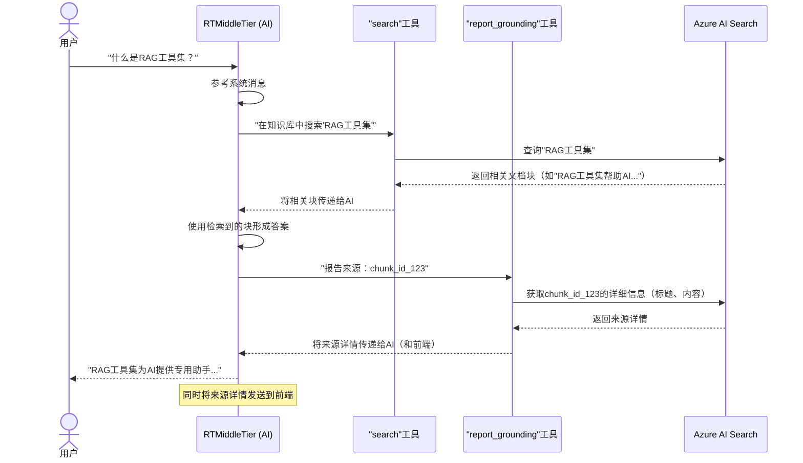

# 第2章：RAG工具集

在[第1章：知识库配置（集成向量化）](01_knowledge_base_setup__integrated_vectorization__.md)中，我们学习了如何构建一个超级智能的数字图书馆，使用==Azure AI Search将原始文档转化为AI就绪的知识库==。这意味着我们的AI现在可以访问一组特定的文档。

> 但AI如何实际*使用*这个图书馆来回答问题？

仅仅有这些"书籍"是不够的；AI需要一种方法来*查找*正确的信息，*阅读*它，然后*形成*回答。这就是"RAG工具集"的用武之地。

## 问题：AI需要帮助来"阅读"你的图书馆

假设你问AI："`aisearch-openai-rag-audio`项目的主要功能是什么？"
如果没有特殊指令，一个强大的AI可能会基于其通用互联网知识来回答。但如果答案*仅*存在于*你的特定项目文档*中呢？即使它找到了答案，它如何告诉你信息*来源*？

AI需要专门的"助手"或"工具"来：
1. **高效搜索**你的独特知识库。
2. **引用**使用的具体文档或部分，确保答案可信且透明。

## 解决方案：RAG工具集

本项目为AI配备了两个关键的"RAG工具"（检索增强生成工具）。这些工具就像人类使用计算器或词典一样，是AI可以调用的特殊技能。它们使AI能够执行检索增强生成（RAG），即从知识库中**检索**信息，然后**增强**其**生成**的答案。

### 1. `search`工具：你的专属图书管理员

`search`工具就像一个超级快速的图书管理员，它知道如何导航你的[Azure AI Search](01_knowledge_base_setup__integrated_vectorization__.md)知识库。

* **功能**：当AI需要信息时，它可以向`search`工具提问。`search`工具快速筛选准备好的文档，找到最相关的片段（块），并将其呈现给AI。
* **重要性**：确保AI不会"猜测"或使用通用知识，而是基于*你提供的*特定信息回答问题。

### 2. `report_grounding`工具：你的引用助手

`report_grounding`工具就像一个细致的助手，确保AI始终注明信息来源。

* **功能**：在AI使用`search`工具检索的信息形成答案后，`report_grounding`工具识别并引用使用的原始来源（文档块）。
* **重要性**：为AI的回答提供**依据**，即答案明确关联到事实来源，确保透明性并允许你验证信息。

## AI如何使用这些工具（系统消息）

这些工具的魔力不仅在于它们的存在，还在于AI被明确*指示*使用它们。这一指示来自**系统消息**，它像一套规则或指南，告诉AI应该如何行为以及可以使用哪些工具。

在本项目中，`system_message`定义在`app/backend/app.py`中：

```python
# app/backend/app.py（简化片段）
# ... 其他导入 ...
from ragtools import attach_rag_tools
from rtmt import RTMiddleTier # 我们将在第3章了解更多关于RTMiddleTier的内容

async def create_app():
    # ... 凭证设置 ...

    rtmt = RTMiddleTier( # RTMiddleTier是AI运行的核心
        # ... 配置 ...
        )
    rtmt.system_message = """
        你是一个乐于助人的助手。仅基于通过'search'工具在知识库中搜索的信息回答问题。
        用户通过音频听取答案，因此答案*尽可能简短*，最好是一句话。
        切勿朗读文件名、来源名称或键值。
        始终按照以下步骤回答问题：
        1. 回答问题前，始终使用'search'工具检查知识库。
        2. 始终使用'report_grounding'工具报告知识库中的信息来源。
        3. 生成尽可能简短的答案。如果知识库中没有答案，回答不知道。
    """.strip()

    attach_rag_tools(rtmt, # 此函数将工具连接到RTMiddleTier
        # ... 搜索客户端配置 ...
        )

    # ... 其余应用设置 ...
```
**说明**：`system_message`明确告诉AI：
1. "仅基于通过**'search'工具**在知识库中搜索的信息回答问题。"
2. "始终使用**'report_grounding'工具**报告知识库中的信息来源。"

这些指令至关重要，它们指导AI*始终*使用`search`工具查询自定义知识库，并*始终*通过`report_grounding`工具引用来源。

## 底层原理：RAG工具集如何工作

让我们追踪你提问时AI使用这些RAG工具的流程。

### 问题处理的流程



1. **你提问**：你通过语音或文本向系统提问。
2. **AI接收问题**：`RTMiddleTier`（我们的核心AI组件，将在[第3章：RTMiddleTier（实时中间层）](03_rtmiddletier__real_time_middle_tier__.md)中探讨）接收你的问题。
3. **AI参考指令**：根据`system_message`，AI知道它*必须*使用`search`工具在知识库中查找信息。
4. **激活`search`工具**：AI调用`search`工具，将你的问题作为查询。
5. **`search`工具查询Azure AI Search**：`search`工具将查询发送到我们的智能图书馆Azure AI Search（在[第1章：知识库配置（集成向量化）](01_knowledge_base_setup__integrated_vectorization__.md)中设置）。
6. **Azure AI Search返回结果**：Azure AI Search快速找到并返回最相关的文档块（信息片段）给`search`工具。
7. **AI处理结果**：`search`工具将这些块传回AI。AI阅读这些块并用于形成答案。
8. **激活`report_grounding`工具**：根据`system_message`，AI调用`report_grounding`工具，告诉它使用了哪些具体的`chunk_id`（来自搜索结果）。
9. **`report_grounding`工具获取来源详情**：此工具再次查询Azure AI Search，获取这些`chunk_id`的完整详情（如原始文档标题和完整块内容）。
10. **AI生成最终答案和引用**：结合相关信息及来源详情，AI生成简洁答案。同时，来源详情通过`RTMiddleTier`传递到前端，供你查看信息来源。

### 工具背后的代码

RAG工具在`app/backend/ragtools.py`中定义并连接到`app/backend/app.py`。

#### 1. 工具模式：AI如何知道工具的功能

在AI使用工具之前，它需要知道工具的名称、功能及其所需信息（"参数"）。这在`ragtools.py`中通过"模式"（蓝图）定义：

```python
# app/backend/ragtools.py（简化片段）
_search_tool_schema = {
    "type": "function",
    "name": "search",
    "description": "搜索知识库。知识库为英文...",
    "parameters": {
        "type": "object",
        "properties": {
            "query": {
                "type": "string",
                "description": "搜索查询"
            }
        },
        "required": ["query"],
        "additionalProperties": False
    }
}

_grounding_tool_schema = {
    "type": "function",
    "name": "report_grounding",
    "description": "报告答案中使用的知识库来源...",
    "parameters": {
        "type": "object",
        "properties": {
            "sources": {
                "type": "array",
                "items": { "type": "string" },
                "description": "实际使用的来源名称列表..."
            }
        },
        "required": ["sources"],
        "additionalProperties": False
    }
}
```
**说明**：这些Python字典定义了工具的结构

例如，`search`工具需要一个输入：`query`（字符串）。`report_grounding`工具需要一个`sources`列表（每个为字符串）。`description`告诉AI每个工具的用途。

#### 2. `attach_rag_tools`：将工具连接到AI

`ragtools.py`中的`attach_rag_tools`函数负责设置并将这些工具连接到`RTMiddleTier`。此函数在`app.py`中调用。

```python
# app/backend/app.py（简化片段）
# ... 导入 ...
from ragtools import attach_rag_tools
# ... RTMiddleTier设置 ...

    attach_rag_tools(rtmt, # 传递RTMiddleTier实例
        credentials=search_credential,
        search_endpoint=os.environ.get("AZURE_SEARCH_ENDPOINT"),
        search_index=os.environ.get("AZURE_SEARCH_INDEX"),
        # ... 其他搜索参数 ...
        )
```
**说明**：调用`attach_rag_tools`时，它会初始化执行搜索和引用操作的实际函数，并告诉`RTMiddleTier`（我们的AI管理器）这些工具可用。

#### 3. `_search_tool`函数：执行搜索

这是执行`search`工具逻辑的核心函数。

```python
# app/backend/ragtools.py（简化片段）
from azure.search.documents.aio import SearchClient
from azure.search.documents.models import VectorizableTextQuery
# ... 导入 ...

async def _search_tool(
    search_client: SearchClient, # 连接到Azure AI Search
    semantic_configuration: str | None,
    identifier_field: str, content_field: str, embedding_field: str,
    use_vector_query: bool, args: Any) -> ToolResult:
    
    print(f"在知识库中搜索'{args['query']}'。")
    
    vector_queries = []
    if use_vector_query:
        # 如果启用向量搜索，从文本创建数值查询
        vector_queries.append(VectorizableTextQuery(text=args['query'], k_nearest_neighbors=50, fields=embedding_field))
    
    search_results = await search_client.search(
        search_text=args["query"], # 用户的查询
        query_type="semantic" if semantic_configuration else "simple",
        semantic_configuration_name=semantic_configuration,
        top=5, # 获取前5个结果
        vector_queries=vector_queries,
        select=", ".join([identifier_field, content_field]) # 仅获取块ID和内容
    )
    
    result = ""
    async for r in search_results:
        result += f"[{r[identifier_field]}]: {r[content_field]}\n-----\n"
    return ToolResult(result, ToolResultDirection.TO_SERVER)
```
**说明**：此函数接收AI的`query`，使用`SearchClient`与Azure AI Search通信并执行搜索。它甚至可以使用高级"向量查询"（来自[第1章：知识库配置（集成向量化）](01_knowledge_base_setup__integrated_vectorization__.md)的数值指纹）查找高度相关的内容。然后格式化前5个结果并返回给AI。

#### 4. `_report_grounding_tool`函数：引用来源

此函数处理引用过程。

```python
# app/backend/ragtools.py（简化片段）
# ... 导入 ...

async def _report_grounding_tool(
    search_client: SearchClient, identifier_field: str, title_field: str, 
    content_field: str, args: Any) -> None:
    
    sources = [s for s in args["sources"]] # AI使用的块ID列表
    list = " OR ".join(sources) # 准备搜索查询
    print(f"引用来源: {list}")
    
    search_results = await search_client.search(
        search_text=list, 
        search_fields=[identifier_field], # 按块ID搜索
        select=[identifier_field, title_field, content_field], # 获取完整详情
        top=len(sources), 
        query_type="full")
    
    docs = []
    async for r in search_results:
        # 收集块ID、原始文档标题和内容
        docs.append({"chunk_id": r[identifier_field], "title": r[title_field], "chunk": r[content_field]})
    
    return ToolResult({"sources": docs}, ToolResultDirection.TO_CLIENT)
```
**说明**：此函数接收AI使用的`chunk_id`列表，再次快速查询Azure AI Search以获取这些`chunk_id`的完整详情（包括原始文档标题）

这些信息随后传回`RTMiddleTier`，并传递到前端作为引用显示。

## 总结

RAG工具集真正激活了我们的AI就绪知识库。

通过为AI提供`search`和`report_grounding`工具，并通过`system_message`指示其使用它们，我们确保AI准确、透明且*仅*基于我们提供的可信信息回答问题。这些工具是AI智能与你的自定义数据之间的桥梁。

==准备好知识库并为AI配备RAG工具集后，下一步是理解我们应用的核心：实时中间层==。在[第3章：RTMiddleTier（实时中间层）](03_rtmiddletier__real_time_middle_tier__.md)中，我们将探讨这一核心组件如何管理AI、实时处理问题并协调这些强大的RAG工具集的使用。

