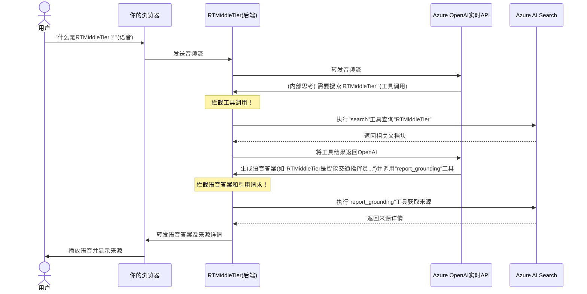

# 第3章：RTMiddleTier（实时中间层）

- 在[第1章：知识库配置（集成向量化）](01_knowledge_base_setup__integrated_vectorization__.md)中，我们构建了一个智能数字图书馆

- 随后在[第2章：RAG工具集](02_rag_tooling_.md)中，我们为AI配备了专用"助手"——`search`和`report_grounding`工具——使其能够与图书馆交互并提供可信答案。

但这些组件如何协同工作，实现流畅的实时语音对话？你的语音如何传递给AI？AI如何决定使用RAG工具？语音响应又如何无延迟地返回？

这正是**RTMiddleTier（实时中间层）**发挥关键作用的地方。

## 问题：实时AI对话的编排

想象你正与AI进行语音对话。你说话，AI思考，可能需要查询信息，然后回应。要让这个过程自然流畅，后台需要瞬间完成以下操作：
- 你的语音需传递给AI
- AI需理解问题
- 若问题需从特定知识库获取信息，AI必须*暂停*常规思考，*调用*RAG工具（如`search`工具），等待结果后再继续思考
- AI形成答案后需转为语音
- 语音需立即返回浏览器

这是复杂的协作过程，尤其是当AI可能根据你的提示*在对话中途*决定使用工具时

我们如何管理整个流程，在不干扰实时体验的前提下注入自定义RAG逻辑？

## 解决方案：RTMiddleTier——智能交通指挥中心

`RTMiddleTier`（实时中间层）是本应用的核心大脑。它如同**智能交通指挥员**或**高级翻译官**，位于对话的中央，作为浏览器与强大的Azure OpenAI GPT-4o实时API之间的**代理中介**。

其核心功能：
1. **监听语音**：接收浏览器发送的语音输入
2. **拦截消息**：拦截所有进出Azure OpenAI API的消息（关键点：不仅传递消息，还会解读内容）
3. **插入智能工具（RAG）**：当AI决定调用RAG工具（如[第2章](02_rag_tooling_.md)的`search`工具）时，RTMiddleTier*拦截*请求，*执行*工具，并将结果返回AI（此时[第1章](01_knowledge_base_setup__integrated_vectorization__.md)的知识库真正发挥作用！）
4. **处理AI响应**：确保AI响应格式正确，并通过`report_grounding`工具添加来源引用等增强内容
5. **保障流畅交互**：所有操作实时完成，使对话自然响应

本质上，`RTMiddleTier`通过管理流程并在适当时机注入智能，使AI能够进行动态的、支持RAG的语音对话。

## 项目中的实现（高层流程）

以问题"什么是RTMiddleTier？"为例，其处理流程如下：



该流程图展示`RTMiddleTier`如何作为中介：
- 将语音传递给AI
- 当AI调用RAG工具时，由其处理与[Azure AI Search](01_knowledge_base_setup__integrated_vectorization__.md)的交互
- 将AI的语音响应及相关引用无缝传递给用户

## RTMiddleTier的代码实现

`RTMiddleTier`实现在`app/backend/rtmt.py`中，使用`aiohttp`管理浏览器与Azure OpenAI实时API之间的WebSocket连接。

### 1. 初始化RTMiddleTier

首先在`app/backend/app.py`中配置RTMiddleTier的Azure OpenAI终端和凭证：

```python
# app/backend/app.py（简化片段）
from rtmt import RTMiddleTier

async def create_app():
    # ...凭证设置...
    
    rtmt = RTMiddleTier(
        credentials=llm_credential, # Azure OpenAI凭证
        endpoint=os.environ["AZURE_OPENAI_ENDPOINT"],
        deployment=os.environ["AZURE_OPENAI_REALTIME_DEPLOYMENT"],
        voice_choice=os.environ.get("AZURE_OPENAI_REALTIME_VOICE_CHOICE") or "alloy"
        )
    # ...附加RAG工具和系统消息...
    # ...关联到web应用...
```
**说明**：此代码创建`RTMiddleTier`实例，配置其连接Azure OpenAI实时API所需的参数，包括语音选择（如"alloy"）。

### 2. 关联到Web应用

`RTMiddleTier`需通过特定路径接收浏览器连接：

```python
# app/backend/app.py（简化片段）
# ...其他导入...
    rtmt.attach_to_app(app, "/realtime") # 将RTMiddleTier关联到/realtime路径
    
    # ...其余应用设置...
```
**说明**：此行告知web应用，所有发送至`/realtime`的请求应由`RTMiddleTier`处理，建立WebSocket终端。

### 3. WebSocket处理器

当浏览器连接`/realtime`时，`app/backend/rtmt.py`中的`_websocket_handler`开始工作：

```python
# app/backend/rtmt.py（简化片段）
# ...导入...

class RTMiddleTier:
    # ...初始化代码...

    async def _websocket_handler(self, request: web.Request):
        ws = web.WebSocketResponse()
        await ws.prepare(request) # 准备WebSocket连接
        await self._forward_messages(ws) # 开始转发消息
        return ws
```
**说明**：此函数是新实时对话的入口，将请求升级为WebSocket连接后转由`_forward_messages`处理实际消息中继。

### 4. 消息转发与拦截

`_forward_messages`是核心代理逻辑，创建两个并行任务：监听浏览器到OpenAI的消息，以及OpenAI到浏览器的消息。关键是在发送前调用`_process_message_to_server`或`_process_message_to_client`拦截并可能修改消息。

```python
# app/backend/rtmt.py（简化片段）
import asyncio # 用于并发运行任务

class RTMiddleTier:
    # ...其他方法...

    async def _forward_messages(self, ws: web.WebSocketResponse):
        # 建立与Azure OpenAI实时API的连接
        async with aiohttp.ClientSession(base_url=self.endpoint) as session:
            async with session.ws_connect("/openai/realtime", # 连接OpenAI
                                         headers=headers, params=params) as target_ws:
                
                async def from_client_to_server():
                    async for msg in ws: # 监听来自浏览器的消息
                        if msg.type == aiohttp.WSMsgType.TEXT:
                            new_msg = await self._process_message_to_server(msg, ws) # 拦截！
                            if new_msg is not None:
                                await target_ws.send_str(new_msg) # 发送至OpenAI

                async def from_server_to_client():
                    async for msg in target_ws: # 监听来自OpenAI的消息
                        if msg.type == aiohttp.WSMsgType.TEXT:
                            new_msg = await self._process_message_to_client(msg, ws, target_ws) # 拦截！
                            if new_msg is not None:
                                await ws.send_str(new_msg) # 发送至浏览器
                
                # 同时运行两个任务
                await asyncio.gather(from_client_to_server(), from_server_to_client())
```
**说明**：此函数创建两个并行"监听站"。发往OpenAI的消息经`_process_message_to_server`处理，来自OpenAI的消息经`_process_message_to_client`处理，实现"智能交通指挥"功能。

### 5. 拦截发往OpenAI的消息（`_process_message_to_server`）

此函数拦截浏览器发送至OpenAI API的消息，主要任务是注入系统消息和可用RAG工具。

```python
# app/backend/rtmt.py（简化片段）
class RTMiddleTier:
    system_message: Optional[str] = None # 在app.py中设置
    tools: dict[str, Tool] = {}         # 由attach_rag_tools附加

    async def _process_message_to_server(self, msg: str, ws: web.WebSocketResponse) -> Optional[str]:
        message = json.loads(msg.data)
        if message is not None and message["type"] == "session.update":
            session = message["session"]
            if self.system_message is not None:
                session["instructions"] = self.system_message # 注入系统消息
            # 若有工具则设置工具选择为'auto'
            session["tool_choice"] = "auto" if len(self.tools) > 0 else "none"
            session["tools"] = [tool.schema for tool in self.tools.values()] # 注入工具定义
            return json.dumps(message) # 发送修改后的消息
        return msg.data # 若非会话更新则发送原始消息
```
**说明**：当浏览器发起新会话或更新时，`RTMiddleTier`捕获该消息，用自定义`system_message`（见[第2章](02_rag_tooling_.md)）覆盖客户端指令，并向OpenAI API提供`search`和`report_grounding`工具的模式定义，告知AI行为准则和可用工具。

### 6. 拦截来自OpenAI的消息（`_process_message_to_client`）

这是最关键的环节，处理OpenAI的响应和工具调用。

```python
# app/backend/rtmt.py（简化片段）
class RTMiddleTier:
    _tools_pending = {} # 跟踪工具调用

    async def _process_message_to_client(self, msg: str, client_ws: web.WebSocketResponse, server_ws: web.WebSocketResponse) -> Optional[str]:
        message = json.loads(msg.data)
        updated_message = msg.data

        if message is None:
            return None # 无需处理

        if message["type"] == "response.output_item.done":
            item = message["item"]
            if item["type"] == "function_call": # OpenAI要调用工具！
                tool = self.tools[item["name"]] # 获取工具(如'search')
                args = item["arguments"] # 获取参数(如{"query": "RTMiddleTier"})
                
                # 执行工具并获取结果！
                result = await tool.target(json.loads(args)) 
                
                # 将工具输出返回OpenAI
                await server_ws.send_json({
                    "type": "conversation.item.create",
                    "item": { "type": "function_call_output", "call_id": item["call_id"], "output": result.to_text() }
                })
                
                # 若工具结果需发送客户端(如引用信息)，则转发
                if result.destination == ToolResultDirection.TO_CLIENT:
                    await client_ws.send_json({
                        "type": "extension.middle_tier_tool_response",
                        "tool_name": item["name"],
                        "tool_result": result.to_text()
                    })
                return None # 不向客户端转发原始工具调用
        
        return updated_message # 转发其他消息(如AI语音输出)
```
**说明**：
1. **OpenAI调用工具**：当OpenAI决定使用工具(如`search("RTMiddleTier")`)，会向`RTMiddleTier`发送消息（即`response.output_item.done`含`type: function_call`）
2. **RTMiddleTier拦截**：`_process_message_to_client`函数拦截此消息
3. **执行工具**：查找工具对应的Python函数（如[第2章](02_rag_tooling_.md)的`_search_tool`）并执行，传入OpenAI提供的参数（如搜索词）
4. **返回结果至OpenAI**：工具执行完成后（如Azure AI Search返回结果），`RTMiddleTier`将`tool_result`*返回OpenAI*，使AI能继续思考过程
5. **发送客户端结果**：若工具输出与客户端相关（如`report_grounding`提供的引用信息），则转发至浏览器
6. **隐藏内部工具调用**：通过返回`None`，阻止原始"工具调用"消息到达浏览器，保持前端对话简洁

## 总结

`RTMiddleTier`是本应用的神经中枢，作为==智能代理协调浏览器与Azure OpenAI API之间的实时对话流==。

通过拦截消息，它动态注入`system_message`并执行RAG工具，使AI能够与自定义知识库交互，实时提供有依据的相关答案。这一复杂中介机制真正实现了动态的、支持RAG的语音体验。

理解`RTMiddleTier`如何==管理后端对话流==后，我们将转向语音的采集与处理。在[第4章：浏览器音频处理](04_browser_audio_processing_.md)中，将深入探讨==浏览器如何捕获你的音频并高效发送至`RTMiddleTier`==
