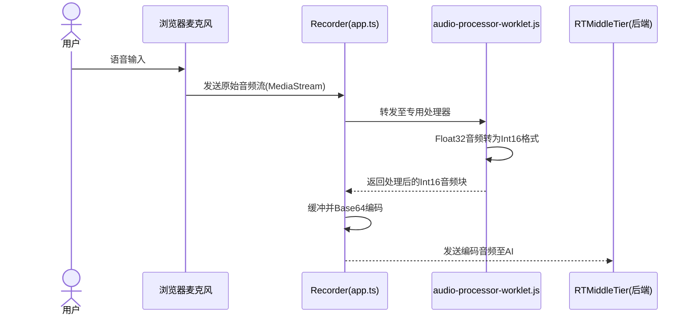
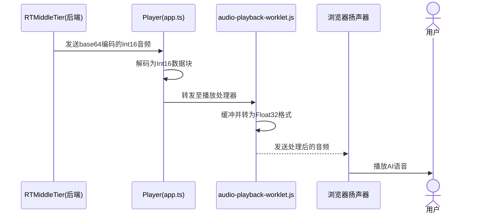

# 第4章：浏览器音频处理

在[第3章：RTMiddleTier（实时中间层）](03_rtmiddletier__real_time_middle_tier__.md)中，我们了解了应用的核心大脑`RTMiddleTier`如何智能协调与AI的实时对话。但任何对话的前提是：AI需要"耳朵"听取你的语音，并通过浏览器内置的"嘴巴"发声。这正是**浏览器音频处理**的职责所在。

## 问题：让浏览器具备听说能力

设想通过网页与AI进行自然语音对话，就像和朋友交谈一样简单。这看似直观，但背后需要实现以下"魔法"：
1. **语音采集**：如何从电脑麦克风获取语音输入？
2. **数字转换**：语音是模拟声波，而计算机（和AI）只理解数字。如何将语音转为可传输的数字格式？
3. **语音播放**：当AI返回数字语音响应时，如何通过扬声器清晰播放？
4. **实时流畅**：所有操作需*瞬时*完成，避免对话卡顿。常规浏览器操作可能暂停，导致语音中断。

本章将解析本项目如何解决这些挑战，将浏览器转化为AI的高效麦克风与扬声器。

## 解决方案：浏览器专用音频功能

本项目利用浏览器强大特性实现流畅高效的音频处理：
1. **AudioContext**：浏览器内部的"录音棚"，是音频操作（录制/处理/播放）的核心场所
2. **MediaStream**：直接从麦克风捕获的原始音频数据流
3. **AudioWorkletNodes**：在浏览器后台独立运行的"专业音频工程师"，通过`AudioWorkletProcessor`（其蓝图）定义音频处理逻辑，专为**实时低延迟音频处理**设计，避免对话卡顿

这些功能使网页能捕获语音、为AI准备数据，并流畅播放AI的语音响应。

## 浏览器的"麦克风"与"扬声器"

本项目前端通过`Recorder`和`Player`两个辅助类管理音频，并封装为React开发者友好的"hooks"。

### 1. `Recorder`：语音捕获

`Recorder`类负责从麦克风获取声音并准备发送给AI。

在`useAudioRecorder`钩子中的使用示例：
```typescript
// app/frontend/src/hooks/useAudioRecorder.tsx（简化）
import { Recorder } from "@/components/audio/recorder";

type Parameters = {
    onAudioRecorded: (base64: string) => void;
};

export default function useAudioRecorder({ onAudioRecorded }: Parameters) {
    const audioRecorder = useRef<Recorder>(); // 存储Recorder实例
    let buffer = new Uint8Array(); // 音频数据临时存储

    const handleAudioData = (data: Iterable<number>) => {
        // 接收来自worklet的原始音频块
        // 缓冲足够数据后通过onAudioRecorded发送给AI
    };

    const start = async () => {
        if (!audioRecorder.current) {
            // 创建Recorder实例，指定音频数据处理回调
            audioRecorder.current = new Recorder(handleAudioData);
        }
        // 请求麦克风访问权限
        const stream = await navigator.mediaDevices.getUserMedia({ audio: true });
        // 启动录音
        audioRecorder.current.start(stream);
    };

    const stop = async () => {
        await audioRecorder.current?.stop(); // 停止录音并清理
    };

    return { start, stop }; // 供应用调用的接口
}
```
**说明**：
- `useAudioRecorder`提供`start()`和`stop()`函数
- `start()`首先通过`getUserMedia`请求麦克风权限
- 创建`Recorder`实例（类似设置专用录音设备）
- `Recorder`开始捕获麦克风音频，处理后将数字音频块发送至`handleAudioData`
- `handleAudioData`收集这些块，转为`base64`文本格式（便于网络传输），最终通过`onAudioRecorded`发送至[RTMiddleTier](03_rtmiddletier__real_time_middle_tier__.md)

### 2. `Player`：播放AI语音响应

`Player`类负责将AI的数字语音数据通过扬声器播放。

在`useAudioPlayer`钩子中的实现：
```typescript
// app/frontend/src/hooks/useAudioPlayer.tsx（简化）
import { Player } from "@/components/audio/player";

const SAMPLE_RATE = 24000; // 音频采样率（每秒样本数）

export default function useAudioPlayer() {
    const audioPlayer = useRef<Player>(); // 存储Player实例

    const reset = () => {
        audioPlayer.current = new Player(); // 创建新Player
        audioPlayer.current.init(SAMPLE_RATE); // 初始化内部音频"录音棚"
    };

    const play = (base64Audio: string) => {
        // 接收AI返回的base64编码音频
        const binary = atob(base64Audio); // 转为二进制
        const bytes = Uint8Array.from(binary, c => c.charCodeAt(0));
        const pcmData = new Int16Array(bytes.buffer); // 转为浏览器可播放的Int16格式

        audioPlayer.current?.play(pcmData); // 调用播放
    };

    const stop = () => {
        audioPlayer.current?.stop(); // 停止播放
    };

    return { reset, play, stop }; // 供应用调用的接口
}
```
**说明**：
- `useAudioPlayer`提供`reset()`、`play(base64Audio)`和`stop()`函数
- `reset()`初始化`Player`及其内部`AudioContext`
- `play()`接收AI的`base64Audio`文本响应
- 将文本解码为原始数字音频数据（`Int16Array`）
- 通过`Player`将数据发送至浏览器音频系统播放

## 底层原理：音频处理流水线

深入探索`Recorder`和`Player`类如何与浏览器高级音频功能交互。

### 1. 语音捕获流程（麦克风→AI）



1. **用户说话**：语音输入浏览器麦克风
2. **获取原始音频**：`Recorder`获取`MediaStream`
3. **路由至Worklet**：`AudioContext`将音频路由至`audio-processor-worklet.js`
4. **格式转换**：Worklet将`Float32Array`音频转为更紧凑的`Int16Array`
5. **返回处理数据**：Worklet将`Int16Array`块返回`Recorder`
6. **准备发送**：`Recorder`缓冲数据，转为`base64`字符串后通过WebSocket发送至[RTMiddleTier](03_rtmiddletier__real_time_middle_tier__.md)

#### 核心代码解析

**音频处理Worklet** (`audio-processor-worklet.js`)：
```javascript
class PCMAudioProcessor extends AudioWorkletProcessor {
    process(inputs) {
        const float32Buffer = inputs[0][0]; // 获取Float32格式原始音频
        const int16Buffer = this.float32ToInt16(float32Buffer); // 转为Int16
        this.port.postMessage(int16Buffer); // 发送回主线程
        return true;
    }

    float32ToInt16(float32Array) {
        const int16Array = new Int16Array(float32Array.length);
        for (let i = 0; i < float32Array.length; i++) {
            int16Array[i] = Math.min(32767, Math.max(-32768, float32Array[i] * 32768)); // 缩放并钳制值
        }
        return int16Array;
    }
}
registerProcessor("audio-processor-worklet", PCMAudioProcessor);
```

**Recorder类** (`recorder.ts`)：
```typescript
export class Recorder {
    async start(stream: MediaStream) {
        this.audioContext = new AudioContext({ sampleRate: 24000 });
        await this.audioContext.audioWorklet.addModule("audio-processor-worklet.js");
        
        this.workletNode = new AudioWorkletNode(this.audioContext, "audio-processor-worklet");
        this.workletNode.port.onmessage = (event) => this.onDataAvailable(event.data);
        
        const source = this.audioContext.createMediaStreamSource(stream);
        source.connect(this.workletNode);
        this.workletNode.connect(this.audioContext.destination);
    }
}
```

### 2. 语音播放流程（AI→扬声器）



1. **AI发送音频**：[RTMiddleTier](03_rtmiddletier__real_time_middle_tier__.md)发送`base64`编码的`Int16`音频
2. **解码音频**：`Player`将`base64`解码为`Int16Array`
3. **发送至Worklet**：通过`postMessage`将数据发送至`audio-playback-worklet.js`
4. **缓冲与转换**：Worklet缓冲音频块，将`Int16Array`转回`Float32Array`
5. **播放音频**：`AudioContext`将`Float32Array`数据发送至扬声器

#### 核心代码解析

**播放Worklet** (`audio-playback-worklet.js`)：
```javascript
class AudioPlaybackWorklet extends AudioWorkletProcessor {
    constructor() {
        super();
        this.buffer = [];
        this.port.onmessage = (event) => this.buffer.push(...event.data); // 接收音频数据
    }

    process(_, outputs) {
        const output = outputs[0][0];
        const chunk = this.buffer.slice(0, output.length);
        this.buffer = this.buffer.slice(output.length);
        output.set(chunk.map(v => v / 32768)); // Int16转Float32
        return true;
    }
}
registerProcessor("audio-playback-worklet", AudioPlaybackWorklet);
```

**Player类** (`player.ts`)：
```typescript
export class Player {
    async init(sampleRate: number) {
        this.audioContext = new AudioContext({ sampleRate });
        await this.audioContext.audioWorklet.addModule("audio-playback-worklet.js");
        this.playbackNode = new AudioWorkletNode(this.audioContext, "audio-playback-worklet");
        this.playbackNode.connect(this.audioContext.destination);
    }

    play(buffer: Int16Array) {
        this.playbackNode?.port.postMessage(buffer); // 发送音频至Worklet
    }
}
```

## 总结

本章探讨了浏览器如何作为AI对话的"耳朵"和"嘴巴"。通过`AudioContext`和`AudioWorkletNodes`，本项目高效捕获麦克风音频，转换为适合AI的数字格式，并无缝播放AI的语音响应。这套浏览器端音频处理方案确保了流畅、实时、高质量的语音体验。

理解浏览器音频处理后，下一步是掌握音频数据如何与[RTMiddleTier](03_rtmiddletier__real_time_middle_tier__.md)实时通信。

在[第5章：前端实时通信（useRealTime钩子）](05_frontend_real_time_communication__userealtime_hook__.md)中，我们将解析协调这些通信的核心`useRealTime`钩子。

