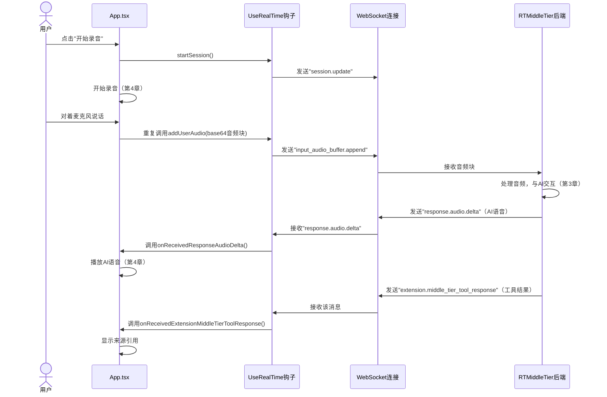

# 第5章：前端实时通信（useRealTime钩子）

在[第4章：浏览器音频处理](04_browser_audio_processing_.md)中，我们学习了浏览器如何作为精密麦克风与扬声器，捕获你的语音并播放AI的响应。

但录音如何从浏览器传送到AI的"大脑"（后端的[RTMiddleTier](03_rtmiddletier__real_time_middle_tier__.md)）？AI的语音回答和附加信息（如[RAG工具集](02_rag_tooling_.md)的来源引用）又如何实时返回浏览器？

这正是**前端实时通信**的核心，特别是通过`useRealTime`钩子实现

## 问题：建立浏览器与AI的实时连接

设想你需要与AI进行闪电般快速的语音对话。

浏览器已准备好录音，后端AI也已待命，但两者之间缺少实时通信的"电话线"。

常规网页交互通常是发送请求后等待完整响应（如加载新页面）。但语音对话需要更快速、更持续的通信：
- **持续输入**：说话时，语音小片段需持续流向AI
- **持续输出**：AI思考与回答时，其语音和支持信息（如答案来源）需实时返回，通常在说完前就开始传输
- **低延迟**：任何延迟都会让对话感觉不自然

> 这需要**WebSocket**——专为实时双向通信设计的特殊网络连接。

## 解决方案：`useRealTime`钩子——AI的专用对讲机

`useRealTime`钩子是客户端引擎，管理浏览器与后端[RTMiddleTier](03_rtmiddletier__real_time_middle_tier__.md)之间的**WebSocket**连接。它如同直接连接浏览器与AI的**对讲机**，功能包括：

- **建立连接**：打开持久的双向"电话线"（WebSocket）
- **发送语音**：持续发送录音输入（来自[第4章](04_browser_audio_processing__.md)的`base64`音频块）至后端
- **监听AI响应**：持续接收AI的语音响应，通过浏览器播放
- **接收工具结果**：监听AI的其他重要消息，如`report_grounding`工具的来源引用（见[第2章](02_rag_tooling_.md)）

该钩子确保你的语音直达AI，答案直返给你，实现流畅的实时对话。

## 如何使用`useRealTime`钩子

让我们看看主页面组件`App.tsx`如何用此钩子管理对话。

### 1. 设置`useRealTime`钩子

`App.tsx`组件导入并调用`useRealTime`钩子，提供各种"事件监听器"（特定事件触发的函数）：

```typescript
// app/frontend/src/App.tsx
import useRealTime from "@/hooks/useRealtime"; 
import useAudioRecorder from "@/hooks/useAudioRecorder";
import useAudioPlayer from "@/hooks/useAudioPlayer";

function App() 
{
    const [isRecording, setIsRecording] = useState(false);
    const [groundingFiles, setGroundingFiles] = useState([]); // 存储AI的来源引用

    const { startSession, addUserAudio, inputAudioBufferClear } = useRealTime({
        onWebSocketOpen: () => console.log("WebSocket连接已开启"),
        onReceivedResponseAudioDelta: message => {
            isRecording && playAudio(message.delta); // 实时播放AI语音
        },
        onReceivedExtensionMiddleTierToolResponse: message => {
            // 处理AI的工具结果（如来源引用）
            const result = JSON.parse(message.tool_result);
            const files = result.sources.map(x => ({
                id: x.chunk_id, name: x.title, content: x.chunk
            }));
            setGroundingFiles(prev => [...prev, ...files]); // 更新显示的来源
        }
        // ...其他事件处理器...
    });

    const { play: playAudio } = useAudioPlayer(); // 播放AI语音
    const { start: startAudioRecording, stop: stopAudioRecording } = useAudioRecorder({ 
        onAudioRecorded: addUserAudio 
    });
    // ...其余代码...
}
```
**说明**：
- `useRealTime`==钩子调用时会建立WebSocket连接==
- `onWebSocketOpen`在连接就绪时触发
- `onReceivedResponseAudioDelta`至关重要：接收AI语音块(`message.delta`)并立即通过`playAudio`播放，实现实时语音
- `onReceivedExtensionMiddleTierToolResponse`处理工具结果（如`report_grounding`的来源引用），更新`groundingFiles`状态以显示来源

### 2. 开始与结束对话

点击应用中的麦克风按钮时，`onToggleListening`函数处理实时通信的启停：

```typescript
// app/frontend/src/App.tsx
    const onToggleListening = async () => 
    {
        if (!isRecording) 
        {
            startSession(); // 开启新对话会话
            await startAudioRecording(); // 开始录音
            setIsRecording(true);
        } 
        else 
        {
            await stopAudioRecording(); // 停止录音
            inputAudioBufferClear(); // 清除后端待处理音频
            setIsRecording(false);
        }
    };
```
**说明**：

- 开始录音时：
  - `startSession()`发送初始化消息，准备AI的新对话轮次
  - `startAudioRecording()`开始捕获麦克风输入，通过`onAudioRecorded`回调（即`addUserAudio`）持续发送语音块至后端
- 停止录音时：
  - `stopAudioRecording()`停止捕获
  - `inputAudioBufferClear()`通知后端清除待处理音频

### 3. 发送你的音频

如前述，`useAudioRecorder`通过`addUserAudio`发送语音块：

```typescript
// app/frontend/src/hooks/useRealtime.tsx
import useWebSocket from "react-use-websocket";

export default function useRealTime({ /* ...参数... */ }) 
{
    const { sendJsonMessage } = useWebSocket(/* ...WebSocket配置... */);

    const addUserAudio = (base64Audio: string) => {
        sendJsonMessage({
            type: "input_audio_buffer.append", // 消息类型：发送音频
            audio: base64Audio // 编码为文本的录音
        });
    };
    // ...其他函数...
}
```
**说明**：`addUserAudio`构建包含`base64Audio`的消息，通过`sendJsonMessage`经WebSocket发送至后端。说话时此函数会每秒多次调用。

## 底层原理：实时通信流程

追踪语音输入如何通过`useRealTime`钩子和WebSocket连接触发AI响应及来源引用：



### 代码解析：`useRealTime.tsx`

`useRealTime`钩子基于React库`react-use-websocket`，简化了WebSocket在React应用中的使用。

#### 1. 建立WebSocket连接

`useRealTime`核心是通过`useWebSocket`建立连接：

```typescript
// app/frontend/src/hooks/useRealtime.tsx（简化）
import useWebSocket from "react-use-websocket";

export default function useRealTime({ /* ...参数... */ }) {
    const wsEndpoint = useDirectAoaiApi 
        ? `${aoaiEndpointOverride}/openai/realtime?...` // 直连Azure OpenAI
        : `/realtime`; // 默认连接RTMiddleTier（第3章）

    const { sendJsonMessage } = useWebSocket(wsEndpoint, {
        onOpen: () => onWebSocketOpen?.(), // 连接开启回调
        onMessage: event => onMessageReceived(event), // 处理所有接收消息
        shouldReconnect: () => true // 断开时自动重连
    });
    // ...其余代码...
}
```
**说明**：
- `wsEndpoint`决定连接目标（默认`/realtime`路径指向[RTMiddleTier](03_rtmiddletier__real_time_middle_tier__.md)）
- `useWebSocket`返回`sendJsonMessage`函数，用于发送JSON消息
- `onMessageReceived`是处理接收消息的核心

#### 2. 接收与路由消息（`onMessageReceived`）

`onMessageReceived`如同消息接待台，根据`type`字段调用对应处理器：

```typescript
// app/frontend/src/hooks/useRealtime.tsx（简化）
    const onMessageReceived = (event: MessageEvent<any>) => {
        const message = JSON.parse(event.data); // 解析JSON消息

        switch (message.type) {
            case "response.audio.delta":
                onReceivedResponseAudioDelta?.(message); // 处理AI语音块
                break;
            case "extension.middle_tier_tool_response":
                onReceivedExtensionMiddleTierToolResponse?.(message); // 处理工具结果
                break;
            case "response.done":
                onReceivedResponseDone?.(message); // AI完成响应
                break;
            case "error":
                onReceivedError?.(message); // 错误处理
                break;
        }
    };
```
**说明**：通过`switch`语句根据`message.type`路由消息，如`response.audio.delta`触发语音播放，`extension.middle_tier_tool_response`更新来源引用显示。

### 关键消息类型

`app/frontend/src/types.ts`定义了前后端通信的消息结构，关键类型包括：

| 消息类型                              | 方向       | 描述                          | 对应处理器                                  |
| :------------------------------------ | :--------- | :---------------------------- | :------------------------------------------ |
| `session.update`                      | 前端->后端 | 初始化/更新会话               | `startSession`                              |
| `input_audio_buffer.append`           | 前端->后端 | 发送用户音频块                | `addUserAudio`                              |
| `response.audio.delta`                | 后端->前端 | 发送AI语音块                  | `onReceivedResponseAudioDelta`              |
| `extension.middle_tier_tool_response` | 后端->前端 | 发送RAG工具结果（如来源引用） | `onReceivedExtensionMiddleTierToolResponse` |

此表展示了前后端如何通过结构化消息进行"对话"。

## 总结

`useRealTime`钩子是连接浏览器音频能力（[第4章](04_browser_audio_processing__.md)）与后端AI智能（[RTMiddleTier](03_rtmiddletier__real_time_middle_tier__.md)和[RAG工具集](02_rag_tooling_.md)）的关键通信层。

通过稳健的WebSocket连接，它确保你的语音流畅传输至AI，而AI的语音响应和工具结果（如来源引用）实时返回，使整个语音对话生动而响应迅速。

现在==应用已具备听说与实时思考能力，最后一步是学习如何将项目部署至Azure==。在[第6章：Azure部署（Azure开发者CLI）](06_azure_deployment__azure_developer_cli__.md)中，我们将探索如何在云端运行你的AI语音助手。

