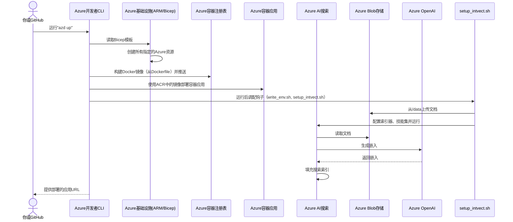

# 第6章：Azure部署

在之前的旅程中，我们构建了一个强大的AI语音助手

从[第1章：知识库配置（集成向量化）](01_knowledge_base_setup__integrated_vectorization__.md)创建智能知识库开始，到[第2章：RAG工具集](02_rag_tooling_.md)为AI配备检索与引用工具，再通过[第3章：RTMiddleTier（实时中间层）](03_rtmiddletier__real_time_middle_tier__.md)协调实时对话。前端方面，[第4章：浏览器音频处理](04_browser_audio_processing_.md)实现了浏览器音频能力，[第5章：前端实时通信（useRealTime钩子）](05_frontend_real_time_communication__userealtime_hook__.md)==建立了前后端实时通信==。

现在，这个应用已经完成，最后关键一步是：如何将它==从本地计算机发布到云端，让全球用户可靠访问==？

这就是**使用Azure开发者CLI（`azd`）进行Azure部署**的意义。

## 问题：应用上云困难重重

想象你建造了一座梦幻房屋（你的应用），配有图书馆、智能助手和最新科技。但目前它只是后院的设计图和材料堆。要让它成为可参观的真实住宅，你需要：
1. **土地（云资源）**：购买土地（Azure服务如服务器、数据库、AI服务）
2. **施工队**：需要专业人员打地基、砌墙、布线、安装智能设备
3. **搬迁部署**：将家具（代码）搬入房屋并启动所有设备
4. **运维保障**：确保可靠运行且易于更新

手动完成这些步骤极其复杂且易出错。你需要逐个创建数十个Azure服务，正确配置它们，再费力将代码部署到正确位置——这简直是噩梦

## 解决方案：Azure开发者CLI（`azd`）——你的总建筑师

**Azure开发者CLI（`azd`）**如同你的Azure**总建筑师**。它根据项目蓝图（`azure.yaml`、基础设施即代码文件和Dockerfile），自动配置所需Azure资源、部署代码，并将整个应用运行在云端。无需手动操作数十个步骤，`azd`能：
- 打包代码
- 创建所有必需的Azure服务（如Azure容器应用、Azure AI搜索、Azure OpenAI）
- 启动前后端代码

> 只需几条命令，`azd`就能将复杂应用部署到Azure。

## 使用`azd`部署应用

让我们一步步使用`azd`部署`aisearch-openai-rag-audio`项目到Azure。

### 步骤1：登录Azure

首先，`azd`需要知道你的身份和要使用的Azure订阅。

```shell
azd auth login
```
**说明**：此命令将打开浏览器，提示你登录Azure账户。登录后，`azd`便获得创建资源的权限。

### 步骤2：创建`azd`环境

`azd`环境帮助组织部署，例如开发、测试或生产环境。

```shell
azd env new
```
**说明**：此命令要求命名环境（如`myvoiceragapp`）。该名称通常用作Azure资源名称的一部分，确保唯一性。同时会在本地创建`.azure/<env-name>`文件夹存储环境特定设置。

### 步骤3：配置资源并部署应用（`azd up`）

这个神奇的命令完成了大部分繁重工作。`azd up`结合了两个主要操作：**资源调配**（创建Azure资源）和**部署**（上传代码）。

```shell
azd up
```
**说明**：
- `azd`读取项目蓝图（`azure.yaml`、`infra`文件夹）
- 要求选择Azure区域（以及Azure OpenAI的特定可用区域）
- 创建所有必需的Azure服务：
  - **Azure容器应用**：运行后端（Python）和前端（React）代码
  - **Azure AI搜索**：智能知识库（[第1章](01_knowledge_base_setup__integrated_vectorization__.md)）
  - **Azure OpenAI**：生成嵌入和AI响应（[第1章](01_knowledge_base_setup__integrated_vectorization__.md)、[第2章](02_rag_tooling_.md)、[第3章](03_rtmiddletier__real_time_middle_tier__.md)）
  - **Azure Blob存储**：存储源文档（[第1章](01_knowledge_base_setup__integrated_vectorization__.md)）
  - 其他支持资源如Log Analytics
- 调配完成后，构建应用的Docker镜像（`Dockerfile`）并部署到Azure容器应用
- 最后运行"后调配"脚本，通过上传文档和触发索引器完成[知识库配置（集成向量化）](01_knowledge_base_setup__integrated_vectorization__.md)
- 完成后，输出部署应用的URL！

### 步骤4：清理（如需）

如需删除`azd`创建的所有Azure资源以避免持续费用，可运行：

```shell
azd down
```
**说明**：此命令安全删除与`azd`环境关联的所有Azure资源，是管理云支出的关键步骤。

## 底层原理：总建筑师工具包

让我们看看`azd`如何知道该构建什么以及如何部署。它依赖于项目中的几个关键文件：

### 1. 总体规划：`azure.yaml`

此文件是`azd`的主要蓝图，告诉`azd`应用的各个部分（称为"服务"）及其部署方式。

```yaml
# azure.yaml
name: aisearch-openai-rag-audio
services:
  backend:
    project: ./app
    language: py
    host: containerapp
    docker:
      remoteBuild: true
hooks:
    postprovision:
      windows:
        shell: pwsh
        run: ./scripts/write_env.ps1; ./scripts/setup_intvect.ps1
        interactive: true
      posix:
        shell: sh
        run: ./scripts/write_env.sh; ./scripts/setup_intvect.sh
```
**说明**：
- `name`：项目名称
- `services`：定义应用的不同逻辑部分。这里有一个`backend`服务
  - `project: ./app`：服务代码位置（`app`文件夹）
  - `language: py`：标识为Python项目
  - `host: containerapp`：指定部署到Azure容器应用
  - `docker: remoteBuild: true`：在云端而非本地构建Docker镜像
- `hooks: postprovision`：`azd`在创建Azure资源后运行的脚本
  - `./scripts/write_env.sh`：从新建的Azure资源收集连接详情（如端点和API密钥），写入后端的`.env`文件
  - `./scripts/setup_intvect.sh`：使用这些环境变量运行[知识库配置（集成向量化）](01_knowledge_base_setup__integrated_vectorization__.md)流程（通过`app/backend/setup_intvect.py`），在Azure AI搜索中准备文档

### 2. 打包指令：`app/Dockerfile`

`Dockerfile`包含将应用打包为标准容器镜像的指令。该镜像可在任何地方（包括Azure容器应用）一致运行。

```dockerfile
# app/Dockerfile（简化）
# 阶段1：构建前端（React应用）
FROM node:20-slim AS build-stage
COPY frontend ./
WORKDIR /frontend
RUN npm install
RUN npm run build

# 阶段2：用Python后端服务构建好的应用
FROM python:3.12-slim AS production-stage
WORKDIR /app
COPY --from=build-stage /frontend/dist /app/static # 复制构建好的前端
COPY ./backend/ /app # 复制后端Python代码
RUN python -m pip install -r requirements.txt # 安装Python依赖
CMD ["python3", "-m", "gunicorn", "app:create_app", "-b", "0.0.0.0:8000", "--worker-class", "aiohttp.GunicornWebWorker"]
```
**说明**：此`Dockerfile`采用两阶段构建：
1. 使用Node.js镜像构建React前端
2. 使用Python镜像，复制*构建好的*前端文件和后端代码，安装Python依赖，最后设置运行Python后端服务器的命令。这个组合镜像包含前后端代码，可在单个容器中运行。

### 3. 自动化部署流程：`.github/workflows/azure-dev.yml`

虽然`azd up`适合本地开发，但你通常希望代码变更时自动部署。这由**GitHub Actions工作流**处理。

```yaml
# .github/workflows/azure-dev.yml（简化）
name: 使用azd部署到Azure

on:
  push:
    branches:
      - main # 推送变更到'main'分支时触发此工作流

jobs:
  build:
    runs-on: ubuntu-latest
    env: # azd的重要环境变量
      AZURE_CLIENT_ID: ${{ vars.AZURE_CLIENT_ID }}
      # ... 其他AZURE_TENANT_ID, AZURE_SUBSCRIPTION_ID等 ...
    steps:
      - name: 检出代码
        uses: actions/checkout@v4
      - name: 安装azd
        uses: Azure/setup-azd@v2
      - name: 使用Azure联合凭证登录
        run: azd auth login --client-id "$Env:AZURE_CLIENT_ID" --federated-credential-provider "github" --tenant-id "$Env:AZURE_TENANT_ID"
        shell: pwsh

      - name: 调配基础设施
        run: azd provision --no-prompt

      - name: 部署应用
        run: azd deploy --no-prompt
```
**说明**：
- `on: push: branches: - main`：当代码推送到`main`分支时触发此工作流
- `steps`：GitHub Actions执行的命令
  - 检出代码
  - 安装`azd`
  - 使用**联合凭证**安全登录Azure（无需在GitHub中直接存储密钥）
  - `azd provision --no-prompt`：创建或更新Azure资源。`--no-prompt`使其适合自动化工作流
  - `azd deploy --no-prompt`：构建Docker镜像（使用`Dockerfile`）并推送到Azure容器应用

### `azd`的完整部署流程

以下是运行`azd up`或触发GitHub工作流时的高级序列：



## 总结

在这最后一章中，我们了解了Azure开发者CLI（`azd`）如何作为总建筑师，自动化将整个`aisearch-openai-rag-audio`应用部署到Azure的复杂流程。

通过以`azure.yaml`为蓝图，`Dockerfile`为打包工具，以及强大的`azd`命令（手动或通过GitHub Actions），你可以无缝调配所有必要的云资源，并轻松部署前后端代码。这使得你的实时AI语音助手能够可靠运行，并被全球用户访问。

至此，我们已经涵盖了`aisearch-openai-rag-audio`项目的所有核心概念，从建立智能知识库到实时音频通信，再到自动化云部署。对这个尖端应用有了全面的理解~

END *★,°*:.☆(￣▽￣)/*.°★* 。