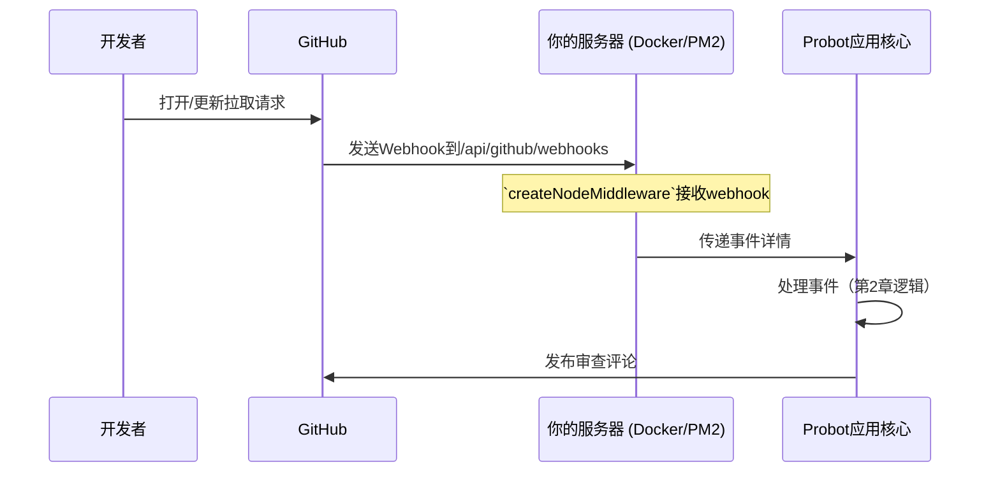
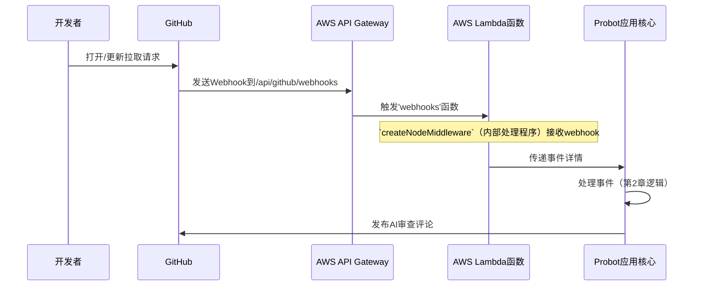
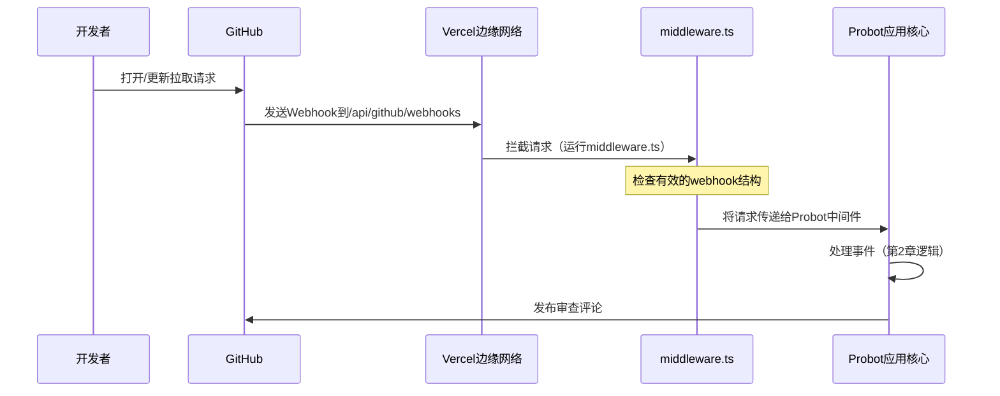
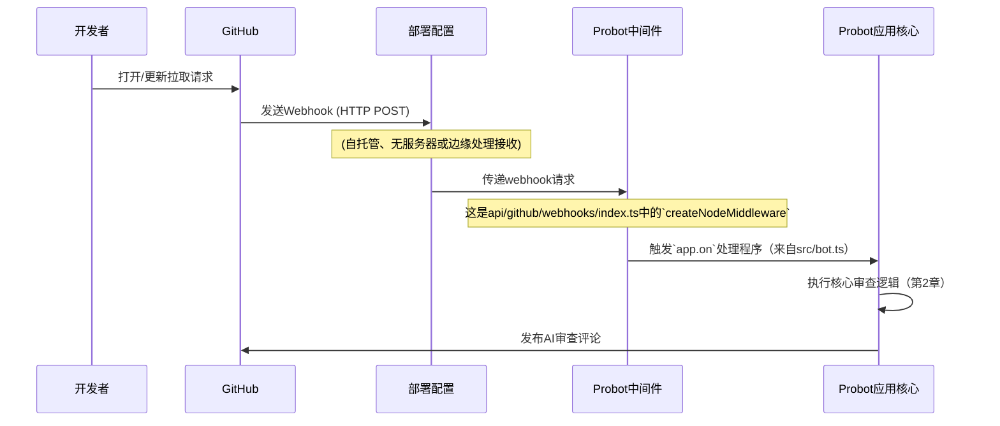

# 第3章：部署配置（托管策略）

欢迎回来🐻‍❄️

在[第1章：GitHub Actions运行器（工作流集成）](01_github_actions_runner__the_workflow_integration__.md)中，我们看到了GitHub如何触发我们的机器人。

在[第2章：Probot应用核心（审查协调器）](02_probot_app_core__the_review_orchestrator__.md)中，我们探索了机器人的"大脑"——决定如何处理这些触发的核心逻辑。

但还有一个缺失的部分：这个"大脑"`实际存在于哪里`？它如何`保持"在线"并准备好接收来自GitHub的消息`？

这正是本章的主题：**部署配置（托管策略）**。这是关于为机器人的大脑在现实世界中找到一个家。

## 它解决了什么问题？

想象我们有一台强大的超级计算机（来自第2章的Probot应用核心）可以审查代码。

但如果这台超级计算机没有插电或放在我们的壁橱里，它就什么都做不了

它需要插上电源、开机并连接到互联网，才能接收那些GitHub消息。

> **部署配置**解决的主要问题是为我们的机器人代码提供一个**可靠且可访问的家，使其能够持续运行**。

GitHub向特定的互联网地址发送"webhooks"（特殊消息）。

我们的机器人需要在该地址运行，监听这些webhooks，并用其[Probot应用核心（审查协调器）](02_probot_app_core__the_review_orchestrator__.md)处理它们。

可以这样理解：

*   **GitHub**：发送信件（webhooks）的==邮递员==。
*   **部署配置**：机器人居住的实体房屋或公寓楼。它有一个==邮箱==（互联网地址），GitHub可以向其发送信件。
*   **Probot应用核心**：房屋内==打开信件==并决定如何处理的人。

没有部署配置，我们机器人的大脑就没有身体，没有存在或接收指令的地方。

## 机器人的不同家（托管策略）

就像人们住在不同类型的房屋中一样，我们的`ChatGPT-CodeReview`机器人可以生活在各种"托管环境"中。每种环境在控制、成本和维护方面提供不同的优势。

以下是机器人的主要托管策略或"蓝图"：

| 托管策略         | 类比             | 最适合                         | 核心理念                                     |
| ---------------- | ---------------- | ------------------------------ | -------------------------------------------- |
| ==**自托管**==   | 自己的传统房屋   | 完全控制、特定服务器设置、学习 | `我们管理服务器`，机器人24/7运行其上。       |
| ==**无服务器**== | 可扩展的智能公寓 | 成本效益高、维护少、突发使用   | `云提供商`仅在需要时提供计算能力。           |
| **==边缘函数==** | 遍布各地的小屋   | 响应极快、全球覆盖、简单设置   | 代码在非常接近`用户`的地方运行，以提高速度。 |

无论选择哪种策略，目标始终相同：将GitHub webhook传递给机器人的[Probot应用核心（审查协调器）](02_probot_app_core__the_review_orchestrator__.md)，以便其完成工作。

## 1. 自托管部署（自己的传统房屋）

这种策略意味着我们提供机器人运行的计算机（服务器）

它可以是自己的机器、虚拟专用服务器（VPS）或我们自己管理的云服务器。==我们对环境有完全的控制权==。

### 使用Docker（搬家箱）

`Docker`帮助将我们的机器人及其所有必需品打包成一个整洁的"容器"。可以将其视为一个搬家箱，包含机器人的代码、所需软件（如Node.js）和所有设置。==这个箱子可以轻松`移动并在任何`理解Docker的服务器上运行==。

以下是一个简化的`Dockerfile`：

```dockerfile
# 从具有Node.js（机器人语言）的基础镜像开始
FROM node:18-slim
# 设置容器内的工作目录
WORKDIR /usr/src/app
# 复制安装依赖项的重要文件
COPY package.json yarn.lock ./
# 安装机器人所需的包
RUN yarn install --production --frozen-lockfile && yarn cache clean
# 将环境设置为生产环境
ENV NODE_ENV="production"
# 将所有机器人代码复制到容器中
COPY . .
# 告诉Docker在容器运行时如何启动机器人
CMD [ "yarn", "start" ]
```
**解释**：这个`Dockerfile`是一个配方

它告诉Docker为机器人创建一个隔离的环境。它从基础的Node.js设置开始，安装所有机器人的依赖项，复制机器人的代码，最后提供命令（`yarn start`）在Docker容器启动时运行机器人

### 使用PM2（警觉的看护者）

一旦机器人进入其Docker容器（或直接在服务器上运行），我们希望确保它保持运行

如果服务器重启或机器人崩溃怎么办？PM2（Process Manager 2）就像一个警觉的看护者，密切关注机器人。如果==机器人停止，PM2会自动重启它==。

以下是一个简化的`pm2.config.cjs`：

```javascript
// 这定义了PM2应如何管理我们的应用程序
const config = {
  apps : [{
    name      : 'Bot', // 机器人的友好名称
    script    : 'dist/index.js', // 运行机器人的主文件
    interpreter_args : '-r dotenv/config', // 从.env加载环境变量
    time: true // 记录时间戳
  }]
}

module.exports = config;
```
**解释**：此配置告诉PM2始终通过执行`dist/index.js`来运行我们的`Bot`应用程序。

它还确保正确加载存储在`.env`文件中的任何重要设置（如API密钥）。

### 如何接收GitHub事件（邮箱）

对于自托管部署，==GitHub webhooks会命中服务器上的特定URL==

此URL由标准Web服务器设置（如Express.js，通常内置在Probot的功能中）处理。

`api/github/webhooks/index.ts`文件设置了一个标准的Node.js中间件。这是入口点，接收传入的GitHub webhook并将其优雅地交给我们的[Probot应用核心（审查协调器）](02_probot_app_core__the_review_orchestrator__.md)。

```typescript
// 文件: api/github/webhooks/index.ts (简化)
import { createNodeMiddleware, createProbot } from "probot";
import { robot as app } from "../../../src/bot.js"; // 来自第2章的机器人大脑

// 初始化Probot
const probot = createProbot();

// 创建一个处理传入webhooks的中间件函数
// 此函数将获取GitHub webhook并将其传递给我们的'app'（robot）
export default createNodeMiddleware(app, { probot, webhooksPath: '/api/github/webhooks' });
```
**解释**：`createNodeMiddleware`是Probot的一个特殊函数

它创建一段代码，监听特定路径（`/api/github/webhooks`）的Web请求

当GitHub向此路径发送webhook时，此中间件拦截它，处理它，然后将事件传递给我们的`robot`（即我们的[Probot应用核心（审查协调器）](02_probot_app_core__the_review_orchestrator__.md)）。



## 2. 无服务器部署（智能公寓）

"无服务器"意味着我们不管理任何服务器

我们只需提供机器人的代码，==云提供商（如AWS、Google Cloud、Azure）仅在*需要时*自动运行它==

我们只需为代码实际运行的时间付费，这对于可能具有不可预测活动的机器人来说非常经济高效。

### 使用AWS Lambda（云函数）

AWS Lambda是一种流行的无服务器服务。我们上传机器人的代码，Lambda创建一个可以触发事件的"函数"——在我们的例子中，是传入的GitHub webhook。

以下是一个简化的`serverless.yml`文件，描述了我们的无服务器设置：

```yaml
# 文件: serverless.yml (简化)
service: cr-bot # 机器人服务的名称
frameworkVersion: '3' # Serverless框架的版本
useDotenv: true # 从.env文件加载环境变量

provider:
  name: aws # 我们使用Amazon Web Services
  runtime: nodejs18.x # 我们的机器人运行在Node.js 18版本上
  environment: # 传递给机器人的重要设置
    APP_ID: ${env:APP_ID} # GitHub应用ID
    WEBHOOK_SECRET: ${env:WEBHOOK_SECRET} # GitHub webhooks的密钥
    PRIVATE_KEY_PATH: ${env:PRIVATE_KEY_PATH} # GitHub应用私钥的路径

functions:
  webhooks: # 我们的无服务器函数名为'webhooks'
    handler: lambda.webhooks # 告诉Lambda运行'lambda.js'中的'webhooks'导出
    events:
      - httpApi: # 此函数由HTTP请求触发
          path: /api/github/webhooks # GitHub将发送webhooks的URL路径
          method: post # 它期望一个POST请求
          memorySize: 256 # 给函数多少内存（MB）
          timeout: 30 # 函数可以运行多长时间（秒）
          logRetentionInDays: 14 # 保留日志的时间
```
**解释**：这个`serverless.yml`文件告诉AWS Lambda："这是我的机器人代码

创建一个名为`webhooks`的函数，使用Node.js 18

每当HTTP POST请求到达`/api/github/webhooks`时，运行此函数。"此函数内部使用Probot的`createNodeMiddleware`（类似于自托管设置）来处理webhook与我们的[Probot应用核心（审查协调器）](02_probot_app_core__the_review_orchestrator__.md)。



## 3. 边缘函数部署（遍布各地的小屋）

边缘函数是一种较新的、非常快速的无服务器函数类型

它们运行在全局服务器网络上，通常*非常接近*请求发起的地方。这意味着极快的响应时间。像Vercel这样的平台提供边缘函数。

### 使用Vercel Edge（全局拦截器）

在Vercel等平台上，我们可以定义在请求到达主应用程序之前运行的"中间件"。我们的机器人使用Vercel边缘函数（`middleware.ts`）作为传入GitHub webhooks的第一道防线。它可以快速检查webhook，如果一切正常，则将请求传递给我们的Probot中间件（类似于`api/github/webhooks/index.ts`）。

```typescript
// 文件: middleware.ts (简化)
import { next, rewrite } from '@vercel/edge'; // 边缘函数的工具

// 这告诉Vercel何时运行我们的中间件
export const config = {
  matcher: '/api/github/webhooks', // 对此路径的请求运行此中间件
};

// 这是我们的边缘函数！
export default async function middleware(request: any) {
  let json;
  try {
    json = await request?.json?.(); // 尝试将传入数据读取为JSON
  } catch {
    // 如果不是JSON，重定向到我们的GitHub应用页面
    return rewrite(new URL('https://github.com/apps/cr-gpt'));
  }

  if (!json || !json.before || !json.after || !json.commits) {
    // 如果JSON缺少预期的GitHub webhook数据，重定向
    return rewrite(new URL('https://github.com/apps/cr-gpt'));
  }

  // 如果一切正常，让请求继续到下一个处理程序
  return next();
}
```
**解释**：这个`middleware.ts`是一个边缘函数

当webhook到达`/api/github/webhooks`时，此代码*首先*运行

它快速检查请求是否有效（例如，是否是适当的GitHub事件）。如果无效，它可以重定向。如果有效，`return next()`告诉Vercel继续处理请求，然后将其传递给我们在自托管部分看到的Probot中间件（`api/github/webhooks/index.ts`）。



## 共同主线：到达Probot的中间件

无论托管策略如何，最终目标都是将GitHub webhook的数据交给Probot。所有这些部署配置都引导到我们的`createNodeMiddleware`（或等效适配器），然后将事件传递给我们的核心机器人逻辑，即`src/bot.js`中的`robot`函数（我们的[Probot应用核心（审查协调器）](02_probot_app_core__the_review_orchestrator__.md)）。



## 总结

在本章中，我们探讨了**部署配置（托管策略）**的关键概念。我们了解到，为了使`ChatGPT-CodeReview`机器人正常运行，它需要一个持续的"家"来接收和处理GitHub webhooks。我们研究了不同的策略：
*   使用Docker和PM2进行**自托管**以实现最大控制。
*   使用AWS Lambda进行**无服务器**部署以实现成本效益和最小维护。
*   使用Vercel进行**边缘函数**部署以实现极快的全球分布式响应。

无论选择哪种方式，最终目标都是==成功接收GitHub webhooks并将其传递给机器人的[Probot应用核心（审查协调器）](02_probot_app_core__the_review_orchestrator__.md)进行处理==。

现在我们了解了机器人存在的位置和方式，让我们深入了解其最令人兴奋的组件之一：它如何==实际与AI对话==！准备好探索[第4章：AI聊天接口（语言模型通信器）](04_ai_chat_interface__the_language_model_communicator__.md)

