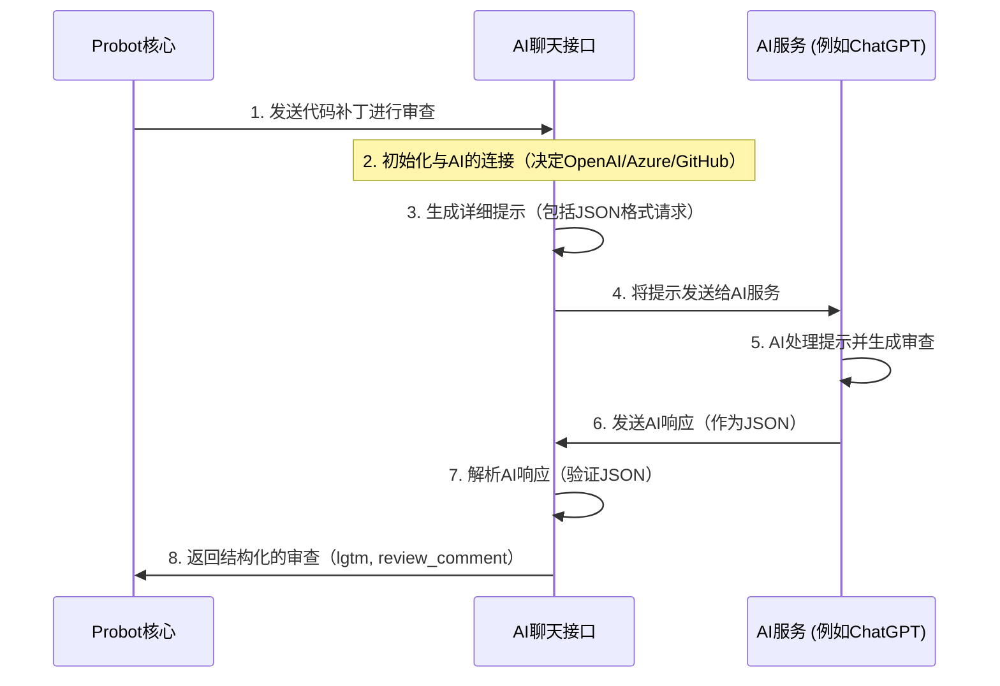

# 第4章：AI聊天接口（语言模型通信器）

欢迎回来

在[第3章：部署配置（托管策略）](03_deployment_configurations__the_hosting_strategy__.md)中，我们学习了`ChatGPT-CodeReview`机器人如何接收来自GitHub的消息

在此之前，在[第2章：Probot应用核心（审查协调器）](02_probot_app_core__the_review_orchestrator__.md)中，我们看到了机器人的"大脑"如何协调整个审查过程

现在，是时候深入了解最令人兴奋的部分之一：

- 我们的机器人如何实际与人工智能*对话*，本章将全面介绍**AI聊天接口（语言模型通信器）**

## 它解决了什么问题？

想象一下，我们的机器人[Probot应用核心](02_probot_app_core__the_review_orchestrator__.md)已经从拉取请求中收集了所有代码变更

它知道*需要审查什么*。但它如何从像ChatGPT这样的AI那里获得*实际审查*呢？它不能只是发送原始代码并期待奇迹发生！

**AI聊天接口**解决了**AI通信**的问题。它充当一个高度专业化的翻译和信使。它==接收代码变更，精心准备一个给AI的问题==（"提示"），将其==发送到选定的AI服务==（如OpenAI的ChatGPT、Azure OpenAI或GitHub Models），然后==理解AI的回复，确保其格式可以被我们的机器人使用==。

可以这样理解：

*   **我们机器人的大脑（Probot应用核心）**：我们，有一个需要解决的问题（审查这段代码）
*   **AI聊天接口**：一个知道如何与AI对话的熟练翻译
*   **AI模型（ChatGPT）**：提供建议的专家

我们给翻译提供代码并说："请专家进行代码审查。"翻译将问题完美地表述给专家，获取答案，然后以清晰、结构化的方式翻译回给我们

> 没有这个翻译，我们的机器人将不知道如何向AI寻求帮助或理解其答案。

## 核心工作：与AI通信

项目中的`Chat`类就是这个专门的"AI聊天接口"。让我们分解它的关键职责。

### 1. 选择合适的AI（连接管理器）

市面上有许多优秀的AI模型。我们的机器人需要足够灵活，能够根据我们的设置使用不同的模型。`Chat`接口首先确定要连接到*哪个*AI服务

这个决定是在创建`Chat`对象时根据我们提供的环境变量（如`AZURE_API_VERSION`或`USE_GITHUB_MODELS`）做出的。

以下是它的决策方式：

```typescript
// 文件: src/chat.ts (简化的构造函数)
import { OpenAI, AzureOpenAI } from 'openai'; // 用于与AI对话的工具

export class Chat {
  private openai: OpenAI | AzureOpenAI; // 保存与AI的连接
  private isAzure: boolean; // 标志：我们是否使用Azure OpenAI？
  private isGithubModels: boolean; // 标志：我们是否使用GitHub的模型？

  constructor(apikey: string) {
    // 检查是否提供了Azure OpenAI设置
    this.isAzure = Boolean(process.env.AZURE_API_VERSION && process.env.AZURE_DEPLOYMENT);
    // 检查是否应该使用GitHub内置的模型
    this.isGithubModels = process.env.USE_GITHUB_MODELS === 'true';

    if (this.isAzure) {
      // 如果是Azure，设置与Azure OpenAI的连接
      this.openai = new AzureOpenAI({ /* Azure特定设置 */ });
    } else {
      // 否则，设置与标准OpenAI（或GitHub Models）的连接
      this.openai = new OpenAI({
        apiKey: apikey,
        baseURL: this.isGithubModels ? 'https://models.github.ai/inference' : process.env.OPENAI_API_ENDPOINT,
      });
    }
  }
  // ... 类的其余部分 ...
}
```
**解释**：当我们创建一个新的`Chat`对象时，它会立即查看机器人的设置（环境变量）

*   如果找到`AZURE_API_VERSION`和`AZURE_DEPLOYMENT`，它知道我们想使用**Azure OpenAI**。
*   如果`USE_GITHUB_MODELS`是`true`，它会连接到**GitHub自己的AI模型**
*   否则，它会连接到标准的**OpenAI**服务
然后，它创建一个特定的`OpenAI`或`AzureOpenAI`对象，就像拿到正确的电话拨打正确的AI服务。

### 2. 设计完美的问题（提示工程师）

一旦连接到AI，`Chat`接口需要提出一个清晰、精确的问题。

这个问题被称为"提示"。一个好的提示对于获得有用的审查至关重要。它包括：

*   实际的代码变更（`patch`）
*   关于我们需要*哪种*审查的指令（例如，查找错误、提出改进建议）
*   要求答案以特定格式返回（非常重要！）

```typescript
// 文件: src/chat.ts (简化的generatePrompt方法)
export class Chat {
  // ... 构造函数和其他部分 ...

  private generatePrompt = (patch: string) => {
    // 确定AI回答的期望语言
    const answerLanguage = process.env.LANGUAGE ? `用${process.env.LANGUAGE}回答我,` : '';

    // 获取用户自定义提示，或使用默认提示
    const userPrompt = process.env.PROMPT || '请审查以下代码补丁。';
    
    // 关键：告诉AI以JSON格式响应
    const jsonFormatRequirement = '\n以严格的JSON格式提供反馈，结构如下：\n' +
        '{\n' +
        '  "lgtm": boolean, // 如果代码看起来可以合并则为true，否则为false\n' +
        '  "review_comment": string // 详细的审查评论（可以使用markdown）\n' +
        '}\n';

    return `${userPrompt}${jsonFormatRequirement} ${answerLanguage}:
    ${patch}
    `; // 将所有部分组合成最终提示
  };

  // ... 类的其余部分 ...
}
```
**解释**：`generatePrompt`函数构建给AI的消息。
*   它检查`LANGUAGE`设置（例如，"English"）。
*   它使用`PROMPT`设置（例如，"专注于错误..."）或默认提示。
*   最重要的部分是`jsonFormatRequirement`。它告诉AI："不要写文章！以结构化的JSON对象形式给出答案，包含`lgtm`（Looks Good To Merge）和`review_comment`字段。"这确保我们的机器人可以轻松理解和使用AI的响应。
*   最后，它添加实际的`patch`（代码变更），以便AI有内容可以审查。

### 3. 发送请求并解释响应（信使与翻译）

在建立AI连接并准备好提示后，`Chat`接口发送请求并处理AI的回复。

```typescript
// 文件: src/chat.ts (简化的codeReview方法)
export class Chat {
  // ... 构造函数和其他部分 ...

  public codeReview = async (patch: string): Promise<{ lgtm: boolean, review_comment: string }> => {
    if (!patch) { // 如果没有代码需要审查，直接返回LGTM
      return { lgtm: true, review_comment: "" };
    }

    const prompt = this.generatePrompt(patch); // 创建完整的提示

    // 将提示发送给AI并等待其响应
    const res = await this.openai.chat.completions.create({
      messages: [{ role: 'user', content: prompt }], // 我们的提示放在这里
      model: process.env.MODEL || (this.isGithubModels ? 'openai/gpt-4o-mini' : 'gpt-4o-mini'), // 使用哪个AI模型
      response_format: { type: "json_object" }, // 关键：强制JSON输出
    });

    if (res.choices.length) {
      try {
        // 尝试将AI的响应解析为JSON
        const json = JSON.parse(res.choices[0].message.content || "");
        return json; // 返回结构化的JSON
      } catch (e) {
        // 如果AI没有返回有效的JSON，将其视为非LGTM评论
        return { lgtm: false, review_comment: res.choices[0].message.content || "" };
      }
    }

    return { lgtm: true, review_comment: "" }; // 如果没有响应，返回默认值
  };
}
```
**解释**：`codeReview`方法是魔法发生的地方。
*   它首先使用`generatePrompt`创建`prompt`。
*   然后，`this.openai.chat.completions.create`是实际调用AI服务的代码。它发送我们的`prompt`并指定AI `model`（例如，`gpt-4o-mini`）。
*   注意这里的`response_format: { type: "json_object" }`！这是额外的保护层，直接告诉AI服务我们*要求*JSON响应。
*   一旦AI返回`res`ponse，代码尝试`JSON.parse`它。这是"解释"步骤。
*   如果解析成功，意味着AI遵循了指令，我们会得到一个漂亮的`lgtm`布尔值和`review_comment`字符串。
*   如果AI以某种方式返回了*无效*JSON的文本，`catch`块会处理它，确保我们的机器人仍然获得*一些*反馈（即使是非结构化的），并且知道不要将其标记为LGTM。

## 整体连接方式

让我们追踪代码补丁通过**AI聊天接口**的旅程：



1.  **[Probot应用核心](02_probot_app_core__the_review_orchestrator__.md)发送代码**：我们机器人的大脑（[第2章](02_probot_app_core__the_review_orchestrator__.md)）提取一个`patch`（一个文件的代码变更）并调用`chat.codeReview(patch)`。
2.  **`Chat`初始化**：如果是第一次，`Chat`对象会设置与所选AI（OpenAI、Azure或GitHub模型）的连接。
3.  **提示生成**：`Chat`对象使用其`generatePrompt`方法为AI创建一个详细的消息，特别要求以JSON格式的审查。
4.  **发送给AI**：`codeReview`方法使用已建立的AI连接（`this.openai`）将此提示发送给AI服务。
5.  **AI处理**：AI模型接收提示，理解请求，并根据`patch`和指令生成代码审查。
6.  **AI响应**：AI发送回其审查，理想情况下按照要求格式化为JSON字符串。
7.  **解析响应**：`codeReview`方法接收此字符串并尝试使用`JSON.parse()`将其解析回JavaScript对象。
8.  **返回结构化审查**：最后，`Chat`接口将结构良好的审查对象（`{ lgtm: boolean, review_comment: string }`）返回给[Probot应用核心](02_probot_app_core__the_review_orchestrator__.md)，然后可以使用此信息在我们的拉取请求上发布评论。

## 总结

**AI聊天接口（语言模型通信器）**是机器人不可或缺的翻译和信使。(`github code和ai的中间层`)

它专业地管理与各种AI服务（OpenAI、Azure OpenAI、GitHub Models）的连接，精心制作包含特定格式要求的精确提示，将这些提示发送给AI，然后解释AI的响应，确保它们是结构化的且可供我们的机器人使用。这种抽象使得`ChatGPT-CodeReview`能够有效地利用AI的力量进行自动化代码审查。

现在我们了解了机器人如何与AI对话，让我们探索它如何决定*哪些*文件需要展示给AI。在下一章中，我们将深入探讨[第5章：文件过滤逻辑（范围管理器）](05_file_filtering_logic__the_scope_manager__.md)
