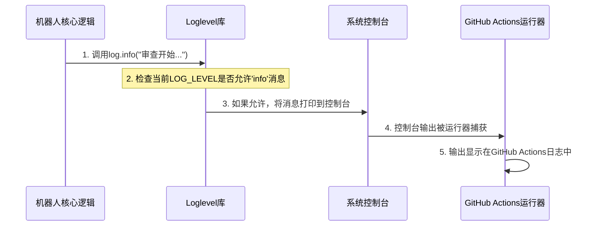

# 第6章：日志机制（调试）

欢迎来到我们了解`ChatGPT-CodeReview`项目的最后一章

在[第5章：文件过滤逻辑（范围管理器）](05_file_filtering_logic__the_scope_manager__.md)中，我们学习了机器人如何智能地==决定*哪些*文件需要发送给AI审查==。

但一旦机器人开始工作，我们如何知道它实际在做什么？它是否正确过滤了文件？AI是否响应了？是否发生了错误？

这就是**日志机制（调试）**发挥作用的地方

可以将其视为机器人的个人日记或飞机的"==黑匣子记录器=="。它记录了机器人内部的所有操作、行为和遇到的任何错误。这些详细的记录对于理解其行为、诊断问题和调试故障至关重要。

## 它解决了什么问题？

假设我们的`ChatGPT-CodeReview`机器人已经设置好，一个拉取请求被打开，然后……什么都没发生。没有审查评论出现。或者审查不完整。如果没有办法窥探内部，我们将完全处于黑暗中

**日志机制**解决了**可观察性和调试**的问题。它为机器人的内部世界提供了一个窗口。当我们启用日志记录时，机器人会"说出它的想法"，告诉我们：

*   "我收到了一个新的拉取请求事件。"
*   "我正在初始化AI连接。"
*   "这些文件被更改了。"
*   "我决定忽略`package-lock.json`。"
*   "我正在将`src/feature.js`发送给AI。"
*   "糟糕，AI未能响应`src/bug.js`！"
*   "审查成功完成。"

如果没有这个"日记"，调试就像蒙着眼睛修理一台复杂的机器

日志记录让我们能够清楚地看到发生了什么，从而更容易确定为什么某些功能正常工作，或者更重要的是，为什么它没有正常工作。

## 机器人的日记：日志级别

并非所有的日记条目都同等重要。有时我们需要每一个微小的细节，有时只需要重要事件。日志系统使用"日志级别"来按重要性对消息进行分类。这让我们可以控制机器人记录多少信息。

以下是`ChatGPT-CodeReview`中主要的日志级别：

| 日志级别 | 类比     | 对机器人意味着什么           | 何时使用                   |
| -------- | -------- | ---------------------------- | -------------------------- |
| `debug`  | 间谍相机 | 非常详细的信息，每一步操作。 | 在主动调试特定问题时使用。 |
| `info`   | 报纸头条 | 重要的里程碑和一般进展。     | 默认设置，用于一般理解。   |
| `warn`   | 警告标志 | 意外情况，但不是严重故障。   | 当怀疑存在小问题时使用。   |
| `error`  | 紧急警报 | 阻止操作的重大问题。         | 当功能明显失效时使用。     |

## 如何使用日志（控制机器人的日记）

我们通过在`.github/workflows/cr.yml`文件中设置`LOG_LEVEL`环境变量来控制机器人的日志详细程度

这是告诉机器人记录和显示哪些日记条目的主要方式。

### 设置`LOG_LEVEL`

可以在GitHub Actions工作流中配置：

```yaml
# 文件: .github/workflows/cr.yml (片段)
      - uses: anc95/ChatGPT-CodeReview@main
        env:
          GITHUB_TOKEN: ${{ secrets.GITHUB_TOKEN }}
          # ... 其他设置 ...

          # 👇 在这里设置日志级别！
          LOG_LEVEL: debug # 在调试时使用 'debug' 获取最详细的信息
          # LOG_LEVEL: info # 使用 'info'（默认）进行常规操作
```
**解释**：
*   如果设置`LOG_LEVEL: debug`，机器人将记录*所有*消息，包括`debug`、`info`、`warn`和`error`消息。这是最详细的设置，非常适合深入调试。
*   如果设置`LOG_LEVEL: info`（或不设置`LOG_LEVEL`，因为`info`是默认值），机器人将仅记录`info`、`warn`和`error`消息。这提供了良好的概览，而不会因过多细节而困扰。
*   如果设置为`error`，则仅显示`error`消息。

### 查看日志的位置

当机器人作为GitHub Action运行时，它记录的所有消息都会被捕获并显示在GitHub仓库的"Actions"选项卡中。

1.  打开GitHub上的仓库。
2.  点击"Actions"选项卡。
3.  点击特定的工作流运行（例如由拉取请求触发的运行）。
4.  导航到`Code Review`作业，然后点击`Run anc95/ChatGPT-CodeReview@main`步骤。
5.  我们将看到所有记录的日志消息打印在那里，帮助我们跟踪机器人的操作过程。

## 幕后：日志机制的工作原理

`ChatGPT-CodeReview`项目使用了一个简单而有效的日志库`loglevel`

该库允许开发者以不同级别（`debug`、`info`等）编写日志消息，然后根据`LOG_LEVEL`设置控制哪些消息实际显示。

### 解析：日志消息的旅程

当机器人的代码决定记录一条消息时，以下是发生的事情：



1.  **机器人调用`log.info()`**：在机器人的核心逻辑（例如[Probot应用核心（审查协调器）](02_probot_app_core__the_review_orchestrator__.md)）中，调用日志函数如`log.info("审查开始...")`。
2.  **`loglevel`检查级别**：`loglevel`库接收此消息。它将消息的级别（此处为`info`）与我们配置的`LOG_LEVEL`（例如`debug`或`info`）进行比较。如果消息的级别等于或高于配置的`LOG_LEVEL`，则继续。
3.  **打印到控制台**：如果允许，`loglevel`库将消息打印到系统的标准控制台输出。
4.  **GitHub Actions捕获**：运行机器人的GitHub Actions运行器会自动捕获打印到控制台的所有内容。
5.  **显示在日志中**：最后，GitHub在运行详情中显示这些捕获的输出，使其对我们可见。

### 代码（日记的设置）

让我们看看实际配置和使用日志机制的代码。

1.  **配置日志记录器（`src/log.ts`）**：
    此文件负责根据`LOG_LEVEL`环境变量设置`loglevel`库。

    ```typescript
    // 文件: src/log.ts
    import log, { LogLevelNames } from "loglevel";
    
    // 此行读取LOG_LEVEL环境变量
    // 如果未设置LOG_LEVEL，则默认为"info"
    log.setLevel((process.env.LOG_LEVEL as LogLevelNames) || "info");
    
    // 导出配置好的'log'对象，供其他文件使用
    export default log;
    ```
    **解释**：这个简短但关键的文件初始化了`loglevel`库。它从环境变量中读取`LOG_LEVEL`（我们在`.github/workflows/cr.yml`中设置）。如果没有设置，机器人将默认使用`info`级别的日志记录，显示重要的更新而不会过于详细。

2.  **使用日志记录器（`src/bot.ts`）**：
    在机器人的主要逻辑（[Probot应用核心（审查协调器）](02_probot_app_core__the_review_orchestrator__.md)）中，`log`对象被用于记录各种事件。

    ```typescript
    // 文件: src/bot.ts (摘录)
    import log from 'loglevel'; // 导入配置好的日志记录器
    
    export const robot = (app: Probot) => {
      // ...
      app.on(['pull_request.opened', 'pull_request.synchronize'], async (context) => {
        const chat = await loadChat(context);
    
        if (!chat) {
          log.info('Chat初始化失败'); // 记录一个重要事件
          return 'no chat';
        }
    
        log.debug('pull_request:', context.payload.pull_request); // 记录详细的PR负载
        // ...
        if (!changedFiles?.length) {
          log.info('过滤后未发现变更'); // 记录过滤结果
          return 'no change';
        }
        // ...
        for (let i = 0; i < changedFiles.length; i++) {
          const file = changedFiles[i];
          // ...
          if (!patch || patch.length > MAX_PATCH_COUNT) {
            log.info(`${file.filename} 因差异过大而被跳过`); // 记录跳过文件的原因
            continue;
          }
          try {
            // ... AI审查逻辑 ...
          } catch (e) {
            log.info(`审查 ${file.filename} 失败`, e); // 记录审查过程中的错误
            throw e;
          }
        }
        // ...
        log.info('成功审查', context.payload.pull_request.html_url); // 记录成功消息
        return 'success';
      });
    };
    ```
    **解释**：在这里，我们可以看到`log.info()`和`log.debug()`的使用。
    *   `log.info()`用于诸如"Chat初始化失败"、"过滤后未发现变更"或"成功审查"等消息。这些是正常操作期间需要了解的关键里程碑或结果。
    *   `log.debug()`用于更详细的细节，例如显示整个`pull_request`负载。这些消息通常仅在`LOG_LEVEL`设置为`debug`时显示，帮助我们在需要时深入细节。

通过在机器人执行过程中的各个关键点放置这些`log`调用，开发者创建了一个全面的"日记"，帮助我们理解和调试机器人的行为。

## 总结

**日志机制（调试）**是我们理解、诊断和调试`ChatGPT-CodeReview`机器人的重要工具

通过配置`LOG_LEVEL`环境变量，我们可以控制机器人记录多少关于其操作、过滤决策、AI交互和任何错误的信息

这个由`loglevel`库支持并在GitHub Actions工作流运行中显示的"机器人日记"，为我们提供了宝贵的内部运作洞察，使我们能够有效调试并确保自动化代码审查顺利进行。

至此，我们对`ChatGPT-CodeReview`项目的探索告一段落

我们学习了从与GitHub Actions的集成和审查协调，到与AI的对话、文件范围管理以及通过日志提供可见性的核心组件


END *★,°*:.☆(￣▽￣)/.°★* 。

