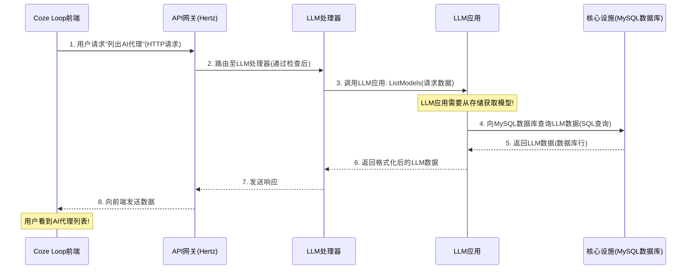
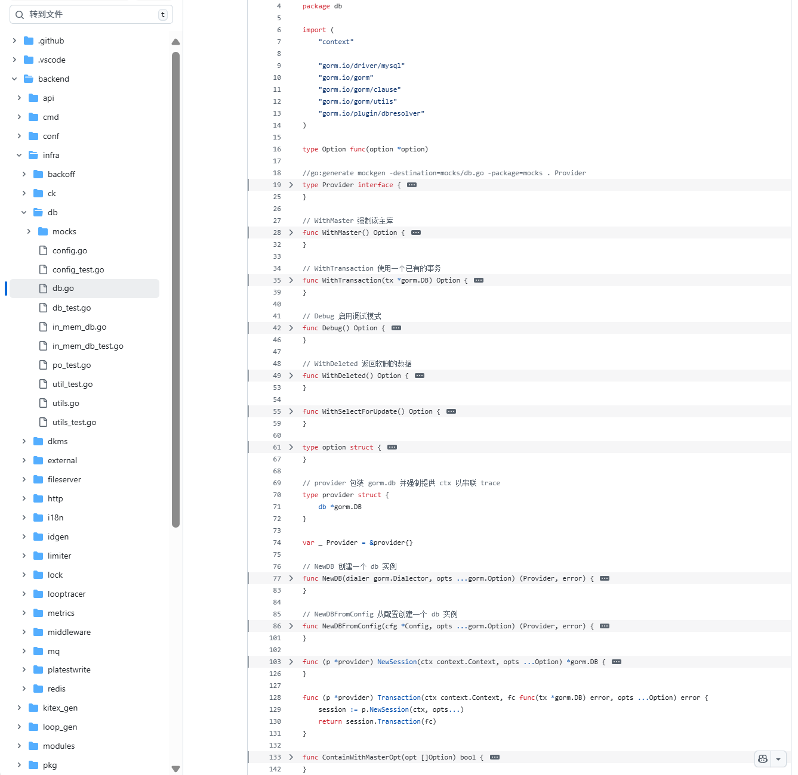
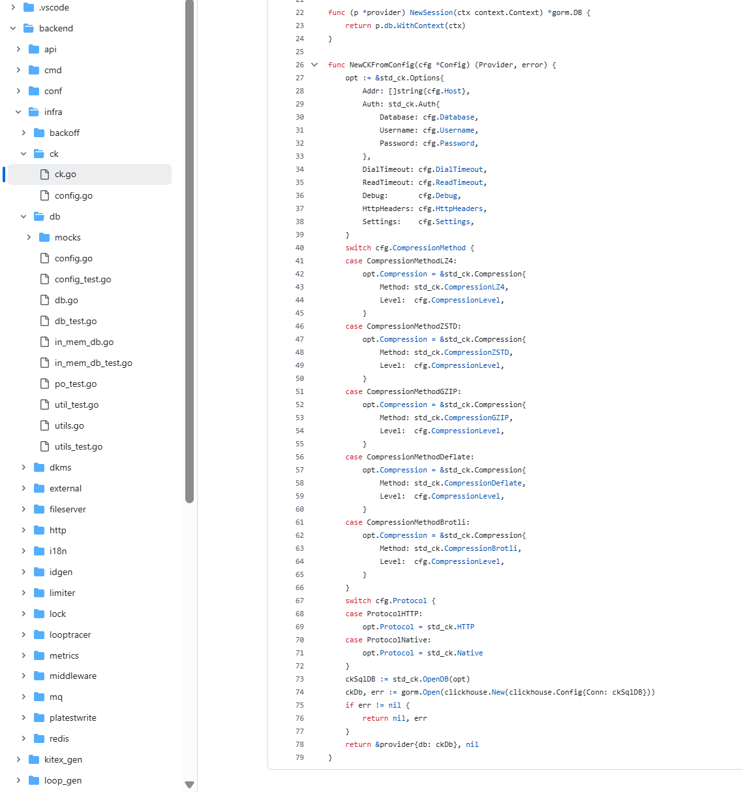

# 第4章：核心基础设施服务

欢迎回到Coze Loop的探索之旅~

在[第3章：业务领域应用](03_business_domain_applications_.md)中，我们探讨了处理核心业务逻辑的"专业部门"，例如管理提示词、大语言模型或用户数据。

我们看到`LLM应用`负责获取AI模型列表。但这些应用的数据存储在哪里？它们如何异步通信？如何为新条目生成唯一ID？

这正是**核心基础设施服务**的职责所在。

## 什么是核心基础设施服务？

将Coze Loop的整个系统想象成一座现代化城市：
- [Coze Loop前端应用](01_cozeloop_frontend_application_.md)如同你交互的各类建筑和商店
- [API网关与处理器](02_api_gateway___handlers_.md)是道路和公共交通，帮助你到达正确地点
- [业务领域应用](03_business_domain_applications_.md)则是城市中的专业政府部门或大型企业（如教育局、城市规划局）

> 那么，城市中每个部分都依赖的基础设施是什么？

比如**供水系统**、**电网**和运输服务的核心**道路网络**。这些就是**核心基础设施服务**。

在Coze Loop中，这些服务是几乎所有业务领域应用依赖的基础设施。它们提供关键的共享能力，确保数据安全存储、快速检索，并在高负载时仍能平稳运行。它们是"==后端的后端=="，构成整个系统的坚实基石。

**为什么需要核心基础设施服务？**

以"列出AI代理"为例：`LLM应用`（业务领域应用）需要获取模型列表。它从哪里获取？显然不会直接存储在代码中，而是向**数据库**查询。

类似场景：
- 需要快速记录用户近期操作或存储临时信息时，使用**高速缓存服务**
- 处理耗时任务（如训练大模型）时，将消息发送至**消息队列**后台处理
- 创建新提示词或数据集时，需要**唯一标识符生成器**
- 大型文件（如数据集）需要专用**文件存储**

这些服务与业务逻辑分离，因为它们是**通用**工具。系统的任何部分都可能需要存储数据、缓存信息或发送消息。通过专用、健壮的基础设施服务，Coze Loop确保了数据完整性、高性能和可扩展性。

## 核心基础设施服务

Coze Loop使用多种基础设施服务，每种都针对特定用途优化：

| 服务类型     | 类比              | 在Coze Loop后端的作用                            | 示例用途                                   |
| :----------- | :---------------- | :----------------------------------------------- | :----------------------------------------- |
| **数据库**   | 城市档案局        | 结构化数据的**==持久化存储==**                   | 存储用户账户、提示词定义、AI模型详情       |
| **Redis**    | 快速备忘录/会话锁 | 高频访问数据的**==快速缓存==**，**==会话管理==** | 存储临时用户会话数据，缓存API响应          |
| **消息队列** | 邮局              | 后台任务的**==异步通信==**                       | 发送通知，处理长时间运行的AI训练任务       |
| **ID生成器** | 车牌管理局        | 为新实体创建**==唯一标识符==**                   | 为新提示词或用户生成唯一ID                 |
| **文件存储** | 仓库              | 存储**==大型文件==**和非结构化数据               | 存储用户上传的数据集、提示词文件、评估结果 |

专栏传送：

[MySQL](https://blog.csdn.net/2301_80171004/category_12816209.html)

[Redis 文档学习](https://blog.csdn.net/2301_80171004/category_12835991.html?spm=1001.2014.3001.5482)

这些服务是默默无闻的功臣，支撑着在Coze Loop中的所有操作。

## 业务应用如何使用基础设施服务

继续以"列出AI代理"为例。`LLM应用`（业务领域应用）负责获取模型列表。



**分步说明：**

1. **请求发起**：在[Coze Loop前端应用](01_cozeloop_frontend_application_.md)点击"列出AI代理"
2. **API网关与处理器**：请求通过[API网关与处理器](02_api_gateway___handlers_.md)路由至`LLM处理器`
3. **业务逻辑**：`LLM处理器`调用`LLM应用`的`ListModels`方法
4. **基础设施交互**：`LLM应用`知道需要从持久化存储获取实际数据，于是与**核心基础设施服务**（MySQL数据库）通信查询LLM模型
5. **数据检索**：MySQL数据库执行查询并返回LLM数据
6. **响应返回**：`LLM应用`处理原始数据并格式化，通过`LLM处理器`和[API网关](02_api_gateway___handlers_.md)返回前端

实现了业务逻辑（`LLM应用`）==将数据存储**委托**给专用基础设施服务==（MySQL数据库）。

## 代码解析：连接基础设施服务

Coze Loop后端用==Go==编写。`backend/infra`目录包含连接和交互核心基础设施服务的代码。

#### 1. 数据库（MySQL & ClickHouse）

主要用**MySQL**处理事务数据（如用户账户、提示词配置），**ClickHouse**处理分析数据（如可观测性追踪）。



**连接MySQL (`backend/infra/db/db.go`)**

```go
// backend/infra/db/db.go

// Provider是数据库操作接口
type Provider interface 
{
	NewSession(ctx context.Context, opts ...Option) *gorm.DB
	Transaction(ctx context.Context, fc func(tx *gorm.DB) error, opts ...Option) error
}

// NewDBFromConfig创建MySQL数据库连接提供者
func NewDBFromConfig(cfg *Config, opts ...gorm.Option) (Provider, error) 
{
	// ... 使用GORM和MySQL驱动设置数据库 ...
	db, err := gorm.Open(mysql.Open(cfg.buildDSN()), opts...)
	if err != nil {
		return nil, err
	}
	return &provider{db: db}, nil
}

// NewSession创建带上下文和选项的新数据库会话
func (p *provider) NewSession(ctx context.Context, opts ...Option) *gorm.DB {
	session := p.db // 获取底层GORM DB实例
	// ... 应用调试模式、从主库读取等选项 ...
	return session.WithContext(ctx) // 始终包含上下文以支持追踪!
}
```

*   **说明**：`db`包提供`Provider`接口供业务应用获取数据库连接。
*   `NewDBFromConfig`在启动时使用`gorm`创建主连接。
*   业务应用（如`LLM应用`调用`ListModels`时）通过`NewSession`获取即用型数据库会话（`*gorm.DB`），确保每个操作都关联请求上下文（对追踪至关重要，见[可观测性（追踪与指标）](05_observability__tracing___metrics__.md)）。

**连接ClickHouse (`backend/infra/ck/ck.go`)**



```go
// backend/infra/ck/ck.go

// Provider是ClickHouse数据库操作接口
type Provider interface {
	NewSession(ctx context.Context) *gorm.DB
}

// NewCKFromConfig创建ClickHouse数据库连接提供者
func NewCKFromConfig(cfg *Config) (Provider, error) {
	// ... ClickHouse专用选项和连接设置 ...
	ckSqlDB := std_ck.OpenDB(opt) // 使用ClickHouse官方Go驱动
	ckDb, err := gorm.Open(clickhouse.New(clickhouse.Config{Conn: ckSqlDB}))
	if err != nil {
		return nil, err
	}
	return &provider{db: ckDb}, nil
}

// NewSession创建ClickHouse数据库会话
func (p *provider) NewSession(ctx context.Context) *gorm.DB {
	return p.db.WithContext(ctx) // 返回ClickHouse的GORM DB会话
}
```

*   **说明**：类似MySQL，`ck`包为ClickHouse提供`Provider`。`NewCKFromConfig`建立连接。
*   ClickHouse常用于==高容量分析数据==（如事件日志或追踪），因此有独立设置。业务应用（如`可观测性应用`）可能用它存储和查询追踪数据。

#### 2. Redis（缓存与会话管理）

Redis用于极速临时存储，适合缓存数据或管理用户会话。

**使用Redis (`backend/infra/redis/redis.go`)**

```go
// backend/infra/redis/redis.go

// Cmdable是包装常见Redis命令的接口
type Cmdable interface {
	// ... Get、Set、Del、HGet、HSet等方法 ...
	Get(ctx context.Context, key string) *redis.StringCmd
	Set(ctx context.Context, key string, value any, expiration time.Duration) *redis.StatusCmd
	Del(ctx context.Context, keys ...string) *redis.IntCmd
}

// NewClient基于选项创建Redis客户端
func NewClient(opts *redis.Options) (Cmdable, error) {
	cli := redis.NewClient(opts)
	// ... 检查连接 ...
	return &provider{cli: cli}, nil
}

// 示例：从Redis获取值
func (p *provider) Get(ctx context.Context, key string) *redis.StringCmd {
	return p.cli.Get(ctx, key)
}

// 示例：设置带过期时间的值
func (p *provider) Set(ctx context.Context, key string, value any, expiration time.Duration) *redis.StatusCmd {
	return p.cli.Set(ctx, key, value, expiration)
}
```

*   **说明**：`redis`包提供`Cmdable`接口封装常见Redis操作。
*   `NewClient`连接Redis服务器。业务应用或中间件（如[API网关与处理器](02_api_gateway___handlers_.md)中的`SessionMW`）可用`Get`和`Set`等方法快速存取数据。例如，`基础应用`可能用Redis存储临时用户会话令牌。

#### 3. 消息队列（RocketMQ）

消息队列支持系统各部分异步通信，无需等待即时响应，适合长时间任务。

**定义消息队列接口 (`backend/infra/mq/factory.go`)**

```go
// backend/infra/mq/factory.go

// IFactory创建消息队列的生产者和消费者
type IFactory interface {
	NewProducer(ProducerConfig) (IProducer, error)
	NewConsumer(ConsumerConfig) (IConsumer, error)
}

// IProducer是发送消息的接口
type IProducer interface {
	SendMessage(ctx context.Context, msg *Message) error
	// ... 其他发送方法 ...
}

// IConsumer是接收消息的接口
type IConsumer interface {
	Start() error
	Shutdown() error
	// ... 消息处理方法 ...
}

// ProducerConfig定义消息生产者的配置
type ProducerConfig struct {
	Addr           []string // 命名服务器地址
	ProduceTimeout time.Duration
	// ... 其他配置 ...
}

// ConsumerConfig定义消息消费者的配置
type ConsumerConfig struct {
	Addr          []string
	Topic         字符串
	ConsumerGroup 字符串
	// ... 其他配置 ...
}
```

*   **说明**：`mq`包提供`IFactory`、`IProducer`和`IConsumer`等接口。
*   Coze Loop使用**RocketMQ**作为消息队列。业务应用（如用户启动模型训练后的`LLM应用`）可用`IFactory.NewProducer`获取`IProducer`，调用`SendMessage`发送任务至队列。系统其他部分（后台工作器）则用`IFactory.NewConsumer`监听和处理这些任务，避免阻塞用户界面。

#### 4. ID生成器

Coze Loop中每个新实体（提示词、数据集、用户）都需要唯一ID。ID生成器确保这些ID始终唯一且可快速生成。

**使用ID生成器 (`backend/infra/idgen/idgen.go`)**

```go
// backend/infra/idgen/idgen.go

// IIDGenerator是生成唯一ID的接口
type IIDGenerator interface {
	GenID(ctx context.Context) (int64, error)
	GenMultiIDs(ctx context.Context, counts int) ([]int64, error)
}
```

*   **说明**：`idgen`包定义`IIDGenerator`。
*   当`提示词应用`创建新提示词时，调用`idgen.GenID(ctx)`获取全新的`int64`数字作为提示词在数据库中的唯一标识符。

#### 5. 文件存储（对象存储）

对于上传的数据集、评估结果或生成的提示词文件等大型非结构化数据，Coze Loop使用兼容AWS S3、阿里云OSS或腾讯云TOS的**对象存储**服务。

**定义对象存储接口 (`backend/infra/fileserver/interface.go`)**

```go
// backend/infra/fileserver/interface.go

// ObjectStorage定义对象存储后端的接口
type ObjectStorage interface {
	Stat(ctx context.Context, key string, opts ...StatOpt) (*ObjectInfo, error)
	Upload(ctx context.Context, key string, r io.Reader, opts ...UploadOpt) error
	Download(ctx context.Context, key string, w io.WriterAt, opts ...DownloadOpt) error
	Remove(ctx context.Context, key string, opts ...RemoveOpt) error
	SignUploadReq(ctx context.Context, key string, opts ...SignOpt) (url string, header http.Header, err error)
	SignDownloadReq(ctx context.Context, key string, opts ...SignOpt) (url string, header http.Header, err error)
}

// BatchObjectStorage提供批量操作方法
type BatchObjectStorage interface {
	ObjectStorage
	BatchUpload(ctx context.Context, keys []string, readers []io.Reader, opts ...UploadOpt) error
	BatchDownload(ctx context.Context, keys []string, writers []io.WriterAt, opts ...DownloadOpt) error
	// ... 其他批量方法 ...
}
```

*   **说明**：`fileserver`包提供`ObjectStorage`和`BatchObjectStorage`等接口。
*   业务应用（如用户上传新数据集时的`数据应用`）可用`Upload`存储文件。后续`评估应用`需要读取该数据集时，使用`Download`或`Read`。`SignUploadReq`和`SignDownloadReq`特别有用，它们能生成前端可直接使用的临时安全URL上传或下载文件，无需后端充当中介，从而提升性能。

## 总结

本章探讨了构成Coze Loop后端基石的**核心基础设施服务**。

这些基础工具（如==MySQL、ClickHouse持久化存储，Redis高速缓存，RocketMQ异步通信，唯一ID生成器和文件存储==）为[业务领域应用](03_business_domain_applications_.md)提供了高效可靠执行复杂任务的能力。

理解这些构建块对掌握Coze Loop如何处理数据和扩展运营至关重要。

接下来，我们将关注如何监控这些动态组件以确保系统健康运行，深入[可观测性（追踪与指标）](05_observability__tracing___metrics__.md)

