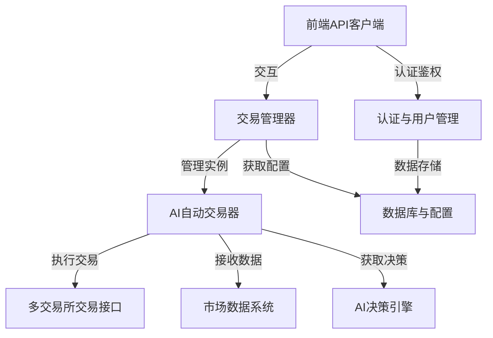

链接：[NOFX - AI Auto Trading Dashboard](https://nofxai.com/)

# docs：nofx项目

`nofx`项目是一个**AI驱动的加密货币交易系统**，设计用于在多个交易所上自主运行。其核心是**AI自动交易器**，作为每个交易机器人的"大脑"，通过先进的**AI决策引擎**基于实时**市场数据**生成交易策略

用户可以通过交互式网页仪表盘管理交易机器人、配置参数并监控交易表现，系统通过**认证与用户管理**保障安全，并通过**数据库与配置系统**实现数据持久化存储。平台通过**多交易所交易接口**实现与各类加密货币交易所的灵活交互。

## 可视化

## 章节目录

1. [数据库与配置系统](01_database___configuration_.md)
2. [市场数据系统](02_market_data_system_.md)
3. [多交易所交易接口](03_multi_exchange_trader_interface_.md)
4. [AI决策引擎](04_ai_decision_engine_.md)
5. [认证与用户管理](05_authentication___user_management_.md)
6. [AI自动交易器](06_ai_autotrader_.md)
7. [交易管理器](07_trader_manager_.md)
8. [前端API客户端](08_frontend_api_client_.md)

---

